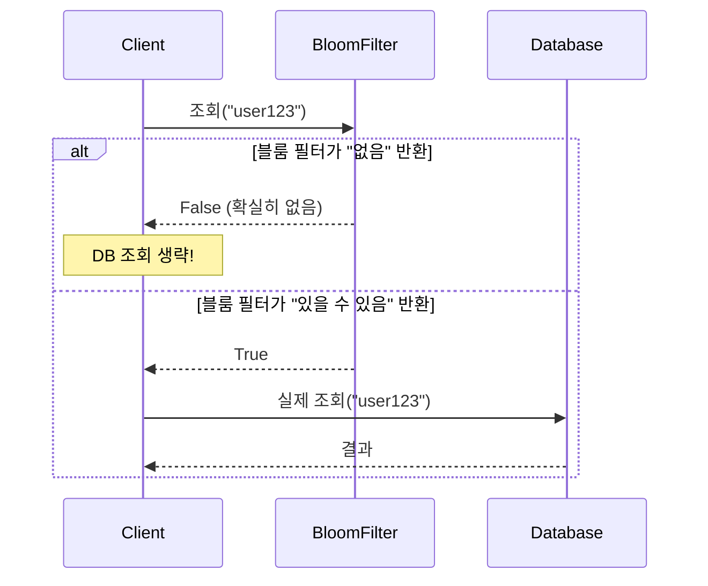

# 블룸 필터 (Bloom Filter)

> `[4] 심화` · 선수 지식: [해시 테이블](./hash-table.md)

> 해시 함수와 비트 배열을 이용해 **집합 멤버십을 확률적으로 검사**하는 자료구조

`#블룸필터` `#BloomFilter` `#확률적자료구조` `#ProbabilisticDataStructure` `#멤버십테스트` `#MembershipTest` `#FalsePositive` `#NoFalseNegative` `#비트배열` `#BitArray` `#해시함수` `#HashFunction` `#공간절약` `#CountingBloomFilter` `#CuckooFilter`

## 왜 알아야 하는가?

블룸 필터는 **대용량 데이터에서 존재 여부를 빠르게 판단**할 때 사용하는 핵심 자료구조입니다.

- **실무**: Redis, Cassandra, Chrome Safe Browsing 등에서 활용
- **면접**: 확률적 자료구조의 대표 주제로 자주 등장
- **기반 지식**: 캐시 최적화, DB 인덱싱, 네트워크 필터링의 기초

## 핵심 개념

- **비트 배열 (Bit Array)**: 0과 1로만 구성된 고정 크기 배열
- **해시 함수 (Hash Function)**: 원소를 여러 인덱스로 매핑 (k개 사용)
- **False Positive (오탐)**: 없는 원소를 "있다"고 판단
- **False Negative (미탐)**: 있는 원소를 "없다"고 판단 - **블룸 필터에서는 발생하지 않음**

## 쉽게 이해하기

**도서관 카탈로그**를 생각해보세요.

| 전통적 방식 | 블룸 필터 방식 |
|------------|---------------|
| 모든 책 제목을 저장 | 각 책의 "지문"만 저장 |
| 정확한 검색 | 빠른 사전 필터링 |
| 메모리 많이 사용 | 메모리 매우 적게 사용 |
| "이 책 있어요" = 정확 | "이 책 있을 수도 있어요" |
| "이 책 없어요" = 정확 | "이 책 없어요" = **정확** |

블룸 필터는 **"없다"는 확실히 알려주지만, "있다"는 확인이 필요**합니다.

## 상세 설명

### 블룸 필터 구조

```
비트 배열 (m = 10)
┌───┬───┬───┬───┬───┬───┬───┬───┬───┬───┐
│ 0 │ 1 │ 0 │ 1 │ 0 │ 0 │ 1 │ 0 │ 1 │ 0 │
└───┴───┴───┴───┴───┴───┴───┴───┴───┴───┘
  0   1   2   3   4   5   6   7   8   9

해시 함수: h1, h2, h3 (k = 3)
```

### 삽입 (Add) 과정

```
원소 "apple" 삽입:
  h1("apple") % 10 = 1  → bit[1] = 1
  h2("apple") % 10 = 3  → bit[3] = 1
  h3("apple") % 10 = 8  → bit[8] = 1

비트 배열:
┌───┬───┬───┬───┬───┬───┬───┬───┬───┬───┐
│ 0 │ 1 │ 0 │ 1 │ 0 │ 0 │ 0 │ 0 │ 1 │ 0 │
└───┴───┴───┴───┴───┴───┴───┴───┴───┴───┘
      ↑       ↑                   ↑
```

### 조회 (Lookup) 과정

```
"apple" 조회:
  h1("apple") % 10 = 1  → bit[1] = 1 ✓
  h2("apple") % 10 = 3  → bit[3] = 1 ✓
  h3("apple") % 10 = 8  → bit[8] = 1 ✓
  → 모두 1이므로 "있을 수도 있음" (True)

"banana" 조회:
  h1("banana") % 10 = 2  → bit[2] = 0 ✗
  → 하나라도 0이면 "확실히 없음" (False)
```

### 왜 삭제가 불가능한가?

```
"apple"과 "cherry"가 같은 인덱스를 공유하는 경우:

h1("apple") = 1,  h2("apple") = 3,  h3("apple") = 8
h1("cherry") = 1, h2("cherry") = 6, h3("cherry") = 9

비트 배열:
┌───┬───┬───┬───┬───┬───┬───┬───┬───┬───┐
│ 0 │ 1 │ 0 │ 1 │ 0 │ 0 │ 1 │ 0 │ 1 │ 1 │
└───┴───┴───┴───┴───┴───┴───┴───┴───┴───┘
      ↑       ↑           ↑       ↑   ↑
   공유                  cherry  apple cherry

"apple" 삭제 시 bit[1]을 0으로 만들면?
→ "cherry"도 없다고 판단됨! (False Negative 발생)
```

## 동작 원리

### 의사 코드

```python
class BloomFilter:
    def __init__(self, m: int, k: int):
        self.bits = [0] * m  # 비트 배열
        self.m = m           # 배열 크기
        self.k = k           # 해시 함수 개수

    def add(self, item: str) -> None:
        """원소 삽입"""
        for i in range(self.k):
            index = hash_i(item, i) % self.m
            self.bits[index] = 1

    def might_contain(self, item: str) -> bool:
        """존재 여부 확인 (확률적)"""
        for i in range(self.k):
            index = hash_i(item, i) % self.m
            if self.bits[index] == 0:
                return False  # 확실히 없음
        return True  # 있을 수도 있음
```

### 시퀀스 다이어그램



## 수학적 분석

### False Positive 확률

```
p ≈ (1 - e^(-kn/m))^k

- m: 비트 배열 크기
- n: 삽입된 원소 수
- k: 해시 함수 개수
- e: 자연상수 (≈ 2.718)
```

### 최적 해시 함수 개수

```
k_optimal = (m/n) × ln(2) ≈ 0.693 × (m/n)
```

### 실무 가이드

| 목표 오탐률 | m/n 비율 | 최적 k |
|------------|---------|--------|
| 10% | 4.8 | 3 |
| 1% | 9.6 | 7 |
| 0.1% | 14.4 | 10 |

**예시**: 100만 개 원소, 1% 오탐률
- m = 100만 × 9.6 ≈ 960만 비트 ≈ **1.2MB**
- k = 7개 해시 함수

## 변형

### Counting Bloom Filter

```
일반 블룸 필터: 비트 (0/1)
카운팅 블룸 필터: 카운터 (0, 1, 2, 3...)

삽입: 카운터 증가
삭제: 카운터 감소 (0 이하로는 X)

장점: 삭제 가능
단점: 메모리 사용량 증가 (비트 → 바이트)
```

### Cuckoo Filter

```
특징:
- 삭제 지원
- 더 나은 공간 효율성 (동일 오탐률 기준)
- 지역성이 좋아 캐시 친화적

원리: Cuckoo Hashing 기반
```

### Quotient Filter

```
특징:
- 캐시 친화적 (연속 메모리 접근)
- 병합 가능
- 크기 조절 가능
```

## 실무 활용 사례

### 1. 웹 브라우저 (Chrome Safe Browsing)

```
사용자가 URL 입력
    ↓
블룸 필터로 악성 URL 체크 (로컬)
    ↓
"있을 수 있음" → 서버에 확인 요청
"없음" → 바로 접속 허용
```

### 2. 데이터베이스 (Cassandra, HBase)

```
SSTable/HFile 조회 최적화:
    ↓
블룸 필터로 해당 파일에 키 존재 여부 확인
    ↓
"없음" → 디스크 I/O 생략
"있을 수 있음" → 디스크에서 실제 검색
```

### 3. Redis

```bash
# Redis 블룸 필터 사용 예시
BF.ADD myfilter item1
BF.EXISTS myfilter item1  # 1 (있을 수 있음)
BF.EXISTS myfilter item2  # 0 (확실히 없음)
```

### 4. 캐시 침투 방지

```
캐시 미스 시:
    ↓
블룸 필터로 DB에 데이터 존재 여부 확인
    ↓
"없음" → DB 조회 생략 (캐시 침투 방지)
"있을 수 있음" → DB 조회
```

## 예제 코드

### Java 구현

```java
import java.util.BitSet;
import java.util.function.Function;

public class BloomFilter<T> {
    private final BitSet bits;
    private final int m;  // 비트 배열 크기
    private final int k;  // 해시 함수 개수

    public BloomFilter(int expectedElements, double falsePositiveRate) {
        // 최적 m 계산
        this.m = (int) (-expectedElements * Math.log(falsePositiveRate)
                        / (Math.log(2) * Math.log(2)));
        // 최적 k 계산
        this.k = (int) (m / expectedElements * Math.log(2));
        this.bits = new BitSet(m);
    }

    public void add(T item) {
        for (int i = 0; i < k; i++) {
            int index = getHash(item, i);
            bits.set(index);
        }
    }

    public boolean mightContain(T item) {
        for (int i = 0; i < k; i++) {
            int index = getHash(item, i);
            if (!bits.get(index)) {
                return false;  // 확실히 없음
            }
        }
        return true;  // 있을 수도 있음
    }

    private int getHash(T item, int seed) {
        int hash = item.hashCode() + seed * 31;
        return Math.abs(hash % m);
    }
}
```

### Python 구현

```python
import math
from bitarray import bitarray
import mmh3  # MurmurHash3

class BloomFilter:
    def __init__(self, expected_elements: int, false_positive_rate: float):
        # 최적 m 계산
        self.m = int(-expected_elements * math.log(false_positive_rate)
                     / (math.log(2) ** 2))
        # 최적 k 계산
        self.k = int(self.m / expected_elements * math.log(2))
        self.bits = bitarray(self.m)
        self.bits.setall(0)

    def add(self, item: str) -> None:
        for i in range(self.k):
            index = mmh3.hash(item, i) % self.m
            self.bits[index] = 1

    def might_contain(self, item: str) -> bool:
        for i in range(self.k):
            index = mmh3.hash(item, i) % self.m
            if not self.bits[index]:
                return False
        return True

# 사용 예시
bf = BloomFilter(expected_elements=1000000, false_positive_rate=0.01)
bf.add("hello")
print(bf.might_contain("hello"))  # True
print(bf.might_contain("world"))  # False (높은 확률)
```

## 트레이드오프

| 항목 | 장점 | 단점 |
|------|------|------|
| **메모리** | 매우 적은 공간 사용 | 원본 데이터 복원 불가 |
| **속도** | O(k) 삽입/조회 | 해시 함수 k개 계산 필요 |
| **정확도** | False Negative 없음 | False Positive 존재 |
| **유연성** | 삽입만 가능 | 삭제 불가 (기본 구현) |

### 블룸 필터 vs 해시 테이블

| 비교 항목 | 블룸 필터 | 해시 테이블 |
|----------|----------|-------------|
| 메모리 | 매우 적음 | 원본 저장 필요 |
| 정확도 | 확률적 | 정확 |
| 삭제 | 불가 (기본) | 가능 |
| 값 조회 | 불가 | 가능 |
| 용도 | 사전 필터링 | 실제 저장소 |

## 면접 예상 질문

### Q: 블룸 필터에서 False Negative가 발생하지 않는 이유는?

A: 삽입 시 모든 해시 인덱스를 1로 설정하기 때문입니다. **삭제가 없다면** 한 번 1로 설정된 비트는 절대 0이 되지 않습니다. 따라서 삽입된 원소를 조회하면 모든 해시 인덱스가 반드시 1입니다.

### Q: 오탐률을 낮추려면 어떻게 해야 하나요?

A: 두 가지 방법이 있습니다:
1. **비트 배열 크기(m) 증가**: 더 많은 공간 = 충돌 감소
2. **최적 해시 함수 개수(k) 사용**: k = (m/n) × ln(2)

단, k가 너무 크면 해시 계산 비용이 증가하고, 너무 작으면 오탐률이 높아집니다.

### Q: 삭제가 필요한 경우 어떻게 해결하나요?

A: **Counting Bloom Filter**를 사용합니다. 비트 대신 카운터를 사용하여 삽입 시 증가, 삭제 시 감소합니다. 단, 메모리 사용량이 증가합니다 (1비트 → 3-4비트).

## 연관 문서

| 문서 | 연관성 | 난이도 |
|------|--------|--------|
| [해시 테이블](./hash-table.md) | 선수 지식 (해시 함수) | [3] 중급 |
| [캐싱](../system-design/caching.md) | 활용 분야 (캐시 침투 방지) | [3] 중급 |
| [B-Tree](./b-tree.md) | DB 인덱스 비교 | [4] 심화 |

## 참고 자료

- [Wikipedia: Bloom filter](https://en.wikipedia.org/wiki/Bloom_filter)
- [Redis Bloom Filter](https://redis.io/docs/data-types/probabilistic/bloom-filter/)
- [Bloom Filters by Example](https://llimllib.github.io/bloomfilter-tutorial/)
- "Network Algorithmics" by George Varghese
