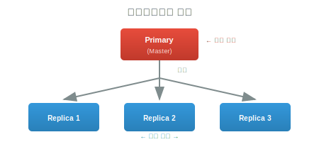
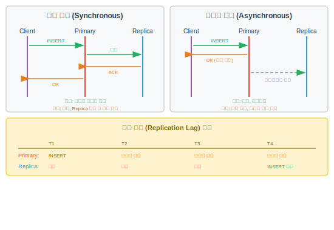
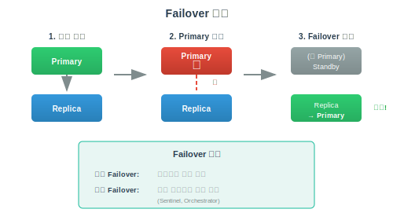

# 레플리케이션 (Replication)

> `[4] 심화` · 선수 지식: [데이터베이스란](./what-is-database.md), [Transaction](./transaction.md)

> 동일한 데이터를 여러 데이터베이스 서버에 복제하여 가용성과 읽기 성능을 향상시키는 기법

`#레플리케이션` `#Replication` `#복제` `#MasterSlave` `#마스터슬레이브` `#Primary` `#Secondary` `#Replica` `#레플리카` `#읽기분산` `#ReadReplica` `#동기복제` `#SyncReplication` `#비동기복제` `#AsyncReplication` `#페일오버` `#Failover` `#고가용성` `#HA` `#HighAvailability` `#MySQL` `#PostgreSQL` `#MongoDB` `#ReplicationLag` `#복제지연`

## 왜 알아야 하는가?

단일 데이터베이스는 장애 시 서비스 중단이 발생합니다. 레플리케이션을 통해 장애 복구 능력을 확보하고, 읽기 트래픽을 분산시켜 성능을 향상시킬 수 있습니다. 프로덕션 환경에서는 필수적인 구성입니다.

## 핵심 개념

- **Primary (Master)**: 쓰기를 담당하는 주 서버
- **Replica (Slave)**: Primary 데이터를 복제받는 서버
- **동기 복제**: 모든 Replica에 쓰기 완료 후 응답
- **비동기 복제**: Primary에 쓰기 후 즉시 응답, 이후 복제
- **Failover**: Primary 장애 시 Replica를 Primary로 승격

## 쉽게 이해하기

**레플리케이션**을 신문사 시스템에 비유할 수 있습니다.

**신문사 비유:**
- **신문사 (Master/Primary)**: 기사 작성 (쓰기), 원본 보관
- **지역 배포처 (Slave/Replica)**: 신문 복사본 배포 (읽기), 지역 독자 서비스



## 상세 설명

### 레플리케이션 토폴로지

```
1. Single-Primary (Master-Slave)
   가장 일반적인 구성

   ┌──────────┐
   │ Primary  │ ← 쓰기
   └────┬─────┘
        │ 복제
   ┌────┴────┬────────┐
   ▼         ▼        ▼
┌──────┐ ┌──────┐ ┌──────┐
│Replica│ │Replica│ │Replica│ ← 읽기
└──────┘ └──────┘ └──────┘


2. Multi-Primary (Master-Master)
   양방향 복제, 쓰기 분산

   ┌──────────┐     ┌──────────┐
   │ Primary1 │ ←─→ │ Primary2 │
   │  쓰기/읽기 │     │  쓰기/읽기 │
   └──────────┘     └──────────┘
        ↓                ↓
     Replicas         Replicas


3. 체인 복제 (Cascading)
   복제 부하 분산

   ┌──────────┐
   │ Primary  │
   └────┬─────┘
        ▼
   ┌──────────┐
   │ Replica1 │ ← Primary에서만 복제
   └────┬─────┘
        ▼
   ┌──────────┐
   │ Replica2 │ ← Replica1에서 복제
   └──────────┘
```

### 동기 vs 비동기 복제



**복제 지연 해결책:**
1. **Read-Your-Writes**: 쓰기 직후 읽기는 Primary에서
2. **Monotonic Reads**: 같은 세션은 같은 Replica에서 읽기
3. **Bounded Staleness**: 최대 지연 시간 제한, 초과 시 Primary에서 읽기
4. **CQRS**: Command(쓰기)와 Query(읽기) 분리

### Failover (장애 조치)



### MySQL 복제 설정

```sql
-- Primary 설정 (my.cnf)
[mysqld]
server-id = 1
log_bin = mysql-bin
binlog_format = ROW

-- Replica 설정 (my.cnf)
[mysqld]
server-id = 2
relay_log = relay-bin
read_only = ON

-- Primary에서 복제 사용자 생성
CREATE USER 'repl'@'%' IDENTIFIED BY 'password';
GRANT REPLICATION SLAVE ON *.* TO 'repl'@'%';

-- Replica에서 복제 시작
CHANGE MASTER TO
  MASTER_HOST='primary-host',
  MASTER_USER='repl',
  MASTER_PASSWORD='password',
  MASTER_LOG_FILE='mysql-bin.000001',
  MASTER_LOG_POS=0;

START SLAVE;

-- 복제 상태 확인
SHOW SLAVE STATUS\G
```

### 읽기/쓰기 분리

```java
// Spring에서 DataSource 라우팅
public class RoutingDataSource extends AbstractRoutingDataSource {

    @Override
    protected Object determineCurrentLookupKey() {
        return TransactionSynchronizationManager.isCurrentTransactionReadOnly()
            ? "replica"
            : "primary";
    }
}

// 사용
@Transactional(readOnly = true)  // Replica로 라우팅
public User findById(Long id) {
    return userRepository.findById(id);
}

@Transactional  // Primary로 라우팅
public User save(User user) {
    return userRepository.save(user);
}
```

## 트레이드오프

| 장점 | 단점 |
|------|------|
| 고가용성 (장애 복구) | 운영 복잡성 증가 |
| 읽기 성능 향상 | 복제 지연 문제 |
| 지역 분산 가능 | 저장 공간 증가 |
| 백업 용이 | 일관성 트레이드오프 |

## 면접 예상 질문

### Q: 동기 복제와 비동기 복제의 차이와 선택 기준은?

A: **동기 복제**: 모든 Replica에 쓰기 완료 후 응답. 데이터 손실 없음, 하지만 느리고 Replica 장애 시 쓰기 불가. **비동기 복제**: Primary 쓰기 후 즉시 응답, 백그라운드 복제. 빠르지만 복제 지연 발생, Primary 장애 시 데이터 손실 가능. **선택 기준**: 금융 등 데이터 손실 불가 → 동기. 성능 우선, 약간의 지연 허용 → 비동기. **절충안**: Semi-sync (최소 1개 Replica 동기).

### Q: Replication Lag 문제를 어떻게 해결하나요?

A: (1) **Read-Your-Writes**: 쓰기 직후 읽기는 Primary에서 수행. (2) **Monotonic Reads**: 세션별 동일 Replica 사용. (3) **Causal Consistency**: 버전/타임스탬프로 읽기 시점 보장. (4) **CQRS**: 쓰기/읽기 모델 분리, 이벤트 소싱. (5) **인프라**: Replica 성능 향상, 네트워크 최적화. **모니터링**: Seconds_Behind_Master 지표 감시.

## 연관 문서

| 문서 | 연관성 | 난이도 |
|------|--------|--------|
| [샤딩](./sharding.md) | 수평 확장 | [4] 심화 |
| [Transaction](./transaction.md) | 분산 트랜잭션 | [3] 중급 |
| [Redis Caching](./redis-caching.md) | 캐시 복제 | [3] 중급 |

## 참고 자료

- [MySQL Replication](https://dev.mysql.com/doc/refman/8.0/en/replication.html)
- [PostgreSQL Replication](https://www.postgresql.org/docs/current/high-availability.html)
- [Designing Data-Intensive Applications - Replication](https://dataintensive.net/)
