# 벡터 데이터베이스 (Vector Database)

> `[3] 중급` · 선수 지식: [Index](./index.md), [NoSQL](./nosql.md)

> `Trend` 2026

> 고차원 벡터(임베딩)를 저장하고 유사도 검색(Similarity Search)을 수행하는 데 특화된 데이터베이스

`#벡터DB` `#VectorDatabase` `#벡터데이터베이스` `#임베딩` `#Embedding` `#유사도검색` `#SimilaritySearch` `#ANN` `#ApproximateNearestNeighbor` `#HNSW` `#IVF` `#코사인유사도` `#CosineSimilarity` `#Pinecone` `#Milvus` `#Weaviate` `#Qdrant` `#Chroma` `#pgvector` `#RAG` `#RetrievalAugmentedGeneration` `#시맨틱검색` `#SemanticSearch` `#LLM` `#AI` `#벡터인덱스` `#차원축소` `#FAISS` `#고차원데이터`

## 왜 알아야 하는가?

- **실무**: LLM 기반 RAG 시스템, 추천 엔진, 이미지·음성 검색 등 AI 애플리케이션의 핵심 인프라로 2026년 현재 거의 모든 AI 서비스가 벡터 DB를 활용한다
- **면접**: "벡터 DB와 기존 RDBMS의 차이", "ANN 알고리즘 비교", "RAG 아키텍처 설명" 등이 빈출 질문이다
- **기반 지식**: 임베딩, 유사도 측정, 인덱싱 전략을 이해하면 AI 시스템 설계 전반에 적용할 수 있다

## 핵심 개념

- **벡터(임베딩)**: 텍스트·이미지·음성을 고정 길이 숫자 배열로 변환한 것. 의미가 유사하면 벡터 공간에서 가까이 위치한다
- **유사도 검색**: 쿼리 벡터와 가장 가까운 벡터를 찾는 연산. 정확한 KNN 대신 속도를 위해 ANN(근사 최근접 이웃)을 사용한다
- **벡터 인덱스**: HNSW, IVF 등 고차원 공간에서 빠른 검색을 가능하게 하는 자료구조

## 쉽게 이해하기

**도서관 비유**로 이해하자.

- **기존 DB(RDBMS)**: 도서관에서 "제목이 정확히 '해리 포터'인 책"을 찾는 것. 카탈로그(인덱스)에서 정확한 키워드로 검색한다
- **벡터 DB**: "마법 학교에서 모험하는 소년 이야기"라고 말하면, 사서가 의미적으로 비슷한 책들을 추천하는 것. 정확한 키워드가 아니라 **의미의 유사성**으로 검색한다

사서가 모든 책의 "줄거리 느낌"을 숫자로 기록해두고(임베딩), 요청이 들어오면 그 숫자들 사이의 거리를 계산해서 가장 가까운 책을 찾는 것이다.

## 상세 설명

### 벡터(임베딩)란?

임베딩은 비정형 데이터(텍스트, 이미지, 음성)를 고차원 벡터로 변환한 것이다. 임베딩 모델(OpenAI `text-embedding-3-small`, Sentence-BERT 등)이 이 변환을 수행한다.

```
"고양이가 소파에 앉아있다" → [0.12, -0.34, 0.78, ..., 0.45]  (1536차원)
"강아지가 침대에 누워있다" → [0.11, -0.32, 0.76, ..., 0.43]  (1536차원)
"주식 시장이 폭락했다"     → [-0.89, 0.67, -0.12, ..., 0.91] (1536차원)
```

**왜 이렇게 하는가?**
의미가 유사한 문장은 벡터 공간에서 가까이 위치하게 되어, 숫자 간 거리 계산만으로 "의미적 유사성"을 판단할 수 있다. 키워드 매칭의 한계(동의어, 맥락)를 극복한다.

### 유사도 측정 방법

| 메트릭 | 수식 | 특징 | 사용 사례 |
|--------|------|------|----------|
| **코사인 유사도** | cos(θ) = A·B / (\|A\|\|B\|) | 벡터 방향만 비교, 크기 무관 | 텍스트 검색 (가장 보편적) |
| **유클리드 거리** | √Σ(aᵢ - bᵢ)² | 절대 거리, 크기 영향 | 이미지 특징 비교 |
| **내적 (Dot Product)** | Σ(aᵢ × bᵢ) | 방향 + 크기 모두 반영 | 추천 시스템, 정규화된 벡터 |

**왜 코사인 유사도가 가장 많이 쓰이는가?**
텍스트 임베딩은 문장 길이에 따라 벡터 크기가 달라질 수 있다. 코사인 유사도는 방향만 비교하므로 이 문제에 영향을 받지 않는다.

### 벡터 인덱스 알고리즘

기존 B-Tree 인덱스는 1차원 정렬 기반이라 고차원 벡터 검색에 적합하지 않다. 벡터 DB는 전용 인덱스 알고리즘을 사용한다.

#### HNSW (Hierarchical Navigable Small World)

가장 널리 사용되는 알고리즘이다. 그래프 기반으로 동작한다.

- **구조**: 다층 그래프. 상위 레이어는 장거리 연결(고속도로), 하위 레이어는 단거리 연결(골목길)
- **검색**: 상위 레이어에서 대략적 위치를 찾고, 하위 레이어로 내려가며 정밀 탐색
- **장점**: 높은 검색 정확도(recall), 빠른 검색 속도
- **단점**: 메모리 사용량이 크다 (그래프 전체를 메모리에 유지)

#### IVF (Inverted File Index)

클러스터 기반으로 동작한다.

- **구조**: 벡터들을 K개 클러스터로 분할. 각 클러스터의 중심점(centroid)을 저장
- **검색**: 쿼리와 가장 가까운 클러스터 nprobe개를 선택하고, 해당 클러스터 내에서만 검색
- **장점**: 메모리 효율적, 대규모 데이터에 적합
- **단점**: 클러스터 경계에 있는 벡터를 놓칠 수 있다 (recall 저하)

#### PQ (Product Quantization)

벡터를 압축하여 메모리를 절약한다.

- **구조**: 고차원 벡터를 여러 서브벡터로 분할하고, 각각을 코드북의 코드로 압축
- **장점**: 메모리 사용량 대폭 감소 (10~100배)
- **단점**: 압축으로 인한 정확도 손실

실무에서는 **IVF + PQ** 또는 **HNSW + PQ** 조합으로 성능과 메모리를 균형 있게 사용한다.

### 벡터 DB vs 기존 DB

| 구분 | RDBMS | 벡터 DB |
|------|-------|---------|
| **데이터 타입** | 정형 데이터 (숫자, 문자열) | 고차원 벡터 + 메타데이터 |
| **쿼리 방식** | 정확 매칭 (WHERE, JOIN) | 유사도 기반 근사 검색 |
| **인덱스** | B-Tree, Hash | HNSW, IVF, PQ |
| **결과** | 정확한 결과 | Top-K 근사 결과 + 유사도 점수 |
| **확장** | 수직 확장 중심 | 수평 확장 (샤딩) 용이 |
| **사용 사례** | 트랜잭션, CRUD | 시맨틱 검색, 추천, RAG |

### 주요 벡터 DB 비교

| DB | 유형 | 특징 | 적합한 경우 |
|----|------|------|-----------|
| **Pinecone** | 관리형 SaaS | 완전 관리형, 서버리스 제공 | 빠른 도입, 운영 부담 최소화 |
| **Milvus** | 오픈소스 | GPU 가속, 분산 아키텍처 | 대규모 데이터, 자체 운영 |
| **Weaviate** | 오픈소스 | 내장 벡터화, GraphQL API | 멀티모달, 개발 편의성 |
| **Qdrant** | 오픈소스 | Rust 기반, 필터링 성능 우수 | 메타데이터 필터 + 벡터 검색 |
| **Chroma** | 오픈소스 | 경량, Python 네이티브 | 프로토타입, 소규모 프로젝트 |
| **pgvector** | 확장 | PostgreSQL 확장 | 기존 PostgreSQL 인프라 활용 |

## 동작 원리



### 데이터 저장 흐름

```
1. 원본 데이터 입력 ("고양이가 소파에 앉아있다")
2. 임베딩 모델이 벡터로 변환 ([0.12, -0.34, ...])
3. 벡터 + 메타데이터를 벡터 DB에 저장
4. 벡터 인덱스(HNSW 등) 자동 구축
```

### 검색 흐름

```
1. 쿼리 입력 ("반려동물이 가구 위에 있는 사진")
2. 같은 임베딩 모델로 쿼리 벡터 생성
3. 벡터 인덱스에서 ANN 검색 (Top-K)
4. 메타데이터 필터 적용 (선택적)
5. 유사도 점수와 함께 결과 반환
```

## 예제 코드

### Python + Chroma (로컬 벡터 DB)

```python
import chromadb

# 클라이언트 생성
client = chromadb.Client()
collection = client.create_collection("documents")

# 문서 저장 (임베딩 자동 생성)
collection.add(
    documents=[
        "고양이가 소파에 앉아있다",
        "강아지가 공원에서 뛰고 있다",
        "주식 시장이 폭락했다"
    ],
    ids=["doc1", "doc2", "doc3"]
)

# 유사도 검색
results = collection.query(
    query_texts=["반려동물 이야기"],
    n_results=2
)
# 결과: doc1(고양이), doc2(강아지) 반환
```

### Spring Boot + pgvector

```java
// 벡터 저장용 엔티티
@Entity
@Table(name = "documents")
@Getter
@NoArgsConstructor(access = AccessLevel.PROTECTED)
public class Document {

    @Id
    @GeneratedValue(strategy = GenerationType.IDENTITY)
    private Long id;

    private String content;

    // pgvector의 vector 타입 (1536차원)
    @Column(columnDefinition = "vector(1536)")
    private float[] embedding;

    @Builder
    private Document(String content, float[] embedding) {
        this.content = content;
        this.embedding = embedding;
    }
}
```

```sql
-- pgvector 확장 설치
CREATE EXTENSION IF NOT EXISTS vector;

-- 벡터 컬럼이 있는 테이블 생성
CREATE TABLE documents (
    id BIGSERIAL PRIMARY KEY,
    content TEXT NOT NULL,
    embedding vector(1536)
);

-- HNSW 인덱스 생성 (코사인 유사도 기준)
CREATE INDEX ON documents
    USING hnsw (embedding vector_cosine_ops)
    WITH (m = 16, ef_construction = 200);

-- 유사도 검색 (코사인 거리 기준 Top 5)
SELECT id, content, 1 - (embedding <=> $1::vector) AS similarity
FROM documents
ORDER BY embedding <=> $1::vector
LIMIT 5;
```

### RAG 파이프라인 통합

```python
from openai import OpenAI
import chromadb

client = OpenAI()
db = chromadb.Client()
collection = db.get_collection("knowledge_base")

def rag_query(question: str) -> str:
    """RAG 파이프라인: 검색 → 증강 → 생성"""

    # 1. 벡터 DB에서 관련 문서 검색
    results = collection.query(
        query_texts=[question],
        n_results=3
    )
    context = "\n".join(results["documents"][0])

    # 2. 검색된 문서를 컨텍스트로 LLM에 전달
    response = client.chat.completions.create(
        model="gpt-4o",
        messages=[
            {"role": "system", "content": f"다음 문서를 참고하여 답변하세요:\n{context}"},
            {"role": "user", "content": question}
        ]
    )

    return response.choices[0].message.content
```

## ANN 알고리즘 비교


| 알고리즘 | 검색 속도 | 정확도(Recall) | 메모리 사용 | 빌드 속도 | 추천 상황 |
|---------|----------|---------------|-----------|----------|----------|
| **Flat (Brute-force)** | 느림 | 100% | 낮음 | 즉시 | 소규모 데이터 (< 10K) |
| **HNSW** | 매우 빠름 | 95~99% | 높음 | 느림 | 실시간 검색, 높은 정확도 |
| **IVF** | 빠름 | 85~95% | 중간 | 빠름 | 대규모 데이터, 메모리 제한 |
| **IVF + PQ** | 빠름 | 80~90% | 낮음 | 빠름 | 초대규모 데이터, 비용 최적화 |
| **ScaNN** | 매우 빠름 | 95~98% | 중간 | 중간 | Google 스택, 높은 처리량 |

## 트레이드오프

| 장점 | 단점 |
|------|------|
| 시맨틱(의미 기반) 검색 가능 | 정확한 매칭에는 부적합 |
| 멀티모달 데이터 통합 검색 | 임베딩 모델 의존성 (모델 변경 시 재임베딩) |
| AI/ML 파이프라인과 자연스러운 통합 | 벡터 차원이 높을수록 저장 비용 증가 |
| 수평 확장 용이 | ACID 트랜잭션 미지원 (대부분) |
| 밀리초 단위 검색 성능 | 학습 곡선 (새로운 패러다임) |

## 트러블슈팅

### 사례 1: 검색 결과 품질이 낮음

#### 증상
벡터 DB에 데이터를 넣고 검색했는데, 관련 없는 결과가 반환된다.

#### 원인 분석
- 임베딩 모델이 도메인에 맞지 않는 경우 (범용 모델로 전문 용어 검색)
- 문서 청킹(chunking) 크기가 부적절한 경우
- 유사도 메트릭 선택이 잘못된 경우

#### 해결 방법
```python
# 1. 청킹 크기 조정 (512~1024 토큰 권장)
from langchain.text_splitter import RecursiveCharacterTextSplitter

splitter = RecursiveCharacterTextSplitter(
    chunk_size=512,
    chunk_overlap=50  # 문맥 유지를 위한 오버랩
)

# 2. 도메인 특화 임베딩 모델 사용
# 범용: text-embedding-3-small
# 코드: code-embedding-ada-002
# 다국어: multilingual-e5-large
```

#### 예방 조치
- 벡터 DB 도입 전 임베딩 모델 벤치마크 수행
- MTEB(Massive Text Embedding Benchmark) 리더보드에서 도메인별 성능 확인
- 청킹 전략을 A/B 테스트하여 최적 크기 결정

### 사례 2: 검색 지연 시간 증가

#### 증상
데이터가 100만 건을 넘기면서 검색 응답 시간이 수백 밀리초 이상으로 증가한다.

#### 원인 분석
- 인덱스가 구축되지 않았거나, Flat(brute-force) 검색을 사용 중
- HNSW의 `ef_search` 파라미터가 과도하게 높음
- 메타데이터 필터와 벡터 검색이 비효율적으로 결합됨

#### 해결 방법
```sql
-- pgvector: HNSW 인덱스 파라미터 튜닝
-- m: 그래프 연결 수 (높을수록 정확, 느림) → 16~64
-- ef_construction: 빌드 시 탐색 범위 → 100~200
CREATE INDEX ON documents
    USING hnsw (embedding vector_cosine_ops)
    WITH (m = 16, ef_construction = 200);

-- 검색 시 ef_search 조정 (기본값 40)
SET hnsw.ef_search = 100;
```

#### 예방 조치
- 데이터 규모에 맞는 인덱스 알고리즘 선택 (위 비교표 참고)
- 메타데이터 필터링은 벡터 검색 전에 적용 (pre-filtering)
- 정기적으로 인덱스 리빌드 수행

## 면접 예상 질문

### Q: 벡터 데이터베이스와 기존 RDBMS의 차이점은?

A: RDBMS는 정확한 값 매칭(WHERE col = 'value')에 최적화된 반면, 벡터 DB는 고차원 벡터 간 유사도 검색에 특화되어 있다. RDBMS의 B-Tree 인덱스는 1차원 정렬 기반이라 고차원 검색에 비효율적("차원의 저주")인 반면, 벡터 DB는 HNSW, IVF 같은 ANN 알고리즘으로 고차원에서도 밀리초 단위 검색이 가능하다. 결과도 다르다: RDBMS는 조건에 맞는 정확한 결과를 반환하고, 벡터 DB는 가장 유사한 Top-K 결과를 유사도 점수와 함께 반환한다.

### Q: HNSW와 IVF 알고리즘의 차이를 설명해주세요.

A: HNSW는 다층 그래프 기반으로 상위 레이어에서 대략적 위치를 찾고 하위 레이어에서 정밀 탐색한다. 메모리를 많이 쓰지만 검색 정확도와 속도가 모두 뛰어나다. IVF는 벡터를 K개 클러스터로 분할하고 쿼리와 가까운 클러스터만 탐색한다. 메모리 효율이 좋지만 클러스터 경계의 벡터를 놓칠 수 있어 정확도가 다소 낮다. 실시간 서비스에는 HNSW, 비용이 중요한 대규모 시스템에는 IVF(+ PQ 압축)가 적합하다.

### Q: RAG에서 벡터 DB의 역할은?

A: RAG(Retrieval-Augmented Generation)에서 벡터 DB는 "검색(Retrieval)" 단계를 담당한다. 사용자 질문을 임베딩으로 변환하고, 벡터 DB에서 의미적으로 유사한 문서를 검색한 후, 이를 LLM의 컨텍스트로 전달하여 답변을 생성한다. 벡터 DB가 없으면 LLM은 학습 데이터에만 의존해야 하므로 최신 정보나 도메인 특화 지식에 답변할 수 없다. 벡터 DB는 LLM의 "외부 기억 장치" 역할을 한다.

### Q: 차원의 저주(Curse of Dimensionality)란 무엇이며, 벡터 DB는 이를 어떻게 해결하는가?

A: 차원이 높아질수록 모든 데이터 포인트 간 거리가 비슷해져 "가까운 이웃"의 의미가 희석되는 현상이다. 100차원 이상에서는 KNN의 brute-force 검색이 사실상 전체 탐색과 같아진다. 벡터 DB는 ANN 알고리즘(HNSW의 계층적 그래프, IVF의 클러스터링)으로 검색 공간을 대폭 줄이고, PQ 같은 양자화로 차원을 압축하여 이 문제를 완화한다. 100% 정확도를 포기하는 대신(trade-off) 실용적인 속도를 얻는 것이다.

## 연관 문서

| 문서 | 연관성 | 난이도 |
|------|--------|--------|
| [Index](./index.md) | 선수 지식 - B-Tree 인덱스 개념 | [3] 중급 |
| [NoSQL](./nosql.md) | 선수 지식 - 비관계형 DB 개념 | [4] 심화 |
| [Elasticsearch](./elasticsearch.md) | 관련 개념 - 역인덱스 기반 전문 검색 | [3] 중급 |
| [샤딩](./sharding.md) | 관련 개념 - 수평 확장 전략 | [4] 심화 |

## 참고 자료

- [Pinecone - What is a Vector Database?](https://www.pinecone.io/learn/vector-database/)
- [Milvus Documentation](https://milvus.io/docs)
- [pgvector GitHub](https://github.com/pgvector/pgvector)
- [MTEB Leaderboard](https://huggingface.co/spaces/mteb/leaderboard)
- [Ann Benchmarks](https://ann-benchmarks.com/)
