# AIOps (AI for IT Operations)

> `[4] 심화` · 선수 지식: [모니터링](./monitoring.md), [SRE](./sre.md)

> `Trend` 2026

> AI/ML을 활용하여 IT 운영을 자동화하고, 이상 탐지·근본 원인 분석·자동 복구를 수행하는 차세대 운영 패러다임

`#AIOps` `#AIOperations` `#AI운영자동화` `#SelfHealing` `#자가복구` `#이상탐지` `#AnomalyDetection` `#근본원인분석` `#RootCauseAnalysis` `#RCA` `#Observability` `#관측가능성` `#MLOps` `#자동화` `#Automation` `#NoiseReduction` `#알림피로` `#AlertFatigue` `#EventCorrelation` `#이벤트상관관계` `#Prometheus` `#Grafana` `#Datadog` `#Dynatrace` `#NewRelic` `#PagerDuty` `#OpenTelemetry` `#IncidentManagement` `#장애관리` `#예측분석`

## 왜 알아야 하는가?

- **실무**: 마이크로서비스 확산으로 모니터링 대상이 기하급수적으로 증가. 2026년 기준 90% 이상의 Kubernetes 환경에서 사람이 수동으로 모든 알림을 처리하는 것은 불가능
- **면접**: "대규모 시스템 장애 대응", "모니터링 고도화 경험"에서 AIOps 개념의 이해는 시니어 엔지니어의 역량 판단 기준
- **기반 지식**: 기존 모니터링(Observability)의 진화 방향이며, SRE·Platform Engineering과 결합하여 운영 자동화의 핵심 축

## 핵심 개념

- **이상 탐지 (Anomaly Detection)**: ML 모델이 정상 패턴을 학습하고, 이탈 시 자동 감지
- **이벤트 상관관계 (Event Correlation)**: 수천 개의 알림을 그룹화하여 노이즈를 90% 이상 감소
- **근본 원인 분석 (Root Cause Analysis)**: 장애 발생 시 원인을 자동으로 추론
- **자가 복구 (Self-Healing)**: 감지된 문제에 대해 사전 정의된 대응을 자동 실행

## 쉽게 이해하기

**병원 응급실 비유**

기존 모니터링은 **환자가 직접 증상을 말하는 것**과 같다:
- "열이 39도입니다" (메트릭 알림)
- "두통이 있습니다" (로그 에러)
- 의사가 모든 증상을 직접 조합하여 진단

AIOps는 **AI 진단 시스템을 갖춘 응급실**:
- 환자의 모든 바이탈(메트릭)을 자동 수집
- 과거 진료 기록(히스토리)과 대조하여 이상 패턴 감지
- "열 + 두통 + 기침 = 독감 가능성 95%"로 근본 원인 분석
- 처방전(Runbook)을 자동 실행하여 초기 치료까지 수행

## 상세 설명

### 전통적 모니터링 vs AIOps

| 구분 | 전통적 모니터링 | AIOps |
|------|---------------|-------|
| 임계값 설정 | 수동 (고정 임계값) | ML 기반 동적 임계값 |
| 알림 처리 | 모든 알림을 사람이 판단 | 노이즈 필터링 + 자동 그룹화 |
| 원인 분석 | 엔지니어가 로그/메트릭 수동 분석 | 자동 상관관계 분석 + RCA |
| 대응 | 수동 Runbook 실행 | 자동 복구 (Self-Healing) |
| 확장성 | 서비스 증가 시 알림 폭증 | 서비스 증가에도 노이즈 일정 |

**왜 이렇게 변화하는가?**

마이크로서비스 아키텍처에서는 수백~수천 개의 서비스가 상호 의존한다. 하나의 장애가 연쇄적으로 수천 개의 알림을 발생시키는 **Alert Storm**이 일상화되었다. 사람이 이 알림들을 모두 분석하고 대응하는 것은 물리적으로 불가능하며, 이것이 AIOps가 필수가 된 이유다.

### AIOps 핵심 기능

#### 1. 이상 탐지 (Anomaly Detection)

고정 임계값 대신 ML 모델이 시계열 데이터의 정상 패턴을 학습한다.

```java
// 고정 임계값 방식 (전통적)
if (cpuUsage > 80) {
    alert("CPU 높음");  // 배포 직후에도 오탐 발생
}

// AIOps 동적 임계값 방식 (개념)
// - 시간대별 패턴 학습 (평일 오전 피크 vs 주말 저녁)
// - 계절성, 추세, 잔차를 분리하여 이상만 감지
// - 배포 이벤트를 컨텍스트로 반영하여 오탐 최소화
```

**주요 알고리즘:**
- **시계열 분해**: STL(Seasonal-Trend Decomposition), Prophet
- **클러스터링**: DBSCAN, Isolation Forest
- **딥러닝**: LSTM Autoencoder, Transformer 기반 시계열 예측

#### 2. 이벤트 상관관계 (Event Correlation)

```
[AS-IS] 1개 DB 장애 → 500개 알림 발생
  - DB Connection Timeout × 200
  - API 5xx Error × 150
  - Health Check Failed × 100
  - Queue Backlog × 50

[TO-BE] AIOps 상관관계 분석 → 1개 인시던트 생성
  - Root Cause: DB Primary 장애
  - Impact: 15개 서비스, 500개 관련 알림
  - Suggested Action: DB Failover 실행
```

**왜 이렇게 하는가?**

Alert Fatigue(알림 피로)는 실제 장애를 놓치게 만드는 주요 원인이다. PagerDuty 보고서에 따르면 운영팀이 받는 알림의 33%가 불필요한 노이즈이며, AIOps 도입 후 평균 70~90%의 노이즈 감소가 보고된다.

#### 3. 근본 원인 분석 (Root Cause Analysis)

AIOps는 토폴로지 그래프(서비스 의존관계)와 시계열 데이터를 결합하여 장애의 근본 원인을 추론한다.

**분석 과정:**
1. 장애 시점의 모든 이벤트를 시간순으로 정렬
2. 서비스 의존관계 그래프에서 영향 전파 경로 추적
3. 가장 먼저 이상이 감지된 노드를 근본 원인 후보로 선정
4. 과거 유사 장애 패턴과 대조하여 신뢰도 계산

#### 4. 자가 복구 (Self-Healing)

```yaml
# Self-Healing 정책 예시 (Kubernetes + AIOps)
apiVersion: aiops/v1
kind: HealingPolicy
metadata:
  name: pod-oom-recovery
spec:
  trigger:
    condition: "pod_oom_killed"
    confidence: 0.95    # ML 모델 신뢰도 95% 이상
  actions:
    - type: scale-up
      resource: memory
      increment: "256Mi"
      maxLimit: "2Gi"
    - type: restart
      strategy: rolling
      maxUnavailable: 1
  notification:
    channel: slack
    message: "Self-healing 실행: ${pod_name} 메모리 증설"
  rollback:
    condition: "error_rate > 5%"
    withinMinutes: 10
```

**왜 이렇게 하는가?**

MTTR(평균 복구 시간)의 대부분은 "사람이 인지하고 → 분석하고 → 대응하는" 과정에서 소요된다. 반복적이고 예측 가능한 장애에 대해 자동 복구를 적용하면 MTTR을 분 단위에서 초 단위로 단축할 수 있다.

### AIOps 성숙도 모델

| 단계 | 수준 | 설명 | 도구 예시 |
|------|------|------|----------|
| Level 0 | 수동 모니터링 | 고정 임계값, 수동 대응 | Nagios, Zabbix |
| Level 1 | 반자동화 | 알림 그룹화, 기본 자동화 | PagerDuty, OpsGenie |
| Level 2 | ML 기반 탐지 | 동적 임계값, 이상 탐지 | Datadog, Dynatrace |
| Level 3 | 자동 분석 | RCA 자동화, 예측 분석 | Moogsoft, BigPanda |
| Level 4 | 자가 복구 | 완전 자동화된 감지-분석-복구 | Custom + Kubernetes Operator |

### 주요 AIOps 플랫폼

| 플랫폼 | 특징 | 적합한 환경 |
|--------|------|-------------|
| **Datadog** | 통합 Observability + ML 기반 이상 탐지 | 클라우드 네이티브 |
| **Dynatrace** | 자동 토폴로지 매핑 + Davis AI | 대규모 엔터프라이즈 |
| **New Relic** | AI 어시스턴트 + 통합 관측 | 풀스택 모니터링 |
| **Moogsoft** | 이벤트 상관관계 특화 | 알림 노이즈 심한 환경 |
| **BigPanda** | 이벤트 그룹화 + IT 자동화 통합 | NOC/SOC 운영 |
| **PagerDuty** | 인시던트 관리 + ML 트리아지 | 온콜 팀 운영 |

## 동작 원리



## 예제 코드

### OpenTelemetry + 이상 탐지 연동

```java
// OpenTelemetry로 수집한 메트릭을 AIOps 파이프라인에 전달하는 구조
@Component
public class MetricExporter {

    private static final Logger log = LoggerFactory.getLogger(MetricExporter.class);
    private final MeterRegistry meterRegistry;

    public MetricExporter(MeterRegistry meterRegistry) {
        this.meterRegistry = meterRegistry;
    }

    /**
     * 비즈니스 메트릭을 커스텀 태그와 함께 기록
     * AIOps 플랫폼이 이 메트릭의 정상 패턴을 학습하여 이상 탐지에 활용
     */
    public void recordOrderProcessingTime(String serviceName, Duration duration) {
        Timer.builder("order.processing.time")
            .tag("service", serviceName)
            .tag("environment", getEnvironment())
            .register(meterRegistry)
            .record(duration);

        log.info("메트릭 기록 완료: service={}, duration={}ms",
            serviceName, duration.toMillis());
    }

    private String getEnvironment() {
        return System.getProperty("spring.profiles.active", "default");
    }
}
```

### Self-Healing Kubernetes Operator 개념

```java
/**
 * Self-Healing 판단 로직 개념 코드
 * 실제로는 Kubernetes Operator 또는 AIOps 플랫폼에서 처리
 */
public class SelfHealingDecisionEngine {

    private static final Logger log = LoggerFactory.getLogger(SelfHealingDecisionEngine.class);
    private static final double CONFIDENCE_THRESHOLD = 0.95;

    private final AnomalyDetector anomalyDetector;
    private final RootCauseAnalyzer rootCauseAnalyzer;
    private final RemediationExecutor remediationExecutor;

    public SelfHealingDecisionEngine(AnomalyDetector anomalyDetector,
                                      RootCauseAnalyzer rootCauseAnalyzer,
                                      RemediationExecutor remediationExecutor) {
        this.anomalyDetector = anomalyDetector;
        this.rootCauseAnalyzer = rootCauseAnalyzer;
        this.remediationExecutor = remediationExecutor;
    }

    public void handleIncident(Incident incident) {
        // 1. ML 모델로 이상 유형 분류
        AnomalyResult anomaly = anomalyDetector.classify(incident);

        if (anomaly.confidence() < CONFIDENCE_THRESHOLD) {
            log.warn("신뢰도 부족 ({}%), 수동 대응 필요: {}",
                anomaly.confidence() * 100, incident.id());
            escalateToOnCall(incident);
            return;
        }

        // 2. 근본 원인 분석
        RootCause rootCause = rootCauseAnalyzer.analyze(incident, anomaly);
        log.info("근본 원인 분석 완료: {} (신뢰도: {}%)",
            rootCause.description(), rootCause.confidence() * 100);

        // 3. 사전 정의된 Runbook에서 대응 방법 조회
        Runbook runbook = rootCause.matchRunbook();

        // 4. 자동 복구 실행
        RemediationResult result = remediationExecutor.execute(runbook);

        if (result.isSuccess()) {
            log.info("자가 복구 성공: {}", result.summary());
        } else {
            log.error("자가 복구 실패, 수동 대응으로 에스컬레이션: {}", result.errorMessage());
            escalateToOnCall(incident);
        }
    }

    private void escalateToOnCall(Incident incident) {
        // 온콜 엔지니어에게 알림 전송
        log.info("온콜 에스컬레이션: {}", incident.id());
    }
}
```

## 트레이드오프

| 장점 | 단점 |
|------|------|
| 알림 노이즈 70~90% 감소 | 초기 도입 비용과 학습 데이터 확보 필요 |
| MTTR 분 단위 → 초 단위로 단축 | ML 모델의 오탐/미탐 가능성 존재 |
| 24/7 자동 모니터링으로 인적 부담 경감 | 블랙박스 모델의 판단 근거 설명 어려움 |
| 예측 분석으로 장애 사전 방지 가능 | 레거시 시스템과의 통합 복잡도 |
| 반복 장애의 자동 복구 | 자가 복구 실패 시 상황이 더 악화될 수 있음 |

## 트러블슈팅

### 사례 1: Alert Storm으로 인한 실제 장애 누락

#### 증상
DB 커넥션 풀 고갈로 인해 15분간 500+개의 알림이 발생했으나, 온콜 엔지니어가 알림 피로로 핵심 알림을 30분간 놓침

#### 원인 분석
- 고정 임계값 기반 알림이 연쇄적으로 발생
- 알림 간 상관관계 분석 없이 개별 알림으로 전달
- 우선순위 구분 없는 동일 채널(Slack)로 모든 알림 전송

#### 해결 방법
```yaml
# AIOps 이벤트 상관관계 설정
correlation:
  window: 5m
  groupBy:
    - service_dependency_graph
    - error_type
  deduplication:
    enabled: true
    similarity_threshold: 0.85
  priority:
    p1: "root_cause_confidence > 0.9"
    p2: "impacted_services > 5"
    p3: "default"
```

#### 예방 조치
- AIOps 플랫폼의 이벤트 상관관계 기능 활성화
- 서비스 토폴로지 맵 최신화 (자동 디스커버리 활용)
- 알림 채널을 심각도별로 분리 (P1: 전화, P2: Slack, P3: 이메일)

### 사례 2: Self-Healing이 상황을 악화시킨 케이스

#### 증상
OOM(Out of Memory)으로 Pod가 재시작되었고, Self-Healing 정책에 따라 메모리를 자동 증설했으나, 메모리 누수가 원인이어서 증설된 메모리도 곧 소진

#### 원인 분석
- 메모리 사용량 증가의 원인이 "정상 부하 증가"인지 "메모리 누수"인지 구분하지 못함
- Self-Healing 정책에 최대 재시도 횟수와 롤백 조건 미설정

#### 해결 방법
```yaml
# 개선된 Self-Healing 정책
healingPolicy:
  trigger:
    condition: "pod_oom_killed"
  actions:
    - type: scale-up-memory
      maxRetries: 2          # 최대 2회까지만 자동 증설
      maxLimit: "2Gi"
  circuitBreaker:
    enabled: true
    failureThreshold: 2      # 2회 실패 시 자동 복구 중단
    cooldownMinutes: 30
  escalation:
    afterFailures: 2
    channel: oncall
    message: "메모리 누수 의심. 자동 복구 2회 실패 후 중단."
```

#### 예방 조치
- Self-Healing 정책에 반드시 **Circuit Breaker** 패턴 적용
- 자동 복구 실행 이력을 대시보드에 시각화
- 메모리 증가 패턴(선형 vs 급증)을 ML 모델로 분류하여 누수 여부 사전 판단

## 면접 예상 질문

### Q: AIOps와 기존 모니터링의 차이는 무엇인가요?

A: 기존 모니터링은 **고정 임계값 기반의 반응적(Reactive) 접근**이다. CPU 80% 초과 시 알림을 보내는 식이다. AIOps는 ML 모델이 **정상 패턴을 학습하여 동적 임계값을 적용**하고, 수천 개의 알림을 자동으로 **상관관계 분석하여 근본 원인을 추론**하며, 사전 정의된 Runbook을 **자동 실행하여 복구**까지 수행한다. 즉, "데이터 수집 → 분석 → 대응" 전 과정에 AI가 개입하여 운영 자동화를 실현하는 것이다.

### Q: Self-Healing 시스템을 설계할 때 주의할 점은?

A: 가장 중요한 것은 **Circuit Breaker**다. 자동 복구가 오히려 상황을 악화시킬 수 있기 때문에, 최대 재시도 횟수·롤백 조건·쿨다운 타임을 반드시 설정해야 한다. 또한 ML 모델의 **신뢰도 임계값**(예: 95% 이상)을 두어 확신이 부족한 경우에는 사람에게 에스컬레이션해야 한다. 자동 복구 실행 이력을 기록하고 시각화하여 **감사 추적(Audit Trail)**이 가능해야 하며, 완전 자동화에 앞서 **반자동화(사람 승인 후 실행)**부터 단계적으로 도입하는 것이 안전하다.

### Q: Alert Fatigue를 어떻게 해결할 수 있나요?

A: Alert Fatigue의 핵심 원인은 **노이즈**다. 해결 방법은 3단계다. 첫째, **이벤트 상관관계 분석**으로 관련 알림을 하나의 인시던트로 그룹화한다. 둘째, **ML 기반 우선순위 분류**로 P1(즉시 대응)부터 P3(정보성)까지 자동 분류한다. 셋째, **채널 분리**로 심각도별 알림 경로를 다르게 설정한다(P1은 전화, P3은 이메일). PagerDuty 보고서에 따르면 이 접근법으로 알림 노이즈를 70~90% 줄일 수 있다.

## 연관 문서

| 문서 | 연관성 | 난이도 |
|------|--------|--------|
| [모니터링](./monitoring.md) | 선수 지식 - Observability 3 Pillars | [3] 중급 |
| [SRE](./sre.md) | 선수 지식 - SLI/SLO/SLA, Error Budget | [4] 심화 |
| [CI/CD](./ci-cd.md) | 배포 파이프라인과의 연동 | [2] 입문 |
| [Kubernetes](../system-design/kubernetes.md) | Self-Healing 실행 환경 | [4] 심화 |
| [Circuit Breaker](../system-design/circuit-breaker.md) | Self-Healing의 안전장치 패턴 | [3] 중급 |
| [MSA vs Monolithic](../system-design/msa-vs-monolithic.md) | Alert Storm 발생 배경 | [3] 중급 |

## 참고 자료

- Gartner, "Market Guide for AIOps Platforms", 2025
- PagerDuty, "State of Digital Operations Report", 2025
- Dynatrace, "The Evolution from Observability to AIOps", 2026
- Moogsoft, "AIOps Maturity Model", 2025
- Google SRE Book, "Monitoring Distributed Systems"
