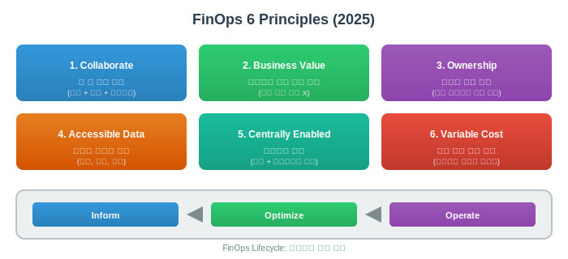
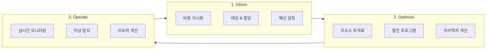

# FinOps (Cloud Financial Operations)

> `[3] 중급` · 선수 지식: [CI/CD](./ci-cd.md), 클라우드 기초

> `Trend` 2025-2026

> 클라우드 비용을 최적화하고 비즈니스 가치를 극대화하기 위한 운영 프레임워크

`#FinOps` `#CloudFinOps` `#클라우드비용최적화` `#CloudCostOptimization` `#CloudCost` `#비용관리` `#CostManagement` `#AWS` `#Azure` `#GCP` `#ReservedInstances` `#SavingsPlans` `#SpotInstances` `#Rightsizing` `#리소스최적화` `#TaggingStrategy` `#태깅전략` `#CostAllocation` `#비용할당` `#Chargeback` `#Showback` `#CloudWaste` `#클라우드낭비` `#UnitEconomics` `#단위비용` `#CostPerTransaction` `#GreenOps` `#지속가능성` `#ErrorBudget`

## 왜 알아야 하는가?

클라우드 지출이 2026년까지 **1조 달러**를 넘어설 것으로 예상되며, 그 중 **약 30%가 낭비**됩니다.

- **실무**: 개발팀이 비용에 대한 책임을 지는 시대. 비용 효율적인 아키텍처 설계 필수
- **면접**: "클라우드 비용 최적화 경험", "비용 절감 사례" 등 시니어 개발자 필수 역량
- **기반 지식**: DevOps, Platform Engineering, SRE의 필수 요소로 통합 중

## 핵심 개념

- **Inform → Optimize → Operate**: FinOps 라이프사이클 3단계
- **단위 비용 (Unit Economics)**: 고객당/트랜잭션당 비용으로 효율성 측정
- **Shared Responsibility**: 개발팀이 자신의 클라우드 사용에 대해 책임

## 쉽게 이해하기

**가정의 전기 요금 비유**

| 기존 방식 | FinOps 방식 |
|----------|-------------|
| 월말에 요금 폭탄 확인 | 실시간 사용량 모니터링 |
| 누가 얼마나 썼는지 모름 | 방별/기기별 사용량 추적 |
| 절약 동기 없음 | 절약하면 보상 (예산 재투자) |
| 요금은 집주인(IT팀)만 관심 | 모든 가족이 비용 인식 |

FinOps는 클라우드 비용을 **가시화**하고, **책임을 분산**하며, **최적화를 지속적으로 수행**합니다.

## 상세 설명

### FinOps 6대 원칙 (2025 업데이트)



| 원칙 | 설명 |
|------|------|
| **Teams need to collaborate** | 재무, 기술, 비즈니스 팀 간 협업 필수 |
| **Business value drives decisions** | 단순 비용 절감이 아닌 비즈니스 가치 중심 의사결정 |
| **Everyone takes ownership** | 각 팀이 자신의 클라우드 사용에 책임 |
| **Data should be accessible** | 비용 데이터는 적시에, 정확하게, 모두에게 공개 |
| **Centrally enabled** | FinOps 기능은 중앙에서 제공하고 팀에서 활용 |
| **Variable cost model** | 클라우드의 유연한 비용 구조를 적극 활용 |

### FinOps 라이프사이클



### 1단계: Inform (정보화)

**목표**: 누가 얼마나 쓰고 있는지 파악

**핵심 활동:**
- 태깅 전략 수립 및 적용
- 비용 대시보드 구축
- 비용 할당 (Chargeback/Showback)

**태깅 전략 예시:**

| 태그 키 | 값 예시 | 용도 |
|---------|--------|------|
| `Team` | order-team, payment-team | 팀별 비용 추적 |
| `Environment` | prod, staging, dev | 환경별 분류 |
| `Service` | api-gateway, user-service | 서비스별 비용 |
| `CostCenter` | CC-001, CC-002 | 회계 코드 연동 |
| `Owner` | alice@company.com | 담당자 식별 |

**Chargeback vs Showback:**

| 방식 | 설명 | 적합한 경우 |
|------|------|------------|
| **Showback** | 비용을 보여주기만 함 | 초기 도입, 비용 인식 제고 |
| **Chargeback** | 실제 비용을 팀 예산에 청구 | 성숙 단계, 책임 강화 |

### 2단계: Optimize (최적화)

**목표**: 낭비 제거 및 효율성 향상

**주요 최적화 영역:**

#### 1) 사용량 최적화 (Usage Optimization)

| 기법 | 설명 | 예상 절감 |
|------|------|----------|
| **Rightsizing** | 과다 프로비저닝된 인스턴스 축소 | 20-40% |
| **Idle Resource 제거** | 미사용 리소스 삭제 | 10-30% |
| **Auto Scaling** | 수요에 따른 자동 확장/축소 | 15-25% |
| **스케줄링** | 비업무 시간 리소스 중단 | 30-70% (개발환경) |

```bash
# AWS: 미사용 EBS 볼륨 찾기
aws ec2 describe-volumes \
  --filters Name=status,Values=available \
  --query 'Volumes[*].[VolumeId,Size,CreateTime]'

# AWS: 미사용 Elastic IP 찾기
aws ec2 describe-addresses \
  --query 'Addresses[?AssociationId==`null`].[PublicIp,AllocationId]'
```

#### 2) 요금 최적화 (Rate Optimization)

| 할인 유형 | 할인율 | 약정 | 적합한 경우 |
|----------|--------|------|------------|
| **On-Demand** | 0% | 없음 | 변동성 높은 워크로드 |
| **Savings Plans** | ~30% | 1-3년 | 유연한 약정 원할 때 |
| **Reserved Instances** | ~40-60% | 1-3년 | 안정적인 워크로드 |
| **Spot Instances** | ~70-90% | 없음 | 중단 가능한 배치 작업 |

**왜 혼합 전략인가?**

```
전체 워크로드 구성 (권장 비율)
┌─────────────────────────────────────────────────────────┐
│  Reserved/Savings (60-70%)  │  On-Demand  │    Spot    │
│       안정적 베이스          │   버스트    │  배치 작업  │
│        (20-30%)             │   (10-20%)  │            │
└─────────────────────────────────────────────────────────┘
```

#### 3) 아키텍처 최적화

| 전략 | 설명 | 예시 |
|------|------|------|
| **서버리스 전환** | 유휴 비용 제거 | Lambda, Cloud Functions |
| **컨테이너화** | 리소스 활용률 향상 | ECS, EKS, GKE |
| **스토리지 계층화** | 접근 빈도별 티어링 | S3 Glacier, Archive |
| **리전 최적화** | 비용 효율적 리전 선택 | 데이터 주권 고려 |

### 3단계: Operate (운영)

**목표**: 최적화 상태를 지속적으로 유지

**핵심 활동:**
- 실시간 비용 모니터링 및 알림
- 이상 비용 탐지 (Anomaly Detection)
- 정기 비용 리뷰 회의

**알림 설정 예시:**

```yaml
# AWS Budgets 알림 (Terraform)
resource "aws_budgets_budget" "monthly" {
  name         = "monthly-budget"
  budget_type  = "COST"
  limit_amount = "10000"
  limit_unit   = "USD"
  time_unit    = "MONTHLY"

  notification {
    comparison_operator = "GREATER_THAN"
    threshold           = 80
    threshold_type      = "PERCENTAGE"
    notification_type   = "ACTUAL"
    subscriber_email_addresses = ["finops@company.com"]
  }

  notification {
    comparison_operator = "GREATER_THAN"
    threshold           = 100
    threshold_type      = "PERCENTAGE"
    notification_type   = "FORECASTED"
    subscriber_email_addresses = ["finops@company.com", "cto@company.com"]
  }
}
```

### 단위 비용 (Unit Economics)

**왜 중요한가?**

총 비용만 보면 비즈니스 성장과 비용 증가를 구분할 수 없습니다.

```
월 클라우드 비용: $100,000 → $150,000 (50% 증가)

❌ 단순 비용 관점: "비용이 너무 올랐다!"

✅ 단위 비용 관점:
   - 월 주문 수: 100만 → 200만 (100% 증가)
   - 주문당 비용: $0.10 → $0.075 (25% 감소)
   - "효율성이 오히려 개선되었다!"
```

**주요 단위 비용 지표:**

| 지표 | 계산 | 용도 |
|------|------|------|
| **Cost per Customer** | 총비용 / 활성 사용자 수 | 고객 확보 비용 분석 |
| **Cost per Transaction** | 총비용 / 트랜잭션 수 | 거래 효율성 측정 |
| **Cost per Request** | 총비용 / API 요청 수 | 인프라 효율성 측정 |
| **Cost per GB** | 스토리지 비용 / 데이터량 | 스토리지 최적화 |

### FinOps 성숙도 모델

| 단계 | 특징 | 주요 활동 |
|------|------|----------|
| **Crawl** | 기초 단계 (61.8%) | 기본 태깅, 비용 가시화 |
| **Walk** | 발전 단계 | 자동화, 팀별 책임, 예측 |
| **Run** | 최적화 단계 | AI 기반 최적화, 실시간 의사결정 |

## 예제 코드

### AWS Cost Explorer API

```python
import boto3
from datetime import datetime, timedelta

def get_cost_by_service():
    client = boto3.client('ce')

    end_date = datetime.now().strftime('%Y-%m-%d')
    start_date = (datetime.now() - timedelta(days=30)).strftime('%Y-%m-%d')

    response = client.get_cost_and_usage(
        TimePeriod={
            'Start': start_date,
            'End': end_date
        },
        Granularity='MONTHLY',
        Metrics=['BlendedCost'],
        GroupBy=[
            {'Type': 'DIMENSION', 'Key': 'SERVICE'}
        ]
    )

    costs = []
    for result in response['ResultsByTime']:
        for group in result['Groups']:
            service = group['Keys'][0]
            cost = float(group['Metrics']['BlendedCost']['Amount'])
            if cost > 0:
                costs.append({'service': service, 'cost': cost})

    return sorted(costs, key=lambda x: x['cost'], reverse=True)

# 사용
top_services = get_cost_by_service()
for svc in top_services[:10]:
    print(f"{svc['service']}: ${svc['cost']:.2f}")
```

### 태깅 규칙 자동화 (AWS Config)

```yaml
# config-rule.yaml
Resources:
  RequiredTagsRule:
    Type: AWS::Config::ConfigRule
    Properties:
      ConfigRuleName: required-tags-check
      Description: "Checks that required tags are present"
      Scope:
        ComplianceResourceTypes:
          - AWS::EC2::Instance
          - AWS::RDS::DBInstance
          - AWS::S3::Bucket
      Source:
        Owner: AWS
        SourceIdentifier: REQUIRED_TAGS
      InputParameters:
        tag1Key: Team
        tag2Key: Environment
        tag3Key: CostCenter
```

### Slack 비용 알림 봇

```python
import boto3
import requests
from datetime import datetime, timedelta

SLACK_WEBHOOK = "https://hooks.slack.com/services/xxx"
COST_THRESHOLD = 1000  # USD

def check_daily_cost():
    client = boto3.client('ce')

    yesterday = (datetime.now() - timedelta(days=1)).strftime('%Y-%m-%d')
    today = datetime.now().strftime('%Y-%m-%d')

    response = client.get_cost_and_usage(
        TimePeriod={'Start': yesterday, 'End': today},
        Granularity='DAILY',
        Metrics=['BlendedCost']
    )

    daily_cost = float(
        response['ResultsByTime'][0]['Total']['BlendedCost']['Amount']
    )

    if daily_cost > COST_THRESHOLD:
        alert_to_slack(daily_cost, yesterday)

    return daily_cost

def alert_to_slack(cost, date):
    message = {
        "blocks": [
            {
                "type": "header",
                "text": {
                    "type": "plain_text",
                    "text": "⚠️ Daily Cost Alert"
                }
            },
            {
                "type": "section",
                "fields": [
                    {"type": "mrkdwn", "text": f"*Date:*\n{date}"},
                    {"type": "mrkdwn", "text": f"*Cost:*\n${cost:.2f}"},
                    {"type": "mrkdwn", "text": f"*Threshold:*\n${COST_THRESHOLD}"},
                    {"type": "mrkdwn", "text": f"*Status:*\n🔴 Over Budget"}
                ]
            }
        ]
    }
    requests.post(SLACK_WEBHOOK, json=message)
```

## 트레이드오프

| 장점 | 단점 |
|------|------|
| 클라우드 비용 30-40% 절감 가능 | FinOps 도구/인력 투자 필요 |
| 비용 예측 가능성 향상 | 초기 태깅/프로세스 정립 시간 |
| 팀별 책임감 강화 | 과도한 비용 절감 시 성능 저하 위험 |
| 비즈니스 가치 중심 의사결정 | 조직 문화 변화 필요 |

## 트러블슈팅

### 사례 1: 태깅 커버리지 부족

#### 증상
- 전체 비용의 40% 이상이 "Untagged"
- 팀별 비용 할당 불가

#### 원인 분석
- 태깅 정책 미수립
- 자동 프로비저닝 시 태그 누락
- 개발자 인식 부족

#### 해결 방법
```python
# AWS Lambda: 미태깅 리소스 자동 태깅
import boto3

def auto_tag_ec2(event, context):
    ec2 = boto3.resource('ec2')

    # 미태깅 인스턴스 찾기
    instances = ec2.instances.filter(
        Filters=[{'Name': 'tag-key', 'Values': ['Team'], 'Negate': True}]
    )

    for instance in instances:
        # 생성자 정보로 태그 추론
        creator = get_creator_from_cloudtrail(instance.id)

        instance.create_tags(Tags=[
            {'Key': 'Team', 'Value': 'Unknown'},
            {'Key': 'CreatedBy', 'Value': creator},
            {'Key': 'NeedsReview', 'Value': 'true'}
        ])

        # Slack으로 알림
        notify_owner(creator, instance.id)
```

#### 예방 조치
- IaC 템플릿에 필수 태그 포함
- CI/CD에서 태그 검증
- 미태깅 리소스 주간 리포트

### 사례 2: 예상치 못한 비용 급증

#### 증상
- 일일 비용이 평소의 3배 발생
- 알림이 너무 늦게 도착

#### 원인 분석
- 개발자가 실수로 고사양 인스턴스 100대 생성
- 비용 알림 임계값이 월간 기준이라 탐지 지연

#### 해결 방법
```yaml
# AWS Anomaly Detection 설정
resource "aws_ce_anomaly_monitor" "service_monitor" {
  name              = "ServiceAnomalyMonitor"
  monitor_type      = "DIMENSIONAL"
  monitor_dimension = "SERVICE"
}

resource "aws_ce_anomaly_subscription" "alert" {
  name      = "AnomalyAlertSubscription"
  threshold = 100  # $100 이상 이상치 발생 시

  monitor_arn_list = [aws_ce_anomaly_monitor.service_monitor.arn]

  subscriber {
    type    = "EMAIL"
    address = "finops@company.com"
  }

  subscriber {
    type    = "SNS"
    address = aws_sns_topic.cost_alerts.arn
  }
}
```

#### 예방 조치
- AI 기반 이상 탐지 활성화
- 일일 예산 알림 추가
- Service Quotas로 리소스 생성 제한

## 면접 예상 질문

### Q: FinOps의 핵심 원칙은 무엇인가요?

A: FinOps는 6가지 원칙을 기반으로 합니다. 핵심은 **협업**, **비즈니스 가치 중심 의사결정**, **모든 팀의 비용 책임**입니다. 재무팀만 비용을 관리하는 것이 아니라, 개발팀이 자신의 리소스 비용을 인식하고 최적화에 참여합니다. 비용 데이터는 실시간으로 모든 팀에 공개되며, 중앙 FinOps 팀은 도구와 가이드라인을 제공합니다.

### Q: 클라우드 비용 최적화를 어떻게 진행하나요?

A: 세 단계로 진행합니다.

1. **Inform**: 태깅으로 비용을 서비스/팀별로 분류하고 대시보드로 가시화
2. **Optimize**: Rightsizing, 예약 인스턴스, Spot 활용, 유휴 리소스 제거
3. **Operate**: 실시간 모니터링, 이상 탐지, 정기 리뷰

실무에서는 먼저 태깅 커버리지를 80% 이상 달성한 후 최적화를 시작하는 것이 효과적입니다.

### Q: 단위 비용(Unit Economics)이 왜 중요한가요?

A: 총 비용만 보면 비즈니스 성장과 낭비를 구분할 수 없습니다. 예를 들어 비용이 50% 증가해도 트랜잭션이 100% 증가했다면 효율성은 오히려 개선된 것입니다. 단위 비용(주문당 비용, 사용자당 비용)을 추적하면 규모의 경제 달성 여부와 진정한 최적화 효과를 측정할 수 있습니다.

## 연관 문서

| 문서 | 연관성 | 난이도 |
|------|--------|--------|
| [CI/CD](./ci-cd.md) | 비용 관리 파이프라인 통합 | [2] 입문 |
| [모니터링](./monitoring.md) | 비용 메트릭 통합 | [3] 중급 |
| [Platform Engineering](./platform-engineering.md) | 셀프서비스 인프라와 비용 거버넌스 | [4] 심화 |
| [Docker](../system-design/docker.md) | 컨테이너 리소스 효율화 | [3] 중급 |
| [Kubernetes](../system-design/kubernetes.md) | K8s 비용 최적화 | [3] 중급 |

## 참고 자료

- [FinOps Foundation - Framework](https://www.finops.org/framework/)
- [FinOps Principles 2025 Update](https://www.finops.org/framework/principles/)
- [AWS Cost Optimization Best Practices](https://docs.aws.amazon.com/wellarchitected/latest/cost-optimization-pillar/)
- [FinOps: A Comprehensive Guide 2025](https://www.hyperglance.com/blog/cloud-finops/)
- [How to build your FinOps strategy for 2026](https://dedicatted.com/insights/how-to-build-your-finops-strategy-for-2026)
