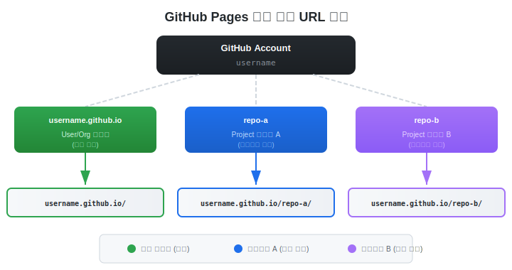

# GitHub Pages

> `[2] 입문` · 선수 지식: [CI/CD](./ci-cd.md)

> GitHub 저장소의 정적 파일을 무료로 호스팅하는 GitHub의 웹사이트 배포 서비스

`#GitHubPages` `#정적사이트` `#StaticSite` `#GitHubActions` `#정적호스팅` `#StaticHosting` `#CI/CD` `#배포자동화` `#포트폴리오` `#Portfolio` `#TIL` `#문서사이트` `#Documentation` `#Jekyll` `#SPA` `#SinglePageApplication` `#무료호스팅` `#FreeHosting` `#github.io` `#멀티레포배포` `#MultiRepoDeploy`

## 왜 알아야 하는가?

- **실무**: 프로젝트 문서 사이트, API 레퍼런스, 포트폴리오, 랜딩 페이지를 무료로 호스팅
- **면접**: CI/CD 파이프라인, 정적 사이트 배포 경험, GitHub Actions 활용 역량 확인
- **기반 지식**: GitHub Actions 워크플로우, 정적 사이트 생성기(SSG), 배포 자동화의 기본 이해

## 핵심 개념

- **User/Org 사이트**: `username.github.io` 레포에서 루트 URL(`/`)로 배포되는 메인 사이트
- **Project 사이트**: 일반 레포에서 서브 경로(`/repo-name/`)로 배포되는 개별 프로젝트 사이트
- **배포 소스(Source)**: Branch 방식(특정 브랜치 직접 서빙) 또는 GitHub Actions 방식(워크플로우로 빌드 후 배포)
- **GitHub Actions 배포**: `actions/upload-pages-artifact` + `actions/deploy-pages`로 구성되는 표준 워크플로우
- **`.nojekyll` 파일**: Jekyll 빌드를 비활성화하여 `_`로 시작하는 파일/폴더를 정상 서빙

## 쉽게 이해하기

**무료 전시장 비유**

GitHub Pages는 **무료 전시 공간**과 같습니다.

```
┌───────────────────────────────────────────────────────────────┐
│                GitHub = 거대한 창고 건물                       │
├───────────────────────────────────────────────────────────────┤
│                                                                │
│  📦 저장소(Repository) = 작업실                                │
│     코드와 파일을 보관하는 공간                                │
│                                                                │
│  🖼️ GitHub Pages = 전시장                                     │
│     작업실의 결과물을 방문자에게 보여주는 공간                 │
│                                                                │
│  ┌──────────────────────────────────────────────────────┐     │
│  │  username.github.io (메인 전시장)                     │     │
│  │  ├── /           → 메인 홀 (대표 작품)               │     │
│  │  ├── /repo-a/    → A 전시실 (프로젝트 A)             │     │
│  │  └── /repo-b/    → B 전시실 (프로젝트 B)             │     │
│  └──────────────────────────────────────────────────────┘     │
│                                                                │
│  하나의 건물 주소(도메인) 아래에                               │
│  여러 전시실(프로젝트)을 운영할 수 있습니다                   │
│                                                                │
└───────────────────────────────────────────────────────────────┘
```

**핵심 원리**: 각 저장소는 독립된 전시실이지만, 모두 같은 건물(`username.github.io`) 아래에 있어서 하나의 도메인으로 통합 관리됩니다.

## 상세 설명

### GitHub Pages 기본 구조

GitHub Pages는 두 가지 유형의 사이트를 제공합니다.

| 유형 | 레포 이름 | URL | 특징 |
|------|----------|-----|------|
| **User/Org 사이트** | `username.github.io` | `https://username.github.io/` | 계정당 1개, 루트 경로 |
| **Project 사이트** | `repo-name` (아무 이름) | `https://username.github.io/repo-name/` | 무제한, 서브 경로 |



**왜 이렇게 구분하는가?**

User/Org 사이트는 포트폴리오나 블로그 같은 **대표 사이트** 용도이고, Project 사이트는 각 프로젝트의 **문서나 데모** 용도입니다. 서브 경로 방식 덕분에 도메인 하나로 여러 프로젝트를 호스팅할 수 있습니다.

### 배포 방식 비교

GitHub Pages에는 두 가지 배포 방식이 있습니다.

| 항목 | Branch 방식 | GitHub Actions 방식 |
|------|------------|-------------------|
| **설정** | 브랜치/폴더 선택만 하면 끝 | 워크플로우 파일 필요 |
| **빌드** | Jekyll 자동 빌드 또는 없음 | 자유롭게 빌드 도구 선택 |
| **유연성** | 낮음 (Jekyll 한정) | 높음 (React, Vue, Hugo 등) |
| **추천 상황** | 단순 HTML/마크다운 | 빌드가 필요한 프로젝트 |
| **설정 위치** | Settings > Pages > Branch | Settings > Pages > GitHub Actions |

**왜 GitHub Actions 방식을 추천하는가?**

Branch 방식은 빌드 결과물을 레포에 커밋해야 하므로 히스토리가 지저분해집니다. Actions 방식은 소스 코드만 관리하고, 빌드와 배포는 CI/CD 파이프라인이 자동으로 처리합니다.

### 멀티 레포 배포 단계별 가이드 (핵심)

새 레포지토리마다 아래 3단계를 반복하면 GitHub Pages로 배포할 수 있습니다.


#### Step 1: Settings > Pages에서 Source 변경

```
레포지토리 > Settings > Pages > Build and deployment
  └── Source: "GitHub Actions" 선택
```

기본값인 "Deploy from a branch"에서 **"GitHub Actions"**로 변경합니다.

**왜?**

GitHub Actions 방식은 워크플로우에서 빌드 → 배포를 자동화하므로, 빌드 결과물을 별도 브랜치에 커밋할 필요가 없습니다.

#### Step 2: Static HTML 워크플로우 Configure

Source를 GitHub Actions로 변경하면 추천 워크플로우 목록이 나타납니다.

```
"Static HTML" 워크플로우의 "Configure" 클릭
```

아래와 같은 `.github/workflows/static.yml` 파일이 자동 생성됩니다:

```yaml
# .github/workflows/static.yml
name: Deploy static content to Pages

on:
  # main 브랜치에 push할 때 실행
  push:
    branches: ["main"]
  # Actions 탭에서 수동 실행 허용
  workflow_dispatch:

# GitHub token 권한 설정
permissions:
  contents: read
  pages: write
  id-token: write

# 동시 배포 방지 (하나만 실행)
concurrency:
  group: "pages"
  cancel-in-progress: false

jobs:
  deploy:
    environment:
      name: github-pages
      url: ${{ steps.deployment.outputs.page_url }}
    runs-on: ubuntu-latest
    steps:
      # 1. 소스 코드 체크아웃
      - name: Checkout
        uses: actions/checkout@v4
      # 2. GitHub Pages 설정
      - name: Setup Pages
        uses: actions/configure-pages@v5
      # 3. 아티팩트 업로드 (기본: 레포 루트 전체)
      - name: Upload artifact
        uses: actions/upload-pages-artifact@v3
        with:
          path: '.'
      # 4. Pages에 배포
      - name: Deploy to GitHub Pages
        id: deployment
        uses: actions/deploy-pages@v4
```

> **빌드가 필요한 프로젝트(React, Vue 등)**: `Upload artifact` 전에 빌드 단계를 추가하고 `path`를 빌드 출력 디렉토리(예: `./dist`, `./build`)로 변경하세요.

#### Step 3: Commit changes

```
"Commit changes..." 버튼 클릭
  └── 커밋 메시지 확인 후 "Commit changes"
```

커밋하면 GitHub Actions가 자동으로 실행되어 사이트가 배포됩니다.

**배포 확인:**
- Actions 탭에서 워크플로우 실행 상태 확인
- 성공 후 `https://username.github.io/repo-name/` 접속

#### 반복: 새 레포마다 Step 1~3 반복

```
┌────────────────────────────────────────────────────────┐
│          새 레포 배포 = 3단계 반복                       │
├────────────────────────────────────────────────────────┤
│                                                         │
│  레포 A  ──→  Settings > Pages > GitHub Actions         │
│          ──→  Static HTML Configure                     │
│          ──→  Commit changes                            │
│          ──→  username.github.io/repo-a/ ✓              │
│                                                         │
│  레포 B  ──→  Settings > Pages > GitHub Actions         │
│          ──→  Static HTML Configure                     │
│          ──→  Commit changes                            │
│          ──→  username.github.io/repo-b/ ✓              │
│                                                         │
│  레포 C  ──→  (동일한 3단계 반복)                       │
│          ──→  username.github.io/repo-c/ ✓              │
│                                                         │
└────────────────────────────────────────────────────────┘
```

### URL 구조

모든 프로젝트 사이트는 `username.github.io` 아래 서브 경로로 자동 매핑됩니다.

```
https://username.github.io/              ← username.github.io 레포
https://username.github.io/repo-a/       ← repo-a 레포
https://username.github.io/repo-b/       ← repo-b 레포
https://username.github.io/portfolio/    ← portfolio 레포
```

**주의**: 프로젝트 사이트는 항상 서브 경로에 배포되므로, HTML 내에서 리소스 참조 시 **상대 경로**를 사용해야 합니다.

```html
<!-- 권장 (O): 상대 경로 -->
<link rel="stylesheet" href="./css/style.css">


<!-- 비권장 (X): 절대 경로 (루트 기준이라 깨짐) -->
<link rel="stylesheet" href="/css/style.css">

```

### 커스텀 도메인 설정

GitHub Pages에 자체 도메인을 연결할 수 있습니다.

```
Settings > Pages > Custom domain
  └── 도메인 입력: example.com
```

**DNS 설정:**

| 레코드 타입 | 호스트 | 값 |
|------------|--------|-----|
| CNAME | www | `username.github.io` |
| A | @ | `185.199.108.153` |
| A | @ | `185.199.109.153` |
| A | @ | `185.199.110.153` |
| A | @ | `185.199.111.153` |

**HTTPS**: "Enforce HTTPS" 체크박스를 활성화하면 무료 SSL 인증서가 자동 발급됩니다.

### 실전 팁

#### 1. `.nojekyll` 파일

GitHub Pages는 기본적으로 Jekyll로 빌드합니다. `_`로 시작하는 파일/폴더(예: `_next/`, `_nuxt/`)가 무시되는 문제를 방지하려면:

```bash
# 레포 루트에 빈 파일 생성
touch .nojekyll
```

#### 2. SPA(Single Page Application) 라우팅

React Router 등 클라이언트 사이드 라우팅을 사용하면 새로고침 시 404가 발생합니다.

**해결 방법**: `404.html`에 리다이렉트 스크립트 추가

```html
<!-- 404.html -->
<!DOCTYPE html>
<html>
<head>
  <script>
    // SPA 라우팅을 위한 리다이렉트
    var pathSegmentsToKeep = 1; // 프로젝트 사이트는 1, User 사이트는 0
    var l = window.location;
    l.replace(
      l.protocol + '//' + l.hostname + (l.port ? ':' + l.port : '') +
      l.pathname.split('/').slice(0, 1 + pathSegmentsToKeep).join('/') + '/?/' +
      l.pathname.slice(1).split('/').slice(pathSegmentsToKeep).join('/').replace(/&/g, '~and~') +
      (l.search ? '&' + l.search.slice(1).replace(/&/g, '~and~') : '') +
      l.hash
    );
  </script>
</head>
</html>
```

#### 3. 빌드 프레임워크별 base path 설정

프로젝트 사이트는 서브 경로에 배포되므로 빌드 도구에 base path를 설정해야 합니다.

```javascript
// Vite (vite.config.js)
export default {
  base: '/repo-name/'
}

// Next.js (next.config.js)
module.exports = {
  basePath: '/repo-name'
}
```

```ruby
# Jekyll (_config.yml)
baseurl: "/repo-name"
```

## 트레이드오프

| 장점 | 단점 |
|------|------|
| 완전 무료 (Public 레포) | 정적 사이트만 가능 (서버 사이드 X) |
| GitHub Actions와 자연스러운 통합 | Private 레포는 Pro 이상 플랜 필요 |
| HTTPS 자동 지원 | 사이트 크기 제한 (1GB 권장) |
| 커스텀 도메인 지원 | 빌드 시간 제한 (10분) |
| CDN으로 빠른 응답 속도 | 월 100GB 대역폭 제한 (소프트 리밋) |
| 별도 서버 관리 불필요 | 서브 경로 배포 시 base path 설정 필요 |

## 트러블슈팅

### 사례 1: 404 Not Found

#### 증상
배포 성공 후 `username.github.io/repo-name/` 접속 시 404 에러 발생

#### 원인 분석
- `index.html` 파일이 레포 루트 또는 지정 디렉토리에 없음
- 워크플로우의 `path` 설정이 잘못됨
- 대소문자 불일치 (GitHub Pages는 대소문자 구분)

#### 해결 방법
```yaml
# 워크플로우에서 path 확인
- name: Upload artifact
  uses: actions/upload-pages-artifact@v3
  with:
    path: '.'  # 빌드 출력 디렉토리로 변경 (예: ./dist)
```

#### 예방 조치
배포 후 Actions 탭에서 아티팩트 내용을 확인하여 `index.html`이 포함되어 있는지 검증

### 사례 2: CSS/JS/이미지가 로드되지 않음

#### 증상
페이지는 뜨지만 스타일이 깨지고 스크립트가 동작하지 않음

#### 원인 분석
절대 경로(`/css/style.css`)를 사용하여 `username.github.io/css/style.css`를 요청하지만, 실제 파일은 `username.github.io/repo-name/css/style.css`에 위치

#### 해결 방법
```html
<!-- 상대 경로 사용 -->
<link rel="stylesheet" href="./css/style.css">

<!-- 또는 base 태그 사용 -->
<base href="/repo-name/">
```

#### 예방 조치
빌드 도구의 base path 설정을 프로젝트 초기에 구성

### 사례 3: Actions 워크플로우 실패

#### 증상
Actions 탭에서 워크플로우가 빨간색 X로 실패 표시

#### 원인 분석
- `permissions` 설정 누락
- Pages 기능이 활성화되지 않음
- `environment: github-pages` 설정 누락

#### 해결 방법
```yaml
# 필수 권한 확인
permissions:
  contents: read
  pages: write
  id-token: write

# 필수 환경 설정 확인
jobs:
  deploy:
    environment:
      name: github-pages
```

#### 예방 조치
GitHub에서 제공하는 기본 워크플로우 템플릿을 수정 없이 먼저 테스트 후 커스터마이징

## 면접 예상 질문

- Q: GitHub Pages에서 정적 사이트만 호스팅할 수 있는 이유는?
  - A: GitHub Pages는 CDN 기반 정적 파일 서빙 서비스이므로, 서버 사이드 로직(Node.js, Python 등)을 실행할 수 없습니다. 대신 빌드 단계에서 모든 페이지를 미리 생성(Pre-rendering)하거나 클라이언트 사이드에서 API를 호출하는 방식으로 동적 기능을 구현합니다.

- Q: GitHub Actions를 이용한 배포와 Branch 방식 배포의 차이는?
  - A: Branch 방식은 특정 브랜치의 파일을 그대로 서빙하므로 빌드 결과물을 커밋해야 합니다. Actions 방식은 워크플로우에서 빌드하고 아티팩트로 업로드하므로, 소스 코드만 관리하면 됩니다. 이는 관심사의 분리(소스 vs 빌드 결과)를 실현하는 CI/CD 모범 사례입니다.

- Q: 여러 레포지토리를 하나의 도메인 아래에 배포하는 원리는?
  - A: GitHub Pages는 `username.github.io` 도메인 아래 각 레포를 서브 경로로 매핑합니다. User 사이트는 루트(`/`)에, Project 사이트는 `/repo-name/`에 배포됩니다. 이는 리버스 프록시처럼 동작하며, 같은 도메인의 다른 경로로 각 레포의 정적 파일을 라우팅합니다.

## 연관 문서

| 문서 | 연관성 | 난이도 |
|------|--------|--------|
| [CI/CD](./ci-cd.md) | 선수 지식 - 지속적 배포 개념 | [2] 입문 |
| [GitOps](./gitops.md) | Git 기반 배포 패턴 | [4] 심화 |
| [배포 전략](./deployment-strategy.md) | 다양한 배포 방식 이해 | [3] 중급 |

## 참고 자료

- [GitHub Pages 공식 문서](https://docs.github.com/en/pages)
- [GitHub Actions - GitHub Pages 배포](https://docs.github.com/en/pages/getting-started-with-github-pages/configuring-a-publishing-source-for-your-github-pages-site)
- [actions/deploy-pages](https://github.com/actions/deploy-pages)
- [SPA on GitHub Pages](https://github.com/rafgraph/spa-github-pages)
