# Git Worktree

> `[3] 중급` · 선수 지식: [Git 기본 개념](./git-basics.md)

> 하나의 Git 저장소에서 여러 브랜치를 동시에 체크아웃하여 독립적인 작업 디렉토리에서 병렬 작업할 수 있게 해주는 기능

`#GitWorktree` `#워크트리` `#Worktree` `#병렬작업` `#브랜치동시작업` `#멀티브랜치` `#작업디렉토리` `#WorkingDirectory` `#git-worktree` `#브랜치전환없이` `#핫픽스` `#Hotfix` `#코드리뷰` `#CodeReview` `#동시개발` `#ParallelDevelopment` `#LinkedWorktree` `#BareRepository` `#gitdir` `#스태시없이` `#컨텍스트스위칭` `#ContextSwitch` `#브랜치격리` `#CI병렬빌드` `#모노레포`

## 왜 알아야 하는가?

- **실무**: feature 브랜치 작업 중 긴급 핫픽스가 필요할 때, `git stash` → 브랜치 전환 → 작업 → 복귀하는 번거로운 과정 없이 별도 디렉토리에서 즉시 작업 가능
- **면접**: Git 고급 기능에 대한 이해도를 보여주는 차별화 포인트. "브랜치 전환 비용을 줄이는 방법"이라는 질문에 worktree를 언급하면 실무 경험을 어필할 수 있음
- **기반 지식**: 모노레포 환경에서의 병렬 빌드, CI/CD 파이프라인 최적화, 대규모 프로젝트의 효율적 브랜치 관리 이해의 기반

## 핵심 개념

- **하나의 `.git` 공유**: 모든 워크트리는 동일한 `.git` 디렉토리(객체 DB, 참조 등)를 공유하므로 디스크 공간을 절약
- **독립적 작업 디렉토리**: 각 워크트리는 자체 working directory, index(staging area), HEAD를 가짐
- **브랜치 잠금**: 하나의 워크트리에서 체크아웃한 브랜치는 다른 워크트리에서 동시에 체크아웃할 수 없음 (충돌 방지)

## 쉽게 이해하기

도서관에서 책 한 권을 빌렸다고 생각해보자. 이 책의 1장을 읽다가 갑자기 5장을 참고해야 한다면, 보통은 책갈피를 꽂고 5장으로 넘겨야 한다. 그런데 **같은 책의 복사본**을 하나 더 받아서 한쪽은 1장을, 다른 한쪽은 5장을 펼쳐놓을 수 있다면? 이것이 바로 Git Worktree다.

- **기존 방식** (브랜치 전환): 책갈피 꽂기(`stash`) → 페이지 넘기기(`checkout`) → 작업 → 다시 돌아오기
- **Worktree 방식**: 같은 책의 복사본을 여러 권 펼쳐놓고 동시에 작업 (원본 데이터는 하나만 존재)

## 상세 설명

### 기본 구조

Git Worktree는 **메인 워크트리(main worktree)**와 **연결된 워크트리(linked worktree)**로 구성된다.



- **메인 워크트리**: `git init` 또는 `git clone`으로 생성된 원래 작업 디렉토리. `.git` 디렉토리를 직접 포함
- **연결된 워크트리**: `git worktree add`로 생성된 추가 작업 디렉토리. `.git` 파일(디렉토리가 아닌 파일)이 메인의 `.git/worktrees/` 를 가리킴

**왜 이렇게 하는가?**
`.git` 디렉토리를 공유함으로써 객체 데이터베이스(blob, tree, commit)를 중복 저장하지 않는다. `git clone`으로 저장소를 여러 개 만드는 것과 달리 디스크 공간을 절약하고, 모든 워크트리에서 동일한 remote, config, hooks를 사용한다.

### 주요 명령어

#### 워크트리 생성

```bash
# 새 브랜치를 만들면서 워크트리 생성
git worktree add ../hotfix-dir hotfix/login-bug

# 기존 브랜치로 워크트리 생성
git worktree add ../review-dir feature/user-api

# 새 브랜치를 자동 생성 (-b 옵션)
git worktree add -b bugfix/issue-42 ../bugfix-dir main
```

#### 워크트리 목록 확인

```bash
git worktree list
# /home/user/my-project         abc1234 [main]
# /home/user/hotfix-dir         def5678 [hotfix/login-bug]
# /home/user/review-dir         ghi9012 [feature/user-api]
```

#### 워크트리 제거

```bash
# 워크트리 디렉토리 삭제 후 정리
rm -rf ../hotfix-dir
git worktree prune

# 또는 한 번에 제거 (Git 2.17+)
git worktree remove ../hotfix-dir

# 변경사항이 있으면 강제 제거
git worktree remove --force ../hotfix-dir
```

#### 워크트리 이동

```bash
# 워크트리 디렉토리 위치 변경 (Git 2.21+)
git worktree move ../hotfix-dir ../new-hotfix-dir
```

#### 워크트리 잠금/해제

```bash
# 이동식 저장소 등에서 prune 방지를 위한 잠금
git worktree lock ../hotfix-dir --reason "USB에 저장 중"

# 잠금 해제
git worktree unlock ../hotfix-dir
```

### 실무 활용 시나리오

#### 시나리오 1: 긴급 핫픽스

feature 브랜치에서 대규모 리팩토링 중 프로덕션 버그가 발생한 상황:



```bash
# 현재: feature/big-refactor 브랜치에서 작업 중
# 긴급 핫픽스 워크트리 생성
git worktree add -b hotfix/critical-bug ../hotfix main

# 별도 터미널에서 핫픽스 작업
cd ../hotfix
# ... 버그 수정 ...
git add . && git commit -m "fix: critical login bug"
git push origin hotfix/critical-bug

# 핫픽스 완료 후 워크트리 제거
cd ../my-project
git worktree remove ../hotfix
```

**장점**: `git stash`로 진행 중인 작업을 임시 저장할 필요 없이, IDE 상태/열린 파일/디버깅 세션을 그대로 유지한 채 핫픽스 작업 가능

#### 시나리오 2: 코드 리뷰

PR 리뷰 시 리뷰 대상 브랜치를 별도 워크트리로 체크아웃:

```bash
# 리뷰용 워크트리 생성
git worktree add ../review feature/payment-api

# 리뷰 진행 (IDE에서 ../review 디렉토리 열기)
cd ../review
# ... 코드 확인, 테스트 실행 ...

# 리뷰 완료 후 제거
git worktree remove ../review
```

#### 시나리오 3: 버전 간 비교

두 브랜치의 동작을 동시에 비교해야 할 때:

```bash
# v1과 v2를 동시에 체크아웃
git worktree add ../app-v1 release/v1.0
git worktree add ../app-v2 release/v2.0

# 각각 서버를 띄워서 동작 비교 가능
```

#### 시나리오 4: CI/CD 병렬 빌드

CI 환경에서 여러 브랜치를 동시에 빌드할 때 `clone` 대신 `worktree`를 사용하면 네트워크 비용과 디스크 공간을 절약:

```bash
# bare repository를 기반으로 여러 워크트리에서 병렬 빌드
git clone --bare https://github.com/org/repo.git repo.git
git -C repo.git worktree add ../build-main main
git -C repo.git worktree add ../build-develop develop
```

## 트레이드오프

| 장점 | 단점 |
|------|------|
| 브랜치 전환 없이 병렬 작업 가능 | 워크트리 관리(생성/삭제)를 수동으로 해야 함 |
| `stash` 불필요, 컨텍스트 유지 | 같은 브랜치를 2개 이상의 워크트리에서 체크아웃 불가 |
| `.git` 공유로 디스크 절약 (clone 대비) | 워크트리 간 submodule 상태가 공유되지 않을 수 있음 |
| IDE에서 각 워크트리를 독립 프로젝트로 열 수 있음 | 워크트리 정리를 잊으면 디스크 낭비 |
| hooks, config, remote 등이 자동 공유 | 일부 GUI 도구에서 워크트리를 지원하지 않을 수 있음 |

## 트러블슈팅

### 사례 1: "fatal: '{branch}' is already checked out at '{path}'"

#### 증상
```bash
git worktree add ../new-dir main
# fatal: 'main' is already checked out at '/home/user/my-project'
```

#### 원인 분석
Git은 데이터 무결성을 위해 같은 브랜치를 2개 이상의 워크트리에서 동시에 체크아웃하는 것을 금지한다. 양쪽에서 동시에 커밋하면 한쪽의 변경사항이 유실될 수 있기 때문이다.

#### 해결 방법
```bash
# 방법 1: 새 브랜치를 만들어서 워크트리 생성
git worktree add -b hotfix/from-main ../new-dir main

# 방법 2: detached HEAD로 생성
git worktree add --detach ../new-dir main
```

#### 예방 조치
워크트리 생성 시 항상 전용 브랜치를 만드는 습관을 들인다.

### 사례 2: 삭제한 워크트리가 `git worktree list`에 남아있음

#### 증상
```bash
rm -rf ../old-worktree
git worktree list
# /home/user/old-worktree   abc1234 [some-branch]  (여전히 표시)
```

#### 원인 분석
디렉토리를 수동으로 삭제하면 `.git/worktrees/` 아래의 메타데이터가 남아있다.

#### 해결 방법
```bash
# 유효하지 않은 워크트리 메타데이터 정리
git worktree prune

# 또는 처음부터 git worktree remove 사용
git worktree remove ../old-worktree
```

### 사례 3: 워크트리에서 `git status`가 메인과 다른 결과를 보여줌

#### 증상
워크트리에서 수정한 파일이 메인 워크트리의 `git status`에 나타나지 않음

#### 원인 분석
각 워크트리는 **독립적인 index(staging area)와 HEAD**를 가진다. 이것이 정상 동작이다. 워크트리가 공유하는 것은 객체 DB와 참조(refs)뿐이며, 작업 디렉토리 상태는 완전히 분리된다.

#### 해결 방법
이것은 버그가 아니라 설계된 동작이다. 각 워크트리에서 독립적으로 `add`, `commit`을 수행하면 된다.

## `git worktree` vs `git clone` vs `git stash`

| 비교 항목 | `git worktree` | `git clone` | `git stash` |
|-----------|---------------|-------------|-------------|
| 디스크 사용량 | 적음 (`.git` 공유) | 많음 (전체 복제) | 없음 (같은 디렉토리) |
| 네트워크 필요 | 불필요 | 필요 (remote fetch) | 불필요 |
| 설정 공유 | 자동 (hooks, config) | 별도 설정 필요 | 해당 없음 |
| 동시 작업 | 가능 (병렬) | 가능 (병렬) | 불가 (순차) |
| 컨텍스트 유지 | 유지 | 유지 | **손실** (전환 필요) |
| 브랜치 제약 | 같은 브랜치 불가 | 제약 없음 | 해당 없음 |
| 적합한 상황 | 핫픽스, 리뷰, 비교 | 독립 환경 필요 시 | 빠른 임시 저장 |

## 면접 예상 질문

### Q: Git Worktree란 무엇이고, 어떤 상황에서 사용하나요?

A: Git Worktree는 하나의 저장소에서 여러 브랜치를 동시에 체크아웃할 수 있는 기능입니다. 모든 워크트리가 `.git` 디렉토리를 공유하므로 `git clone`보다 디스크 효율적입니다. 주로 feature 개발 중 긴급 핫픽스가 필요하거나, PR 리뷰 시 리뷰 대상 브랜치를 별도로 띄워야 할 때 사용합니다. **핵심은 브랜치 전환(context switch) 비용을 없애는 것**입니다. `git stash` + `checkout`으로는 IDE 상태, 빌드 캐시, 디버깅 세션을 잃지만, worktree는 현재 작업을 완전히 유지한 채 다른 브랜치에서 작업할 수 있습니다.

### Q: `git worktree`와 `git clone`의 차이점은?

A: 두 가지 모두 병렬 작업을 가능하게 하지만, worktree는 `.git` 객체 DB를 공유하므로 디스크 공간을 절약하고 네트워크가 불필요합니다. 또한 hooks, config, remote 설정이 자동 공유됩니다. 반면 clone은 완전히 독립적인 저장소를 만들어 같은 브랜치를 동시에 체크아웃하는 것도 가능합니다. **worktree는 "가벼운 병렬 작업"에, clone은 "완전 격리가 필요한 경우"에 적합합니다.**

### Q: 같은 브랜치를 여러 워크트리에서 체크아웃할 수 없는 이유는?

A: Git은 각 브랜치의 HEAD를 하나의 커밋으로 추적합니다. 만약 두 워크트리에서 같은 브랜치를 체크아웃하고 양쪽에서 커밋하면, 한쪽의 커밋이 다른 쪽에 반영되지 않아 데이터 불일치가 발생합니다. 이를 방지하기 위해 Git은 이미 체크아웃된 브랜치의 중복 체크아웃을 금지합니다. 대안으로 `-b` 옵션으로 새 브랜치를 만들거나, `--detach`로 detached HEAD 상태로 체크아웃할 수 있습니다.

## 연관 문서

| 문서 | 연관성 | 난이도 |
|------|--------|--------|
| [Git 기본 개념](./git-basics.md) | 선수 지식 | [2] 입문 |
| [Git 브랜치 전략](./git-branch-strategy.md) | worktree와 함께 활용하는 브랜치 전략 | [3] 중급 |
| [Git 내부 동작 원리](./git-internals.md) | .git 디렉토리 구조 이해 | [3] 중급 |
| [Git 고급 명령어](./git-advanced-commands.md) | stash, cherry-pick 등 대안 명령어 | [3] 중급 |

## 참고 자료

- [Git 공식 문서 - git-worktree](https://git-scm.com/docs/git-worktree)
- [Pro Git Book - Git Tools](https://git-scm.com/book/en/v2)
- [Git Worktree - Atlassian Tutorial](https://www.atlassian.com/git/tutorials)
