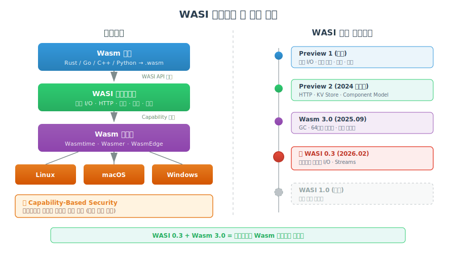
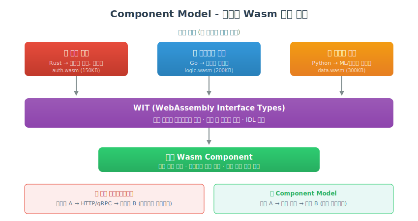
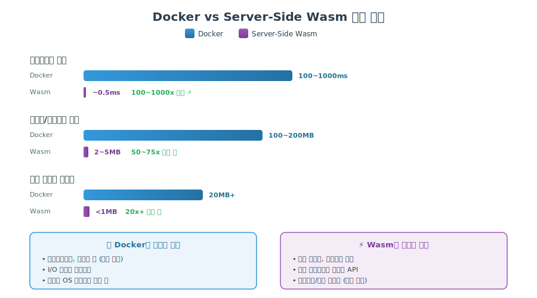
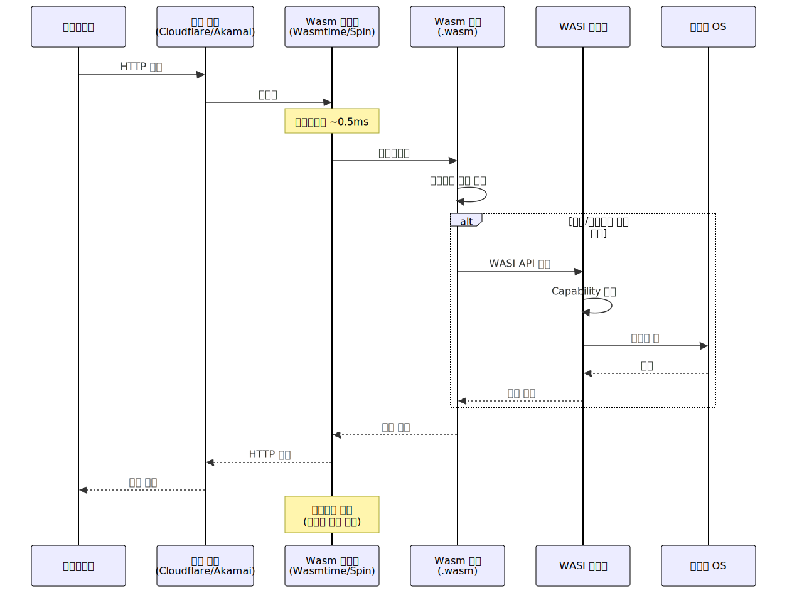

# Server-Side WebAssembly

> `[3] 중급` · 선수 지식: [WebAssembly](./webassembly.md)

> `Trend` 2026

> 브라우저를 넘어 서버와 엣지에서 WebAssembly를 실행하여, 컨테이너보다 빠르고 가볍고 안전한 워크로드 실행 환경을 구축하는 기술

`#ServerSideWasm` `#서버사이드웹어셈블리` `#WASI` `#WebAssemblySystemInterface` `#ComponentModel` `#컴포넌트모델` `#Wasmtime` `#Wasmer` `#WasmEdge` `#Spin` `#Fermyon` `#SpinKube` `#WasmCloud` `#엣지컴퓨팅` `#EdgeComputing` `#서버리스` `#Serverless` `#콜드스타트` `#ColdStart` `#Docker대안` `#컨테이너` `#CloudflareWorkers` `#FastlyCompute` `#Akamai` `#CNCF` `#BytecodeAlliance` `#Wasm3.0` `#GarbageCollection` `#샌드박싱` `#크로스플랫폼`

## 왜 알아야 하는가?

2026년, WebAssembly는 브라우저 전용 기술에서 **서버사이드 핵심 런타임**으로 진화했습니다. Docker의 창시자 Solomon Hykes가 "만약 2008년에 WASM+WASI가 있었다면 Docker를 만들 필요가 없었을 것"이라고 말한 것이 현실이 되고 있습니다.

- **실무**: 엣지 함수, 서버리스 마이크로서비스, 플러그인 시스템에서 Docker 컨테이너 대비 **100배 빠른 콜드스타트**와 **50배 작은 바이너리** 크기를 제공
- **면접**: "Wasm이 Docker를 대체할 수 있나요?", "WASI란 무엇인가요?", "서버사이드 Wasm의 장단점은?"
- **기반 지식**: 클라우드 네이티브 아키텍처, 엣지 컴퓨팅, 서버리스 2.0의 핵심 기술로, 현대 인프라 이해에 필수

## 핵심 개념

- **WASI (WebAssembly System Interface)**: Wasm이 OS 자원(파일, 네트워크 등)에 접근하기 위한 표준 인터페이스
- **Component Model**: 서로 다른 언어로 작성된 Wasm 모듈을 조합하는 아키텍처
- **서브밀리초 콜드스타트**: Docker 수백 ms 대비 ~0.5ms의 시작 시간
- **Capability-Based Security**: 명시적으로 허용된 자원만 접근 가능한 보안 모델

## 쉽게 이해하기

**우체국 vs 드론 배송에 비유:**

Docker 컨테이너는 **우체국 택배**와 같습니다:
- 박스에 물건(앱) + 포장재(OS 레이어) + 송장(설정)을 넣어 보냄
- 택배 차량을 출발시키는 데 시간이 걸림 (콜드스타트)
- 박스가 크고 무거움 (100~200MB)

Server-Side Wasm은 **드론 배송**입니다:
- 물건만 딱 실어서 바로 출발 (2~5MB)
- 이륙까지 1초도 안 걸림 (서브밀리초 콜드스타트)
- 드론이 허용된 경로만 비행 (샌드박싱)
- 어떤 배송 센터(OS)에서든 동일하게 작동 (크로스플랫폼)
- 하지만 대형 가구는 여전히 택배가 필요 (I/O 집약적 워크로드)

## 상세 설명

### 2026년 서버사이드 Wasm 생태계 현황

2026년은 서버사이드 Wasm의 **실용화 원년**입니다.

| 이벤트 | 시기 | 의미 |
|--------|------|------|
| Wasm 3.0 출시 | 2025.09 | GC, 64비트 메모리, 다중 메모리 지원 |
| WASI Preview 2 안정화 | 2024 | 서버사이드 표준 인터페이스 확정 |
| WASI 0.3 출시 예정 | 2026.02 | 네이티브 비동기 I/O 지원 |
| Akamai가 Fermyon 인수 | 2025.12 | 4,000+ 글로벌 PoP에서 엣지 Wasm |
| Spin이 CNCF Sandbox 합류 | 2025 | 클라우드 네이티브 생태계 공식 편입 |
| Wasmtime LTS 출시 | 2025.08 | 2년 보안 지원, 프로덕션 준비 완료 |

**왜 지금인가?**

Wasm 3.0의 GC 지원으로 Java, Kotlin, Dart 등 관리 언어가 Wasm 타겟으로 컴파일 가능해졌고, WASI 0.3의 네이티브 비동기 지원으로 실무 수준의 서버 애플리케이션 개발이 현실화되었습니다.

### WASI: 서버사이드의 핵심

WASI는 Wasm 모듈이 브라우저 밖에서 시스템 자원에 접근하기 위한 **표준 인터페이스**입니다.



#### WASI 버전별 주요 기능

| 버전 | 상태 | 핵심 기능 |
|------|------|----------|
| WASI Preview 1 | 안정 | 파일 I/O, 환경 변수, 시계 |
| WASI Preview 2 | 안정 (2024) | HTTP, 키-밸류 스토어, Component Model |
| WASI 0.3 | 개발 중 (2026.02) | **네이티브 비동기 I/O**, Streams |
| WASI 1.0 | 계획 | 장기 안정 표준 |

**왜 WASI가 중요한가?**

POSIX가 Unix 계열 OS의 표준 인터페이스이듯, WASI는 Wasm 런타임의 표준 인터페이스입니다. WASI 덕분에 동일한 Wasm 바이너리가 Linux, macOS, Windows, 엣지 노드 어디서든 동일하게 실행됩니다.

### Component Model: 다언어 모듈 조합

Component Model은 서로 다른 언어로 작성된 Wasm 모듈을 **레고 블록처럼 조합**하는 아키텍처입니다.



```
┌─────────────────────────────────────────────────────────────┐
│                   Wasm Component 조합 예시                     │
├─────────────────────────────────────────────────────────────┤
│                                                               │
│   ┌──────────────┐  ┌──────────────┐  ┌──────────────┐      │
│   │  인증 모듈    │  │  비즈니스 로직 │  │  데이터 처리  │      │
│   │  (Rust)      │  │  (Go)        │  │  (Python)    │      │
│   │  .wasm       │  │  .wasm       │  │  .wasm       │      │
│   └──────┬───────┘  └──────┬───────┘  └──────┬───────┘      │
│          │                 │                 │               │
│          └─────────────────┼─────────────────┘               │
│                            ▼                                  │
│              ┌──────────────────────┐                         │
│              │  Component Linker    │                         │
│              │  (WIT 인터페이스)     │                         │
│              └──────────┬───────────┘                         │
│                         │                                     │
│                         ▼                                     │
│              ┌──────────────────────┐                         │
│              │  통합 Wasm Component  │                         │
│              │  (단일 배포 단위)     │                         │
│              └──────────────────────┘                         │
│                                                               │
│   WIT (WebAssembly Interface Type):                           │
│   - 언어 간 타입 안전한 인터페이스 정의                         │
│   - IDL(Interface Definition Language) 역할                   │
│                                                               │
└─────────────────────────────────────────────────────────────┘
```

**왜 이렇게 하는가?**

마이크로서비스에서 각 서비스가 다른 언어로 작성되듯, Component Model은 **모듈 수준**에서 다언어 조합을 가능하게 합니다. 네트워크 호출 없이 함수 호출 수준으로 통합되므로 오버헤드가 거의 없습니다.

### Docker vs Server-Side Wasm



#### 정량적 비교

| 지표 | Docker | Server-Side Wasm | 차이 |
|------|--------|------------------|------|
| 콜드스타트 | 100~1000ms | **0.5~1ms** | 100~1000x 빠름 |
| 이미지/바이너리 크기 | 100~200MB | **2~5MB** | 50~75x 작음 |
| 유휴 메모리 | 20MB+ | **1MB 미만** | 20x+ 절약 |
| 보안 모델 | Namespace/cgroup 격리 | **Capability-based 샌드박싱** | Wasm이 더 강력 |
| 생태계 성숙도 | **13년 (성숙)** | 3~4년 (성장 중) | Docker 우세 |
| I/O 집약적 워크로드 | **우수** | 오버헤드 있음 | Docker 우세 |
| 상태 저장 앱 | **우수** | 제한적 | Docker 우세 |

#### 언제 무엇을 쓸 것인가?

```
┌─────────────────────────────────────────────────────────────┐
│                    기술 선택 의사결정 트리                      │
├─────────────────────────────────────────────────────────────┤
│                                                               │
│   워크로드 특성은?                                             │
│       │                                                       │
│       ├── 엣지/서버리스 함수 ──────► Server-Side Wasm         │
│       │   (낮은 지연, 빠른 스케일링)                           │
│       │                                                       │
│       ├── 데이터베이스/메시지 큐 ──► Docker                    │
│       │   (상태 저장, I/O 집약적)                              │
│       │                                                       │
│       ├── 플러그인/확장 시스템 ────► Server-Side Wasm         │
│       │   (보안 격리, 다언어)                                  │
│       │                                                       │
│       ├── 기존 모놀리식 앱 ────────► Docker                    │
│       │   (OS 종속성, 복잡한 의존성)                           │
│       │                                                       │
│       └── 하이브리드 아키텍처 ────► Docker + Wasm 공존        │
│           (SpinKube로 K8s에서 통합)                            │
│                                                               │
└─────────────────────────────────────────────────────────────┘
```

**핵심 원칙**: Wasm은 Docker의 **대체재가 아닌 보완재**입니다. 엣지에서는 Wasm, 클라우드에서는 Docker, 그리고 SpinKube로 Kubernetes 환경에서 양쪽을 통합하는 **하이브리드 패턴**이 2026년의 표준입니다.

### 주요 런타임 및 프레임워크

#### Wasmtime

Bytecode Alliance가 개발한 **프로덕션급 Wasm 런타임**입니다.

```
┌─────────────────────────────────────────────────────────────┐
│                     Wasmtime 특징                             │
├─────────────────────────────────────────────────────────────┤
│                                                               │
│  • CNCF 최초 Core Project 지위 획득                           │
│  • v36.0.0: 2년 보안 지원 LTS 릴리스 (2025.08)               │
│  • v39.0.0: WebAssembly 수준 디버깅 도입                      │
│  • Cranelift 컴파일러 백엔드 사용                             │
│  • WASI Preview 2 완벽 지원                                   │
│                                                               │
│  지원 언어: Rust, C/C++, Go, Python, .NET, Ruby              │
│                                                               │
└─────────────────────────────────────────────────────────────┘
```

#### Fermyon Spin

**서버리스 Wasm 앱을 가장 쉽게 만드는 프레임워크**입니다.

```rust
// Spin으로 HTTP 핸들러 작성 (Rust)
use spin_sdk::http::{IntoResponse, Request, Response};
use spin_sdk::http_component;

#[http_component]
fn handle_request(req: Request) -> anyhow::Result<impl IntoResponse> {
    Ok(Response::builder()
        .status(200)
        .header("content-type", "application/json")
        .body(r#"{"message": "Hello from Wasm!"}"#)
        .build())
}
```

```toml
# spin.toml - 앱 매니페스트
spin_manifest_version = 2

[application]
name = "hello-wasm"
version = "0.1.0"

[[trigger.http]]
route = "/api/hello"
component = "hello"

[component.hello]
source = "target/wasm32-wasi/release/hello.wasm"
```

```bash
# 빌드 및 실행
spin build
spin up  # 로컬 서버 시작 (포트 3000)

# 배포
spin deploy  # Fermyon Cloud로 배포
```

#### SpinKube: Kubernetes에서 Wasm 실행

SpinKube는 **Kubernetes 환경에서 Wasm 워크로드를 실행**하는 오픈소스 프로젝트입니다.

```yaml
# SpinKube SpinApp CRD 예시
apiVersion: core.spinoperator.dev/v1alpha1
kind: SpinApp
metadata:
  name: hello-wasm
spec:
  image: "ghcr.io/myorg/hello-wasm:v1"
  executor:
    name: containerd-shim-spin
  replicas: 3
```

**왜 SpinKube가 중요한가?**

기존 Kubernetes 인프라를 그대로 활용하면서 Wasm 워크로드를 추가할 수 있습니다. Docker 컨테이너와 Wasm 앱이 **같은 클러스터에서 공존**하므로, 점진적 마이그레이션이 가능합니다.

### 엣지 컴퓨팅 활용 사례

서버사이드 Wasm의 **킬러 유스케이스**는 엣지 컴퓨팅입니다.

| 플랫폼 | 특징 | 글로벌 PoP |
|--------|------|-----------|
| **Cloudflare Workers** | V8 기반 Wasm 실행 | 330+ |
| **Fastly Compute** | 마이크로초 인스턴스화 | 90+ |
| **Akamai (Fermyon)** | Spin 기반, 인수 후 확대 | 4,000+ |

**실제 활용 사례:**

| 기업 | 사례 | 효과 |
|------|------|------|
| American Express | WasmCloud 플랫폼 | 마이크로서비스 경량화 |
| Shopify | 엣지 Wasm 함수 | 전 세계 저지연 커머스 |
| WordPress Playground | PHP를 Wasm으로 실행 | 브라우저에서 WordPress 실행 |
| Figma | Wasm 플러그인 | 네이티브급 성능의 안전한 확장 |

## 동작 원리



## 예제 코드

### Go로 Spin HTTP 핸들러 작성

```go
package main

import (
    "fmt"
    "net/http"

    spinhttp "github.com/fermyon/spin/sdk/go/v2/http"
)

func init() {
    spinhttp.Handle(func(w http.ResponseWriter, r *http.Request) {
        w.Header().Set("Content-Type", "application/json")
        fmt.Fprintf(w, `{"path": "%s", "method": "%s"}`, r.URL.Path, r.Method)
    })
}

func main() {}
```

### JavaScript/TypeScript로 Spin 핸들러 작성

```javascript
// Spin JavaScript SDK
export async function handleRequest(request) {
    const url = new URL(request.url);

    return {
        status: 200,
        headers: { "content-type": "application/json" },
        body: JSON.stringify({
            message: "Hello from Wasm!",
            path: url.pathname,
            timestamp: new Date().toISOString()
        })
    };
}
```

### Cloudflare Workers에서 Wasm 실행

```javascript
// Rust로 컴파일된 Wasm 모듈을 Workers에서 사용
import init, { process_image } from './image_processor.wasm';

export default {
    async fetch(request, env) {
        await init();

        const imageData = await request.arrayBuffer();
        // Rust/Wasm으로 이미지 처리 (네이티브급 성능)
        const processed = process_image(new Uint8Array(imageData));

        return new Response(processed, {
            headers: { 'Content-Type': 'image/webp' }
        });
    }
};
```

## 트레이드오프

| 장점 | 단점 |
|------|------|
| 서브밀리초 콜드스타트 (~0.5ms) | 생태계가 아직 성장 중 (Docker 대비) |
| 극소 바이너리 크기 (2~5MB) | I/O 집약적 워크로드에서 오버헤드 |
| 강력한 Capability-based 보안 | 상태 저장 애플리케이션 지원 제한적 |
| 진정한 크로스플랫폼 (Write once, run anywhere) | 디버깅 도구가 아직 미성숙 |
| 다언어 Component Model | WASI 표준이 아직 진화 중 |
| Kubernetes 통합 (SpinKube) | 네이티브 네트워킹 기능 제한적 |
| 네이티브의 ~95% 성능 (Wasmer 6.0) | 러닝 커브 (새로운 배포 패러다임) |

## 트러블슈팅

### 사례 1: WASI 버전 호환성 문제

#### 증상

```bash
Error: cannot link wasm module - missing import: wasi_snapshot_preview1::sock_accept
```

#### 원인 분석

WASI Preview 1으로 컴파일된 모듈을 Preview 2 전용 런타임에서 실행하거나, 런타임이 지원하지 않는 WASI 함수를 호출할 때 발생합니다.

#### 해결 방법

```bash
# 1. 런타임 버전 확인
wasmtime --version

# 2. 적절한 WASI 타겟으로 재컴파일
# Preview 1
cargo build --target wasm32-wasi

# Preview 2 (wasip2)
cargo build --target wasm32-wasip2

# 3. 또는 adapter 모듈 사용
wasmtime run --adapt wasi_snapshot_preview1=adapter.wasm my_module.wasm
```

#### 예방 조치

- 프로젝트 초기에 WASI 타겟 버전을 명시적으로 결정
- CI/CD에서 `wasmtime --version`을 출력하여 런타임 버전 추적
- 새로운 프로젝트는 `wasm32-wasip2` 사용 권장

### 사례 2: 메모리 한계 초과

#### 증상

```
wasm trap: out of bounds memory access
```

#### 원인 분석

Wasm 모듈은 기본적으로 선형 메모리를 사용하며, 초기 메모리 크기가 작게 설정된 경우 대용량 데이터 처리 시 초과됩니다.

#### 해결 방법

```bash
# Wasmtime에서 메모리 제한 조정
wasmtime run --max-memory-size 536870912 my_module.wasm  # 512MB

# Spin에서 메모리 설정
# spin.toml
[component.my-component]
max_memory = "512mb"
```

#### 예방 조치

- 대용량 데이터는 스트리밍 처리
- WASI 0.3의 Streams API 활용
- 메모리 사용량 모니터링 설정

## 면접 예상 질문

### Q: Server-Side Wasm이 Docker를 대체할 수 있나요?

A: **대체가 아닌 보완 관계**입니다. Wasm은 엣지 컴퓨팅, 서버리스 함수, 플러그인 시스템에서 Docker보다 압도적인 성능(100x 빠른 콜드스타트, 50x 작은 크기)을 보이지만, 데이터베이스, 메시지 큐 같은 상태 저장 I/O 집약적 워크로드에서는 Docker가 여전히 우세합니다. 2026년의 표준 패턴은 **엣지에서 Wasm, 클라우드에서 Docker, SpinKube로 하이브리드**입니다.

### Q: WASI의 Capability-Based Security가 Docker의 보안 모델보다 나은 이유는?

A: Docker는 Linux의 Namespace와 cgroup으로 격리하지만, 커널을 공유하므로 **커널 취약점에 노출**됩니다. WASI의 Capability-Based Security는 모듈이 **명시적으로 부여받은 자원만** 접근할 수 있습니다. 예를 들어 특정 디렉토리만 읽기 권한을 부여하면, 그 외 파일 시스템은 존재 자체를 알 수 없습니다. 이는 최소 권한 원칙(Principle of Least Privilege)을 **아키텍처 수준에서 강제**합니다.

### Q: Component Model이 마이크로서비스 아키텍처에 미치는 영향은?

A: Component Model은 **네트워크 호출 없이** 서로 다른 언어로 작성된 모듈을 함수 호출 수준으로 조합합니다. 기존 마이크로서비스에서 HTTP/gRPC로 통신하던 오버헤드를 제거하고, WIT(WebAssembly Interface Type)로 **타입 안전한 인터페이스**를 정의합니다. 이를 통해 "인증은 Rust, 비즈니스 로직은 Go, 데이터 처리는 Python"처럼 각 언어의 강점을 살린 **나노서비스(Nanoservice)** 패턴이 가능해집니다.

### Q: WASI 0.3에서 네이티브 비동기가 왜 중요한가요?

A: 기존 WASI Preview 2까지는 비동기 I/O를 네이티브로 지원하지 않아, HTTP 요청이나 데이터베이스 쿼리 시 **블로킹 방식**으로 동작했습니다. WASI 0.3의 네이티브 비동기 지원으로 Rust의 async/await, Go의 goroutine과 유사한 **논블로킹 I/O**가 Wasm 레벨에서 가능해집니다. 이는 서버사이드 Wasm이 **실무급 웹 서버와 API 게이트웨이**로 사용될 수 있는 핵심 전환점입니다.

## 연관 문서

| 문서 | 연관성 | 난이도 |
|------|--------|--------|
| [WebAssembly](./webassembly.md) | 선수 지식 - Wasm 기본 개념, 샌드박싱 | [2] 입문 |
| [서버리스](../system-design/serverless.md) | Serverless 2.0과 Wasm 통합 | [3] 중급 |
| [Docker](../system-design/docker.md) | 컨테이너 vs Wasm 비교 | [3] 중급 |
| [Kubernetes](../system-design/kubernetes.md) | SpinKube로 K8s 통합 | [4] 심화 |
| [엣지 컴퓨팅](../system-design/edge-computing.md) | Wasm 킬러 유스케이스 | [3] 중급 |

## 참고 자료

- [WebAssembly vs Docker - When to Use Each in 2026](https://byteiota.com/webassembly-vs-docker-when-to-use-each-in-2026/)
- [State of WebAssembly 2026](https://devnewsletter.com/p/state-of-webassembly-2026/)
- [WASI 1.0: WebAssembly Is Everywhere in 2026 - The New Stack](https://thenewstack.io/wasi-1-0-you-wont-know-when-webassembly-is-everywhere-in-2026/)
- [Backend Development Trends in 2026 - Medium](https://medium.com/@Adekola_Olawale/backend-development-trends-in-2026-what-you-should-learn-2561711da04f)
- [6 Software Development and DevOps Trends Shaping 2026 - DZone](https://dzone.com/articles/software-devops-trends-shaping-2026)
- [Fermyon Spin 공식 문서](https://developer.fermyon.com/spin)
- [Wasmtime 공식 문서](https://wasmtime.dev/)
- [SpinKube 프로젝트](https://www.spinkube.dev/)
- [Bytecode Alliance](https://bytecodealliance.org/)
