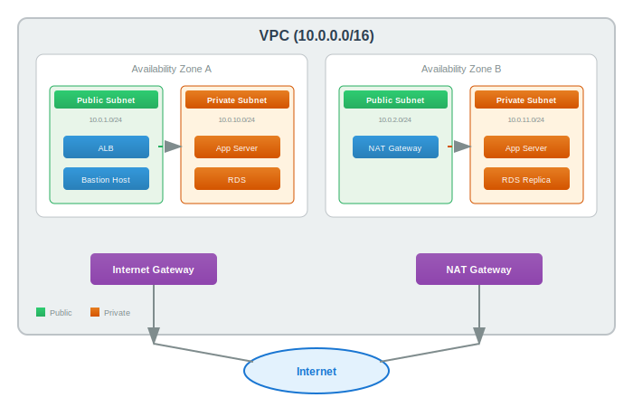

# VPC (Virtual Private Cloud)

> `[3] 중급` · 선수 지식: [네트워크란](./what-is-network.md), [TCP/IP](./tcp-ip.md)

> 클라우드 환경에서 논리적으로 격리된 가상 네트워크로, 자체 IP 주소 범위와 보안 규칙을 정의할 수 있는 프라이빗 네트워크

`#VPC` `#VirtualPrivateCloud` `#가상사설클라우드` `#Subnet` `#서브넷` `#CIDR` `#NAT` `#NATGateway` `#InternetGateway` `#IGW` `#SecurityGroup` `#보안그룹` `#NACL` `#NetworkACL` `#RouteTable` `#라우팅테이블` `#VPCPeering` `#피어링` `#TransitGateway` `#PrivateSubnet` `#PublicSubnet` `#AWS` `#Azure` `#GCP` `#VNet` `#Bastion` `#VPNGateway` `#DirectConnect` `#ExpressRoute`

## 왜 알아야 하는가?

VPC는 클라우드 인프라 설계의 **기초**입니다. 모든 클라우드 리소스는 VPC 내에 배치됩니다.

- **실무**: "VPC, Subnet, Peering에 대한 깊은 이해" - 클라우드 아키텍트 필수 역량
- **면접**: 네트워크 설계, 보안 그룹 설정, 서브넷 구성 등 실무 질문 빈출
- **기반 지식**: 모든 클라우드 서비스(EKS, RDS, Lambda 등)가 VPC 위에서 동작

## 핵심 개념

- **VPC**: 클라우드 내 논리적으로 격리된 가상 네트워크
- **Subnet**: VPC를 더 작은 IP 범위로 분할한 네트워크 세그먼트
- **Route Table**: 네트워크 트래픽의 경로를 결정하는 규칙 집합
- **Security Group / NACL**: 인바운드/아웃바운드 트래픽 제어

## 쉽게 이해하기

**빌딩 비유**

| 개념 | 비유 |
|------|------|
| **VPC** | 빌딩 전체 |
| **Subnet** | 층별 공간 (1층, 2층, 지하) |
| **Public Subnet** | 로비 (외부 방문객 출입 가능) |
| **Private Subnet** | 사무실 (직원만 출입 가능) |
| **Internet Gateway** | 정문 (외부와 연결) |
| **NAT Gateway** | 대리 접수처 (내부에서 외부로만 연락) |
| **Security Group** | 각 방의 출입문 잠금장치 |
| **NACL** | 층별 출입 통제 |
| **Route Table** | 빌딩 내 이정표/안내판 |

## 상세 설명

### VPC 기본 아키텍처



```
┌─────────────────────────────────────────────────────────────────────┐
│                         VPC (10.0.0.0/16)                           │
│                                                                      │
│  ┌─────────────────────────────────────────────────────────────────┐│
│  │                    Availability Zone A                          ││
│  │  ┌───────────────────────┐  ┌───────────────────────┐          ││
│  │  │  Public Subnet        │  │  Private Subnet       │          ││
│  │  │  10.0.1.0/24          │  │  10.0.3.0/24          │          ││
│  │  │  ┌─────────┐          │  │  ┌─────────┐          │          ││
│  │  │  │   ALB   │──────────│──│─▶│   App   │          │          ││
│  │  │  └─────────┘          │  │  └────┬────┘          │          ││
│  │  └───────────────────────┘  │       │               │          ││
│  │                             │       ▼               │          ││
│  │                             │  ┌─────────┐          │          ││
│  │                             │  │   RDS   │          │          ││
│  │                             │  └─────────┘          │          ││
│  │                             └───────────────────────┘          ││
│  └─────────────────────────────────────────────────────────────────┘│
│                                                                      │
│  ┌─────────────────────────────────────────────────────────────────┐│
│  │                    Availability Zone B                          ││
│  │  ┌───────────────────────┐  ┌───────────────────────┐          ││
│  │  │  Public Subnet        │  │  Private Subnet       │          ││
│  │  │  10.0.2.0/24          │  │  10.0.4.0/24          │          ││
│  │  └───────────────────────┘  └───────────────────────┘          ││
│  └─────────────────────────────────────────────────────────────────┘│
│                                                                      │
│       │                              │                               │
│       ▼                              ▼                               │
│  ┌─────────┐                   ┌───────────┐                        │
│  │  IGW    │                   │ NAT GW    │                        │
│  └────┬────┘                   └─────┬─────┘                        │
│       │                              │                               │
└───────┼──────────────────────────────┼───────────────────────────────┘
        │                              │
        ▼                              ▼
   ┌─────────┐                   ┌─────────┐
   │ Internet│                   │ Internet│
   └─────────┘                   └─────────┘
```

### Subnet 설계

#### Public Subnet vs Private Subnet

| 구분 | Public Subnet | Private Subnet |
|------|---------------|----------------|
| **인터넷 접근** | 직접 가능 (IGW) | NAT Gateway 통해 가능 |
| **Public IP** | 할당 가능 | 할당 불가 |
| **용도** | ALB, Bastion, NAT GW | App Server, DB, Cache |
| **보안** | 외부 노출 | 외부 격리 |

#### CIDR 설계 가이드

```
VPC CIDR: 10.0.0.0/16 (65,536 IPs)
├── Public Subnet AZ-A:  10.0.1.0/24 (256 IPs)
├── Public Subnet AZ-B:  10.0.2.0/24 (256 IPs)
├── Private Subnet AZ-A: 10.0.10.0/24 (256 IPs)
├── Private Subnet AZ-B: 10.0.11.0/24 (256 IPs)
├── DB Subnet AZ-A:      10.0.20.0/24 (256 IPs)
├── DB Subnet AZ-B:      10.0.21.0/24 (256 IPs)
└── Reserved:            10.0.100.0/22 (1,024 IPs) - 향후 확장용
```

**왜 /16을 사용하는가?**
- 충분한 IP 주소 확보 (65,536개)
- 서브넷 확장 유연성
- 향후 VPC Peering 시 IP 충돌 방지

### Route Table (라우팅 테이블)

트래픽이 어디로 가야 하는지 결정하는 규칙.

**Public Subnet Route Table:**

| Destination | Target | 설명 |
|-------------|--------|------|
| 10.0.0.0/16 | local | VPC 내부 통신 |
| 0.0.0.0/0 | igw-xxx | 인터넷으로 나가는 모든 트래픽 |

**Private Subnet Route Table:**

| Destination | Target | 설명 |
|-------------|--------|------|
| 10.0.0.0/16 | local | VPC 내부 통신 |
| 0.0.0.0/0 | nat-xxx | NAT Gateway로 아웃바운드 |

### Internet Gateway vs NAT Gateway

```
                  Internet
                     │
        ┌────────────┴────────────┐
        │                         │
        ▼                         ▼
┌───────────────┐        ┌───────────────┐
│ Internet GW   │        │   NAT GW      │
│ (양방향)       │        │ (단방향)       │
└───────┬───────┘        └───────┬───────┘
        │                         │
        ▼                         ▼
┌───────────────┐        ┌───────────────┐
│ Public Subnet │───────▶│ Private Subnet│
│ (ALB, Bastion)│        │ (App, DB)     │
└───────────────┘        └───────────────┘
```

| 구분 | Internet Gateway | NAT Gateway |
|------|------------------|-------------|
| **방향** | 양방향 (인바운드 + 아웃바운드) | 아웃바운드만 |
| **위치** | VPC에 연결 | Public Subnet에 배치 |
| **비용** | 무료 | 시간당 + 데이터 전송 비용 |
| **용도** | 퍼블릭 리소스 인터넷 연결 | 프라이빗 리소스 아웃바운드 |

### Security Group vs NACL

| 구분 | Security Group | NACL |
|------|----------------|------|
| **레벨** | 인스턴스 (ENI) | 서브넷 |
| **상태** | Stateful | Stateless |
| **규칙** | Allow만 | Allow + Deny |
| **평가** | 모든 규칙 평가 | 순서대로 평가 |
| **기본값** | 모든 아웃바운드 허용 | 모든 트래픽 허용 |

**Stateful vs Stateless:**

```
Stateful (Security Group):
요청 → 허용 → 응답도 자동 허용

Stateless (NACL):
요청 → 허용 → 응답은 별도 규칙 필요 (Ephemeral ports)
```

**Security Group 설계 예시:**

```
┌─────────────────────────────────────────────────────────────┐
│                    Security Group Chain                      │
│                                                              │
│   ALB-SG          App-SG          DB-SG                     │
│  ┌─────┐         ┌─────┐         ┌─────┐                    │
│  │80/443│  ───▶  │8080 │  ───▶  │5432 │                    │
│  │from │        │from │        │from │                    │
│  │0.0.0.0│       │ALB-SG│        │App-SG│                    │
│  └─────┘         └─────┘         └─────┘                    │
│                                                              │
└─────────────────────────────────────────────────────────────┘
```

### VPC Peering

두 VPC 간 프라이빗 네트워크 연결.

```
┌─────────────────┐         ┌─────────────────┐
│   VPC A         │         │   VPC B         │
│   10.0.0.0/16   │◀─────▶ │   10.1.0.0/16   │
│                 │ Peering │                 │
│   App Servers   │         │   Data Services │
└─────────────────┘         └─────────────────┘
```

**Peering 제약사항:**
- CIDR 범위 중복 불가
- **Transitive Peering 불가**: A↔B, B↔C 연결 시 A↔C 자동 연결 안 됨
- 리전 간 Peering 가능 (Inter-Region)

**Transitive Peering 해결책: Transit Gateway**

```
       ┌─────────────┐
       │ Transit GW  │
       └──────┬──────┘
      ┌───────┼───────┐
      ▼       ▼       ▼
   ┌─────┐ ┌─────┐ ┌─────┐
   │VPC A│ │VPC B│ │VPC C│
   └─────┘ └─────┘ └─────┘
```

### 클라우드 벤더별 비교

| 기능 | AWS | Azure | GCP |
|------|-----|-------|-----|
| **VPC 명칭** | VPC | VNet | VPC |
| **범위** | Regional | Regional | **Global** |
| **Subnet 범위** | AZ | AZ 전체 | Regional |
| **기본 VPC** | 자동 생성 | 없음 | Default VPC |
| **Peering** | VPC Peering | VNet Peering | VPC Peering |
| **허브-스포크** | Transit GW | Virtual WAN | Shared VPC |
| **Private 연결** | Direct Connect | ExpressRoute | Cloud Interconnect |

**GCP의 Global VPC:**
- 하나의 VPC가 모든 리전 커버
- 서브넷은 리전별로 생성
- 리전 간 통신이 기본으로 가능

## 예제 코드

### Terraform - AWS VPC 구성

```hcl
# VPC 생성
resource "aws_vpc" "main" {
  cidr_block           = "10.0.0.0/16"
  enable_dns_hostnames = true
  enable_dns_support   = true

  tags = {
    Name        = "production-vpc"
    Environment = "prod"
  }
}

# Internet Gateway
resource "aws_internet_gateway" "main" {
  vpc_id = aws_vpc.main.id

  tags = {
    Name = "production-igw"
  }
}

# Public Subnet
resource "aws_subnet" "public" {
  count                   = 2
  vpc_id                  = aws_vpc.main.id
  cidr_block              = "10.0.${count.index + 1}.0/24"
  availability_zone       = data.aws_availability_zones.available.names[count.index]
  map_public_ip_on_launch = true

  tags = {
    Name = "public-subnet-${count.index + 1}"
    Type = "public"
  }
}

# Private Subnet
resource "aws_subnet" "private" {
  count             = 2
  vpc_id            = aws_vpc.main.id
  cidr_block        = "10.0.${count.index + 10}.0/24"
  availability_zone = data.aws_availability_zones.available.names[count.index]

  tags = {
    Name = "private-subnet-${count.index + 1}"
    Type = "private"
  }
}

# NAT Gateway
resource "aws_nat_gateway" "main" {
  allocation_id = aws_eip.nat.id
  subnet_id     = aws_subnet.public[0].id

  tags = {
    Name = "production-nat-gw"
  }
}

# Route Table - Public
resource "aws_route_table" "public" {
  vpc_id = aws_vpc.main.id

  route {
    cidr_block = "0.0.0.0/0"
    gateway_id = aws_internet_gateway.main.id
  }

  tags = {
    Name = "public-route-table"
  }
}

# Route Table - Private
resource "aws_route_table" "private" {
  vpc_id = aws_vpc.main.id

  route {
    cidr_block     = "0.0.0.0/0"
    nat_gateway_id = aws_nat_gateway.main.id
  }

  tags = {
    Name = "private-route-table"
  }
}

# Security Group - Web
resource "aws_security_group" "web" {
  name        = "web-sg"
  description = "Security group for web servers"
  vpc_id      = aws_vpc.main.id

  ingress {
    from_port   = 443
    to_port     = 443
    protocol    = "tcp"
    cidr_blocks = ["0.0.0.0/0"]
  }

  ingress {
    from_port   = 80
    to_port     = 80
    protocol    = "tcp"
    cidr_blocks = ["0.0.0.0/0"]
  }

  egress {
    from_port   = 0
    to_port     = 0
    protocol    = "-1"
    cidr_blocks = ["0.0.0.0/0"]
  }

  tags = {
    Name = "web-security-group"
  }
}

# Security Group - App (from Web SG only)
resource "aws_security_group" "app" {
  name        = "app-sg"
  description = "Security group for app servers"
  vpc_id      = aws_vpc.main.id

  ingress {
    from_port       = 8080
    to_port         = 8080
    protocol        = "tcp"
    security_groups = [aws_security_group.web.id]  # Web SG에서만 허용
  }

  egress {
    from_port   = 0
    to_port     = 0
    protocol    = "-1"
    cidr_blocks = ["0.0.0.0/0"]
  }

  tags = {
    Name = "app-security-group"
  }
}
```

### VPC Peering 설정

```hcl
# VPC Peering Connection
resource "aws_vpc_peering_connection" "peer" {
  vpc_id        = aws_vpc.main.id          # Requester VPC
  peer_vpc_id   = aws_vpc.services.id      # Accepter VPC
  peer_region   = "ap-northeast-2"
  auto_accept   = false

  tags = {
    Name = "vpc-peering-main-services"
  }
}

# Accepter 측에서 수락
resource "aws_vpc_peering_connection_accepter" "peer" {
  vpc_peering_connection_id = aws_vpc_peering_connection.peer.id
  auto_accept               = true
}

# Route Table 업데이트 - Main VPC
resource "aws_route" "main_to_services" {
  route_table_id            = aws_route_table.private.id
  destination_cidr_block    = "10.1.0.0/16"  # Services VPC CIDR
  vpc_peering_connection_id = aws_vpc_peering_connection.peer.id
}
```

## 트레이드오프

| 장점 | 단점 |
|------|------|
| 네트워크 격리 및 보안 | 초기 설계 복잡도 |
| 세밀한 트래픽 제어 | NAT Gateway 비용 |
| 확장 가능한 IP 공간 | CIDR 변경 어려움 |
| 멀티 AZ 고가용성 | 리전 간 통신 지연 |

## 트러블슈팅

### 사례 1: Private Subnet에서 인터넷 접근 불가

#### 증상
- Private Subnet의 EC2에서 `apt update` 실패
- 외부 API 호출 타임아웃

#### 원인 분석
- NAT Gateway 미설정
- Route Table에 NAT Gateway 경로 누락
- NAT Gateway가 잘못된 서브넷에 위치

#### 해결 방법
```bash
# 1. NAT Gateway 상태 확인
aws ec2 describe-nat-gateways --filter Name=state,Values=available

# 2. Route Table 확인
aws ec2 describe-route-tables --route-table-id rtb-xxx

# 3. Route 추가
aws ec2 create-route \
  --route-table-id rtb-private \
  --destination-cidr-block 0.0.0.0/0 \
  --nat-gateway-id nat-xxx
```

### 사례 2: VPC Peering 후 통신 불가

#### 증상
- Peering 연결은 Active 상태
- 하지만 Ping/SSH 실패

#### 원인 분석
- 양쪽 Route Table에 피어링 경로 미추가
- Security Group에서 피어링 VPC CIDR 미허용
- CIDR 범위 중복

#### 해결 방법
```bash
# 양쪽 VPC Route Table에 경로 추가 필요
# VPC A → VPC B
aws ec2 create-route \
  --route-table-id rtb-vpc-a \
  --destination-cidr-block 10.1.0.0/16 \
  --vpc-peering-connection-id pcx-xxx

# VPC B → VPC A
aws ec2 create-route \
  --route-table-id rtb-vpc-b \
  --destination-cidr-block 10.0.0.0/16 \
  --vpc-peering-connection-id pcx-xxx

# Security Group 업데이트
aws ec2 authorize-security-group-ingress \
  --group-id sg-xxx \
  --protocol tcp \
  --port 22 \
  --cidr 10.1.0.0/16
```

## 면접 예상 질문

### Q: Public Subnet과 Private Subnet의 차이점은?

A: **Public Subnet**은 Internet Gateway와 연결되어 인터넷과 직접 통신이 가능하고, 리소스에 Public IP를 할당할 수 있습니다. **Private Subnet**은 인터넷과 직접 연결되지 않고, 외부로 나가려면 NAT Gateway를 통해야 합니다. 보안상 애플리케이션 서버와 데이터베이스는 Private Subnet에 배치하고, ALB나 Bastion Host는 Public Subnet에 배치합니다.

### Q: Security Group과 NACL의 차이점은?

A: **Security Group**은 인스턴스 레벨에서 동작하며 Stateful(응답 트래픽 자동 허용)입니다. Allow 규칙만 지원합니다. **NACL**은 서브넷 레벨에서 동작하며 Stateless(인바운드/아웃바운드 별도 규칙 필요)입니다. Allow와 Deny 모두 지원하고 규칙 번호 순서대로 평가합니다. 일반적으로 Security Group을 주로 사용하고, NACL은 서브넷 전체에 대한 추가 방어 계층으로 사용합니다.

### Q: VPC Peering의 제약사항은?

A: 첫째, **CIDR 중복 불가** - 피어링할 VPC의 IP 범위가 겹치면 안 됩니다. 둘째, **Transitive Peering 불가** - A↔B, B↔C 연결 시 A↔C는 자동 연결되지 않습니다. 이 문제는 Transit Gateway로 해결합니다. 셋째, VPC당 피어링 개수 제한이 있습니다 (AWS 기준 125개).

## 연관 문서

| 문서 | 연관성 | 난이도 |
|------|--------|--------|
| [네트워크란](./what-is-network.md) | 선수 지식 | [1] 정의 |
| [TCP/IP](./tcp-ip.md) | 선수 지식 | [2] 입문 |
| [Cloud Native](../system-design/cloud-native.md) | 클라우드 아키텍처 | [2] 입문 |
| [Load Balancing](./load-balancing.md) | ALB/NLB 연계 | [4] 심화 |
| [Docker](../system-design/docker.md) | 컨테이너 네트워킹 | [3] 중급 |

## 참고 자료

- [What is Amazon VPC? - AWS](https://docs.aws.amazon.com/vpc/latest/userguide/what-is-amazon-vpc.html)
- [VPC Peering - AWS](https://docs.aws.amazon.com/vpc/latest/peering/vpc-peering-basics.html)
- [Virtual Networks and Subnets in AWS, Azure, GCP](https://blog.ipspace.net/2021/02/vpc-subnets-aws-azure-gcp/)
- [GCP VPC Network Peering](https://docs.cloud.google.com/vpc/docs/vpc-peering)
- [Networking Services Compared: AWS vs Azure vs GCP](https://www.pluralsight.com/resources/blog/cloud/networking-services-compared-aws-vs-azure-vs-google-cloud)
