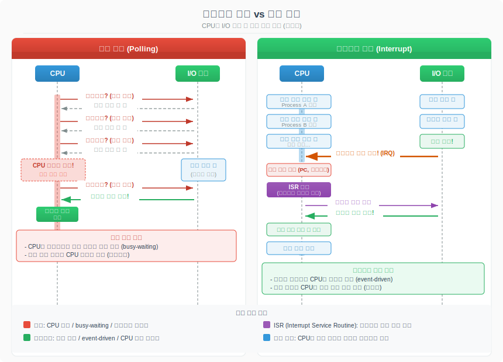

# 인터럽트 (Interrupt)

> `[2] 입문` · 선수 지식: [운영체제란](./what-is-os.md)

> CPU가 실행 중인 작업을 일시 중단하고 긴급한 이벤트를 먼저 처리하는 메커니즘

`#인터럽트` `#Interrupt` `#IRQ` `#InterruptRequest` `#ISR` `#InterruptServiceRoutine` `#인터럽트핸들러` `#InterruptHandler` `#인터럽트벡터테이블` `#IVT` `#InterruptVectorTable` `#IDT` `#InterruptDescriptorTable` `#하드웨어인터럽트` `#소프트웨어인터럽트` `#트랩` `#Trap` `#폴트` `#Fault` `#NMI` `#NonMaskableInterrupt` `#마스커블` `#폴링` `#Polling` `#PIC` `#APIC` `#인터럽트우선순위` `#컨텍스트저장` `#타이머인터럽트`

## 왜 알아야 하는가?

- **실무**: 네트워크 패킷 수신, 디스크 I/O 완료, 타이머 기반 스케줄링 등 OS의 거의 모든 동작이 인터럽트로 시작된다. 고성능 서버 튜닝 시 인터럽트 친화성(IRQ Affinity) 설정이 필수다.
- **면접**: "시스템 콜은 어떻게 커널 모드로 전환하나요?", "폴링과 인터럽트의 차이는?" 등 OS 면접의 핵심 주제다.
- **기반 지식**: 시스템 콜, 컨텍스트 스위칭, 스케줄링, I/O 모델 등 대부분의 OS 개념이 인터럽트를 기반으로 동작한다.

## 핵심 개념

- CPU는 명령어를 순차 실행하다가 인터럽트 신호를 받으면 **현재 상태를 저장**하고, **인터럽트 서비스 루틴(ISR)**을 실행한 뒤, **원래 작업으로 복귀**한다
- 인터럽트는 크게 **하드웨어 인터럽트**(외부 장치)와 **소프트웨어 인터럽트**(프로그램 내부)로 나뉜다
- 인터럽트가 없으면 CPU는 장치 상태를 계속 확인(폴링)해야 하므로 **CPU 자원이 낭비**된다

## 쉽게 이해하기

**식당 주방장 비유**

주방장(CPU)이 요리(프로그램)를 하고 있다고 상상하자.

- **폴링 방식**: 주방장이 30초마다 홀에 나가서 "새 주문 있나요?" 확인한다. 주문이 없어도 매번 확인해야 하므로 요리 시간이 낭비된다.
- **인터럽트 방식**: 주문이 들어오면 벨이 울린다(인터럽트). 주방장은 벨이 울릴 때만 하던 요리를 잠시 멈추고(상태 저장), 주문서를 확인한 뒤(ISR 실행), 다시 요리를 계속한다(복귀).

벨(인터럽트)이 있으면 주방장은 요리에만 집중할 수 있고, 새 주문에도 즉시 대응할 수 있다.

## 상세 설명

### 인터럽트의 종류



#### 하드웨어 인터럽트 (외부 인터럽트)

CPU 외부의 장치가 발생시키는 전기적 신호다.

| 구분 | 설명 | 예시 |
|------|------|------|
| **마스커블 (Maskable)** | CPU가 무시(마스킹)할 수 있는 인터럽트 | 키보드 입력, 마우스 클릭, 디스크 I/O 완료, 네트워크 패킷 수신 |
| **논마스커블 (NMI)** | CPU가 절대 무시할 수 없는 인터럽트 | 전원 장애, 메모리 패리티 에러, 하드웨어 치명적 오류 |

**왜 마스킹이 필요한가?**

임계 영역(Critical Section) 실행 중 인터럽트가 발생하면 데이터 정합성이 깨질 수 있다. 예를 들어 커널이 프로세스 테이블을 수정하는 도중 인터럽트가 발생하면, ISR에서 같은 테이블에 접근할 때 불일치가 생긴다. 그래서 중요한 코드 구간에서는 인터럽트를 일시적으로 비활성화(마스킹)한다.

#### 소프트웨어 인터럽트 (내부 인터럽트)

프로그램 실행 중 CPU 내부에서 발생한다.

| 구분 | 설명 | 예시 | 복구 가능 |
|------|------|------|----------|
| **트랩 (Trap)** | 의도적으로 발생시킨 인터럽트 | 시스템 콜(`int 0x80`, `syscall`), 디버깅 브레이크포인트 | O |
| **폴트 (Fault)** | 오류지만 복구 가능한 인터럽트 | 페이지 폴트, 세그멘테이션 폴트 | O (재실행) |
| **어보트 (Abort)** | 복구 불가능한 치명적 오류 | 기계 체크 예외, 이중 폴트 | X (프로세스 종료) |

**왜 트랩과 폴트를 구분하는가?**

트랩은 다음 명령어부터 실행을 재개하지만, 폴트는 오류를 유발한 **같은 명령어를 다시 실행**한다. 페이지 폴트를 예로 들면, 가상 메모리 페이지가 물리 메모리에 없을 때 폴트가 발생하고, OS가 페이지를 로드한 뒤 같은 명령어를 재실행하면 정상 동작한다.

### 인터럽트 벡터 테이블 (IVT / IDT)

인터럽트 번호와 ISR 주소를 매핑하는 테이블이다.

```
┌──────────────────────────────────────────────┐
│        인터럽트 벡터 테이블 (IVT/IDT)          │
├──────────┬───────────────────────────────────┤
│  번호     │  ISR 주소 (핸들러)                 │
├──────────┼───────────────────────────────────┤
│  0x00    │  Division Error Handler           │
│  0x01    │  Debug Exception Handler          │
│  0x02    │  NMI Handler                      │
│  ...     │  ...                              │
│  0x0E    │  Page Fault Handler               │
│  ...     │  ...                              │
│  0x20    │  Timer Interrupt Handler          │
│  0x21    │  Keyboard Interrupt Handler       │
│  0x80    │  System Call Handler (Linux)      │
│  ...     │  ...                              │
└──────────┴───────────────────────────────────┘
```

- x86에서는 **IDT(Interrupt Descriptor Table)**라고 부른다
- 부팅 시 OS가 테이블을 초기화하고, `IDTR` 레지스터에 테이블 주소를 등록한다
- 인터럽트 발생 시 CPU는 이 테이블에서 번호에 해당하는 ISR 주소를 찾아 점프한다

### 인터럽트 처리 과정



인터럽트 발생부터 복귀까지 6단계로 진행된다:

**1단계: 인터럽트 발생**

외부 장치가 인터럽트 컨트롤러(PIC/APIC)를 통해 CPU에 IRQ 신호를 보내거나, 프로그램이 `int` 명령어를 실행한다.

**2단계: 현재 명령어 완료**

CPU는 현재 실행 중인 명령어를 끝까지 완료한다. 명령어 중간에 중단하면 레지스터 상태가 불일치하기 때문이다.

**3단계: 상태 저장 (Context Save)**

PC(Program Counter), 플래그 레지스터, 범용 레지스터 등을 커널 스택에 저장한다.

```
커널 스택 (상태 저장)
┌────────────────┐
│  SS (스택 세그먼트)  │  ← 높은 주소
│  RSP (스택 포인터)   │
│  RFLAGS (플래그)     │
│  CS (코드 세그먼트)  │
│  RIP (다음 명령어)   │  ← CPU가 자동 저장
├────────────────┤
│  범용 레지스터      │  ← ISR이 수동 저장
│  (RAX, RBX, ...)   │
└────────────────┘  ← 낮은 주소
```

**4단계: 인터럽트 벡터 테이블 참조**

CPU가 인터럽트 번호로 IDT를 조회하여 해당 ISR의 시작 주소를 얻는다.

**5단계: ISR 실행**

ISR(Interrupt Service Routine)이 실행되어 인터럽트를 처리한다. 키보드 인터럽트라면 키 코드를 버퍼에 저장하고, 타이머 인터럽트라면 틱 카운터를 증가시킨다.

**6단계: 상태 복원 및 복귀**

저장했던 레지스터를 복원하고, `iret`(interrupt return) 명령어로 원래 코드의 중단 지점으로 돌아간다.

### 인터럽트 컨트롤러 (PIC / APIC)

여러 장치에서 동시에 인터럽트가 발생할 수 있으므로, **인터럽트 컨트롤러**가 중재한다.

| 구분 | PIC (8259A) | APIC |
|------|-------------|------|
| **시대** | 단일 CPU 시대 | 멀티코어 시대 |
| **IRQ 수** | 15개 (마스터 8 + 슬레이브 7) | 256개 |
| **코어 분배** | 불가 (단일 CPU만) | 특정 코어에 인터럽트 분배 가능 |
| **현재 사용** | 레거시 호환용 | 현대 시스템 표준 |

**왜 APIC이 필요한가?**

멀티코어 환경에서 네트워크 카드의 인터럽트가 항상 코어 0에서만 처리되면, 코어 0은 과부하되고 나머지 코어는 유휴 상태가 된다. APIC은 인터럽트를 여러 코어에 분산하여 처리량을 높인다.

### 인터럽트 우선순위

모든 인터럽트가 동등하지 않다. 우선순위가 높은 인터럽트가 먼저 처리된다.

```
높음  ┌─────────────────────────────┐
  ▲   │  NMI (전원 장애, 하드웨어 오류) │  ← 절대 무시 불가
  │   ├─────────────────────────────┤
  │   │  기계 체크 예외               │
  │   ├─────────────────────────────┤
  │   │  타이머 인터럽트              │  ← 스케줄링의 기반
  │   ├─────────────────────────────┤
  │   │  디스크 I/O 완료             │
  │   ├─────────────────────────────┤
  │   │  네트워크 패킷 수신           │
  │   ├─────────────────────────────┤
  │   │  키보드 / 마우스 입력         │
  │   ├─────────────────────────────┤
  ▼   │  소프트웨어 인터럽트 (트랩)    │
낮음  └─────────────────────────────┘
```

**중첩 인터럽트 (Nested Interrupt)**

ISR 실행 중에 더 높은 우선순위의 인터럽트가 발생하면, 현재 ISR을 중단하고 상위 인터럽트를 먼저 처리한다. 이를 중첩 인터럽트라 한다.

```
[프로그램 실행] → [키보드 ISR 실행] → [타이머 ISR 실행] → [키보드 ISR 재개] → [프로그램 재개]
                  ↑ 키보드 인터럽트     ↑ 타이머 인터럽트(우선순위 높음)
```

### 인터럽트 vs 폴링



| 비교 항목 | 폴링 (Polling) | 인터럽트 (Interrupt) |
|----------|---------------|---------------------|
| **동작 방식** | CPU가 주기적으로 장치 상태 확인 | 장치가 CPU에게 신호 전송 |
| **CPU 효율** | 낮음 (대기 시간 낭비) | 높음 (이벤트 발생 시만 처리) |
| **응답 시간** | 폴링 주기에 의존 (느릴 수 있음) | 즉시 반응 (빠름) |
| **구현 복잡도** | 단순 (반복문) | 복잡 (ISR, 벡터 테이블, 컨트롤러) |
| **적합한 상황** | 이벤트가 매우 빈번한 경우 | 이벤트가 비정기적으로 발생하는 경우 |

**왜 폴링이 여전히 사용되는가?**

인터럽트 처리에는 상태 저장/복원 오버헤드가 있다. 네트워크 카드가 초당 수만 개의 패킷을 수신하는 고성능 환경에서는 인터럽트 오버헤드가 오히려 병목이 된다. Linux의 **NAPI(New API)**는 이 문제를 해결하기 위해 **인터럽트 + 폴링 하이브리드** 방식을 사용한다:

1. 첫 패킷 → 인터럽트로 알림
2. 이후 패킷 → 폴링으로 연속 처리 (인터럽트 비활성화)
3. 패킷이 없으면 → 다시 인터럽트 모드로 전환

## 실무에서의 인터럽트

### 타이머 인터럽트

```
타이머 인터럽트 → OS 스케줄러 호출 → 프로세스 전환 (컨텍스트 스위칭)
```

- 일정 주기(보통 1ms~10ms)마다 발생하여 OS 스케줄러에게 CPU 제어권을 돌려준다
- 이것이 없으면 **선점형 스케줄링**이 불가능하다 (프로세스가 CPU를 독점)

### 키보드 인터럽트

```
키 입력 → IRQ 1 → 키보드 ISR → 스캔 코드를 버퍼에 저장 → 프로세스에 전달
```

- 키를 누를 때마다 IRQ 1 인터럽트가 발생한다
- ISR이 키 스캔 코드를 읽어 커널 버퍼에 저장하고, 대기 중인 프로세스에 전달한다

### 네트워크 인터럽트

```
패킷 수신 → NIC가 IRQ 발생 → ISR이 패킷을 커널 버퍼에 복사 → 프로토콜 스택 처리
```

- 네트워크 카드(NIC)가 패킷을 수신하면 인터럽트를 발생시킨다
- 고성능 서버에서는 **IRQ Affinity** 설정으로 특정 코어에 네트워크 인터럽트를 바인딩한다

### IRQ Affinity 설정 (Linux)

```shell
# 현재 인터럽트 통계 확인
cat /proc/interrupts

# IRQ 16번을 CPU 코어 2에 바인딩 (비트마스크: 0x04 = 코어 2)
echo 4 > /proc/irq/16/smp_affinity

# IRQ별 처리 코어 확인
cat /proc/irq/16/smp_affinity
```

## 트레이드오프

| 장점 | 단점 |
|------|------|
| CPU를 효율적으로 사용 (유휴 시간 최소화) | 상태 저장/복원 오버헤드 |
| 이벤트에 빠르게 반응 | 구현 복잡도 증가 (ISR, IDT 관리) |
| 비동기 I/O의 기반 | 빈번한 인터럽트 시 livelock 가능성 |
| 멀티태스킹/선점형 스케줄링 가능 | 인터럽트 우선순위 관리 필요 |

## 면접 예상 질문

### Q: 인터럽트와 폴링의 차이점은?

A: 폴링은 CPU가 주기적으로 장치 상태를 확인하는 방식이고, 인터럽트는 장치가 CPU에게 능동적으로 신호를 보내는 방식이다. 폴링은 구현이 단순하지만 CPU 시간을 낭비하고, 인터럽트는 CPU 효율은 높지만 상태 저장/복원 오버헤드가 있다. 실무에서는 NAPI처럼 둘을 결합한 하이브리드 방식도 사용한다.

### Q: 시스템 콜과 인터럽트의 관계는?

A: 시스템 콜은 **소프트웨어 인터럽트(트랩)**의 한 종류다. 유저 모드 프로그램이 `syscall` 명령어를 실행하면 트랩이 발생하고, CPU가 커널 모드로 전환되어 시스템 콜 핸들러(IDT의 0x80번 등)를 실행한다. 즉, 인터럽트 메커니즘 덕분에 유저↔커널 모드 전환이 가능하다.

### Q: 인터럽트를 비활성화하면 어떤 일이 발생하나?

A: 마스커블 인터럽트를 비활성화하면 타이머 인터럽트도 차단되어 스케줄러가 호출되지 않는다. 즉 프로세스가 CPU를 독점하게 된다. 커널은 임계 영역 보호를 위해 짧은 시간만 인터럽트를 비활성화하며, 오래 비활성화하면 시스템 응답성이 극도로 저하된다. NMI는 비활성화할 수 없으므로 하드웨어 오류는 항상 처리된다.

### Q: 페이지 폴트는 인터럽트인가?

A: 페이지 폴트는 소프트웨어 인터럽트 중 **폴트(Fault)**에 해당한다. 프로그램이 물리 메모리에 없는 가상 메모리 페이지에 접근하면 CPU가 폴트를 발생시키고, OS의 페이지 폴트 핸들러가 해당 페이지를 디스크에서 메모리로 로드한다. 로드가 완료되면 폴트를 유발한 같은 명령어를 **재실행**한다. 이것이 트랩(다음 명령어로 진행)과의 핵심 차이점이다.

## 연관 문서

| 문서 | 연관성 | 난이도 |
|------|--------|--------|
| [운영체제란](./what-is-os.md) | 선수 지식 - OS 구조와 역할 | [1] 정의 |
| [시스템 콜](./system-call.md) | 소프트웨어 인터럽트(트랩)의 대표적 활용 | [2] 입문 |
| [프로세스와 스레드](./process-vs-thread.md) | 인터럽트를 통한 프로세스 전환 | [2] 입문 |
| [컨텍스트 스위칭](./context-switching.md) | 인터럽트 발생 시 컨텍스트 저장/복원 | [3] 중급 |
| [스케줄링](./scheduling.md) | 타이머 인터럽트 기반 선점형 스케줄링 | [3] 중급 |
| [가상 메모리](./virtual-memory.md) | 페이지 폴트 인터럽트 처리 | [3] 중급 |

## 참고 자료

- Abraham Silberschatz, "Operating System Concepts" (공룡책) - Chapter 1.2 Interrupt
- Andrew S. Tanenbaum, "Modern Operating Systems" - Chapter 5 Input/Output
- Intel 64 and IA-32 Architectures Software Developer's Manual - Vol 3. Chapter 6 Interrupt and Exception Handling
- Linux Kernel Documentation - /proc/interrupts, IRQ Affinity
