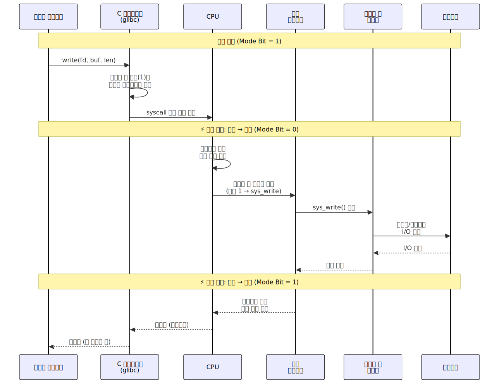

# 시스템 콜 (System Call)

> `[2] 입문` · 선수 지식: [운영체제란](./what-is-os.md)

> 사용자 프로그램이 운영체제 커널의 서비스를 요청하기 위해 호출하는 프로그래밍 인터페이스

`#시스템콜` `#SystemCall` `#syscall` `#커널` `#Kernel` `#유저모드` `#UserMode` `#커널모드` `#KernelMode` `#트랩` `#Trap` `#인터럽트` `#Interrupt` `#컨텍스트스위칭` `#ContextSwitch` `#모드전환` `#ModeSwitch` `#프로세스` `#파일시스템` `#소켓` `#Socket` `#POSIX` `#fork` `#exec` `#open` `#read` `#write` `#close` `#mmap` `#ioctl` `#리눅스` `#Linux`

## 왜 알아야 하는가?

- **실무**: 파일 I/O, 네트워크 통신, 프로세스 생성 등 모든 프로그램은 시스템 콜을 통해 OS 자원에 접근합니다. 성능 병목 분석 시 시스템 콜 오버헤드를 이해해야 합니다.
- **면접**: "유저 모드와 커널 모드의 차이", "시스템 콜은 어떻게 동작하는가" 등 OS 기초 면접에서 자주 출제됩니다.
- **기반 지식**: 프로세스 관리, 파일 시스템, 네트워크 프로그래밍 등 OS의 거의 모든 개념이 시스템 콜 위에서 동작합니다.

## 핵심 개념

- **유저 모드 / 커널 모드**: CPU의 실행 권한 수준. 유저 모드는 제한된 명령만, 커널 모드는 모든 명령 실행 가능
- **트랩 (Trap)**: 시스템 콜 호출 시 유저 모드 → 커널 모드로 전환하는 소프트웨어 인터럽트
- **시스템 콜 테이블**: 커널이 관리하는 시스템 콜 번호 → 핸들러 함수 매핑 테이블
- **래퍼 함수**: glibc 등 C 라이브러리가 제공하는 시스템 콜의 사용자 친화적 인터페이스

## 쉽게 이해하기

**시스템 콜**을 은행 업무에 비유할 수 있습니다.

- **유저 모드 = 은행 로비**: 고객(프로그램)이 자유롭게 활동하지만, 금고에 직접 접근 불가
- **커널 모드 = 은행 금고**: 은행 직원(커널)만 접근 가능한 영역
- **시스템 콜 = 창구 요청서**: 고객이 직원에게 "출금해주세요"라고 요청하는 양식
- **트랩 = 번호표 호출**: 직원이 요청을 받아 처리를 시작하는 순간

고객이 직접 금고에 들어가면 보안 문제가 생기듯, 프로그램이 직접 하드웨어에 접근하면 시스템이 불안정해집니다. 그래서 반드시 시스템 콜이라는 "공식 창구"를 통해야 합니다.

## 상세 설명

### 유저 모드 vs 커널 모드

CPU는 명령어 실행 시 **모드 비트(Mode Bit)**로 현재 권한 수준을 구분합니다.

| 구분 | 유저 모드 (User Mode) | 커널 모드 (Kernel Mode) |
|------|----------------------|------------------------|
| 모드 비트 | 1 | 0 |
| 실행 가능 명령 | 일반 명령만 | 모든 명령 (특권 명령 포함) |
| 메모리 접근 | 프로세스 가상 주소 공간만 | 전체 메모리 |
| 하드웨어 접근 | 불가 | 직접 접근 가능 |
| 장애 발생 시 | 해당 프로세스만 종료 | 시스템 전체 장애 (커널 패닉) |

**왜 이렇게 나누는가?**
악의적이거나 버그가 있는 프로그램이 시스템 전체를 망가뜨리는 것을 방지하기 위해서입니다. 하드웨어 수준에서 권한을 분리하여 보호합니다.

### 시스템 콜의 종류

| 분류 | 시스템 콜 | 설명 |
|------|----------|------|
| **프로세스 관리** | `fork()` | 현재 프로세스 복제 |
| | `exec()` | 새 프로그램으로 교체 |
| | `wait()` | 자식 프로세스 종료 대기 |
| | `exit()` | 프로세스 종료 |
| **파일 관리** | `open()` | 파일 열기 |
| | `read()` | 파일 읽기 |
| | `write()` | 파일 쓰기 |
| | `close()` | 파일 닫기 |
| **메모리 관리** | `mmap()` | 메모리 매핑 |
| | `brk()` | 힙 영역 크기 조정 |
| **네트워크** | `socket()` | 소켓 생성 |
| | `connect()` | 서버 연결 |
| | `send()` / `recv()` | 데이터 송수신 |
| **장치 관리** | `ioctl()` | 장치 제어 |
| | `read()` / `write()` | 장치 I/O (파일과 동일 인터페이스) |

### 시스템 콜 호출 과정

시스템 콜이 호출되면 다음 단계를 거칩니다.

1. **래퍼 함수 호출**: 프로그램이 `write()` 같은 C 라이브러리 함수 호출
2. **레지스터 설정**: 시스템 콜 번호와 인자를 CPU 레지스터에 저장
3. **트랩 명령 실행**: `syscall` (x86-64) 또는 `int 0x80` (x86-32) 명령으로 커널 진입
4. **모드 전환**: CPU가 유저 모드 → 커널 모드로 전환
5. **시스템 콜 디스패치**: 커널이 시스템 콜 테이블에서 번호에 해당하는 핸들러 조회
6. **핸들러 실행**: 커널 함수(`sys_write` 등)가 실제 작업 수행
7. **결과 반환**: 결과를 레지스터에 저장하고 커널 모드 → 유저 모드 복귀



### 시스템 콜 vs 일반 함수 호출

| 구분 | 일반 함수 호출 | 시스템 콜 |
|------|--------------|----------|
| 모드 전환 | 없음 | 유저 → 커널 → 유저 |
| 실행 비용 | 수 나노초 | 수백 나노초~수 마이크로초 |
| 스택 | 유저 스택 사용 | 커널 스택으로 전환 |
| 권한 | 유저 권한 | 커널 권한 |
| 보안 검사 | 없음 | 권한 검증 수행 |

**왜 시스템 콜이 느린가?**
모드 전환 자체의 비용(레지스터 저장/복원, TLB 플러시 가능성, 파이프라인 비움)이 발생하기 때문입니다. 그래서 빈번한 시스템 콜은 성능 병목이 됩니다.

### 시스템 콜 최적화 기법

#### 1. 버퍼링 (Buffering)

```java
// Bad: 매번 시스템 콜 발생 (1바이트씩 write)
for (byte b : data) {
    outputStream.write(b);  // write() 시스템 콜 × N번
}

// Good: 버퍼에 모아서 한 번에 (BufferedOutputStream 사용)
BufferedOutputStream bos = new BufferedOutputStream(outputStream);
for (byte b : data) {
    bos.write(b);  // 버퍼에 저장만
}
bos.flush();  // write() 시스템 콜 1번
```

#### 2. mmap (메모리 매핑)

```java
// 전통적 파일 읽기: read() 시스템 콜로 커널 버퍼 → 유저 버퍼 복사
FileInputStream fis = new FileInputStream("data.bin");
byte[] buf = new byte[4096];
fis.read(buf);  // 커널 → 유저 복사 발생

// mmap: 파일을 메모리에 매핑, 복사 없이 직접 접근
FileChannel channel = FileChannel.open(Path.of("data.bin"));
MappedByteBuffer mapped = channel.map(FileChannel.MapMode.READ_ONLY, 0, channel.size());
byte value = mapped.get(0);  // 페이지 폴트로 필요할 때만 로드
```

#### 3. vDSO (Virtual Dynamic Shared Object)

커널이 유저 공간에 매핑한 코드 영역으로, 모드 전환 없이 일부 시스템 콜을 실행합니다.

```java
// gettimeofday()는 vDSO를 통해 유저 모드에서 직접 실행
// 모드 전환 비용 없이 현재 시간 조회 가능
System.currentTimeMillis();  // 내부적으로 vDSO 활용 가능
```

### Linux 시스템 콜 추적 (strace)

실무에서 프로그램의 시스템 콜을 분석할 때 `strace`를 사용합니다.

```bash
# 프로그램의 모든 시스템 콜 추적
strace -o trace.log java -jar app.jar

# 파일 관련 시스템 콜만 필터링
strace -e trace=file java -jar app.jar

# 시스템 콜별 통계
strace -c java -jar app.jar
# % time     calls  syscall
# ------  --------  --------
#  45.23       152  read
#  30.11        98  write
#  12.50        45  open
#   8.33        30  mmap
```

## 동작 원리


## 예제 코드

### Java에서의 시스템 콜 (간접 호출)

Java는 JVM을 통해 시스템 콜을 간접적으로 호출합니다.

```java
import java.io.FileOutputStream;
import java.io.IOException;
import java.nio.charset.StandardCharsets;

public class SystemCallExample {

    /**
     * Java 코드 → JVM (JNI) → C 라이브러리 → 시스템 콜 순서로 호출됨
     *
     * fileOutputStream.write(data)
     *   → JVM native method (FileOutputStream.writeBytes)
     *     → libc write()
     *       → syscall (sys_write)
     */
    public static void main(String[] args) throws IOException {
        // open() 시스템 콜 발생
        try (FileOutputStream fos = new FileOutputStream("test.txt")) {
            byte[] data = "Hello, System Call!".getBytes(StandardCharsets.UTF_8);
            // write() 시스템 콜 발생
            fos.write(data);
        }
        // close() 시스템 콜 발생 (try-with-resources)
    }
}
```

### C에서의 직접 시스템 콜 (참고)

```java
// C 언어에서 직접 시스템 콜 호출하는 모습 (참고용)
// Java 개발자도 원리를 이해하면 성능 튜닝에 도움됨

// write() 래퍼 함수 사용
// write(fd, buf, count) → 내부적으로 syscall 명령 실행
//
// x86-64 어셈블리로 보면:
// mov rax, 1        ; 시스템 콜 번호 (write = 1)
// mov rdi, 1        ; fd (stdout = 1)
// mov rsi, buf      ; 데이터 주소
// mov rdx, len      ; 데이터 길이
// syscall            ; 커널 진입
```

## 트레이드오프

| 장점 | 단점 |
|------|------|
| 하드웨어 보호 (악성 프로그램 차단) | 모드 전환 오버헤드 |
| 자원 공유 및 관리 추상화 | 직접 하드웨어 접근보다 느림 |
| 이식성 (POSIX 표준) | 시스템 콜 수가 많아 학습 곡선 존재 |
| 보안 경계 명확 | 커널 버그 시 전체 시스템 영향 |

## 면접 예상 질문

### Q: 유저 모드와 커널 모드의 차이는?

A: CPU의 **모드 비트**로 구분됩니다. **유저 모드**(비트=1)에서는 일반 명령만 실행 가능하고 하드웨어 직접 접근이 불가합니다. **커널 모드**(비트=0)에서는 특권 명령(I/O, 인터럽트 제어 등) 포함 모든 명령을 실행할 수 있습니다. **왜 분리하는가?** 사용자 프로그램의 버그나 악성 코드가 시스템 전체를 망가뜨리는 것을 하드웨어 수준에서 방지하기 위해서입니다.

### Q: 시스템 콜은 어떻게 동작하는가?

A: 사용자 프로그램이 시스템 콜을 호출하면 (1) 시스템 콜 번호와 인자를 레지스터에 저장하고 (2) `syscall` 트랩 명령으로 커널 모드에 진입합니다. (3) 커널은 시스템 콜 테이블에서 번호에 해당하는 핸들러를 찾아 실행하고 (4) 결과를 반환 후 유저 모드로 복귀합니다. **왜 비용이 큰가?** 모드 전환 시 레지스터 저장/복원, 스택 전환, 보안 검사 등이 발생하기 때문입니다.

### Q: 시스템 콜이 성능에 미치는 영향과 최적화 방법은?

A: 시스템 콜은 일반 함수 호출보다 수십~수백 배 느립니다. 최적화 방법: (1) **버퍼링**: BufferedOutputStream처럼 데이터를 모아서 한 번에 write (2) **mmap**: 파일을 메모리에 매핑하여 read/write 시스템 콜 횟수 감소 (3) **배치 처리**: 여러 I/O를 묶어서 처리. **실무 팁**: `strace -c`로 시스템 콜 통계를 확인하면 병목 지점을 파악할 수 있습니다.

## 연관 문서

| 문서 | 연관성 | 난이도 |
|------|--------|--------|
| [운영체제란](./what-is-os.md) | 선수 지식 | [1] 정의 |
| [프로세스와 스레드](./process-vs-thread.md) | fork/exec 시스템 콜 | [2] 입문 |
| [파일 디스크립터](./file-descriptor.md) | 파일 I/O 시스템 콜 | [3] 중급 |
| [메모리 관리](./memory-management.md) | mmap, brk 시스템 콜 | [4] 심화 |
| [IPC](./ipc.md) | 프로세스 간 통신 시스템 콜 | [3] 중급 |

## 참고 자료

- Operating System Concepts (공룡책) - Silberschatz
- Linux System Programming - Robert Love
- Linux man pages: syscalls(2)
