# 소프트웨어 공급망 보안 (Software Supply Chain Security)

> `[3] 중급` · 선수 지식: [DevSecOps](../devops/devsecops.md), [웹 보안](./web-security.md)

> 소프트웨어의 개발·빌드·배포 전 과정에서 사용되는 코드, 도구, 인프라, 의존성의 무결성과 신뢰성을 보장하는 보안 체계

`#공급망보안` `#SupplyChainSecurity` `#SBOM` `#SoftwareBillOfMaterials` `#SLSA` `#SupplyChainLevelsForSoftwareArtifacts` `#SCA` `#SoftwareCompositionAnalysis` `#Sigstore` `#Cosign` `#Rekor` `#Fulcio` `#CVE` `#Dependabot` `#Renovate` `#SolarWinds` `#Log4Shell` `#xz-utils` `#EU_CRA` `#CISA` `#OpenSSF` `#코드서명` `#의존성관리` `#SPDX` `#CycloneDX` `#Syft` `#Trivy` `Trend`

## 왜 알아야 하는가?

- **실무**: EU CRA(사이버복원력법, 2026 시행)와 CISA SBOM 의무화로 **규제 준수가 필수**. SBOM 미제출 시 유럽 시장 진출 불가
- **면접**: "소프트웨어 공급망 공격이란?", "SBOM이 왜 필요한가?", "SLSA 레벨을 설명하라" 등 보안 분야 빈출 질문
- **기반 지식**: DevSecOps, Cloud Security, CI/CD 파이프라인 보안 설계의 핵심 기반

## 핵심 개념

- **SBOM (Software Bill of Materials)**: 소프트웨어에 포함된 모든 구성 요소(라이브러리, 프레임워크, 도구)의 목록. "소프트웨어 성분표"
- **SLSA (Supply-chain Levels for Software Artifacts)**: Google이 제안한 공급망 보안 성숙도 프레임워크. Level 1~4로 구분
- **SCA (Software Composition Analysis)**: 오픈소스 구성 요소의 알려진 취약점(CVE)을 자동 스캔하는 도구
- **코드 서명 (Code Signing)**: 소프트웨어 아티팩트의 출처와 무결성을 암호학적으로 증명
- **의존성 관리 (Dependency Management)**: 외부 라이브러리의 버전 고정, 취약점 감시, 자동 업데이트 전략

## 쉽게 이해하기

**식품 유통 시스템에 비유하면:**

```
┌─────────────────────────────────────────────────────────────────────────┐
│               식품 유통 = 소프트웨어 공급망                                │
├─────────────────────────────────────────────────────────────────────────┤
│                                                                          │
│   ┌─────────────┐   ┌─────────────┐   ┌─────────────┐                 │
│   │   농장/원산지  │ → │   가공 공장   │ → │  마트/소비자  │                 │
│   │  (소스 코드)  │   │  (빌드/CI)   │   │  (배포/운영)  │                 │
│   └─────────────┘   └─────────────┘   └─────────────┘                 │
│                                                                          │
│   식품 성분표  = SBOM (어떤 재료가 들어갔는지 목록)                        │
│   HACCP 인증  = SLSA (제조 과정이 안전한지 등급)                          │
│   검역 검사    = SCA  (유해 성분이 없는지 자동 검사)                      │
│   원산지 표시  = 코드 서명 (어디서 만들었는지 증명)                        │
│   유통기한 관리 = 의존성 관리 (오래된 재료 교체)                           │
│                                                                          │
└─────────────────────────────────────────────────────────────────────────┘
```

- **SBOM은 식품 성분표**: 어떤 오픈소스 라이브러리가 포함되었는지 전부 기록. 리콜(취약점 발견) 시 영향 범위를 즉시 파악 가능
- **SLSA는 HACCP 인증**: 제조(빌드) 과정 자체가 변조되지 않았음을 등급으로 보장
- **SCA는 검역 검사**: 들어오는 원재료(의존성)에 유해 성분(CVE)이 없는지 자동으로 확인

## 상세 설명

### 소프트웨어 공급망이란

소프트웨어 공급망(Software Supply Chain)은 코드가 작성되어 최종 사용자에게 전달되기까지의 **모든 단계와 구성 요소**를 포함합니다.

```
개발자 → 소스 코드 → 의존성(오픈소스) → 빌드 시스템 → 아티팩트 → 배포 → 운영
```

현대 소프트웨어는 평균 **70~90%가 오픈소스 구성 요소**로 이루어져 있습니다. 하나의 애플리케이션이 수백~수천 개의 직·간접 의존성을 가지며, 이 중 하나라도 침해되면 전체 시스템이 위험에 노출됩니다.

### 주요 공급망 공격 사례

| 사건 | 연도 | 공격 벡터 | 영향 | 교훈 |
|------|------|----------|------|------|
| **SolarWinds** | 2020 | 빌드 시스템에 백도어 주입 | 미 정부기관 포함 18,000+ 조직 피해 | 빌드 프로세스 자체도 보호 대상 |
| **Codecov** | 2021 | CI 스크립트 변조 → 환경변수 탈취 | 수천 개 저장소 자격증명 유출 | CI/CD 파이프라인 무결성 검증 필요 |
| **Log4Shell** | 2021 | Log4j 라이브러리 제로데이 취약점 | 전 세계 Java 애플리케이션 대부분 영향 | SBOM으로 영향 범위 즉시 파악 필요 |
| **xz-utils** | 2024 | 2년간 유지보수자로 위장 → 백도어 삽입 | Linux SSH 인증 우회 시도 | 오픈소스 기여자 신뢰 모델의 한계 |

#### SolarWinds (2020) - 빌드 시스템 침해

공격자가 SolarWinds의 **빌드 서버에 침투**하여 Orion 소프트웨어 업데이트에 백도어(SUNBURST)를 삽입했습니다. 정상적인 빌드 프로세스를 통해 배포되었기 때문에, 코드 서명까지 유효한 상태로 고객에게 전달되었습니다.

```
정상 빌드 프로세스:  소스 코드 → 빌드 → 서명 → 배포 ✅
침해된 프로세스:     소스 코드 → [백도어 주입] → 빌드 → 서명 → 배포 ❌
```

#### Log4Shell (2021) - 의존성 취약점

Apache Log4j 2.x의 JNDI Lookup 기능에서 원격 코드 실행(RCE) 취약점이 발견되었습니다. Log4j는 Java 생태계에서 가장 널리 사용되는 로깅 라이브러리로, **SBOM이 없는 조직은 자사 시스템이 영향을 받는지 파악하는 데만 며칠~몇 주가 소요**되었습니다.

#### xz-utils (2024) - 오픈소스 신뢰 공격

공격자 "Jia Tan"이 약 2년간 xz-utils 프로젝트에 정상적인 기여자로 활동하며 신뢰를 쌓은 후, 테스트 파일에 위장한 백도어를 삽입했습니다. 이 백도어는 Linux 시스템의 **SSH 인증을 우회**할 수 있었으며, 배포 직전 우연히 발견되었습니다.

### SBOM (Software Bill of Materials)

SBOM은 소프트웨어에 포함된 **모든 구성 요소의 상세 목록**입니다. EU CRA와 미국 CISA 지침에 따라 점차 의무화되고 있습니다.

#### SBOM 표준 비교

| 항목 | SPDX | CycloneDX |
|------|------|-----------|
| **주관** | Linux Foundation | OWASP |
| **ISO 표준** | ISO/IEC 5962:2021 ✅ | 진행 중 |
| **형식** | JSON, RDF, XML, YAML | JSON, XML, Protobuf |
| **초점** | 라이선스 컴플라이언스 | 보안 취약점 관리 |
| **VEX 지원** | 별도 문서 | 내장 지원 |
| **주요 사용처** | 법적 컴플라이언스 | DevSecOps 파이프라인 |

#### SBOM 생성 도구

| 도구 | 특징 | 지원 생태계 |
|------|------|------------|
| **Syft** (Anchore) | 경량, CLI 기반, 빠른 스캔 | 컨테이너, 파일시스템, 대부분 언어 |
| **Trivy** (Aqua Security) | SBOM + 취약점 스캔 통합 | 컨테이너, IaC, 파일시스템 |
| **cdxgen** (OWASP) | CycloneDX 전용, 상세 분석 | Java, Node.js, Python 등 |
| **GitHub Dependency Graph** | GitHub 내장, 자동 생성 | GitHub 저장소 전체 |

```bash
# Syft로 SBOM 생성 (CycloneDX JSON 형식)
syft dir:./my-project -o cyclonedx-json > sbom.json

# Trivy로 SBOM 생성 + 취약점 스캔
trivy fs --format cyclonedx --output sbom.json ./my-project
trivy sbom sbom.json  # SBOM 기반 취약점 스캔

# GitHub CLI로 SBOM 내보내기
gh api repos/{owner}/{repo}/dependency-graph/sbom > sbom.spdx.json
```

### SLSA (Supply-chain Levels for Software Artifacts)

SLSA(발음: "살사")는 Google이 제안한 **공급망 보안 성숙도 프레임워크**입니다. 소프트웨어 아티팩트가 변조되지 않았음을 단계적으로 보장합니다.

#### SLSA 레벨

| 레벨 | 이름 | 요구사항 | 방어 대상 |
|------|------|---------|----------|
| **Level 1** | 빌드 증명 존재 | 빌드 프로세스가 문서화됨 (Provenance 존재) | 알 수 없는 출처의 아티팩트 |
| **Level 2** | 호스팅된 빌드 | 빌드가 호스팅된 CI/CD 서비스에서 실행 | 로컬 빌드 변조 |
| **Level 3** | 강화된 빌드 | 빌드 서비스가 변조 방지됨, 격리된 환경 | 빌드 시스템 자체의 침해 (SolarWinds 유형) |
| **Level 4** | 재현 가능한 빌드 | 동일 소스 → 동일 바이너리 재현 가능 | 모든 빌드 시스템 침해 |

```
Level 1: "이 아티팩트는 어디서 빌드되었는가?" (출처 기록)
Level 2: "신뢰할 수 있는 서비스에서 빌드되었는가?" (호스팅 빌드)
Level 3: "빌드 과정 자체가 변조되지 않았는가?" (격리/보호)
Level 4: "누구든 같은 결과를 재현할 수 있는가?" (재현 가능성)
```

#### GitHub Actions에서 SLSA 적용

```yaml
# .github/workflows/slsa-build.yml
name: SLSA Build
on:
  push:
    tags: ['v*']

permissions:
  id-token: write    # OIDC 토큰 발급
  contents: read
  attestations: write

jobs:
  build:
    runs-on: ubuntu-latest
    steps:
      - uses: actions/checkout@v4

      - name: Build artifact
        run: ./gradlew build

      - name: Generate SLSA provenance
        uses: slsa-framework/slsa-github-generator/.github/workflows/generator_generic_slsa3.yml@v2.1.0
        with:
          base64-subjects: ${{ steps.hash.outputs.hashes }}
```

### 코드 서명과 Sigstore

코드 서명(Code Signing)은 소프트웨어 아티팩트의 **출처(Who)와 무결성(Tampered?)**을 암호학적으로 증명합니다. 기존에는 PGP 키 관리가 복잡했지만, **Sigstore** 프로젝트가 이를 혁신적으로 간소화했습니다.

#### Sigstore 구성 요소

| 구성 요소 | 역할 | 비유 |
|----------|------|------|
| **Cosign** | 컨테이너 이미지 서명/검증 도구 | 봉인 도장 |
| **Fulcio** | 단기 인증서 발급 CA (Certificate Authority) | 공증 사무소 |
| **Rekor** | 투명 로그 (서명 이력 불변 기록) | 공개 장부 |

```bash
# Cosign으로 컨테이너 이미지 서명 (Keyless - OIDC 기반)
cosign sign --yes ghcr.io/myorg/myapp:v1.0.0

# 서명 검증
cosign verify ghcr.io/myorg/myapp:v1.0.0 \
  --certificate-identity=user@example.com \
  --certificate-oidc-issuer=https://accounts.google.com

# Rekor 투명 로그 검색
rekor-cli search --email user@example.com
```

**Keyless 서명의 동작 원리:**
1. 개발자가 OIDC 제공자(GitHub, Google 등)로 인증
2. Fulcio가 단기 인증서(10분) 발급
3. 해당 인증서로 아티팩트 서명
4. 서명 기록이 Rekor 투명 로그에 영구 저장
5. 누구든 Rekor에서 서명 이력을 검증 가능

### 의존성 관리 전략

현대 소프트웨어의 70~90%는 오픈소스 의존성으로 구성됩니다. 이를 안전하게 관리하는 전략이 필수입니다.

#### Lock 파일 활용

Lock 파일은 의존성의 **정확한 버전과 해시값**을 고정하여 재현 가능한 빌드를 보장합니다.

| 생태계 | Lock 파일 | 해시 검증 |
|--------|----------|----------|
| Node.js | `package-lock.json` / `yarn.lock` | ✅ integrity 필드 |
| Python | `poetry.lock` / `pip freeze` | ✅ hash 옵션 |
| Java/Kotlin | `gradle.lockfile` | ✅ Gradle 8+ 지원 |
| Go | `go.sum` | ✅ 기본 내장 |
| Rust | `Cargo.lock` | ✅ 기본 내장 |

#### 자동화 도구

| 도구 | 제공자 | 특징 |
|------|--------|------|
| **Dependabot** | GitHub | GitHub 내장, 자동 PR 생성, 보안 업데이트 우선 |
| **Renovate** | Mend | 고도로 커스터마이징 가능, 그룹 업데이트 지원 |
| **Socket** | Socket.dev | 행동 분석 기반, 악성 패키지 탐지 |

```yaml
# .github/dependabot.yml
version: 2
updates:
  - package-ecosystem: "gradle"
    directory: "/"
    schedule:
      interval: "weekly"
    open-pull-requests-limit: 10
    # 보안 업데이트는 즉시, 일반 업데이트는 주간
    groups:
      minor-and-patch:
        update-types:
          - "minor"
          - "patch"

  - package-ecosystem: "github-actions"
    directory: "/"
    schedule:
      interval: "weekly"
```

### 규제와 컴플라이언스

#### 주요 규제 현황 (2026)

| 규제 | 지역 | 시행 시기 | 핵심 요구사항 |
|------|------|---------|-------------|
| **EU CRA** (사이버복원력법) | 유럽 | 2026 시행 | SBOM 제출 의무, 취약점 신고 24시간, CE 마킹 |
| **CISA SBOM 지침** | 미국 | 2023~ 단계적 | 연방 조달 소프트웨어 SBOM 필수 |
| **행정명령 14028** | 미국 | 2021~ | 연방 정부 공급업체 보안 요구 강화 |
| **KISA 가이드라인** | 한국 | 2024~ | 소프트웨어 공급망 보안 가이드라인 권고 |

#### EU CRA 핵심 의무

```
제조사 의무:
├── SBOM 작성 및 제출 (CycloneDX 또는 SPDX)
├── 알려진 취약점 없이 제품 출시
├── 보안 업데이트 최소 5년 제공
├── 취약점 발견 시 24시간 내 ENISA 신고
└── CE 마킹으로 규정 준수 표시

위반 시 제재:
├── 최대 1,500만 유로 또는 글로벌 매출 2.5% 과징금
└── EU 시장 판매 중지
```

## 동작 원리

아래 다이어그램은 소프트웨어 공급망의 각 단계에서 적용되는 **보안 제어(초록)**와 주요 **공격 벡터(빨강)**를 보여줍니다.



**단계별 보안 제어 요약:**

| 단계 | 보안 제어 | 도구 예시 |
|------|----------|----------|
| ① 소스 코드 | 코드 리뷰, 커밋 서명, 2FA | GPG, Sigstore gitsign |
| ② 의존성 | SCA 스캔, SBOM 생성, Lock 파일 | Trivy, Syft, Dependabot |
| ③ 빌드 | SLSA 증명, 아티팩트 서명, 격리 빌드 | SLSA Generator, Cosign |
| ④ 배포 | 이미지 서명 검증, 런타임 모니터링 | Cosign verify, Falco |

## 예제 코드

### Gradle 의존성 검증 설정

```kotlin
// gradle/verification-metadata.xml을 통한 의존성 해시 검증
// settings.gradle.kts
dependencyResolutionManagement {
    repositories {
        mavenCentral()
    }
}

// build.gradle.kts
plugins {
    java
    id("org.owasp.dependencycheck") version "10.0.3"
}

dependencyCheck {
    // NVD API Key 설정 (무료 등록)
    nvd {
        apiKey = providers.environmentVariable("NVD_API_KEY").orNull
    }
    // CVSS 7.0 이상 취약점 발견 시 빌드 실패
    failBuildOnCVSS = 7.0f
    // HTML/JSON 리포트 생성
    formats = listOf("HTML", "JSON")
}
```

```bash
# 의존성 취약점 스캔 실행
./gradlew dependencyCheckAnalyze

# Gradle 의존성 검증 메타데이터 생성
./gradlew --write-verification-metadata sha256
```

### GitHub Actions SBOM 파이프라인

```yaml
# .github/workflows/sbom-pipeline.yml
name: SBOM & Security Pipeline
on:
  push:
    branches: [main]
  pull_request:

permissions:
  contents: read
  security-events: write

jobs:
  sbom-and-scan:
    runs-on: ubuntu-latest
    steps:
      - uses: actions/checkout@v4

      - name: Set up JDK
        uses: actions/setup-java@v4
        with:
          java-version: '21'
          distribution: 'temurin'

      - name: Build
        run: ./gradlew build

      # SBOM 생성 (CycloneDX)
      - name: Generate SBOM
        uses: anchore/sbom-action@v0
        with:
          format: cyclonedx-json
          output-file: sbom.cyclonedx.json

      # 취약점 스캔
      - name: Scan vulnerabilities
        uses: aquasecurity/trivy-action@master
        with:
          scan-type: 'sbom'
          input: 'sbom.cyclonedx.json'
          severity: 'HIGH,CRITICAL'
          exit-code: '1'    # 고위험 취약점 발견 시 빌드 실패

      # SBOM 아티팩트 저장
      - name: Upload SBOM
        uses: actions/upload-artifact@v4
        with:
          name: sbom
          path: sbom.cyclonedx.json
```

### Renovate 설정 (고급)

```json
// renovate.json
{
  "$schema": "https://docs.renovatebot.com/renovate-schema.json",
  "extends": [
    "config:recommended",
    "security:openssf-scorecard"
  ],
  "labels": ["dependencies"],
  "vulnerabilityAlerts": {
    "enabled": true,
    "labels": ["security"]
  },
  "packageRules": [
    {
      "description": "보안 패치는 자동 머지",
      "matchUpdateTypes": ["patch"],
      "matchCategories": ["security"],
      "automerge": true
    },
    {
      "description": "Major 업데이트는 수동 리뷰",
      "matchUpdateTypes": ["major"],
      "automerge": false,
      "labels": ["breaking-change"]
    },
    {
      "description": "테스트 의존성은 그룹화",
      "matchDepTypes": ["devDependencies", "test"],
      "groupName": "test dependencies"
    }
  ]
}
```

## 트레이드오프

| 항목 | 장점 | 단점 |
|------|------|------|
| **SBOM 의무화** | 취약점 영향 범위 즉시 파악, 규제 준수 | 생성·유지 비용, 민감 정보 노출 우려 |
| **SLSA Level 3+** | 빌드 변조 방지, SolarWinds 유형 공격 차단 | 빌드 속도 저하, 인프라 복잡도 증가 |
| **자동 의존성 업데이트** | 취약점 빠른 패치, 기술 부채 감소 | PR 폭주, 호환성 이슈, 리뷰 부담 |
| **코드 서명 (Keyless)** | 키 관리 불필요, OIDC 기반 간편 | 외부 서비스 의존(Fulcio/Rekor), 오프라인 불가 |
| **SCA 도구 도입** | 알려진 취약점 자동 탐지, CI 통합 | 오탐(False Positive), 라이선스 비용 |

## 트러블슈팅

### SBOM에서 의존성이 누락되는 경우

**증상**: SBOM 생성 후 일부 전이 의존성(transitive dependency)이 목록에 없음

**원인 및 해결**:

```bash
# 1. 빌드 전 의존성 해결이 완료되었는지 확인
./gradlew dependencies --configuration runtimeClasspath

# 2. Syft 스캔 시 소스 디렉토리 지정 확인
syft dir:. -o cyclonedx-json > sbom.json   # 프로젝트 루트
syft dir:./build/libs -o cyclonedx-json    # 빌드 결과물 대상

# 3. 컨테이너 이미지 기반 스캔 (더 정확)
syft ghcr.io/myorg/myapp:latest -o cyclonedx-json > sbom.json
```

### Dependabot PR이 너무 많이 생성되는 경우

**증상**: Dependabot이 매주 수십 개의 PR을 생성하여 리뷰 부담 가중

**해결**:

```yaml
# .github/dependabot.yml - PR 수 제한 + 그룹화
version: 2
updates:
  - package-ecosystem: "gradle"
    directory: "/"
    schedule:
      interval: "monthly"        # 주간 → 월간으로 변경
    open-pull-requests-limit: 5  # 동시 PR 최대 5개
    groups:
      all-dependencies:
        patterns: ["*"]          # 모든 의존성을 하나의 PR로 그룹화
        update-types:
          - "minor"
          - "patch"
```

**대안**: Renovate로 전환하면 더 세밀한 그룹화와 자동 머지 설정이 가능합니다.

## 면접 예상 질문

### Q1. 소프트웨어 공급망 공격이란 무엇이며, 대표적인 사례를 설명하세요.

소프트웨어 공급망 공격은 소프트웨어의 개발·빌드·배포 과정에서 **정상적인 구성 요소를 변조하거나 악성 코드를 주입**하는 공격입니다. 최종 사용자는 신뢰하는 소프트웨어를 통해 공격을 받게 되므로 탐지가 매우 어렵습니다.

대표 사례로는 SolarWinds(2020, 빌드 시스템 침해), Log4Shell(2021, 의존성 취약점), xz-utils(2024, 오픈소스 기여자 위장 침투)가 있습니다. 특히 xz-utils 사건은 2년간 신뢰를 쌓은 후 백도어를 삽입한 사회공학적 공격으로, 오픈소스 신뢰 모델의 한계를 보여주었습니다.

### Q2. SBOM이 왜 중요한가요? 어떤 표준이 있나요?

SBOM(Software Bill of Materials)은 소프트웨어에 포함된 모든 구성 요소의 목록입니다. Log4Shell 사태에서 SBOM이 없는 조직은 영향 파악에 수주가 걸렸고, 있는 조직은 수시간 내 대응했습니다.

주요 표준으로 **SPDX**(Linux Foundation, ISO 5962 표준)와 **CycloneDX**(OWASP, 보안 중심)가 있습니다. EU CRA(2026 시행)는 유럽 시장 출시 소프트웨어에 SBOM 제출을 의무화하며, 미국 CISA도 연방 조달 소프트웨어에 SBOM을 요구하고 있습니다.

### Q3. SLSA 프레임워크의 레벨을 설명하세요.

SLSA는 Google이 제안한 공급망 보안 성숙도 모델로 4단계가 있습니다:

- **Level 1**: 빌드 증명(Provenance)이 존재하여 아티팩트 출처 추적 가능
- **Level 2**: 호스팅된 CI/CD 서비스에서 빌드 실행 (로컬 빌드 변조 방지)
- **Level 3**: 빌드 서비스 자체가 변조 방지됨 (SolarWinds 유형 방어)
- **Level 4**: 재현 가능한 빌드로, 동일 소스에서 동일 바이너리를 누구든 검증 가능

실무에서는 **Level 3**이 현실적인 목표이며, GitHub Actions의 SLSA Generator를 통해 비교적 쉽게 달성할 수 있습니다.

## 연관 문서

| 문서 | 연관성 |
|------|--------|
| [DevSecOps](../devops/devsecops.md) | 개발-보안-운영 통합 파이프라인, 공급망 보안의 실행 프레임워크 |
| [웹 보안](./web-security.md) | OWASP Top 10, 애플리케이션 레벨 보안의 기초 |
| [OWASP Top 10 for LLM](./owasp-llm-top10.md) | AI/LLM 시스템의 공급망 보안 (모델 포이즈닝, 데이터 오염) |
| [Cloud Security](./cloud-security.md) | 클라우드 환경에서의 공급망 보안 (컨테이너 서명, 레지스트리 보안) |
| [인증과 인가](./authentication-authorization.md) | 코드 서명, OIDC 기반 Keyless 인증의 기초 개념 |

## 참고 자료

- [SLSA - Supply-chain Levels for Software Artifacts](https://slsa.dev/)
- [Sigstore - Software Signing for Everyone](https://www.sigstore.dev/)
- [OpenSSF (Open Source Security Foundation)](https://openssf.org/)
- [CISA SBOM Resources](https://www.cisa.gov/sbom)
- [EU Cyber Resilience Act](https://digital-strategy.ec.europa.eu/en/policies/cyber-resilience-act)
- [SPDX Specification](https://spdx.dev/specifications/)
- [CycloneDX Specification](https://cyclonedx.org/specification/overview/)
- [NIST Secure Software Development Framework](https://csrc.nist.gov/projects/ssdf)
- [Google - Know, Prevent, Fix (Open Source Vulnerabilities)](https://security.googleblog.com/2021/02/know-prevent-fix-framework-for-shifting.html)
