# Spring AI

> `[3] 중급` · 선수 지식: [Spring DI/IoC](./spring-di-ioc.md), [Spring MVC](./spring-mvc.md)

> `Trend` 2026

> Spring 생태계에서 AI 모델(LLM)과 상호작용하기 위한 애플리케이션 프레임워크로, ChatClient·Advisor·MCP·RAG 등을 통해 AI 기능을 Spring 방식으로 통합한다.

`#SpringAI` `#스프링AI` `#LLM` `#대규모언어모델` `#ChatClient` `#ChatModel` `#Advisor` `#RAG` `#검색증강생성` `#VectorStore` `#벡터저장소` `#MCP` `#ModelContextProtocol` `#FunctionCalling` `#ToolUse` `#도구호출` `#Embedding` `#임베딩` `#OpenAI` `#Ollama` `#Anthropic` `#프롬프트` `#PromptTemplate` `#QuestionAnswerAdvisor` `#Spring` `#SpringBoot` `#AI통합` `#엔터프라이즈AI` `#에이전트`

## 왜 알아야 하는가?

- **실무**: 2026년 현재, AI 기능 통합은 엔터프라이즈 애플리케이션의 핵심 요구사항이 되었다. Spring AI를 통해 기존 Spring 애플리케이션에 자연스럽게 AI를 결합할 수 있다.
- **면접**: "Spring AI로 RAG를 어떻게 구현하는가?", "MCP란 무엇이며 Spring AI에서 어떻게 활용하는가?" 등 최신 기술 트렌드 질문이 증가하고 있다.
- **기반 지식**: Spring AI는 DI/IoC, AOP, MVC 등 Spring 핵심 개념 위에 구축되며, AI Agent·MCP·RAG 등 AI 생태계의 핵심 개념을 실무에서 적용하는 관문이다.

## 핵심 개념

- **ChatClient**: AI 모델과 대화하기 위한 Fluent API (WebClient/RestClient와 유사한 패턴)
- **Advisor**: 요청/응답을 가로채 변환하는 인터셉터 (메모리, RAG, 필터링 등)
- **MCP (Model Context Protocol)**: AI 모델이 외부 도구·리소스에 접근하기 위한 표준 프로토콜
- **RAG (Retrieval Augmented Generation)**: 벡터 검색으로 관련 문서를 찾아 컨텍스트를 보강하는 패턴
- **VectorStore**: 문서 임베딩을 저장하고 유사도 검색을 수행하는 저장소

## 쉽게 이해하기

Spring AI는 **AI 통역사**와 같다.

회사(Spring 애플리케이션)에 외국인 전문가(AI 모델)를 고용했다고 상상해보자. 이 전문가는 뛰어난 능력을 가지고 있지만, 회사의 내부 시스템(DB, API, 파일)에 직접 접근할 수 없고, 회사의 규칙(보안, 인증)도 모른다.

- **ChatClient** = 전문가와 대화하는 표준 양식. 누가 전문가인지(OpenAI, Ollama 등) 상관없이 같은 양식으로 대화한다.
- **Advisor** = 비서. 전문가에게 질문하기 전에 참고 자료를 덧붙이거나(RAG), 이전 대화 내용을 정리해준다(Memory).
- **MCP** = 전문가가 회사 시스템을 사용할 수 있게 해주는 출입 카드. DB 조회, API 호출 등을 표준화된 방식으로 허용한다.
- **VectorStore** = 전문가를 위한 참고 자료실. 질문과 관련된 문서를 빠르게 찾아준다.

## 상세 설명

### Spring AI 아키텍처

Spring AI는 Spring 생태계의 핵심 원칙(DI, 추상화, 이식성)을 AI 영역에 적용한다.



**왜 이렇게 설계했는가?**

Spring이 JDBC로 DB 벤더를 추상화한 것처럼, Spring AI는 ChatModel 인터페이스로 AI 모델 벤더를 추상화한다. OpenAI에서 Ollama로 전환할 때 비즈니스 로직을 변경할 필요가 없다.

### ChatClient API

ChatClient는 AI 모델과 상호작용하기 위한 Fluent API다.

```java
@Service
public class ChatService {

    private final ChatClient chatClient;

    public ChatService(ChatClient.Builder builder) {
        this.chatClient = builder
            .defaultSystem("당신은 Java 전문가입니다.")
            .defaultAdvisors(
                MessageChatMemoryAdvisor.builder(chatMemory).build()
            )
            .build();
    }

    public String ask(String question) {
        return chatClient.prompt()
            .user(question)
            .call()
            .content();
    }

    // 구조화된 응답 (Java 객체로 매핑)
    public BookRecommendation recommend(String genre) {
        return chatClient.prompt()
            .user("추천 도서를 알려줘: " + genre)
            .call()
            .entity(BookRecommendation.class);
    }
}
```

**왜 이렇게 하는가?**

WebClient처럼 친숙한 Fluent API를 제공하여 Spring 개발자의 학습 비용을 최소화한다. `.entity()` 메서드로 JSON → Java 객체 변환까지 자동 처리한다.

### Advisor 패턴

Advisor는 ChatClient의 요청/응답 파이프라인에 끼어드는 인터셉터다. Spring MVC의 HandlerInterceptor와 유사한 개념이다.

```java
var chatClient = ChatClient.builder(chatModel)
    .defaultAdvisors(
        // 대화 기록 유지
        MessageChatMemoryAdvisor.builder(chatMemory).build(),
        // RAG: 벡터 검색으로 컨텍스트 보강
        QuestionAnswerAdvisor.builder(vectorStore).build(),
        // 안전 필터
        new SafeGuardAdvisor("정치, 종교 관련 질문에는 답변하지 마세요.")
    )
    .build();
```

주요 Advisor 종류:

| Advisor | 역할 | 사용 사례 |
|---------|------|----------|
| `MessageChatMemoryAdvisor` | 대화 기록을 메시지에 추가 | 챗봇, 멀티턴 대화 |
| `QuestionAnswerAdvisor` | 벡터 검색 → 컨텍스트 보강 (Naive RAG) | FAQ, 문서 기반 QA |
| `RetrievalAugmentationAdvisor` | 모듈형 RAG 아키텍처 | 고급 RAG 파이프라인 |
| `SafeGuardAdvisor` | 입력/출력 필터링 | 콘텐츠 안전성 |

**실행 순서**는 `getOrder()` 값으로 결정되며, 낮은 값이 먼저 실행된다.

### RAG (Retrieval Augmented Generation)

RAG는 AI 모델의 환각(Hallucination)을 줄이기 위해 관련 문서를 검색하여 컨텍스트로 제공하는 패턴이다.


```java
@Configuration
public class RagConfig {

    @Bean
    public ChatClient ragChatClient(
            ChatModel chatModel,
            VectorStore vectorStore) {

        return ChatClient.builder(chatModel)
            .defaultAdvisors(
                QuestionAnswerAdvisor.builder(vectorStore)
                    .searchRequest(
                        SearchRequest.builder()
                            .similarityThreshold(0.7)
                            .topK(5)
                            .build()
                    )
                    .build()
            )
            .build();
    }
}
```

**Naive RAG vs Modular RAG**

| 구분 | Naive RAG | Modular RAG |
|------|-----------|-------------|
| Advisor | `QuestionAnswerAdvisor` | `RetrievalAugmentationAdvisor` |
| 쿼리 변환 | 없음 | 지원 (쿼리 재작성, 확장) |
| 검색 전략 | 단순 유사도 검색 | 다중 소스, 필터링, 재랭킹 |
| 적합 상황 | 간단한 QA | 복잡한 엔터프라이즈 RAG |

### MCP (Model Context Protocol)

MCP는 Anthropic이 제안한 표준 프로토콜로, AI 모델이 외부 도구·리소스에 접근하는 방식을 표준화한다.



#### MCP Client (AI 애플리케이션)

```yaml
# application.yml
spring:
  ai:
    mcp:
      client:
        stdio:
          servers-configuration: classpath:mcp-servers.json
```

```json
{
  "mcpServers": {
    "database": {
      "command": "java",
      "args": ["-jar", "db-mcp-server.jar"]
    }
  }
}
```

#### MCP Server (도구 제공)

```java
@Service
public class OrderMcpTools {

    private final OrderRepository orderRepository;

    public OrderMcpTools(OrderRepository orderRepository) {
        this.orderRepository = orderRepository;
    }

    @Tool(description = "주문 ID로 주문 정보를 조회합니다")
    public Order getOrder(@ToolParam(description = "주문 ID") Long orderId) {
        return orderRepository.findById(orderId)
            .orElseThrow(() -> new OrderNotFoundException(orderId));
    }

    @Tool(description = "최근 주문 목록을 조회합니다")
    public List<Order> getRecentOrders(
            @ToolParam(description = "조회할 개수") int limit) {
        return orderRepository.findRecentOrders(limit);
    }
}
```

**왜 MCP가 중요한가?**

DB 전문가는 MCP 서버만 만들면 되고, AI 애플리케이션 개발자는 MCP 클라이언트만 설정하면 된다. USB처럼 표준화된 인터페이스를 통해 AI와 외부 시스템을 연결한다.

### VectorStore

VectorStore는 문서를 벡터(임베딩)로 변환하여 저장하고, 유사도 검색을 수행한다.

```java
@Configuration
public class VectorStoreConfig {

    @Bean
    public VectorStore vectorStore(EmbeddingModel embeddingModel) {
        return PgVectorStore.builder(jdbcTemplate, embeddingModel)
            .dimensions(1536)
            .build();
    }
}

@Service
public class DocumentIngestionService {

    private final VectorStore vectorStore;

    public DocumentIngestionService(VectorStore vectorStore) {
        this.vectorStore = vectorStore;
    }

    public void ingest(Resource resource) {
        var reader = new TikaDocumentReader(resource);
        var documents = new TokenTextSplitter().apply(reader.get());
        vectorStore.add(documents);
    }
}
```

지원 VectorStore:

| VectorStore | 특징 |
|-------------|------|
| PGVector | PostgreSQL 확장, 기존 DB와 함께 사용 |
| Chroma | 경량 오픈소스, 빠른 프로토타이핑 |
| Redis | 인메모리, 초고속 검색 |
| Pinecone | 관리형 서비스, 대규모 운영 |
| Milvus | 대규모 벡터 검색 특화 |

## 동작 원리

### ChatClient 요청 처리 흐름


1. 사용자가 ChatClient에 프롬프트 전달
2. Advisor 체인이 순서대로 요청을 가공 (메모리 추가, RAG 컨텍스트 보강 등)
3. ChatModel이 AI 프로바이더(OpenAI, Ollama 등)에 API 호출
4. 응답이 Advisor 체인을 역순으로 통과하며 후처리
5. 최종 응답을 사용자에게 반환

## 트레이드오프

| 장점 | 단점 |
|------|------|
| Spring 생태계와 자연스러운 통합 | 아직 빠르게 변화 중 (API 변경 가능성) |
| AI 프로바이더 추상화 (벤더 락인 방지) | AI 모델 자체의 한계는 해결하지 못함 |
| Advisor 패턴으로 유연한 파이프라인 구성 | 추상화 계층으로 인한 디버깅 복잡성 |
| 기존 Spring Security·Observability 재사용 | 자체 프롬프트 엔지니어링 역량은 별도 필요 |
| MCP로 표준화된 도구 통합 | MCP 생태계가 아직 성장 중 |

## 면접 예상 질문

### Q: Spring AI의 ChatClient와 ChatModel의 차이는 무엇인가?

A: **ChatModel**은 특정 AI 프로바이더(OpenAI, Ollama 등)와의 통신을 추상화하는 저수준 인터페이스다. **ChatClient**는 ChatModel 위에 구축된 고수준 Fluent API로, Advisor 체인·시스템 프롬프트·출력 변환 등을 선언적으로 구성할 수 있다. Spring에서 JdbcTemplate(저수준)과 Spring Data JPA(고수준)의 관계와 유사하다.

### Q: RAG에서 QuestionAnswerAdvisor와 RetrievalAugmentationAdvisor의 차이는?

A: QuestionAnswerAdvisor는 단순한 Naive RAG를 구현한다. 사용자 질문으로 벡터 검색 후 결과를 프롬프트에 추가하는 방식이다. RetrievalAugmentationAdvisor는 모듈형 RAG로, 쿼리 변환(재작성, 확장)·다중 검색 소스·문서 재랭킹 등 고급 기능을 지원한다. 단순 QA는 전자, 복잡한 엔터프라이즈 요구사항에는 후자를 선택한다.

### Q: MCP란 무엇이고 Spring AI에서 어떻게 활용하는가?

A: MCP(Model Context Protocol)는 AI 모델이 외부 도구·리소스에 접근하기 위한 표준 프로토콜이다. JSON-RPC 기반의 클라이언트-서버 아키텍처로, Spring AI에서는 `@Tool` 어노테이션으로 MCP 서버를 만들고, Boot Starter로 MCP 클라이언트를 구성한다. USB처럼 AI와 외부 시스템을 표준화된 방식으로 연결하며, Spring Security의 OAuth 2.0과 통합하여 보안까지 처리한다.

### Q: Spring AI에서 AI 프로바이더를 교체하려면 어떻게 하는가?

A: ChatModel 인터페이스가 프로바이더를 추상화하므로, 의존성(starter)과 설정(application.yml)만 변경하면 된다. 비즈니스 로직(ChatClient 사용 코드)은 수정할 필요가 없다. 이는 Spring이 DataSource를 추상화하여 DB를 교체할 수 있게 하는 것과 동일한 원리(DIP)다.

## 연관 문서

| 문서 | 연관성 | 난이도 |
|------|--------|--------|
| [Spring DI/IoC](./spring-di-ioc.md) | Spring AI의 Bean 구성 기반 | [3] 중급 |
| [Spring MVC](./spring-mvc.md) | REST API로 AI 서비스 노출 | [3] 중급 |
| [Spring AOP](./spring-aop.md) | Advisor 패턴의 이론적 기반 | [3] 중급 |
| [Spring Security](./spring-security.md) | MCP 서버 보안 (OAuth 2.0) | [3] 중급 |

## 참고 자료

- [Spring AI 공식 문서](https://docs.spring.io/spring-ai/reference/)
- [Spring AI GitHub](https://github.com/spring-projects/spring-ai)
- [Spring AI MCP Overview](https://docs.spring.io/spring-ai/reference/api/mcp/mcp-overview.html)
- [Baeldung - MCP with Spring AI](https://www.baeldung.com/spring-ai-model-context-protocol-mcp)
- [Baeldung - Spring AI Advisors](https://www.baeldung.com/spring-ai-advisors)
- [Spring AI MCP Boot Starters 소개](https://spring.io/blog/2025/09/16/spring-ai-mcp-intro-blog/)
- [Building MCP Tools using Spring AI (2026)](https://javapro.io/2026/01/07/building-mcp-tools-for-ai-agents-using-spring-ai/)
