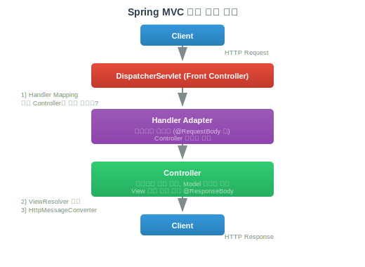
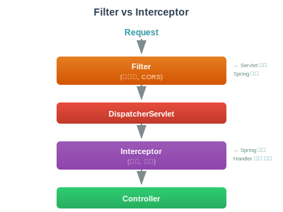

# Spring MVC

> `[3] 중급` · 선수 지식: [Spring DI/IoC](./spring-di-ioc.md), [HTTP](../network/http-https.md)

> Model-View-Controller 패턴을 기반으로 웹 애플리케이션을 구축하는 Spring 웹 프레임워크

`#SpringMVC` `#스프링MVC` `#MVC` `#ModelViewController` `#Controller` `#컨트롤러` `#RestController` `#RequestMapping` `#GetMapping` `#PostMapping` `#DispatcherServlet` `#디스패처서블릿` `#HandlerMapping` `#ViewResolver` `#뷰리졸버` `#RequestBody` `#ResponseBody` `#PathVariable` `#RequestParam` `#ModelAttribute` `#Validation` `#ExceptionHandler` `#ControllerAdvice` `#Interceptor` `#Filter`

## 왜 알아야 하는가?

Spring MVC는 Java 웹 개발의 표준입니다. REST API부터 전통적인 웹 페이지까지 모든 웹 애플리케이션의 기반이 됩니다. 요청 처리 흐름, 어노테이션 사용법, 예외 처리 등을 이해해야 효과적인 웹 개발이 가능합니다.

## 핵심 개념

- **DispatcherServlet**: 모든 요청을 받아 적절한 핸들러로 분배
- **Controller**: 요청을 처리하고 응답을 생성
- **Handler Mapping**: URL과 컨트롤러 메서드 매핑
- **View Resolver**: 뷰 이름을 실제 뷰로 변환

## 쉽게 이해하기

**Spring MVC**를 레스토랑에 비유할 수 있습니다.

```
┌─────────────────────────────────────────────────────────────┐
│                    레스토랑 비유                             │
├─────────────────────────────────────────────────────────────┤
│                                                              │
│  손님 (Client)                                               │
│    │ "스테이크 주세요"                                       │
│    ▼                                                         │
│  안내 직원 (DispatcherServlet)                               │
│    │ "어느 셰프가 담당하지?" (Handler Mapping)               │
│    ▼                                                         │
│  셰프 (Controller)                                           │
│    │ 요리 준비 (비즈니스 로직)                               │
│    │ 재료 가져오기 (Service, Repository)                     │
│    ▼                                                         │
│  요리 (Model)                                                │
│    │                                                         │
│    ▼                                                         │
│  접시 담기 (View/JSON)                                       │
│    │                                                         │
│    ▼                                                         │
│  손님에게 서빙 (Response)                                    │
│                                                              │
└─────────────────────────────────────────────────────────────┘
```

## 상세 설명

### 요청 처리 흐름



### 기본 컨트롤러

```java
// REST API 컨트롤러
@RestController  // @Controller + @ResponseBody
@RequestMapping("/api/users")
public class UserController {

    private final UserService userService;

    // 생성자 주입
    public UserController(UserService userService) {
        this.userService = userService;
    }

    // GET /api/users
    @GetMapping
    public List<UserResponse> getUsers() {
        return userService.findAll();
    }

    // GET /api/users/123
    @GetMapping("/{id}")
    public UserResponse getUser(@PathVariable Long id) {
        return userService.findById(id);
    }

    // POST /api/users
    @PostMapping
    @ResponseStatus(HttpStatus.CREATED)
    public UserResponse createUser(@RequestBody @Valid UserCreateRequest request) {
        return userService.create(request);
    }

    // PUT /api/users/123
    @PutMapping("/{id}")
    public UserResponse updateUser(@PathVariable Long id,
                                   @RequestBody @Valid UserUpdateRequest request) {
        return userService.update(id, request);
    }

    // DELETE /api/users/123
    @DeleteMapping("/{id}")
    @ResponseStatus(HttpStatus.NO_CONTENT)
    public void deleteUser(@PathVariable Long id) {
        userService.delete(id);
    }
}
```

### 파라미터 바인딩

```java
@RestController
@RequestMapping("/api/orders")
public class OrderController {

    // 1. @PathVariable: URL 경로 변수
    @GetMapping("/{orderId}/items/{itemId}")
    public OrderItem getItem(
            @PathVariable Long orderId,
            @PathVariable("itemId") Long id) {  // 다른 이름
        return orderService.getItem(orderId, id);
    }

    // 2. @RequestParam: 쿼리 파라미터
    // GET /api/orders?status=PENDING&page=0&size=10
    @GetMapping
    public Page<Order> getOrders(
            @RequestParam(required = false) OrderStatus status,
            @RequestParam(defaultValue = "0") int page,
            @RequestParam(defaultValue = "10") int size) {
        return orderService.findOrders(status, PageRequest.of(page, size));
    }

    // 3. @RequestBody: HTTP Body (JSON)
    @PostMapping
    public Order createOrder(@RequestBody OrderCreateRequest request) {
        return orderService.create(request);
    }

    // 4. @RequestHeader: HTTP 헤더
    @GetMapping("/my")
    public List<Order> getMyOrders(
            @RequestHeader("Authorization") String token,
            @RequestHeader(value = "X-Custom", required = false) String custom) {
        return orderService.findByUser(token);
    }

    // 5. @CookieValue: 쿠키
    @GetMapping("/recent")
    public Order getRecentOrder(@CookieValue("lastOrderId") Long orderId) {
        return orderService.findById(orderId);
    }

    // 6. @ModelAttribute: 폼 데이터, 쿼리 파라미터 → 객체
    // GET /api/orders/search?keyword=phone&minPrice=1000
    @GetMapping("/search")
    public List<Order> searchOrders(@ModelAttribute OrderSearchRequest request) {
        return orderService.search(request);
    }
}

// DTO 예시
public record OrderSearchRequest(
    String keyword,
    Integer minPrice,
    Integer maxPrice
) {}
```

### Validation (검증)

```java
// DTO에 검증 어노테이션
public record UserCreateRequest(
    @NotBlank(message = "이름은 필수입니다")
    @Size(min = 2, max = 20, message = "이름은 2~20자 사이여야 합니다")
    String name,

    @NotBlank
    @Email(message = "올바른 이메일 형식이 아닙니다")
    String email,

    @NotNull
    @Min(value = 0, message = "나이는 0 이상이어야 합니다")
    @Max(value = 150, message = "나이는 150 이하여야 합니다")
    Integer age,

    @Pattern(regexp = "^\\d{3}-\\d{4}-\\d{4}$", message = "전화번호 형식이 올바르지 않습니다")
    String phone
) {}

// Controller에서 @Valid 적용
@PostMapping
public UserResponse createUser(@RequestBody @Valid UserCreateRequest request) {
    return userService.create(request);
}

// 검증 실패 시 MethodArgumentNotValidException 발생
// → ExceptionHandler로 처리

// 커스텀 검증 어노테이션
@Target(ElementType.FIELD)
@Retention(RetentionPolicy.RUNTIME)
@Constraint(validatedBy = UniqueEmailValidator.class)
public @interface UniqueEmail {
    String message() default "이미 사용 중인 이메일입니다";
    Class<?>[] groups() default {};
    Class<? extends Payload>[] payload() default {};
}

public class UniqueEmailValidator implements ConstraintValidator<UniqueEmail, String> {
    private final UserRepository userRepository;

    @Override
    public boolean isValid(String email, ConstraintValidatorContext context) {
        return !userRepository.existsByEmail(email);
    }
}
```

### 예외 처리

```java
// 전역 예외 처리
@RestControllerAdvice
@Slf4j
public class GlobalExceptionHandler {

    // 특정 예외 처리
    @ExceptionHandler(UserNotFoundException.class)
    @ResponseStatus(HttpStatus.NOT_FOUND)
    public ErrorResponse handleUserNotFound(UserNotFoundException e) {
        return new ErrorResponse("USER_NOT_FOUND", e.getMessage());
    }

    // 검증 실패
    @ExceptionHandler(MethodArgumentNotValidException.class)
    @ResponseStatus(HttpStatus.BAD_REQUEST)
    public ErrorResponse handleValidation(MethodArgumentNotValidException e) {
        List<FieldError> fieldErrors = e.getBindingResult().getFieldErrors();
        String message = fieldErrors.stream()
            .map(error -> error.getField() + ": " + error.getDefaultMessage())
            .collect(Collectors.joining(", "));
        return new ErrorResponse("VALIDATION_ERROR", message);
    }

    // 기타 예외
    @ExceptionHandler(Exception.class)
    @ResponseStatus(HttpStatus.INTERNAL_SERVER_ERROR)
    public ErrorResponse handleException(Exception e) {
        log.error("Unexpected error", e);
        return new ErrorResponse("INTERNAL_ERROR", "서버 오류가 발생했습니다");
    }
}

public record ErrorResponse(String code, String message) {}

// 커스텀 예외
public class UserNotFoundException extends RuntimeException {
    public UserNotFoundException(Long userId) {
        super("사용자를 찾을 수 없습니다: " + userId);
    }
}
```

### Interceptor

```java
// 요청 전후 처리 (AOP와 유사하지만 웹 계층에 특화)
@Component
public class LoggingInterceptor implements HandlerInterceptor {

    @Override
    public boolean preHandle(HttpServletRequest request,
                            HttpServletResponse response,
                            Object handler) {
        log.info("Request: {} {}", request.getMethod(), request.getRequestURI());
        request.setAttribute("startTime", System.currentTimeMillis());
        return true;  // false 반환 시 요청 중단
    }

    @Override
    public void postHandle(HttpServletRequest request,
                          HttpServletResponse response,
                          Object handler,
                          ModelAndView modelAndView) {
        // Controller 실행 후, View 렌더링 전
    }

    @Override
    public void afterCompletion(HttpServletRequest request,
                               HttpServletResponse response,
                               Object handler,
                               Exception ex) {
        long startTime = (long) request.getAttribute("startTime");
        long duration = System.currentTimeMillis() - startTime;
        log.info("Response: {} {}ms", response.getStatus(), duration);
    }
}

// 등록
@Configuration
public class WebConfig implements WebMvcConfigurer {

    @Override
    public void addInterceptors(InterceptorRegistry registry) {
        registry.addInterceptor(new LoggingInterceptor())
                .addPathPatterns("/api/**")           // 적용 경로
                .excludePathPatterns("/api/health"); // 제외 경로

        registry.addInterceptor(new AuthInterceptor())
                .addPathPatterns("/api/admin/**");
    }
}
```

### Filter vs Interceptor



### 응답 포맷 통일

```java
// 공통 응답 DTO
public record ApiResponse<T>(
    boolean success,
    T data,
    ErrorInfo error
) {
    public static <T> ApiResponse<T> success(T data) {
        return new ApiResponse<>(true, data, null);
    }

    public static <T> ApiResponse<T> error(String code, String message) {
        return new ApiResponse<>(false, null, new ErrorInfo(code, message));
    }
}

public record ErrorInfo(String code, String message) {}

// ResponseBodyAdvice로 자동 래핑
@RestControllerAdvice
public class ApiResponseAdvice implements ResponseBodyAdvice<Object> {

    @Override
    public boolean supports(MethodParameter returnType,
                           Class<? extends HttpMessageConverter<?>> converterType) {
        // ApiResponse가 아닌 경우에만 적용
        return !returnType.getParameterType().equals(ApiResponse.class);
    }

    @Override
    public Object beforeBodyWrite(Object body,
                                  MethodParameter returnType,
                                  MediaType selectedContentType,
                                  Class<? extends HttpMessageConverter<?>> converterType,
                                  ServerHttpRequest request,
                                  ServerHttpResponse response) {
        return ApiResponse.success(body);
    }
}
```

## 트레이드오프

| 장점 | 단점 |
|------|------|
| 어노테이션 기반 간결한 코드 | 학습 곡선 |
| 강력한 데이터 바인딩 | 설정 복잡도 |
| 유연한 예외 처리 | 마법 같은 동작 |
| 다양한 확장 포인트 | 디버깅 어려움 |

## 면접 예상 질문

### Q: DispatcherServlet의 역할은?

A: **Front Controller 패턴** 구현체. 모든 HTTP 요청을 받아 적절한 핸들러로 분배. **동작**: (1) HandlerMapping으로 컨트롤러 찾기 (2) HandlerAdapter로 메서드 호출 (3) ViewResolver로 뷰 처리 (4) 응답 반환. **이점**: 공통 로직 중앙 처리, 일관된 요청 흐름.

### Q: @Controller와 @RestController의 차이는?

A: **@Controller**: 뷰 이름 반환, @ResponseBody 없으면 ViewResolver 사용. **@RestController**: @Controller + @ResponseBody, 모든 메서드가 HTTP Body로 응답. **사용**: 웹 페이지 반환은 @Controller, REST API는 @RestController.

## 연관 문서

| 문서 | 연관성 | 난이도 |
|------|--------|--------|
| [Spring DI/IoC](./spring-di-ioc.md) | 선수 지식 | [3] 중급 |
| [HTTP](../network/http-https.md) | 프로토콜 | [2] 입문 |
| [REST API](../programming/api-design.md) | API 설계 | [3] 중급 |
| [예외 처리](../language/java/exception-handling.md) | 에러 처리 | [2] 입문 |

## 참고 자료

- [Spring MVC Documentation](https://docs.spring.io/spring-framework/reference/web/webmvc.html)
- [Baeldung - Spring MVC](https://www.baeldung.com/spring-mvc-tutorial)
