# Spring @Scheduled (스케줄링)

> `[3] 중급` · 선수 지식: [Spring DI/IoC](./spring-di-ioc.md), [Spring AOP](./spring-aop.md)

> Spring에서 반복 작업을 자동으로 실행하기 위한 태스크 스케줄링 기능

`#Scheduled` `#스케줄링` `#Scheduling` `#Spring` `#스프링` `#TaskScheduler` `#fixedRate` `#fixedDelay` `#cron` `#크론` `#CronExpression` `#EnableScheduling` `#SchedulingConfigurer` `#ThreadPool` `#스레드풀` `#배치` `#Batch` `#주기적실행` `#타이머` `#Timer` `#TaskExecutor` `#비동기` `#Async` `#initialDelay` `#timeUnit` `#SpringBoot` `#스프링부트` `#ScheduledThreadPoolExecutor`

## 왜 알아야 하는가?

실무에서 주기적으로 실행해야 하는 작업은 매우 흔합니다. 캐시 갱신, 로그 정리, 통계 집계, 외부 API 동기화 등 다양한 배치성 작업을 Spring의 `@Scheduled`로 간단하게 구현할 수 있습니다.

- **실무**: 데이터 동기화, 알림 발송, 임시 파일 정리 등 반복 작업 자동화
- **면접**: fixedRate vs fixedDelay 차이, Cron 표현식, 스레드 풀 설정이 자주 출제
- **기반 지식**: Spring Batch, 분산 스케줄링(ShedLock, Quartz)의 기초

## 핵심 개념

- **@EnableScheduling**: 스케줄링 기능 활성화 어노테이션
- **@Scheduled**: 메서드에 스케줄링을 선언하는 어노테이션
- **fixedRate**: 이전 실행 시작 시점 기준 고정 주기 실행
- **fixedDelay**: 이전 실행 완료 시점 기준 대기 후 실행
- **cron**: Cron 표현식으로 특정 시간에 실행
- **TaskScheduler**: 스케줄링 작업을 실행하는 스레드 풀

## 쉽게 이해하기

**@Scheduled**를 알람 시계에 비유할 수 있습니다.

```
fixedRate (고정 주기 알람):
┌─────────────────────────────────────────────────────────────┐
│  매일 아침 8시 알람 (30분 간격으로 반복)                      │
│  → 8:00, 8:30, 9:00, 9:30...                                │
│  → 잠을 자든 깨어있든 상관없이 30분마다 울림                  │
│  → 이전 작업 완료 여부와 무관하게 주기적 실행                 │
└─────────────────────────────────────────────────────────────┘

fixedDelay (완료 후 대기 알람):
┌─────────────────────────────────────────────────────────────┐
│  운동 끝나면 30분 쉬고 다음 세트                              │
│  → 운동 5분 + 휴식 30분 → 다음 운동 5분 + 휴식 30분...       │
│  → 이전 운동이 끝나야 휴식 시간 시작                          │
│  → 이전 작업 완료 후 대기 시간 적용                           │
└─────────────────────────────────────────────────────────────┘

cron (정밀 스케줄):
┌─────────────────────────────────────────────────────────────┐
│  "매주 월~금, 오전 9시에 출근"                                │
│  → 요일, 시간, 분, 초까지 정확하게 지정                       │
│  → 달력 기반의 정밀한 스케줄링                                │
└─────────────────────────────────────────────────────────────┘
```

## 동작 원리




## 상세 설명

### 1. 기본 설정

스케줄링을 사용하려면 `@EnableScheduling`으로 기능을 활성화해야 합니다.

```java
@EnableScheduling
@SpringBootApplication
public class Application {
    public static void main(String[] args) {
        SpringApplication.run(Application.class, args);
    }
}
```

스케줄링 메서드는 **Spring Bean**에 등록된 클래스 내부에서만 동작합니다.

```java
@Component
public class ScheduledTask {

    @Scheduled(fixedRate = 5000)
    public void executeTask() {
        // 5초마다 실행
    }
}
```

**제약 사항:**
- 반환 타입은 `void`
- 파라미터를 받을 수 없음
- Spring Bean으로 등록된 클래스에서만 동작

### 2. fixedRate - 고정 주기 실행

이전 실행의 **시작 시점**을 기준으로 고정 주기마다 실행합니다.

```java
// 5초마다 실행 (이전 작업 완료 여부 무관)
@Scheduled(fixedRate = 5000)
public void fixedRateTask() {
    log.info("fixedRate 실행: {}", LocalDateTime.now());
}
```

**동작 방식:**
```
작업 소요 3초, fixedRate = 5000ms

시간  0s----3s----5s----8s----10s---13s---15s
실행  |■■■■■|     |■■■■■|     |■■■■■|
      작업1       작업2       작업3
      3초 소요    3초 소요    3초 소요
```

**작업이 주기보다 오래 걸리는 경우:**
```
작업 소요 7초, fixedRate = 5000ms (기본 단일 스레드)

시간  0s---------7s--------14s-------21s
실행  |■■■■■■■■■■|■■■■■■■■■|■■■■■■■■■|
      작업1       작업2      작업3
      7초 소요    7초 소요   7초 소요
      → 다음 실행이 지연됨 (5초 주기를 지킬 수 없음)
```

**주의:** 기본 스레드 풀 크기가 1이므로, 작업이 주기보다 길면 밀려서 실행됩니다.

### 3. fixedDelay - 완료 후 대기

이전 실행의 **완료 시점**을 기준으로 대기 시간 후 실행합니다.

```java
// 이전 작업 완료 후 5초 대기 뒤 실행
@Scheduled(fixedDelay = 5000)
public void fixedDelayTask() {
    log.info("fixedDelay 실행: {}", LocalDateTime.now());
}
```

**동작 방식:**
```
작업 소요 3초, fixedDelay = 5000ms

시간  0s--3s--------8s--11s-------16s--19s
실행  |■■■|         |■■■|         |■■■|
      작업1  5초대기 작업2  5초대기 작업3
```

**fixedRate와 핵심 차이:**
- `fixedRate`: 작업 시작 ~ 다음 작업 시작 간격이 고정
- `fixedDelay`: 작업 완료 ~ 다음 작업 시작 간격이 고정

**왜 fixedDelay를 사용하는가?**

외부 API 호출, DB 조회 등 작업 시간이 가변적인 경우 작업이 겹치는 것을 방지합니다. 이전 작업이 확실히 끝난 후 다음 작업을 시작하므로 안전합니다.

### 4. initialDelay - 초기 지연

애플리케이션 시작 후 최초 실행까지의 대기 시간을 설정합니다.

```java
// 앱 시작 후 10초 대기, 이후 5초 간격 실행
@Scheduled(fixedRate = 5000, initialDelay = 10000)
public void withInitialDelay() {
    log.info("initialDelay 실행: {}", LocalDateTime.now());
}
```

**왜 사용하는가?**

애플리케이션이 완전히 초기화되기 전에 스케줄이 실행되면 의존성이 준비되지 않아 실패할 수 있습니다. initialDelay로 초기화 시간을 확보합니다.

### 5. timeUnit - 시간 단위 지정

Spring 5.3+에서 시간 단위를 명시적으로 지정할 수 있습니다.

```java
// 밀리초 대신 초 단위로 지정
@Scheduled(fixedRate = 5, timeUnit = TimeUnit.SECONDS)
public void withTimeUnit() {
    log.info("5초마다 실행");
}

// 분 단위
@Scheduled(fixedRate = 1, timeUnit = TimeUnit.MINUTES)
public void everyMinute() {
    log.info("1분마다 실행");
}
```

### 6. cron - Cron 표현식

달력 기반의 정밀한 스케줄링을 위해 Cron 표현식을 사용합니다.

```java
// 매일 오전 9시에 실행
@Scheduled(cron = "0 0 9 * * *")
public void dailyAt9AM() {
    log.info("오전 9시 실행");
}
```

#### Cron 표현식 구조

```
┌───────────── 초 (0-59)
│ ┌───────────── 분 (0-59)
│ │ ┌───────────── 시 (0-23)
│ │ │ ┌───────────── 일 (1-31)
│ │ │ │ ┌───────────── 월 (1-12 또는 JAN-DEC)
│ │ │ │ │ ┌───────────── 요일 (0-7 또는 SUN-SAT, 0과 7 모두 일요일)
│ │ │ │ │ │
* * * * * *
```

**주의:** Spring Cron은 **6자리**(초 포함)입니다. Unix Cron(5자리)과 다릅니다.

#### 특수 문자

| 문자 | 의미 | 예시 | 설명 |
|------|------|------|------|
| `*` | 모든 값 | `* * * * * *` | 매초 실행 |
| `,` | 나열 | `0 0 9,18 * * *` | 오전 9시, 오후 6시 |
| `-` | 범위 | `0 0 9-18 * * *` | 오전 9시~오후 6시 매시 |
| `/` | 간격 | `0 */10 * * * *` | 10분마다 |
| `?` | 미지정 | `0 0 9 * * ?` | 요일 미지정 |
| `L` | 마지막 | `0 0 9 L * *` | 매월 마지막 날 |
| `W` | 평일 | `0 0 9 15W * *` | 15일에 가장 가까운 평일 |
| `#` | n번째 요일 | `0 0 9 * * 5#3` | 세 번째 금요일 |

#### 자주 사용하는 Cron 표현식

```java
// 매일 자정
@Scheduled(cron = "0 0 0 * * *")

// 매일 오전 6시
@Scheduled(cron = "0 0 6 * * *")

// 평일(월~금) 오전 9시
@Scheduled(cron = "0 0 9 * * MON-FRI")

// 매시 정각
@Scheduled(cron = "0 0 * * * *")

// 30분마다
@Scheduled(cron = "0 */30 * * * *")

// 매월 1일 자정
@Scheduled(cron = "0 0 0 1 * *")

// 매월 마지막 날 오후 11시
@Scheduled(cron = "0 0 23 L * *")

// 매주 월요일 오전 10시
@Scheduled(cron = "0 0 10 * * MON")
```

#### 타임존 설정

```java
// 한국 시간 기준으로 실행
@Scheduled(cron = "0 0 9 * * *", zone = "Asia/Seoul")
public void koreaTime9AM() {
    log.info("한국 시간 오전 9시 실행");
}
```

### 7. 문자열 속성 (외부 설정 연동)

스케줄링 주기를 외부 설정 파일에서 관리할 수 있습니다.

```yaml
# application.yml
schedule:
  cron: "0 0 9 * * MON-FRI"
  fixed-rate: 5000
  fixed-delay: 10000
```

```java
@Scheduled(cron = "${schedule.cron}")
public void cronFromProperty() {
    log.info("외부 설정 Cron 실행");
}

@Scheduled(fixedRateString = "${schedule.fixed-rate}")
public void fixedRateFromProperty() {
    log.info("외부 설정 fixedRate 실행");
}

@Scheduled(fixedDelayString = "${schedule.fixed-delay}")
public void fixedDelayFromProperty() {
    log.info("외부 설정 fixedDelay 실행");
}
```

**왜 외부 설정을 사용하는가?**

환경(개발/스테이징/운영)별로 스케줄 주기를 다르게 설정할 수 있습니다. 코드 변경 없이 설정만으로 주기를 조정할 수 있어 운영 유연성이 높아집니다.

### 8. 스레드 풀 설정

기본적으로 `@Scheduled`는 **단일 스레드**로 동작합니다. 여러 스케줄 작업이 있으면 한 작업이 끝나야 다음 작업이 실행됩니다.

```java
@Configuration
public class SchedulerConfig implements SchedulingConfigurer {

    @Override
    public void configureTasks(ScheduledTaskRegistrar taskRegistrar) {
        ThreadPoolTaskScheduler scheduler = new ThreadPoolTaskScheduler();
        scheduler.setPoolSize(10);
        scheduler.setThreadNamePrefix("scheduled-");
        scheduler.setErrorHandler(t -> log.error("스케줄 작업 에러", t));
        scheduler.initialize();
        taskRegistrar.setTaskScheduler(scheduler);
    }
}
```

또는 `application.yml`로 간단하게 설정할 수 있습니다.

```yaml
# Spring Boot 설정
spring:
  task:
    scheduling:
      pool:
        size: 10
      thread-name-prefix: scheduled-
```

**왜 스레드 풀을 늘려야 하는가?**

단일 스레드에서 작업 A가 10분 걸리면, 작업 B는 10분 동안 대기합니다. 스레드 풀을 늘리면 여러 작업을 동시에 실행할 수 있습니다.

### 9. @Async와 함께 사용

`@Async`를 함께 사용하면 스케줄 작업을 비동기로 실행합니다.

```java
@EnableAsync
@EnableScheduling
@SpringBootApplication
public class Application { }

@Component
public class AsyncScheduledTask {

    @Async
    @Scheduled(fixedRate = 5000)
    public void asyncTask() {
        log.info("비동기 스케줄 실행 - 스레드: {}", Thread.currentThread().getName());
    }
}
```

**@Async + @Scheduled 조합의 효과:**
- fixedRate에서 이전 작업 완료를 기다리지 않고 새 스레드에서 실행
- 작업이 주기보다 오래 걸려도 다음 주기 실행에 영향 없음

**주의:** 동시에 여러 인스턴스가 실행될 수 있으므로 동시성 제어가 필요합니다.

### 10. 동적 스케줄링

런타임에 스케줄 주기를 변경해야 할 때 `SchedulingConfigurer`를 사용합니다.

```java
@Component
public class DynamicScheduler implements SchedulingConfigurer {

    private String cronExpression = "0 */5 * * * *";

    @Override
    public void configureTasks(ScheduledTaskRegistrar taskRegistrar) {
        taskRegistrar.addTriggerTask(
            () -> log.info("동적 스케줄 실행: {}", LocalDateTime.now()),
            triggerContext -> {
                CronTrigger trigger = new CronTrigger(cronExpression);
                return trigger.nextExecution(triggerContext);
            }
        );
    }

    public void updateCron(String newCron) {
        this.cronExpression = newCron;
    }
}
```

## 속성 비교 요약

| 속성 | 기준점 | 단위 | 용도 |
|------|--------|------|------|
| `fixedRate` | 이전 **시작** 시점 | ms | 주기적 모니터링, 상태 체크 |
| `fixedDelay` | 이전 **완료** 시점 | ms | 외부 API 호출, DB 동기화 |
| `cron` | 달력 기반 | Cron식 | 특정 시간 배치, 리포트 생성 |
| `initialDelay` | 앱 시작 시점 | ms | 초기화 대기 |
| `fixedRateString` | fixedRate와 동일 | 문자열 | 외부 설정 연동 |
| `fixedDelayString` | fixedDelay와 동일 | 문자열 | 외부 설정 연동 |
| `timeUnit` | - | TimeUnit | 시간 단위 지정 (Spring 5.3+) |
| `zone` | - | TimeZone ID | Cron 타임존 지정 |

## 트레이드오프

| 장점 | 단점 |
|------|------|
| 어노테이션만으로 간편한 설정 | 기본 단일 스레드로 병목 가능 |
| Spring Boot와 자연스러운 통합 | 분산 환경에서 중복 실행 위험 |
| 외부 설정으로 유연한 관리 | 복잡한 스케줄링엔 한계 (Quartz 필요) |
| 별도 인프라 없이 사용 가능 | 실패 시 자동 재시도 미지원 |

## 트러블슈팅

### 사례 1: @Scheduled가 실행되지 않음

#### 증상
`@Scheduled` 메서드가 호출되지 않고 로그도 출력되지 않음

#### 원인 분석
1. `@EnableScheduling`이 누락됨
2. 해당 클래스가 Spring Bean으로 등록되지 않음
3. 메서드가 `private`으로 선언됨

#### 해결 방법
```java
// 1. @EnableScheduling 확인
@EnableScheduling  // 반드시 추가
@SpringBootApplication
public class Application { }

// 2. @Component 등 Bean 등록 확인
@Component  // 반드시 Bean 등록
public class MyScheduler {

    // 3. public 메서드로 선언
    @Scheduled(fixedRate = 5000)
    public void task() { }  // private 불가
}
```

#### 예방 조치
애플리케이션 시작 시 스케줄 등록 로그를 확인합니다. `DEBUG` 레벨에서 `TaskScheduler` 관련 로그가 출력됩니다.

### 사례 2: 여러 @Scheduled가 순차 실행됨

#### 증상
여러 스케줄 작업이 동시에 실행되지 않고, 하나가 끝나야 다음이 실행됨

#### 원인 분석
기본 스레드 풀 크기가 1이므로, 모든 스케줄이 한 스레드에서 순차적으로 실행됩니다.

#### 해결 방법
```yaml
# application.yml
spring:
  task:
    scheduling:
      pool:
        size: 5  # 스케줄 작업 수에 맞게 조정
```

### 사례 3: 분산 환경에서 중복 실행

#### 증상
서버 2대에서 동일한 스케줄 작업이 동시에 실행됨

#### 원인 분석
`@Scheduled`는 각 인스턴스에서 독립적으로 동작합니다. 분산 환경의 중복 실행 방지 기능이 내장되어 있지 않습니다.

#### 해결 방법
ShedLock 라이브러리를 사용하여 분산 락을 적용합니다.

```java
@SchedulerLock(name = "myTask", lockAtLeastFor = "PT5M", lockAtMostFor = "PT10M")
@Scheduled(cron = "0 0 9 * * *")
public void lockedTask() {
    // 하나의 인스턴스에서만 실행
}
```

#### 예방 조치
분산 환경 배포 시 반드시 중복 실행 방지를 고려합니다. ShedLock, Quartz Cluster, Redis 분산 락 등을 검토합니다.

## 면접 예상 질문

### Q: fixedRate와 fixedDelay의 차이점은?

A: `fixedRate`는 이전 작업의 **시작 시점**을 기준으로 고정 간격마다 실행합니다. 작업이 주기보다 오래 걸려도 다음 주기에 바로 실행을 시도합니다. `fixedDelay`는 이전 작업의 **완료 시점**을 기준으로 대기 후 실행합니다. 작업이 확실히 끝난 후 일정 시간 대기 후 다음 작업을 시작하므로 작업 겹침을 방지합니다.

### Q: @Scheduled의 기본 스레드 풀 크기는?

A: 기본적으로 **1개의 스레드**로 동작합니다. 여러 스케줄 작업이 있으면 순차적으로 실행되므로, 작업 수에 맞게 `spring.task.scheduling.pool.size`를 조정하거나 `SchedulingConfigurer`로 커스텀 스레드 풀을 설정해야 합니다.

### Q: Spring Cron과 Unix Cron의 차이는?

A: Spring Cron은 **6자리**(초 분 시 일 월 요일)이고, Unix Cron은 **5자리**(분 시 일 월 요일)입니다. Spring Cron은 초 단위 제어가 가능하고, `L`(마지막), `W`(평일), `#`(n번째 요일) 같은 확장 문자를 지원합니다.

### Q: 분산 환경에서 @Scheduled 중복 실행을 방지하려면?

A: `@Scheduled`는 각 인스턴스에서 독립적으로 동작하므로, ShedLock(DB 기반 분산 락), Quartz Cluster Mode, Redis 분산 락 등을 사용해야 합니다. 가장 간단한 방법은 ShedLock으로 `@SchedulerLock`을 추가하는 것입니다.

## 연관 문서

| 문서 | 연관성 | 난이도 |
|------|--------|--------|
| [Spring DI/IoC](./spring-di-ioc.md) | Bean 등록 필수 | 중급 |
| [Spring AOP](./spring-aop.md) | 프록시 기반 동작 | 중급 |
| [Spring 트랜잭션](./spring-transaction.md) | 스케줄 내 트랜잭션 관리 | 중급 |
| [Java 동시성](../language/java/concurrency.md) | 스레드 풀, 동시성 제어 | 중급 |

## 참고 자료

- [Spring Framework - Task Execution and Scheduling](https://docs.spring.io/spring-framework/reference/integration/scheduling.html)
- [Spring Boot - Task Scheduling](https://docs.spring.io/spring-boot/reference/features/task-execution-and-scheduling.html)
- [Baeldung - The @Scheduled Annotation in Spring](https://www.baeldung.com/spring-scheduled-tasks)
- [ShedLock - Distributed Lock for Scheduled Tasks](https://github.com/lukas-krecan/ShedLock)
