# 12-Factor App (12요소 앱)

> `[3] 중급` · 선수 지식: [시스템 설계란](./what-is-system-design.md), [Docker](./docker.md)

> 클라우드 네이티브 애플리케이션 개발을 위한 12가지 방법론

`#12FactorApp` `#12요소` `#CloudNative` `#클라우드네이티브` `#Heroku` `#SaaS` `#DevOps` `#Container` `#ConfigManagement`

## 왜 알아야 하는가?

12-Factor App은 **클라우드 환경에서 운영하기 좋은 애플리케이션의 표준**입니다. Heroku 창립자들이 정리한 이 원칙은 Docker, Kubernetes, 마이크로서비스 환경에서 필수적인 설계 가이드입니다. 현대적인 DevOps 문화와 직결됩니다.

- **실무**: 클라우드 배포, 컨테이너화, 마이크로서비스 설계
- **면접**: "12-Factor App이란?", "환경 변수로 설정을 관리하는 이유는?"
- **기반 지식**: Docker, Kubernetes, CI/CD 이해의 전제

## 핵심 개념

12-Factor App의 핵심은 **배포 환경과 코드의 분리**, **이식성(Portability)**, **확장성**입니다.

## 쉽게 이해하기

**12-Factor App**을 프랜차이즈 매장에 비유할 수 있습니다.



같은 매뉴얼(코드)로 어디서든 매장(환경)을 열 수 있음

## 상세 설명

### 12가지 요소

```
┌─────────────────────────────────────────────────────────┐
│                    12-Factor App                         │
├─────────────────────────────────────────────────────────┤
│  1. Codebase       │ 7. Port Binding                    │
│  2. Dependencies   │ 8. Concurrency                     │
│  3. Config         │ 9. Disposability                   │
│  4. Backing        │ 10. Dev/Prod Parity                │
│     Services       │ 11. Logs                           │
│  5. Build/Release  │ 12. Admin Processes                │
│     /Run           │                                    │
│  6. Processes      │                                    │
└─────────────────────────────────────────────────────────┘
```

### 1. Codebase (코드베이스)

**하나의 코드베이스, 여러 배포**

```
❌ 잘못된 예: 환경별 코드베이스 분리
├── my-app-dev/
├── my-app-staging/
└── my-app-prod/

✅ 올바른 예: 하나의 코드베이스, 환경별 배포
my-app/
├── src/
├── config/
└── Dockerfile
    → dev 배포
    → staging 배포
    → prod 배포
```

### 2. Dependencies (의존성)

**명시적으로 선언하고 격리**

```xml
<!-- ✅ 의존성 명시적 선언 (pom.xml) -->
<dependencies>
    <dependency>
        <groupId>org.springframework.boot</groupId>
        <artifactId>spring-boot-starter-web</artifactId>
        <version>3.2.0</version>
    </dependency>
</dependencies>

<!-- ❌ 시스템에 이미 설치된 라이브러리 가정 금지 -->
```

```dockerfile
# ✅ 의존성 격리 (Docker)
FROM openjdk:21-slim
COPY target/app.jar /app.jar
# 컨테이너에 필요한 모든 것이 포함됨
```

### 3. Config (설정)

**환경 변수에 설정 저장**

```java
// ❌ 잘못된 예: 코드에 설정 하드코딩
public class DatabaseConfig {
    private String url = "jdbc:mysql://prod-db:3306/myapp";
    private String password = "secret123";
}

// ✅ 올바른 예: 환경 변수에서 읽기
@Configuration
public class DatabaseConfig {
    @Value("${DATABASE_URL}")
    private String url;

    @Value("${DATABASE_PASSWORD}")
    private String password;
}
```

```bash
# 환경별로 다른 값 주입
# 개발
DATABASE_URL=jdbc:mysql://localhost:3306/dev

# 운영
DATABASE_URL=jdbc:mysql://prod-db:3306/prod
```

### 4. Backing Services (지원 서비스)

**외부 리소스를 연결된 리소스로 취급**

```
Backing Services: DB, 메시지 큐, 캐시, 외부 API 등

┌─────────────────────────────────────────────┐
│                 Application                  │
├─────────────────────────────────────────────┤
│  DATABASE_URL=mysql://localhost:3306/myapp  │  ← 로컬 MySQL
│  REDIS_URL=redis://cache.example.com:6379   │  ← 외부 Redis
│  S3_BUCKET=my-app-uploads                   │  ← AWS S3
└─────────────────────────────────────────────┘

모두 URL(연결 정보)만 바꾸면 교체 가능
로컬 MySQL → RDS, 로컬 Redis → ElastiCache
```

### 5. Build, Release, Run (빌드, 릴리스, 실행)

**빌드 → 릴리스 → 실행 엄격히 분리**



- ✅ 릴리스는 불변 (immutable)
- ✅ 각 릴리스는 고유 ID (v1.2.3, git sha)

### 6. Processes (프로세스)

**애플리케이션을 무상태(Stateless) 프로세스로 실행**

```java
// ❌ 잘못된 예: 프로세스 내 상태 저장
public class SessionController {
    private Map<String, User> sessions = new HashMap<>(); // 메모리에 저장

    public void login(String sessionId, User user) {
        sessions.put(sessionId, user);  // 이 인스턴스에만 저장
    }
}

// ✅ 올바른 예: 외부 저장소 사용
public class SessionController {
    private RedisTemplate<String, User> redis;

    public void login(String sessionId, User user) {
        redis.opsForValue().set(sessionId, user);  // Redis에 저장
    }
}
```

### 7. Port Binding (포트 바인딩)

**포트 바인딩을 통해 서비스 노출**

```java
// ✅ 내장 웹 서버 사용 (Spring Boot)
@SpringBootApplication
public class MyApp {
    public static void main(String[] args) {
        SpringApplication.run(MyApp.class, args);
        // 포트 8080에서 자체적으로 서비스 노출
    }
}
```

```yaml
# application.yml
server:
  port: ${PORT:8080}  # 환경 변수로 포트 지정
```

### 8. Concurrency (동시성)

**프로세스 모델을 통한 수평 확장**



### 9. Disposability (폐기 가능성)

**빠른 시작과 정상적인 종료**

```java
// ✅ Graceful Shutdown
@PreDestroy
public void onShutdown() {
    // 진행 중인 요청 완료 대기
    // 리소스 정리
    // 연결 종료
}
```

```yaml
# Kubernetes: 종료 시 유예 시간
terminationGracePeriodSeconds: 30
```

### 10. Dev/Prod Parity (개발/운영 일치)

**개발, 스테이징, 운영 환경을 최대한 유사하게**

| 격차 | 전통적 앱 | 12-Factor 앱 |
|------|----------|-------------|
| 시간 | 개발 후 몇 주 후 배포 | 몇 시간/분 후 배포 |
| 인원 | 개발자 ≠ 배포자 | 개발자가 배포 |
| 도구 | 개발: SQLite, 운영: MySQL | 동일한 도구 |

### 11. Logs (로그)

**로그를 이벤트 스트림으로 취급**

```java
// ✅ stdout으로 로그 출력 (파일 저장 X)
@Slf4j
public class OrderService {
    public void createOrder(Order order) {
        log.info("Order created: {}", order.getId());
        // stdout으로 출력, 로그 수집기가 가져감
    }
}
```

```
Application → stdout → Log Aggregator (ELK, Datadog)
                           ↓
                    분석, 알림, 저장
```

### 12. Admin Processes (관리 프로세스)

**일회성 관리 작업을 별도 프로세스로 실행**

```bash
# ✅ 마이그레이션을 별도 프로세스로 실행
kubectl run migration --image=myapp:latest \
    --command -- java -jar app.jar migrate

# ✅ 데이터 정리 스크립트
kubectl run cleanup --image=myapp:latest \
    --command -- java -jar app.jar cleanup-old-data
```

## 트레이드오프

| 장점 | 단점 |
|------|------|
| 클라우드 이식성 | 기존 애플리케이션 마이그레이션 비용 |
| 수평 확장 용이 | 상태 관리 복잡도 증가 |
| 환경 일관성 | 외부 서비스 의존성 증가 |
| 자동화 친화적 | 학습 곡선 |

## 면접 예상 질문

### Q: 환경 변수로 설정을 관리하는 이유는?

A: (1) **보안**: 비밀번호 등 민감 정보가 코드에 포함되지 않음 (2) **이식성**: 동일 코드로 dev/staging/prod 배포 가능 (3) **배포 편의**: 재빌드 없이 설정 변경 가능. **왜 파일이 아닌 환경 변수인가?** 설정 파일은 코드베이스에 포함되거나 별도 관리가 필요하지만, 환경 변수는 배포 환경에서 즉시 주입 가능합니다.

### Q: Stateless가 왜 중요한가요?

A: (1) **수평 확장**: 어떤 인스턴스가 요청을 받아도 동일하게 처리 (2) **장애 복구**: 인스턴스 교체가 자유로움 (3) **배포 용이**: 롤링 업데이트 시 세션 유실 없음. **상태는 어디에?** Redis, DB 등 외부 저장소에 저장합니다. 프로세스는 언제든 종료/시작될 수 있어야 합니다.

## 연관 문서

| 문서 | 연관성 | 난이도 |
|------|--------|--------|
| [시스템 설계란](./what-is-system-design.md) | 선수 지식 | [1] 정의 |
| [Docker](./docker.md) | 컨테이너화 | [3] 중급 |
| [Kubernetes](./kubernetes.md) | 오케스트레이션 | [3] 중급 |
| [CI/CD](../devops/ci-cd.md) | 자동화 배포 | [3] 중급 |

## 참고 자료

- [The Twelve-Factor App](https://12factor.net/ko/)
- Beyond the Twelve-Factor App - Kevin Hoffman
- Cloud Native Patterns - Cornelia Davis
