# API Gateway

> `[3] 중급` · 선수 지식: [로드밸런싱](./load-balancing.md), [MSA vs 모놀리식](./msa-vs-monolithic.md)

> 클라이언트와 백엔드 서비스 사이에서 단일 진입점 역할을 하며, 인증/라우팅/모니터링 등 횡단 관심사를 처리하는 게이트웨이 패턴

`#APIGateway` `#API게이트웨이` `#Gateway` `#게이트웨이` `#진입점` `#EntryPoint` `#라우팅` `#Routing` `#인증` `#Authentication` `#인가` `#Authorization` `#RateLimiting` `#레이트리밋` `#요청제한` `#횡단관심사` `#CrossCutting` `#리버스프록시` `#ReverseProxy` `#Kong` `#SpringCloudGateway` `#Nginx` `#AWS` `#AWSAPIGateway` `#Zuul` `#MSA` `#마이크로서비스` `#BFF` `#BackendForFrontend` `#SSL종료` `#로깅` `#모니터링`

## 왜 알아야 하는가?

- **실무**: MSA 환경에서 API Gateway는 필수. Spring Cloud Gateway, Kong 등 설정이 일상 업무
- **면접**: "MSA에서 인증은 어디서 처리하나요?" 질문의 핵심 답변
- **기반 지식**: BFF 패턴, 서비스 메시, 제로 트러스트 아키텍처의 기반

## 핵심 개념

- 모든 클라이언트 요청이 통과하는 단일 진입점 (Single Entry Point)
- 인증/인가, Rate Limiting, 로깅 등 횡단 관심사를 중앙에서 처리
- 백엔드 서비스 구조를 클라이언트로부터 숨김 (캡슐화)

## 쉽게 이해하기

**호텔 프론트 데스크 비유**

```
┌─────────────────────────────────────────────────────────────────┐
│                        호 텔                                     │
├─────────────────────────────────────────────────────────────────┤
│                                                                  │
│   투숙객들     →     프론트 데스크    →     호텔 시설들          │
│   (클라이언트)       (API Gateway)          (백엔드 서비스)      │
│                                                                  │
│   ┌───┐              ┌──────────────┐      ┌─────────┐          │
│   │ A │──┐           │              │  ┌──→│  객실   │          │
│   └───┘  │           │  - 신분 확인  │  │  └─────────┘          │
│   ┌───┐  │           │  - 예약 확인  │──┤  ┌─────────┐          │
│   │ B │──┼──────────→│  - 안내      │──┼─→│레스토랑 │          │
│   └───┘  │           │  - 기록      │──┤  └─────────┘          │
│   ┌───┐  │           │              │  │  ┌─────────┐          │
│   │ C │──┘           └──────────────┘  └─→│   스파   │          │
│   └───┘                                    └─────────┘          │
│                                                                  │
│   "신분증 보여주시고, 어디로 가시나요?"                          │
└─────────────────────────────────────────────────────────────────┘
```

- **프론트 데스크** = API Gateway: 모든 요청의 단일 창구
- **신분 확인** = 인증/인가: 정당한 사용자인지 확인
- **안내** = 라우팅: 적절한 서비스로 요청 전달
- **기록** = 로깅/모니터링: 모든 요청 추적

## 상세 설명

### API Gateway가 없는 경우 vs 있는 경우



**API Gateway 없는 경우 문제점:**
- 클라이언트가 서비스 주소를 모두 알아야 함
- 인증 로직이 각 서비스에 중복
- 서비스 추가/변경 시 클라이언트 수정 필요

**API Gateway 있는 경우 장점:**
- 클라이언트는 Gateway 주소만 알면 됨
- 인증 로직 중앙 집중화
- 서비스 구조 변경이 클라이언트에 영향 없음

### API Gateway 핵심 기능



### BFF (Backend For Frontend) 패턴



**왜 BFF를 사용하는가?**
- 모바일은 데이터 절약이 중요 (간략한 응답)
- 웹은 상세 정보 표시 가능 (풍부한 응답)
- 각 클라이언트에 최적화된 API 제공

### 주요 API Gateway 솔루션 비교

| 솔루션 | 특징 | 적합한 상황 |
|--------|------|------------|
| **Kong** | 오픈소스, 플러그인 풍부, Lua 기반 | 대규모 엔터프라이즈 |
| **Spring Cloud Gateway** | Spring 생태계 통합, 리액티브 | Spring Boot 기반 MSA |
| **AWS API Gateway** | 서버리스, Lambda 통합 | AWS 환경 |
| **Nginx** | 고성능, 경량, 리버스 프록시 | 단순 라우팅 위주 |
| **Envoy** | 서비스 메시 연동, gRPC 지원 | Istio/K8s 환경 |

## 구현 예시

### Spring Cloud Gateway 설정

```yaml
# application.yml
spring:
  cloud:
    gateway:
      routes:
        # User Service 라우팅
        - id: user-service
          uri: lb://user-service  # 서비스 디스커버리 사용
          predicates:
            - Path=/api/users/**
          filters:
            - StripPrefix=1  # /api 제거
            - AddRequestHeader=X-Request-Source, gateway

        # Order Service 라우팅
        - id: order-service
          uri: lb://order-service
          predicates:
            - Path=/api/orders/**
          filters:
            - StripPrefix=1
            - name: CircuitBreaker
              args:
                name: orderCircuitBreaker
                fallbackUri: forward:/fallback/orders

      # 글로벌 필터
      default-filters:
        - DedupeResponseHeader=Access-Control-Allow-Origin

      # Rate Limiting (Redis 사용)
      redis-rate-limiter:
        replenishRate: 10      # 초당 10개 토큰
        burstCapacity: 20      # 최대 20개 버스트
```

### JWT 인증 필터

```java
@Component
public class JwtAuthenticationFilter implements GlobalFilter, Ordered {

    private final JwtTokenProvider tokenProvider;

    private static final List<String> EXCLUDED_PATHS = List.of(
        "/api/auth/login",
        "/api/auth/signup",
        "/health"
    );

    @Override
    public Mono<Void> filter(ServerWebExchange exchange, GatewayFilterChain chain) {
        ServerHttpRequest request = exchange.getRequest();
        String path = request.getPath().value();

        // 인증 제외 경로
        if (EXCLUDED_PATHS.stream().anyMatch(path::startsWith)) {
            return chain.filter(exchange);
        }

        // Authorization 헤더 확인
        String authHeader = request.getHeaders().getFirst(HttpHeaders.AUTHORIZATION);

        if (authHeader == null || !authHeader.startsWith("Bearer ")) {
            return onError(exchange, "Missing or invalid Authorization header",
                          HttpStatus.UNAUTHORIZED);
        }

        String token = authHeader.substring(7);

        try {
            // JWT 검증
            Claims claims = tokenProvider.validateToken(token);

            // 사용자 정보를 헤더에 추가하여 백엔드 서비스로 전달
            ServerHttpRequest mutatedRequest = request.mutate()
                .header("X-User-Id", claims.getSubject())
                .header("X-User-Role", claims.get("role", String.class))
                .build();

            return chain.filter(exchange.mutate().request(mutatedRequest).build());

        } catch (ExpiredJwtException e) {
            return onError(exchange, "Token expired", HttpStatus.UNAUTHORIZED);
        } catch (JwtException e) {
            return onError(exchange, "Invalid token", HttpStatus.UNAUTHORIZED);
        }
    }

    private Mono<Void> onError(ServerWebExchange exchange, String message,
                                HttpStatus status) {
        ServerHttpResponse response = exchange.getResponse();
        response.setStatusCode(status);
        response.getHeaders().setContentType(MediaType.APPLICATION_JSON);

        String body = String.format("{\"error\": \"%s\"}", message);
        DataBuffer buffer = response.bufferFactory()
            .wrap(body.getBytes(StandardCharsets.UTF_8));

        return response.writeWith(Mono.just(buffer));
    }

    @Override
    public int getOrder() {
        return -100;  // 높은 우선순위
    }
}
```

### Rate Limiting 필터

```java
@Component
public class RateLimitFilter implements GlobalFilter, Ordered {

    private final ReactiveRedisTemplate<String, String> redisTemplate;

    private static final int REQUESTS_PER_MINUTE = 60;

    @Override
    public Mono<Void> filter(ServerWebExchange exchange, GatewayFilterChain chain) {
        String clientIp = getClientIp(exchange);
        String key = "rate_limit:" + clientIp;

        return redisTemplate.opsForValue()
            .increment(key)
            .flatMap(count -> {
                if (count == 1) {
                    // 첫 요청: TTL 설정
                    redisTemplate.expire(key, Duration.ofMinutes(1)).subscribe();
                }

                if (count > REQUESTS_PER_MINUTE) {
                    return onRateLimitExceeded(exchange, count);
                }

                // 남은 요청 수를 헤더에 추가
                exchange.getResponse().getHeaders()
                    .add("X-RateLimit-Remaining",
                         String.valueOf(REQUESTS_PER_MINUTE - count));

                return chain.filter(exchange);
            });
    }

    private Mono<Void> onRateLimitExceeded(ServerWebExchange exchange, Long count) {
        ServerHttpResponse response = exchange.getResponse();
        response.setStatusCode(HttpStatus.TOO_MANY_REQUESTS);
        response.getHeaders().add("X-RateLimit-Exceeded", "true");
        response.getHeaders().add("Retry-After", "60");

        String body = "{\"error\": \"Rate limit exceeded. Try again later.\"}";
        DataBuffer buffer = response.bufferFactory()
            .wrap(body.getBytes(StandardCharsets.UTF_8));

        return response.writeWith(Mono.just(buffer));
    }

    private String getClientIp(ServerWebExchange exchange) {
        String xForwardedFor = exchange.getRequest().getHeaders()
            .getFirst("X-Forwarded-For");
        if (xForwardedFor != null) {
            return xForwardedFor.split(",")[0].trim();
        }
        return exchange.getRequest().getRemoteAddress()
            .getAddress().getHostAddress();
    }

    @Override
    public int getOrder() {
        return -50;  // JWT 필터 다음
    }
}
```

### Kong API Gateway 설정 (Declarative)

```yaml
# kong.yml
_format_version: "2.1"

services:
  - name: user-service
    url: http://user-service:8080
    routes:
      - name: user-route
        paths:
          - /api/users
        strip_path: true
    plugins:
      - name: jwt
      - name: rate-limiting
        config:
          minute: 100
          policy: redis
          redis_host: redis

  - name: order-service
    url: http://order-service:8080
    routes:
      - name: order-route
        paths:
          - /api/orders
    plugins:
      - name: jwt
      - name: circuit-breaker
        config:
          timeout: 5000
          failure_threshold: 5

plugins:
  # 글로벌 플러그인
  - name: cors
    config:
      origins:
        - https://example.com
      methods:
        - GET
        - POST
        - PUT
        - DELETE
      headers:
        - Authorization
        - Content-Type

  - name: prometheus  # 메트릭 수집
```

## 트레이드오프

| 장점 | 단점 |
|------|------|
| 횡단 관심사 중앙 집중화 | 단일 장애점(SPOF) 가능성 |
| 백엔드 구조 캡슐화 | 추가 네트워크 홉 (지연 증가) |
| 클라이언트 단순화 | Gateway 복잡도 증가 |
| 보안 강화 (단일 진입점) | 운영 부담 증가 |

### Gateway 병목 해결



**핵심: Gateway를 Stateless로 설계하여 수평 확장 가능하게**

## 트러블슈팅

### 사례 1: Gateway 타임아웃으로 504 에러

#### 증상
특정 API에서 간헐적으로 504 Gateway Timeout 발생

#### 원인 분석
백엔드 서비스 응답 시간이 Gateway 타임아웃 설정보다 긴 경우

#### 해결 방법
```yaml
# Spring Cloud Gateway
spring:
  cloud:
    gateway:
      httpclient:
        connect-timeout: 5000   # 연결 타임아웃 5초
        response-timeout: 30s   # 응답 타임아웃 30초

# 특정 라우트만 다르게 설정
routes:
  - id: slow-service
    uri: lb://slow-service
    predicates:
      - Path=/api/reports/**
    metadata:
      response-timeout: 120000  # 2분 (리포트 생성 등)
```

### 사례 2: CORS 에러

#### 증상
브라우저에서 "CORS policy" 에러, 백엔드 직접 호출은 성공

#### 원인 분석
Gateway에서 CORS 헤더 미설정 또는 백엔드와 중복 설정

#### 해결 방법
```java
@Configuration
public class CorsConfig {

    @Bean
    public CorsWebFilter corsFilter() {
        CorsConfiguration config = new CorsConfiguration();
        config.addAllowedOrigin("https://example.com");
        config.addAllowedMethod("*");
        config.addAllowedHeader("*");
        config.setAllowCredentials(true);
        config.setMaxAge(3600L);

        UrlBasedCorsConfigurationSource source = new UrlBasedCorsConfigurationSource();
        source.registerCorsConfiguration("/**", config);

        return new CorsWebFilter(source);
    }
}
```

```yaml
# 백엔드 서비스에서는 CORS 비활성화 (Gateway에서만 처리)
```

## 면접 예상 질문

### Q: API Gateway와 로드밸런서의 차이점은?

A: 로드밸런서는 트래픽 분산에 집중하고 L4/L7 레벨에서 동작합니다. API Gateway는 L7에서 동작하며 인증/인가, Rate Limiting, 요청 변환 등 애플리케이션 레벨의 횡단 관심사를 처리합니다. **왜 구분하냐면**, 로드밸런서는 "어디로 보낼까"만 결정하지만, Gateway는 "보내도 되는지, 어떻게 변환할지"까지 결정하기 때문입니다. 실무에서는 둘 다 함께 사용합니다.

### Q: API Gateway에서 인증을 처리하는 이점은?

A: 첫째, 인증 로직이 중앙 집중화되어 각 서비스에서 중복 구현할 필요가 없습니다. 둘째, 인증 실패 요청이 백엔드까지 도달하지 않아 리소스 절약됩니다. 셋째, 인증 방식 변경 시 Gateway만 수정하면 됩니다. **왜 이게 중요하냐면**, MSA에서 서비스가 10개면 인증 로직을 10번 구현하고 유지보수해야 하는데, Gateway에서 처리하면 한 곳만 관리하면 되기 때문입니다.

### Q: Gateway가 SPOF가 되지 않으려면?

A: Gateway를 Stateless로 설계하고 수평 확장합니다. 세션, 캐시, Rate Limit 카운터 등은 Redis 같은 외부 저장소에 저장합니다. 그리고 앞단에 로드밸런서를 두어 여러 Gateway 인스턴스로 분산합니다. K8s 환경에서는 Ingress Controller + Gateway Pod 조합으로 자동 확장됩니다.

## 연관 문서

| 문서 | 연관성 | 난이도 |
|------|--------|--------|
| [로드밸런싱](./load-balancing.md) | 선수 지식 - 트래픽 분산 | Intermediate |
| [MSA vs 모놀리식](./msa-vs-monolithic.md) | 선수 지식 - MSA 이해 | Intermediate |
| [서킷브레이커](./circuit-breaker.md) | 관련 - Gateway 장애 처리 | Intermediate |
| [Rate Limiting](./rate-limiting.md) | 관련 - 요청 제한 상세 | Intermediate |
| [Service Mesh](./service-mesh.md) | 후속 - 서비스 간 통신 | Advanced |

## 참고 자료

- [Spring Cloud Gateway Documentation](https://docs.spring.io/spring-cloud-gateway/docs/current/reference/html/)
- [Kong Gateway Documentation](https://docs.konghq.com/)
- [AWS API Gateway Developer Guide](https://docs.aws.amazon.com/apigateway/)
- Chris Richardson, "Microservices Patterns", Manning
