# Cloud Native (클라우드 네이티브)

> `[2] 입문` · 선수 지식: [시스템 설계란](./what-is-system-design.md)

> `Trend` 2025-2026

> 클라우드 환경의 장점을 최대한 활용하여 확장 가능하고 탄력적인 애플리케이션을 구축하는 소프트웨어 개발 접근 방식

`#CloudNative` `#클라우드네이티브` `#CNCF` `#Kubernetes` `#쿠버네티스` `#K8s` `#Docker` `#Container` `#컨테이너` `#Microservices` `#마이크로서비스` `#MSA` `#ServiceMesh` `#서비스메시` `#Istio` `#DevOps` `#CI/CD` `#IaC` `#ImmutableInfrastructure` `#DeclarativeAPI` `#Serverless` `#AWS` `#Azure` `#GCP` `#HybridCloud` `#MultiCloud` `#12FactorApp` `#GitOps` `#Observability` `#HighAvailability` `#Scalability`

## 왜 알아야 하는가?

클라우드 네이티브는 현대 소프트웨어 개발의 **표준 패러다임**이 되었습니다.

- **실무**: AWS, Azure, GCP 환경에서 HA, 확장성, 보안성을 갖춘 인프라 설계 필수
- **면접**: "클라우드 네이티브 경험", "컨테이너/K8s 환경 구축 경험" 필수 질문
- **기반 지식**: MSA, DevOps, IaC, 서비스 메시 등 현대 아키텍처의 기반

## 핵심 개념

- **컨테이너 (Container)**: 애플리케이션과 의존성을 패키징하는 경량 가상화
- **마이크로서비스 (Microservices)**: 독립적으로 배포 가능한 작은 서비스들의 집합
- **선언적 API (Declarative API)**: "어떻게"가 아닌 "무엇을" 원하는지 정의
- **불변 인프라 (Immutable Infrastructure)**: 수정 대신 교체

## 쉽게 이해하기

**레고 블록 비유**

| 전통적 방식 (모놀리식) | 클라우드 네이티브 |
|----------------------|------------------|
| 하나의 큰 조각상 | 레고 블록 조합 |
| 일부 수정 시 전체 재작업 | 블록 단위로 교체 가능 |
| 크기 조절 불가 | 블록 추가로 확장 |
| 하나 깨지면 전체 손상 | 일부 블록만 교체 |

클라우드 네이티브는 애플리케이션을 **독립적인 블록(컨테이너/마이크로서비스)**으로 구성하여, 필요에 따라 **조립, 교체, 확장**할 수 있게 합니다.

## 상세 설명

### CNCF 정의

> Cloud Native 기술은 조직이 퍼블릭, 프라이빗, 하이브리드 클라우드 환경에서 **확장 가능한 애플리케이션**을 구축하고 실행할 수 있게 합니다.
> 이러한 접근 방식의 특징은 **느슨하게 결합된 시스템**으로, **탄력적이고, 관리 가능하며, 관찰 가능**합니다.

### Cloud Native 5대 구성 요소



| 구성 요소 | 설명 | 대표 기술 |
|----------|------|----------|
| **컨테이너** | 애플리케이션 패키징 | Docker, containerd |
| **마이크로서비스** | 독립 배포 가능한 서비스 | Spring Boot, Node.js |
| **서비스 메시** | 서비스 간 통신 관리 | Istio, Linkerd |
| **선언적 API** | 원하는 상태 정의 | Kubernetes YAML |
| **불변 인프라** | 교체 기반 배포 | Terraform, Ansible |

### 1. 컨테이너 (Container)

애플리케이션과 모든 의존성을 하나의 패키지로 묶어 어디서든 동일하게 실행.

```dockerfile
# Dockerfile 예시
FROM openjdk:17-slim
WORKDIR /app
COPY target/app.jar app.jar
EXPOSE 8080
ENTRYPOINT ["java", "-jar", "app.jar"]
```

**왜 컨테이너인가?**
- 환경 일관성: "내 컴퓨터에서는 되는데..." 문제 해결
- 빠른 시작: VM 대비 초 단위 부팅
- 리소스 효율: OS 커널 공유로 경량화
- 이식성: 어떤 클라우드/서버에서도 동일 실행

### 2. 마이크로서비스 (Microservices)

하나의 큰 애플리케이션을 독립적인 작은 서비스들로 분리.

```
┌─────────────────────────────────────────────────────────────┐
│                      E-Commerce System                       │
├───────────┬───────────┬───────────┬───────────┬─────────────┤
│  User     │  Order    │  Payment  │  Product  │  Shipping   │
│  Service  │  Service  │  Service  │  Service  │  Service    │
│  (Java)   │  (Kotlin) │  (Go)     │  (Node)   │  (Python)   │
└───────────┴───────────┴───────────┴───────────┴─────────────┘
      │           │           │           │           │
      └───────────┴───────────┴───────────┴───────────┘
                              │
                    ┌─────────┴─────────┐
                    │   API Gateway      │
                    └───────────────────┘
```

**마이크로서비스 특징:**
- 독립 배포: 하나의 서비스만 업데이트 가능
- 기술 다양성: 서비스별로 최적의 언어/프레임워크 선택
- 장애 격리: 하나의 서비스 실패가 전체 영향 최소화
- 확장성: 필요한 서비스만 스케일 아웃

### 3. 오케스트레이션 (Kubernetes)

컨테이너화된 애플리케이션의 배포, 스케일링, 관리 자동화.

```yaml
# Kubernetes Deployment 예시
apiVersion: apps/v1
kind: Deployment
metadata:
  name: order-service
spec:
  replicas: 3  # 3개의 Pod 유지
  selector:
    matchLabels:
      app: order-service
  template:
    metadata:
      labels:
        app: order-service
    spec:
      containers:
      - name: order-service
        image: myapp/order-service:v1.2.0
        ports:
        - containerPort: 8080
        resources:
          requests:
            memory: "256Mi"
            cpu: "250m"
          limits:
            memory: "512Mi"
            cpu: "500m"
        livenessProbe:
          httpGet:
            path: /health
            port: 8080
          initialDelaySeconds: 30
          periodSeconds: 10
```

**Kubernetes 핵심 기능:**

| 기능 | 설명 |
|------|------|
| **자동 스케일링** | CPU/메모리 기반 Pod 수 조절 (HPA) |
| **자가 치유** | 실패한 컨테이너 자동 재시작 |
| **롤링 업데이트** | 무중단 배포 |
| **서비스 디스커버리** | DNS 기반 서비스 탐색 |
| **로드 밸런싱** | 트래픽 자동 분산 |

### 4. 서비스 메시 (Service Mesh)

마이크로서비스 간 통신을 위한 인프라 레이어.

```
┌─────────────────────────────────────────────────────────────┐
│                       Service Mesh                           │
│  ┌─────────────────┐           ┌─────────────────┐          │
│  │  Order Service  │           │  Payment Service │          │
│  │  ┌───────────┐  │           │  ┌───────────┐  │          │
│  │  │   App     │  │           │  │   App     │  │          │
│  │  └─────┬─────┘  │           │  └─────┬─────┘  │          │
│  │  ┌─────┴─────┐  │  ─────>   │  ┌─────┴─────┐  │          │
│  │  │  Sidecar  │  │  mTLS     │  │  Sidecar  │  │          │
│  │  │  (Envoy)  │  │           │  │  (Envoy)  │  │          │
│  │  └───────────┘  │           │  └───────────┘  │          │
│  └─────────────────┘           └─────────────────┘          │
└─────────────────────────────────────────────────────────────┘
                              │
                    ┌─────────┴─────────┐
                    │   Control Plane    │
                    │   (Istio/Linkerd)  │
                    └───────────────────┘
```

**서비스 메시 기능:**
- **mTLS**: 서비스 간 암호화 통신
- **트래픽 관리**: 카나리, A/B 테스트
- **Retry/Timeout**: 자동 재시도, 타임아웃
- **Circuit Breaker**: 장애 전파 방지
- **분산 추적**: 요청 흐름 추적

### 5. 선언적 인프라 (IaC)

인프라를 코드로 정의하고 버전 관리.

```hcl
# Terraform 예시 - AWS EKS 클러스터
resource "aws_eks_cluster" "main" {
  name     = "production-cluster"
  role_arn = aws_iam_role.cluster.arn
  version  = "1.28"

  vpc_config {
    subnet_ids              = var.subnet_ids
    endpoint_private_access = true
    endpoint_public_access  = false
  }

  enabled_cluster_log_types = ["api", "audit", "authenticator"]
}

resource "aws_eks_node_group" "workers" {
  cluster_name    = aws_eks_cluster.main.name
  node_group_name = "workers"
  node_role_arn   = aws_iam_role.node.arn
  subnet_ids      = var.private_subnet_ids

  scaling_config {
    desired_size = 3
    max_size     = 10
    min_size     = 2
  }

  instance_types = ["m5.large"]
}
```

### Cloud Native 성숙도 모델

| 레벨 | 특징 | 주요 활동 |
|------|------|----------|
| **Level 1: 컨테이너화** | 기존 앱을 컨테이너로 패키징 | Docker 도입 |
| **Level 2: 오케스트레이션** | K8s로 컨테이너 관리 | EKS/AKS/GKE 도입 |
| **Level 3: CI/CD** | 자동화된 빌드/배포 | GitOps, ArgoCD |
| **Level 4: 관측성** | 로그/메트릭/트레이스 통합 | Prometheus, Jaeger |
| **Level 5: 서비스 메시** | 서비스 간 통신 관리 | Istio, Linkerd |

## Cloud Native 아키텍처 패턴

### 패턴 1: Sidecar Pattern

메인 컨테이너에 보조 컨테이너를 붙여 기능 확장.

```yaml
apiVersion: v1
kind: Pod
metadata:
  name: web-app
spec:
  containers:
  - name: app
    image: myapp:v1
    ports:
    - containerPort: 8080
  - name: log-shipper  # Sidecar
    image: fluent-bit:latest
    volumeMounts:
    - name: logs
      mountPath: /var/log/app
```

### 패턴 2: Ambassador Pattern

외부 통신을 위한 프록시 컨테이너.

```yaml
# 외부 API 호출을 Ambassador가 처리
spec:
  containers:
  - name: app
    image: myapp:v1
  - name: ambassador  # 외부 통신 담당
    image: envoy:latest
    ports:
    - containerPort: 8443
```

### 패턴 3: Init Container Pattern

메인 컨테이너 실행 전 초기화 작업 수행.

```yaml
spec:
  initContainers:
  - name: init-db
    image: busybox
    command: ['sh', '-c', 'until nc -z db-service 5432; do sleep 2; done']
  containers:
  - name: app
    image: myapp:v1
```

## 퍼블릭 클라우드 비교

| 서비스 | AWS | Azure | GCP |
|--------|-----|-------|-----|
| **Kubernetes** | EKS | AKS | GKE |
| **컨테이너 레지스트리** | ECR | ACR | GCR/Artifact Registry |
| **서버리스 컨테이너** | Fargate | Container Instances | Cloud Run |
| **서비스 메시** | App Mesh | - | Anthos Service Mesh |
| **CI/CD** | CodePipeline | Azure DevOps | Cloud Build |
| **IaC** | CloudFormation | ARM/Bicep | Deployment Manager |

## 예제: 클라우드 네이티브 배포 파이프라인

```yaml
# GitHub Actions - Cloud Native CI/CD
name: Cloud Native Pipeline

on:
  push:
    branches: [main]

jobs:
  build-and-deploy:
    runs-on: ubuntu-latest
    steps:
    - uses: actions/checkout@v4

    - name: Build Docker Image
      run: docker build -t ${{ secrets.ECR_REPO }}:${{ github.sha }} .

    - name: Push to ECR
      run: |
        aws ecr get-login-password | docker login --username AWS --password-stdin ${{ secrets.ECR_REPO }}
        docker push ${{ secrets.ECR_REPO }}:${{ github.sha }}

    - name: Update K8s Manifest
      run: |
        sed -i "s|IMAGE_TAG|${{ github.sha }}|g" k8s/deployment.yaml

    - name: Deploy to EKS
      run: |
        aws eks update-kubeconfig --name production-cluster
        kubectl apply -f k8s/
        kubectl rollout status deployment/myapp
```

## 트레이드오프

| 장점 | 단점 |
|------|------|
| 빠른 배포 및 롤백 | 초기 학습 곡선 높음 |
| 확장성 및 탄력성 | 운영 복잡도 증가 |
| 장애 격리 및 복원력 | 분산 시스템 디버깅 어려움 |
| 기술 다양성 허용 | 네트워크 지연 증가 |
| 리소스 효율성 | 모니터링/보안 도구 추가 필요 |

## 면접 예상 질문

### Q: Cloud Native의 핵심 구성 요소는 무엇인가요?

A: CNCF가 정의한 핵심 요소는 **컨테이너, 마이크로서비스, 서비스 메시, 불변 인프라, 선언적 API**입니다. 컨테이너는 애플리케이션을 패키징하고, 마이크로서비스는 독립 배포 가능한 서비스 단위를 제공합니다. 서비스 메시는 서비스 간 통신을 관리하며, 불변 인프라는 수정 대신 교체 방식을, 선언적 API는 원하는 상태를 정의하는 방식을 의미합니다.

### Q: 컨테이너와 VM의 차이점은 무엇인가요?

A: VM은 하이퍼바이저 위에 **전체 OS를 가상화**하지만, 컨테이너는 **OS 커널을 공유**하고 애플리케이션 레벨만 격리합니다. 그래서 컨테이너는 VM 대비 더 가볍고(MB vs GB), 빠르게 시작하며(초 vs 분), 더 많은 밀도로 배포할 수 있습니다. 하지만 VM은 완전한 격리가 필요한 멀티테넌시 환경에서 여전히 유용합니다.

### Q: Kubernetes가 왜 Cloud Native에서 중요한가요?

A: Kubernetes는 컨테이너 오케스트레이션의 **사실상 표준**입니다. 자동 스케일링, 자가 치유, 롤링 업데이트, 서비스 디스커버리 등 Cloud Native 애플리케이션 운영에 필요한 핵심 기능을 제공합니다. CNCF 설립과 Kubernetes 1.0 발표가 같은 날이었을 정도로 둘은 밀접하게 연결되어 있습니다.

## 연관 문서

| 문서 | 연관성 | 난이도 |
|------|--------|--------|
| [시스템 설계란](./what-is-system-design.md) | 선수 지식 | [1] 정의 |
| [Docker](./docker.md) | 컨테이너 기초 | [3] 중급 |
| [Kubernetes](./kubernetes.md) | 오케스트레이션 | [3] 중급 |
| [MSA vs 모놀리식](./msa-vs-monolithic.md) | 아키텍처 비교 | [3] 중급 |
| [Service Mesh](./service-mesh.md) | 서비스 간 통신 | [4] 심화 |
| [12-Factor App](./12-factor-app.md) | 클라우드 방법론 | [3] 중급 |

## 참고 자료

- [CNCF - Cloud Native Computing Foundation](https://www.cncf.io/)
- [What is Cloud Native? - AWS](https://aws.amazon.com/what-is/cloud-native/)
- [CNCF State of Cloud Native Development Q3 2025](https://www.cncf.io/wp-content/uploads/2025/11/cncf_report_stateofcloud_111025a.pdf)
- [Cloud Native Explained - InfoWorld](https://www.infoworld.com/article/2255318/what-is-cloud-native-the-modern-way-to-develop-software.html)
- [Kubernetes Documentation](https://kubernetes.io/docs/)
