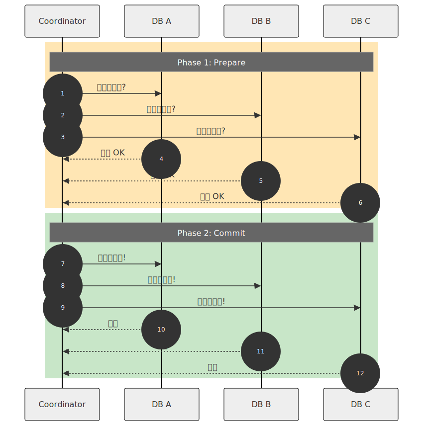

# 분산 트랜잭션 (Distributed Transaction)

> `[4] 심화` · 선수 지식: [트랜잭션](../db/transaction.md), [시스템 설계란](./what-is-system-design.md)

> 여러 서비스/데이터베이스에 걸친 트랜잭션의 원자성을 보장하는 기법

`#분산트랜잭션` `#DistributedTransaction` `#2PC` `#TwoPhaseCommit` `#Saga` `#사가패턴` `#보상트랜잭션` `#Compensation` `#Eventually일관성` `#EventualConsistency` `#분산시스템` `#마이크로서비스` `#Microservices` `#ACID` `#BASE` `#이벤트소싱` `#EventSourcing` `#Outbox` `#CDC`

## 왜 알아야 하는가?

마이크로서비스 환경에서는 하나의 비즈니스 로직이 여러 서비스에 걸쳐 있습니다. 예: 주문 생성 시 주문 서비스, 결제 서비스, 재고 서비스가 모두 성공해야 합니다. 하나라도 실패하면 전체를 롤백해야 하는데, 서로 다른 DB를 사용하므로 단일 트랜잭션으로 묶을 수 없습니다.

## 핵심 개념

- **2PC (Two-Phase Commit)**: 코디네이터가 모든 참여자의 준비를 확인 후 커밋
- **Saga 패턴**: 로컬 트랜잭션 + 보상 트랜잭션으로 일관성 유지
- **보상 트랜잭션**: 이전 작업을 취소하는 역연산
- **Eventually Consistent**: 최종적으로는 일관성이 맞춰짐

## 쉽게 이해하기

**분산 트랜잭션**을 결혼식에 비유할 수 있습니다.

**2PC (Two-Phase Commit)**:
- 1단계: 주례가 신랑/신부에게 "결혼하시겠습니까?" (Prepare)
- 2단계: 둘 다 "예"하면 "부부가 되었습니다" (Commit)
- 한 명이라도 "아니오"면 결혼 취소 (Abort)

**Saga 패턴**:
- 결혼 → 피로연 예약 → 신혼여행 예약
- 신혼여행 예약 실패 시:
  - 피로연 예약 취소 (보상)
  - 결혼 취소 (보상)

## 상세 설명

### 문제 상황

```
┌─────────────┐    ┌─────────────┐    ┌─────────────┐
│  주문 서비스 │    │  결제 서비스 │    │  재고 서비스 │
│   (DB A)    │    │   (DB B)    │    │   (DB C)    │
└──────┬──────┘    └──────┬──────┘    └──────┬──────┘
       │                  │                  │
       │  1. 주문 생성    │                  │
       ├──────────────────┼──────────────────┤
       │                  │  2. 결제 성공    │
       │                  ├──────────────────┤
       │                  │                  │  3. 재고 부족!
       │                  │                  │  ← 롤백 필요

문제: DB A, B는 이미 커밋됨. 어떻게 롤백?
```

### 2PC (Two-Phase Commit)



**단점**:
- 코디네이터 장애 시 전체 블로킹
- 락을 오래 유지해야 함 → 성능 저하
- 네트워크 지연에 취약

### Saga 패턴

**정의**: 로컬 트랜잭션들의 연쇄 + 실패 시 보상 트랜잭션

```
정상 흐름:
T1 → T2 → T3 → 완료
(주문생성) (결제) (재고차감)

실패 시 보상:
T1 → T2 → T3 실패!
          ↓
        C2 (결제 취소)
          ↓
        C1 (주문 취소)
```

#### Choreography (이벤트 기반)



**장점**: 단순, 느슨한 결합
**단점**: 흐름 파악 어려움, 순환 의존 위험

#### Orchestration (중앙 조정)



**장점**: 흐름 명확, 중앙 관리
**단점**: Orchestrator가 단일 장애점

### 보상 트랜잭션 설계

| 원 트랜잭션 | 보상 트랜잭션 |
|------------|--------------|
| 주문 생성 | 주문 취소 |
| 결제 승인 | 결제 취소/환불 |
| 재고 차감 | 재고 복원 |
| 포인트 차감 | 포인트 복원 |
| 쿠폰 사용 | 쿠폰 복원 |

**주의**: 보상 트랜잭션은 항상 가능해야 함
- 이미 배송 시작된 주문은 취소 불가 → 비즈니스 로직으로 처리

### Transactional Outbox 패턴

**문제**: DB 저장과 이벤트 발행을 원자적으로 처리해야 함

```
// 문제 상황
@Transactional
public void createOrder(Order order) {
    orderRepository.save(order);        // 1. DB 저장 성공
    eventPublisher.publish(event);      // 2. 이벤트 발행 실패!
    // → DB에는 저장됐지만 이벤트는 발행 안 됨
}
```

**해결: Outbox 테이블**

```
┌─────────────────────────────────────────────────────────────┐
│                    같은 트랜잭션                             │
│  ┌────────────────┐    ┌────────────────┐                   │
│  │ orders 테이블  │    │ outbox 테이블  │                   │
│  │ - 주문 데이터   │    │ - 이벤트 데이터 │                   │
│  └────────────────┘    └────────────────┘                   │
└─────────────────────────────────────────────────────────────┘
                              │
                              ▼ (별도 프로세스)
┌─────────────────────────────────────────────────────────────┐
│  Message Relay (CDC/Polling)                                │
│  - outbox 테이블 읽기                                        │
│  - 메시지 큐로 발행                                          │
│  - 발행 완료 표시                                            │
└─────────────────────────────────────────────────────────────┘
```

## 트레이드오프

| 방식 | 일관성 | 성능 | 복잡도 | 사용처 |
|------|--------|------|--------|--------|
| 2PC | 강한 일관성 | 낮음 | 중간 | 동일 DB 벤더 |
| Saga | 최종 일관성 | 높음 | 높음 | 마이크로서비스 |

## 면접 예상 질문

### Q: 2PC와 Saga의 차이는?

A: **2PC**는 코디네이터가 모든 참여자를 동기적으로 제어하여 강한 일관성을 보장하지만, 락을 오래 유지하고 코디네이터 장애에 취약합니다. **Saga**는 로컬 트랜잭션과 보상 트랜잭션을 연쇄하여 최종 일관성을 제공하고, 각 서비스가 독립적으로 동작하므로 성능이 좋지만 보상 로직 설계가 복잡합니다. **선택 기준**: 동일 DB 벤더이고 강한 일관성이 필요하면 2PC, 마이크로서비스처럼 이기종 시스템이면 Saga를 사용합니다.

### Q: 보상 트랜잭션이란?

A: 이미 완료된 트랜잭션의 효과를 논리적으로 취소하는 역연산입니다. **예시**: 결제 승인의 보상은 환불, 재고 차감의 보상은 재고 복원. **주의점**: (1) 보상 트랜잭션은 항상 성공해야 함 (2) 물리적 롤백이 아닌 논리적 취소 (3) 비즈니스 규칙상 취소 불가능한 경우 처리 필요 (예: 이미 배송된 주문).

## 연관 문서

| 문서 | 연관성 | 난이도 |
|------|--------|--------|
| [트랜잭션](../db/transaction.md) | 단일 DB 트랜잭션 | [3] 중급 |
| [CQRS & 이벤트 소싱](./cqrs-event-sourcing.md) | 이벤트 기반 설계 | [4] 심화 |

## 참고 자료

- Microservices Patterns - Chris Richardson
- [Saga Pattern](https://microservices.io/patterns/data/saga.html)
