# Event-Driven Architecture (이벤트 기반 아키텍처)

> `[3] 중급` · 선수 지식: [메시지 큐](./message-queue.md), [MSA](./msa-vs-monolithic.md)

> 이벤트의 생성, 감지, 소비를 통해 시스템 간 느슨한 결합을 달성하는 아키텍처 패턴

`#EventDrivenArchitecture` `#EDA` `#이벤트기반` `#Event` `#EventSourcing` `#PubSub` `#MessageBroker` `#Kafka` `#비동기` `#AsyncCommunication`

## 왜 알아야 하는가?

Event-Driven Architecture는 **마이크로서비스의 핵심 통신 패턴**입니다. 서비스 간 직접 호출 대신 이벤트를 통해 느슨한 결합을 달성합니다. 대규모 분산 시스템에서 확장성과 복원력을 위해 필수적이며, Kafka, RabbitMQ 같은 메시지 시스템 이해의 기반입니다.

- **실무**: MSA에서 서비스 간 통신, 실시간 데이터 파이프라인
- **면접**: "동기 vs 비동기 통신", "이벤트 소싱이란?"
- **기반 지식**: CQRS, Event Sourcing, Saga 패턴의 전제

## 핵심 개념

- **Event (이벤트)**: "무언가 발생했다"는 사실의 기록
- **Producer (생산자)**: 이벤트를 발행하는 주체
- **Consumer (소비자)**: 이벤트를 수신하고 처리하는 주체
- **Event Broker**: 이벤트를 중개하는 시스템 (Kafka, RabbitMQ)

## 쉽게 이해하기

**Event-Driven Architecture**를 SNS 알림에 비유할 수 있습니다.

```
동기 통신 (REST API 직접 호출)
┌────────┐  "야, 나 글 올렸어"  ┌────────┐
│ 사용자A │ ───────────────────→ │ 친구B  │
└────────┘  (직접 전화)         └────────┘
                                 (전화 안받으면 실패)

비동기 통신 (Event-Driven)
┌────────┐  [글 작성 이벤트]  ┌──────────┐   알림   ┌────────┐
│ 사용자A │ ─────────────────→│   SNS    │─────────→│ 친구B  │
└────────┘   (게시물 업로드)  │ (브로커) │         └────────┘
                             └──────────┘   (나중에 확인 가능)
```

A는 글만 올리면 됨. B가 온라인인지 신경 안 씀.

## 상세 설명

### 동기 vs 비동기 통신



**동기 통신 문제점:** Payment 장애 시 Order도 실패

**비동기 통신 장점:** Payment 장애와 무관하게 Order 처리

### Event vs Message vs Command

| 유형 | 의미 | 예시 | 특징 |
|------|------|------|------|
| **Event** | 과거에 발생한 사실 | OrderCreated, UserRegistered | 불변, 과거형, 수신자 모름 |
| **Command** | 수행해야 할 작업 | CreateOrder, SendEmail | 특정 수신자에게 지시 |
| **Message** | 일반적인 데이터 전달 | - | Event, Command 모두 포함 |

### 이벤트 구조

```java
// Event 클래스 예시
public class OrderCreatedEvent {
    private final String eventId;        // 이벤트 고유 ID
    private final Instant occurredAt;    // 발생 시각
    private final String orderId;        // 집계 ID
    private final String customerId;
    private final BigDecimal totalAmount;
    private final List<OrderItem> items;

    // 이벤트는 불변 (setter 없음)
}
```

### 코드 예시

```java
// Producer (이벤트 발행)
@Service
public class OrderService {
    private final OrderRepository orderRepository;
    private final ApplicationEventPublisher eventPublisher;

    @Transactional
    public Order createOrder(CreateOrderCommand command) {
        Order order = Order.create(command);
        orderRepository.save(order);

        // 이벤트 발행 (order는 저장됨, 수신자가 누구인지 모름)
        eventPublisher.publishEvent(new OrderCreatedEvent(
            order.getId(),
            order.getCustomerId(),
            order.getTotalAmount()
        ));

        return order;
    }
}

// Consumer (이벤트 수신)
@Component
public class PaymentEventHandler {
    private final PaymentService paymentService;

    @EventListener
    @Async
    public void handle(OrderCreatedEvent event) {
        // 결제 처리 (Order 서비스와 독립적)
        paymentService.processPayment(
            event.getOrderId(),
            event.getTotalAmount()
        );
    }
}

@Component
public class NotificationEventHandler {
    private final NotificationService notificationService;

    @EventListener
    @Async
    public void handle(OrderCreatedEvent event) {
        // 알림 발송 (Order 서비스와 독립적)
        notificationService.sendOrderConfirmation(event.getCustomerId());
    }
}
```

### 토폴로지 패턴

```
1. Broker Topology (중앙 집중형)
   ┌────────────┐
   │   Broker   │
   │  (Kafka)   │
   └─────┬──────┘
    ┌────┴────┐
    ↓         ↓
┌───────┐ ┌───────┐
│Service│ │Service│
└───────┘ └───────┘

2. Mediator Topology (중재자 패턴)
┌────────────────────────────────┐
│           Mediator             │
│  (Workflow Orchestrator)       │
└────────────────────────────────┘
    ↓           ↓           ↓
┌───────┐  ┌───────┐  ┌───────┐
│Service│  │Service│  │Service│
└───────┘  └───────┘  └───────┘
```

### 장애 처리

```java
// Dead Letter Queue (DLQ) 처리
@KafkaListener(topics = "orders")
public void consume(OrderEvent event) {
    try {
        processEvent(event);
    } catch (Exception e) {
        // 재시도 후에도 실패하면 DLQ로 이동
        kafkaTemplate.send("orders-dlq", event);
        log.error("Event moved to DLQ: {}", event.getId());
    }
}

// 멱등성 보장
@Transactional
public void processEvent(OrderEvent event) {
    // 이미 처리된 이벤트인지 확인
    if (processedEventRepository.exists(event.getId())) {
        log.info("Already processed: {}", event.getId());
        return;
    }

    // 이벤트 처리
    doProcess(event);

    // 처리 완료 기록
    processedEventRepository.save(event.getId());
}
```

## 트레이드오프

| 장점 | 단점 |
|------|------|
| 서비스 간 느슨한 결합 | 디버깅/추적 어려움 |
| 높은 확장성 | 최종 일관성 (Eventual Consistency) |
| 장애 격리 | 이벤트 순서 보장 복잡 |
| 실시간 반응 가능 | 러닝 커브 |

### 언제 사용하나?

**적합한 경우**:
- 마이크로서비스 간 통신
- 실시간 데이터 처리 (로그, 분석)
- 높은 확장성이 필요한 시스템
- 여러 시스템에 동일 이벤트 전파

**부적합한 경우**:
- 즉각적인 응답이 필요한 경우
- 단순한 요청-응답 패턴
- 강한 일관성이 필수인 경우

## 면접 예상 질문

### Q: Event-Driven Architecture의 장단점은?

A: **장점**: (1) 서비스 간 느슨한 결합으로 독립 배포 가능 (2) Producer가 Consumer를 모르므로 확장 용이 (3) 장애 격리 - 한 서비스 장애가 전파되지 않음. **단점**: (1) 디버깅이 어려움 - 이벤트 흐름 추적 필요 (2) 최종 일관성만 보장 - 즉각적 일관성 불가 (3) 이벤트 순서 보장 복잡.

### Q: 이벤트 중복 처리는 어떻게 하나요?

A: **멱등성(Idempotency)**을 보장해야 합니다. (1) 이벤트 ID를 저장하고 중복 체크 (2) DB에 unique constraint로 중복 삽입 방지 (3) 비즈니스 키 기반으로 upsert. **왜냐하면** 네트워크 오류, 재시도 등으로 동일 이벤트가 여러 번 전달될 수 있기 때문입니다.

## 연관 문서

| 문서 | 연관성 | 난이도 |
|------|--------|--------|
| [메시지 큐](./message-queue.md) | 선수 지식, 구현체 | [3] 중급 |
| [MSA vs 모놀리식](./msa-vs-monolithic.md) | MSA 통신 패턴 | [3] 중급 |
| [CQRS & 이벤트 소싱](./cqrs-event-sourcing.md) | 심화 패턴 | [4] 심화 |
| [분산 트랜잭션](./distributed-transaction.md) | Saga 패턴 | [4] 심화 |

## 참고 자료

- Building Event-Driven Microservices - Adam Bellemare
- [Event-Driven Architecture - Martin Fowler](https://martinfowler.com/articles/201701-event-driven.html)
- Enterprise Integration Patterns - Gregor Hohpe
