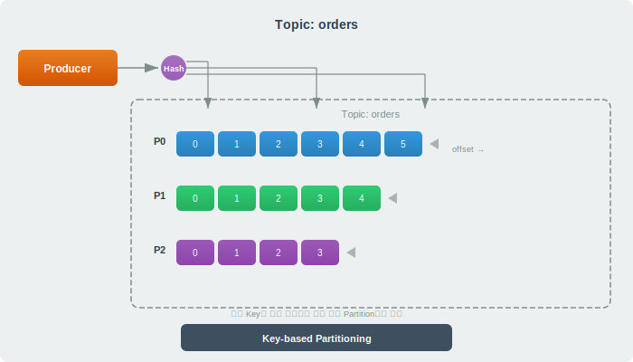
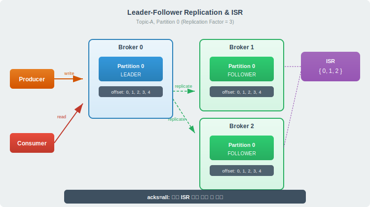
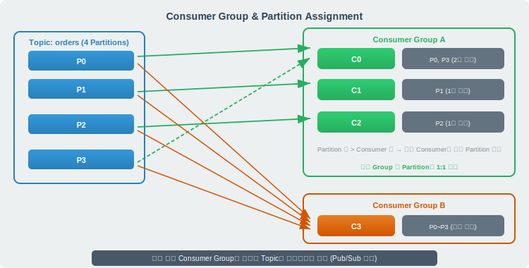

# Apache Kafka

> `[3] 중급` · 선수 지식: [메시지 큐](./message-queue.md), [Event-Driven Architecture](./event-driven-architecture.md)

> 대용량 실시간 데이터를 높은 처리량과 내구성으로 수집·저장·전달하는 분산 이벤트 스트리밍 플랫폼

`#카프카` `#Kafka` `#ApacheKafka` `#이벤트스트리밍` `#EventStreaming` `#Topic` `#토픽` `#Partition` `#파티션` `#Offset` `#오프셋` `#ConsumerGroup` `#컨슈머그룹` `#Producer` `#Consumer` `#Broker` `#브로커` `#Replication` `#복제` `#ISR` `#InSyncReplica` `#Leader` `#Follower` `#acks` `#LogCompaction` `#KRaft` `#ZooKeeper` `#SpringKafka` `#메시지큐` `#분산시스템` `#PubSub`

## 왜 알아야 하는가?

- **실무**: MSA 환경에서 서비스 간 비동기 통신, 실시간 데이터 파이프라인, CDC(Change Data Capture)의 사실상 표준
- **면접**: "Kafka가 빠른 이유", "Partition과 Consumer Group 관계", "메시지 순서 보장 방법" 등 분산 시스템 필수 질문
- **기반 지식**: CQRS, Event Sourcing, Saga 패턴, 실시간 분석 파이프라인의 핵심 인프라

## 핵심 개념

- **Topic**: 메시지를 분류하는 논리적 채널. 데이터베이스의 테이블에 해당
- **Partition**: Topic을 물리적으로 분할한 단위. 병렬 처리의 핵심
- **Offset**: Partition 내 메시지의 고유 순번. Consumer가 어디까지 읽었는지 추적
- **Broker**: Kafka 서버 인스턴스. 여러 Broker가 클러스터를 구성
- **Consumer Group**: 같은 목적으로 메시지를 소비하는 Consumer들의 논리적 그룹
- **ISR (In-Sync Replica)**: Leader와 동기화된 복제본 집합. 데이터 안전성의 핵심

## 쉽게 이해하기

### Kafka = 대형 물류 센터

**일반 메시지 큐 (RabbitMQ)**
편의점 택배 보관함입니다. 택배(메시지)를 넣으면 누군가 가져갑니다. 보관함이 작아서 대량 택배는 감당이 안 되고, 한 번 가져가면 사라집니다.

**Kafka**
대형 물류 센터입니다. 컨베이어 벨트(Partition)가 여러 개 있어서 택배를 병렬로 분류합니다. 택배가 벨트 위에 번호표(Offset)를 달고 순서대로 이동하며, 가져가더라도 일정 기간 보관됩니다. 여러 팀(Consumer Group)이 독립적으로 같은 택배를 확인할 수 있습니다.

| 비유 | Kafka 개념 |
|------|-----------|
| 물류 센터 | Kafka Cluster |
| 물류 센터 건물 | Broker |
| 컨베이어 벨트 라인 | Partition |
| 택배 분류 카테고리 | Topic |
| 택배 번호표 | Offset |
| 택배 발송자 | Producer |
| 택배 수거 팀 | Consumer Group |
| 팀원 | Consumer |

## 상세 설명

### Topic과 Partition

Topic은 메시지를 주제별로 분류하는 논리적 단위이며, 실제 데이터는 Partition에 저장된다.



**Partition이 필요한 이유:**
- **병렬 처리**: Partition 수만큼 Consumer가 동시에 메시지를 읽을 수 있다
- **순서 보장**: 같은 Partition 내에서는 메시지 순서가 보장된다 (Partition 간에는 보장 안 됨)
- **수평 확장**: Partition을 여러 Broker에 분산하여 처리량을 늘린다

**왜 이렇게 하는가?**
단일 큐로는 초당 수백만 메시지를 처리할 수 없다. Partition으로 분할하면 각 Partition이 독립적인 로그 파일로 동작하여, I/O를 병렬화할 수 있다.

```java
// Key 기반 파티셔닝 — 같은 Key는 항상 같은 Partition
ProducerRecord<String, String> record = new ProducerRecord<>(
    "orders",           // Topic
    orderId,            // Key (파티션 결정)
    orderJson           // Value
);
producer.send(record);
```

같은 `orderId`를 Key로 사용하면 해당 주문의 모든 이벤트(생성, 결제, 배송)가 같은 Partition에 들어가 **순서가 보장**된다.

### Broker와 Replication

Kafka 클러스터는 여러 Broker로 구성되며, 데이터 안전성을 위해 Partition을 복제한다.



**복제 구조:**
- 각 Partition에는 1개의 **Leader**와 N개의 **Follower**가 존재
- 모든 읽기/쓰기는 Leader를 통해 수행 (Kafka 2.4+ 부터 Follower 읽기 가능)
- Follower는 Leader의 데이터를 비동기로 복제

**ISR (In-Sync Replica):**
Leader와 일정 시간(`replica.lag.time.max.ms`) 내에 동기화된 복제본 집합이다. ISR에 속하지 못한 Follower는 "out-of-sync"로 판정되어 Leader 승격 대상에서 제외된다.

**왜 이렇게 하는가?**
단순 비동기 복제만으로는 Leader 장애 시 데이터 손실 가능성이 있다. ISR 메커니즘은 "충분히 따라잡은 Follower"만 Leader 후보로 인정하여 **데이터 안전성과 가용성의 균형**을 맞춘다.

### Producer의 acks 설정

Producer가 메시지를 보낼 때, 어디까지 확인을 받을지 결정한다.

| acks | 동작 | 처리량 | 안전성 |
|------|------|--------|--------|
| `0` | 응답을 기다리지 않음 | 최고 | 최저 (메시지 유실 가능) |
| `1` | Leader 기록 확인 | 높음 | 중간 (Leader 장애 시 유실 가능) |
| `all` (`-1`) | 모든 ISR 복제 확인 | 낮음 | 최고 (ISR 전체 장애 아닌 한 안전) |

```yaml
# Spring Kafka 설정
spring:
  kafka:
    producer:
      acks: all                    # 모든 ISR 복제 확인
      retries: 3                   # 실패 시 재시도
      properties:
        enable.idempotence: true   # 중복 전송 방지
        max.in.flight.requests.per.connection: 5
```

**`acks=all` + `min.insync.replicas=2`** 조합이 프로덕션 권장 설정이다. ISR이 최소 2개 이상일 때만 쓰기를 허용하여 단일 Broker 장애에도 데이터가 안전하다.

### Consumer Group

Consumer Group은 Kafka의 수평 확장과 장애 복구의 핵심이다.



**핵심 규칙:**
1. 같은 Consumer Group 내에서 하나의 Partition은 **하나의 Consumer만** 담당
2. Consumer 수 > Partition 수이면, 남는 Consumer는 **유휴 상태**
3. 다른 Consumer Group은 **같은 메시지를 독립적으로** 소비

**왜 이렇게 하는가?**
하나의 Partition을 여러 Consumer가 동시에 읽으면 Offset 관리가 복잡해지고 메시지 순서가 깨진다. 1:1 할당으로 단순하면서도 안전한 병렬 처리를 보장한다.

```java
@KafkaListener(
    topics = "orders",
    groupId = "order-service",     // Consumer Group
    concurrency = "3"              // 3개 Consumer 스레드
)
public void consume(ConsumerRecord<String, String> record) {
    log.info("Partition: {}, Offset: {}, Value: {}",
        record.partition(), record.offset(), record.value());
}
```

**리밸런싱**: Consumer가 추가/제거되면 Partition 할당이 재조정된다. 이 과정에서 일시적으로 메시지 소비가 중단될 수 있다.

### Kafka가 빠른 이유

| 기법 | 설명 |
|------|------|
| **Sequential I/O** | 디스크에 순차적으로 쓰기. 랜덤 I/O 대비 수백 배 빠름 |
| **Zero-Copy** | 커널 → 소켓 직접 전송. 사용자 공간 복사 생략 |
| **Page Cache** | OS 페이지 캐시 활용. JVM 힙 대신 OS가 캐싱 관리 |
| **Batching** | Producer/Consumer 모두 배치 단위로 처리. 네트워크 오버헤드 감소 |
| **Partition 병렬화** | 여러 Partition에 동시 읽기/쓰기 |
| **압축** | Snappy, LZ4, Zstd 등으로 네트워크 전송량 감소 |

**왜 이렇게 하는가?**
전통적인 메시지 브로커(RabbitMQ 등)는 메시지 단위 처리와 랜덤 I/O를 사용한다. Kafka는 "분산 커밋 로그"라는 설계 철학으로, 로그 파일에 순차 기록하는 단순한 구조를 택해 하드웨어 성능을 극대화한다.

### ZooKeeper에서 KRaft로

| 항목 | ZooKeeper 모드 | KRaft 모드 (3.3+) |
|------|---------------|-------------------|
| 메타데이터 관리 | 외부 ZooKeeper 클러스터 | Kafka 자체 내장 |
| 운영 복잡도 | ZK + Kafka 별도 관리 | Kafka만 관리 |
| 장애 복구 | ZK 의존 | 자체 Raft 합의 |
| 파티션 수 제한 | ~200K | 수백만 파티션 가능 |
| 상태 | Deprecated (4.0에서 제거) | 권장 |

**왜 이렇게 하는가?**
ZooKeeper는 Kafka와 별도 클러스터로 운영 부담이 크고, 메타데이터 동기화 병목이 대규모 클러스터의 확장성을 제한했다. KRaft는 Kafka 내부에 Raft 합의 알고리즘을 구현하여 아키텍처를 단순화했다.

## Kafka vs RabbitMQ

| 비교 항목 | Kafka | RabbitMQ |
|----------|-------|----------|
| **모델** | 분산 로그 (Pull 기반) | 메시지 브로커 (Push 기반) |
| **처리량** | 초당 수백만 메시지 | 초당 수만 메시지 |
| **메시지 보존** | 설정 기간 동안 보관 | 소비 후 삭제 |
| **순서 보장** | Partition 내 보장 | Queue 내 보장 |
| **라우팅** | Topic + Key 기반 | Exchange + Routing Key (유연) |
| **재소비** | Offset 리셋으로 가능 | 불가 (메시지 삭제됨) |
| **적합한 용도** | 이벤트 스트리밍, 로그 수집, CDC | 작업 큐, RPC, 복잡한 라우팅 |

**선택 기준:**
- **대용량 실시간 스트리밍** → Kafka
- **복잡한 메시지 라우팅이 필요** → RabbitMQ
- **메시지 재처리가 필요** → Kafka
- **즉각적인 메시지 전달(낮은 지연)** → RabbitMQ

## 예제 코드

### Spring Kafka Producer

```java
@Service
@RequiredArgsConstructor
public class OrderEventProducer {

    private final KafkaTemplate<String, String> kafkaTemplate;
    private final ObjectMapper objectMapper;

    public void publishOrderCreated(OrderCreatedEvent event) {
        try {
            String payload = objectMapper.writeValueAsString(event);
            kafkaTemplate.send("order-events", event.getOrderId(), payload)
                .whenComplete((result, ex) -> {
                    if (ex != null) {
                        log.error("메시지 전송 실패: topic={}, key={}",
                            "order-events", event.getOrderId(), ex);
                    }
                });
        } catch (JsonProcessingException e) {
            throw new IllegalArgumentException("직렬화 실패", e);
        }
    }
}
```

### Spring Kafka Consumer

```java
@Service
@RequiredArgsConstructor
public class OrderEventConsumer {

    private final OrderService orderService;

    @KafkaListener(
        topics = "order-events",
        groupId = "inventory-service",
        concurrency = "3"
    )
    public void handleOrderCreated(
            ConsumerRecord<String, String> record,
            Acknowledgment ack) {
        try {
            log.info("수신: partition={}, offset={}, key={}",
                record.partition(), record.offset(), record.key());

            OrderCreatedEvent event = objectMapper.readValue(
                record.value(), OrderCreatedEvent.class);
            orderService.reserveInventory(event);

            ack.acknowledge();  // 수동 커밋
        } catch (Exception e) {
            log.error("처리 실패: offset={}", record.offset(), e);
            // DLQ로 전송하거나 재시도 로직
        }
    }
}
```

### application.yml 설정

```yaml
spring:
  kafka:
    bootstrap-servers: localhost:9092
    producer:
      key-serializer: org.apache.kafka.common.serialization.StringSerializer
      value-serializer: org.apache.kafka.common.serialization.StringSerializer
      acks: all
      properties:
        enable.idempotence: true
    consumer:
      group-id: inventory-service
      auto-offset-reset: earliest
      enable-auto-commit: false    # 수동 커밋 권장
      key-deserializer: org.apache.kafka.common.serialization.StringDeserializer
      value-deserializer: org.apache.kafka.common.serialization.StringDeserializer
    listener:
      ack-mode: manual             # 수동 ACK
      concurrency: 3               # Consumer 스레드 수
```

## 트레이드오프

| 장점 | 단점 |
|------|------|
| 초고성능 (초당 수백만 메시지) | 운영 복잡도 높음 (Broker, Topic, Partition 관리) |
| 메시지 영속성 + 재소비 가능 | 메시지 라우팅이 단순 (Exchange 패턴 없음) |
| Consumer Group으로 수평 확장 용이 | Consumer 리밸런싱 시 일시적 중단 |
| Partition으로 순서 보장 | Topic 레벨 순서 보장 불가 |
| 풍부한 에코시스템 (Connect, Streams) | 소규모 시스템에는 오버스펙 |

## 트러블슈팅

### 사례 1: Consumer Lag 급증

#### 증상
Consumer Group의 Lag(미처리 메시지 수)가 지속적으로 증가. 메시지 처리 지연 발생.

#### 원인 분석
Consumer의 처리 속도 < Producer의 전송 속도. 일반적인 원인:
- Consumer 내부에서 동기 I/O (DB 조회, 외부 API 호출)
- Partition 수 대비 Consumer 수가 적음
- GC 정지로 인한 일시적 처리 중단

#### 해결 방법
```bash
# Lag 확인
kafka-consumer-groups.sh --bootstrap-server localhost:9092 \
  --group inventory-service --describe
```

1. **Consumer 수 증가**: `concurrency` 값을 Partition 수까지 늘린다
2. **배치 처리**: `@KafkaListener`에 `BatchListener` 적용
3. **비동기 처리**: Consumer 내부 로직을 비동기로 전환
4. **Partition 수 증가**: Topic의 Partition을 늘린다 (줄이는 것은 불가)

#### 예방 조치
- Lag 모니터링 알림 설정 (Grafana + Prometheus + JMX Exporter)
- `max.poll.records`로 한 번에 가져오는 메시지 수 조절
- `max.poll.interval.ms`를 처리 시간에 맞게 설정

### 사례 2: Rebalancing Storm

#### 증상
Consumer가 반복적으로 Group에서 이탈/재가입. 로그에 `Rebalancing triggered` 다수 발생.

#### 원인 분석
`max.poll.interval.ms`(기본 5분) 내에 `poll()`을 호출하지 못하면 Consumer가 "죽었다"고 판단되어 리밸런싱 발생. 처리 시간이 긴 메시지가 원인.

#### 해결 방법
```yaml
spring:
  kafka:
    consumer:
      properties:
        max.poll.interval.ms: 600000     # 10분으로 증가
        max.poll.records: 50             # 한 번에 가져오는 수 줄임
        session.timeout.ms: 30000        # 세션 타임아웃
        heartbeat.interval.ms: 10000     # 하트비트 주기
```

#### 예방 조치
- 무거운 처리는 별도 스레드 풀에 위임
- `CooperativeStickyAssignor` 사용으로 리밸런싱 영향 최소화

## 면접 예상 질문

### Q: Kafka가 빠른 이유는?

A: 핵심은 **Sequential I/O + Zero-Copy + Page Cache**이다. Kafka는 메시지를 디스크에 순차적으로 기록하는 "분산 커밋 로그" 구조를 사용한다. 순차 I/O는 랜덤 I/O 대비 수백 배 빠르며, OS Page Cache를 활용해 JVM GC 영향 없이 데이터를 캐싱한다. 또한 Zero-Copy로 커널에서 소켓으로 직접 전송하여 불필요한 데이터 복사를 제거한다. 여기에 Producer/Consumer의 Batching과 Partition 병렬화가 더해져 초당 수백만 메시지 처리가 가능하다.

### Q: Partition 수를 어떻게 결정하는가?

A: `목표 처리량 / 단일 Consumer 처리량`으로 계산한다. 예를 들어 초당 10만 메시지를 처리해야 하고, Consumer 하나가 초당 1만 메시지를 처리하면 최소 10개 Partition이 필요하다. 단, Partition은 늘리기만 가능하고 줄일 수 없으므로, 초기에 여유 있게 설정하되 과도하게 많으면 리밸런싱 시간이 증가하고 파일 디스크립터가 소모된다. 일반적으로 Broker당 2,000~4,000개를 상한으로 권장한다.

### Q: 메시지 순서를 보장하려면?

A: **같은 Key를 사용하여 같은 Partition에 보내면** 해당 Key 범위 내에서 순서가 보장된다. 예를 들어 주문 ID를 Key로 사용하면 같은 주문의 모든 이벤트가 순서대로 처리된다. 추가로 `max.in.flight.requests.per.connection=1`을 설정하면 재시도 시 순서 역전도 방지할 수 있지만 처리량이 감소한다. `enable.idempotence=true` 설정 시에는 5까지 허용해도 순서가 보장된다.

### Q: Consumer Group의 리밸런싱이란?

A: Consumer Group 내 Consumer가 추가/제거되거나, Topic의 Partition이 변경될 때 Partition 할당을 재조정하는 과정이다. 리밸런싱 중에는 모든 Consumer가 메시지 소비를 일시 중단하므로 **지연이 발생**한다. 이를 완화하기 위해 Kafka 2.4+에서 도입된 `CooperativeStickyAssignor`를 사용하면 변경이 필요한 Partition만 재할당하여 영향을 최소화할 수 있다.

## 연관 문서

| 문서 | 연관성 | 난이도 |
|------|--------|--------|
| [메시지 큐](./message-queue.md) | 선수 지식 — MQ 기본 개념 | [3] 중급 |
| [Event-Driven Architecture](./event-driven-architecture.md) | 선수 지식 — EDA 패턴 | [3] 중급 |
| [AWS SQS](./aws-sqs.md) | 비교 대상 — 관리형 MQ | [3] 중급 |
| [SAGA 패턴](./saga-pattern.md) | 심화 학습 — Kafka 기반 Saga | [4] 심화 |
| [CQRS & 이벤트 소싱](./cqrs-event-sourcing.md) | 심화 학습 — Kafka 이벤트 스토어 | [4] 심화 |
| [멱등성](./idempotency.md) | 관련 개념 — 중복 메시지 처리 | [3] 중급 |
| [CDC](../db/cdc.md) | 관련 개념 — Kafka Connect CDC | - |

## 참고 자료

- [Apache Kafka 공식 문서](https://kafka.apache.org/documentation/)
- [Kafka: The Definitive Guide (O'Reilly)](https://www.oreilly.com/library/view/kafka-the-definitive/9781492043072/)
- [Spring for Apache Kafka Reference](https://docs.spring.io/spring-kafka/reference/)
- [KRaft: Apache Kafka Without ZooKeeper (Confluent Blog)](https://developer.confluent.io/learn/kraft/)
