# Layered Architecture (계층형 아키텍처)

> `[2] 입문` · 선수 지식: [시스템 설계란](./what-is-system-design.md)

> 애플리케이션을 역할별 계층으로 분리하여 관심사를 분리하는 아키텍처 패턴

`#LayeredArchitecture` `#계층형아키텍처` `#NTier` `#3Tier` `#Presentation` `#Business` `#Data` `#SoC` `#SeparationOfConcerns` `#관심사분리`

## 왜 알아야 하는가?

Layered Architecture는 **가장 널리 사용되는 아키텍처 패턴**입니다. Spring MVC, Django, Rails 등 대부분의 웹 프레임워크가 이 패턴을 기반으로 합니다. 아키텍처 면접에서 기본으로 물어보는 개념이며, 다른 아키텍처 패턴을 이해하기 위한 기초입니다.

- **실무**: 대부분의 엔터프라이즈 애플리케이션의 기본 구조
- **면접**: "Controller-Service-Repository 구조를 왜 사용하나요?"
- **기반 지식**: Hexagonal, Clean Architecture 이해의 전제

## 핵심 개념

- **관심사 분리 (Separation of Concerns)**: 각 계층은 특정 역할만 담당
- **단방향 의존성**: 상위 계층이 하위 계층에만 의존
- **계층 간 인터페이스**: 계층 간 통신은 정의된 인터페이스를 통해

## 쉽게 이해하기

**Layered Architecture**를 회사 조직 구조에 비유할 수 있습니다.

```
┌─────────────────────────────────────────┐
│  [Presentation Layer] - 접수 창구        │
│  고객 응대, 요청 접수, 결과 전달          │
├─────────────────────────────────────────┤
│  [Business Layer] - 실무 부서            │
│  업무 처리, 규칙 적용, 의사 결정          │
├─────────────────────────────────────────┤
│  [Data Layer] - 기록 보관실              │
│  데이터 저장, 조회, 관리                  │
└─────────────────────────────────────────┘

고객 → 접수 창구에서 요청 → 실무 부서에서 처리 → 기록 보관실에서 조회/저장
```

접수 창구 직원이 직접 기록 보관실에 가지 않고, 실무 부서를 통해 요청합니다.

## 상세 설명

### 표준 3-Tier 구조



### Spring 예시 코드

```java
// Presentation Layer
@RestController
@RequestMapping("/api/users")
public class UserController {
    private final UserService userService;

    @PostMapping
    public ResponseEntity<UserResponse> createUser(@RequestBody UserRequest request) {
        // 입력 검증
        User user = userService.createUser(request.toCommand());
        return ResponseEntity.ok(UserResponse.from(user));
    }
}

// Business Layer
@Service
@Transactional
public class UserService {
    private final UserRepository userRepository;
    private final EmailService emailService;

    public User createUser(CreateUserCommand command) {
        // 비즈니스 규칙 검증
        if (userRepository.existsByEmail(command.email())) {
            throw new DuplicateEmailException();
        }

        User user = User.create(command);
        userRepository.save(user);
        emailService.sendWelcomeEmail(user);
        return user;
    }
}

// Data Layer
@Repository
public class UserRepository {
    private final JpaUserRepository jpaRepository;

    public void save(User user) {
        jpaRepository.save(UserEntity.from(user));
    }

    public boolean existsByEmail(String email) {
        return jpaRepository.existsByEmail(email);
    }
}
```

### 의존성 방향

```
Controller → Service → Repository → Database
   (상위)                              (하위)

✅ 올바른 의존성: Controller가 Service를 호출
❌ 잘못된 의존성: Repository가 Controller를 호출
```

**왜 단방향 의존성인가?**
- 하위 계층 변경이 상위 계층에 영향을 주지 않음
- 계층별 독립적인 테스트 가능
- 계층 교체가 용이 (예: JPA → MyBatis)

### 계층별 책임

| 계층 | 책임 | 포함 요소 |
|------|------|----------|
| **Presentation** | 사용자 인터페이스, 입출력 | Controller, DTO, View |
| **Business** | 비즈니스 로직, 규칙 | Service, Domain Model |
| **Data** | 데이터 접근, 영속화 | Repository, Entity |
| **Infrastructure** | 외부 시스템 연동 | DB, 메시지 큐, 외부 API |

### Strict vs Relaxed Layering



**Strict 장점**: 계층 간 결합도 최소화, 명확한 구조
**Relaxed 장점**: 성능 최적화 가능, 유연성

## 트레이드오프

| 장점 | 단점 |
|------|------|
| 이해하기 쉬운 구조 | 단순 CRUD에도 모든 계층 통과 |
| 관심사 분리로 유지보수 용이 | 계층 간 데이터 변환 오버헤드 |
| 계층별 독립적 테스트 가능 | 비즈니스 로직이 Service에 집중 |
| 팀 단위 병렬 개발 가능 | 도메인 모델이 빈약해질 수 있음 |

### 언제 사용하나?

**적합한 경우**:
- 전통적인 엔터프라이즈 애플리케이션
- CRUD 중심의 데이터 기반 애플리케이션
- 팀이 익숙한 구조가 필요할 때

**부적합한 경우**:
- 복잡한 도메인 로직 (→ Hexagonal, Clean Architecture)
- 마이크로서비스 환경 (→ Event-Driven)
- 실시간 처리 시스템

## 면접 예상 질문

### Q: Layered Architecture의 장단점은?

A: **장점**: (1) 이해하기 쉽고 널리 알려진 패턴 (2) 관심사 분리로 유지보수 용이 (3) 계층별 독립적 테스트 가능. **단점**: (1) 모든 요청이 전체 계층을 통과해야 함 (2) 비즈니스 로직이 Service 계층에 집중되어 도메인 모델이 빈약해짐(Anemic Domain Model) (3) 계층 간 데이터 변환 오버헤드.

### Q: Controller에서 Repository를 직접 호출하면 안 되나요?

A: 기술적으로는 가능하지만 **권장하지 않습니다**. **왜냐하면** (1) 관심사가 섞여 Controller가 비대해짐 (2) 트랜잭션 경계가 불명확해짐 (3) 비즈니스 로직 재사용이 어려워짐 (4) 테스트 시 DB 의존성이 생김. 다만, 단순 조회의 경우 성능상 이유로 허용하기도 합니다(Relaxed Layering).

## 연관 문서

| 문서 | 연관성 | 난이도 |
|------|--------|--------|
| [시스템 설계란](./what-is-system-design.md) | 선수 지식 | [1] 정의 |
| [Hexagonal Architecture](./hexagonal-architecture.md) | 대안 아키텍처 | [3] 중급 |
| [MSA vs 모놀리식](./msa-vs-monolithic.md) | 아키텍처 비교 | [3] 중급 |
| [DTO-Entity 변환](./dto-entity-conversion.md) | 계층 간 데이터 전달 | [3] 중급 |

## 참고 자료

- Patterns of Enterprise Application Architecture - Martin Fowler
- [Software Architecture Patterns - O'Reilly](https://www.oreilly.com/library/view/software-architecture-patterns/9781491971437/)
