# 로드밸런싱 (Load Balancing)

> `[3] 중급` · 선수 지식: [확장성](./scalability.md), [가용성](./availability.md)

> 들어오는 트래픽을 여러 서버에 분산하여 시스템의 확장성, 가용성, 성능을 높이는 기술

`#로드밸런싱` `#LoadBalancing` `#LB` `#로드밸런서` `#LoadBalancer` `#부하분산` `#트래픽분산` `#L4` `#L7` `#RoundRobin` `#LeastConnections` `#IPHash` `#WeightedRoundRobin` `#HealthCheck` `#헬스체크` `#고가용성` `#HA` `#스케일아웃` `#ELB` `#ALB` `#NLB` `#HAProxy` `#Nginx` `#AWS` `#리버스프록시` `#세션스티키` `#SessionAffinity` `#페일오버` `#Failover`

## 왜 알아야 하는가?

- **실무**: 모든 프로덕션 서비스는 로드밸런서를 사용함. AWS ELB, Nginx 설정이 일상적 업무
- **면접**: "트래픽이 급증하면 어떻게 대응하나요?" 질문의 핵심 답변
- **기반 지식**: MSA, 무중단 배포, 고가용성 설계의 기본 전제 조건

## 핵심 개념

- 트래픽을 여러 서버에 분산하여 단일 서버 과부하 방지
- 장애 서버를 자동 감지하고 트래픽 우회 (Health Check)
- L4 (TCP/UDP 기반) vs L7 (HTTP 기반) 레벨에서 동작

## 쉽게 이해하기

**은행 창구 비유**

```
┌─────────────────────────────────────────────────────────┐
│                       은 행                              │
├─────────────────────────────────────────────────────────┤
│                                                          │
│   고객들      →    안내 직원     →    창구들             │
│   (요청)          (로드밸런서)       (서버)              │
│                                                          │
│   ┌───┐              ┌───┐         ┌───────┐            │
│   │ A │──┐           │   │    ┌───→│창구 1 │            │
│   └───┘  │           │ 안│    │    └───────┘            │
│   ┌───┐  │           │ 내│────┤    ┌───────┐            │
│   │ B │──┼──────────→│ 직│────┼───→│창구 2 │            │
│   └───┘  │           │ 원│────┤    └───────┘            │
│   ┌───┐  │           │   │    │    ┌───────┐            │
│   │ C │──┘           └───┘    └───→│창구 3 │            │
│   └───┘                            └───────┘            │
│                                                          │
│   "대기 인원이 적은 창구로 안내해드릴게요"               │
└─────────────────────────────────────────────────────────┘
```

- **안내 직원** = 로드밸런서: 고객(요청)을 적절한 창구(서버)로 분배
- **창구 폐쇄 감지** = Health Check: 문제 있는 창구는 안내하지 않음
- **창구 추가** = Scale Out: 바쁜 시간대에 창구를 늘림

## 상세 설명

### L4 vs L7 로드밸런싱



| 구분 | L4 로드밸런서 | L7 로드밸런서 |
|------|--------------|--------------|
| **동작 계층** | Transport (TCP/UDP) | Application (HTTP) |
| **라우팅 기준** | IP, Port | URL, Header, Cookie |
| **성능** | 빠름 (패킷만 전달) | 상대적으로 느림 |
| **기능** | 단순 분산 | 콘텐츠 기반 라우팅, SSL 종료 |
| **예시** | AWS NLB, HAProxy | AWS ALB, Nginx |

**왜 이렇게 구분하는가?**

L4는 패킷 내용을 분석하지 않아 빠르지만 단순함. L7은 요청 내용을 분석할 수 있어 정교한 라우팅이 가능하지만 오버헤드가 있음. 용도에 맞게 선택해야 함.

### 로드밸런싱 알고리즘


| 알고리즘 | 장점 | 단점 | 적합한 상황 |
|----------|------|------|------------|
| **Round Robin** | 단순, 균등 분배 | 서버 성능 차이 무시 | 동일 스펙 서버 |
| **Least Connections** | 부하 기반 분배 | 모니터링 오버헤드 | 요청 처리 시간 다양 |
| **Weighted** | 성능 차이 반영 | 가중치 관리 필요 | 이기종 서버 환경 |
| **IP Hash** | 세션 유지 | 분배 불균형 가능 | Stateful 서비스 |

### Health Check (헬스 체크)



**설정 예시:**
- 체크 주기: 30초
- 타임아웃: 5초
- 실패 임계: 3회 연속 실패 시 제외
- 복구 임계: 2회 연속 성공 시 복구

**왜 Health Check가 중요한가?**

장애 서버로 트래픽이 가면 사용자 요청이 실패함. 자동으로 장애를 감지하고 트래픽을 우회해야 고가용성을 보장할 수 있음.

### Session Affinity (Sticky Session)



## 구현 예시

### Nginx 로드밸런서 설정

```nginx
# /etc/nginx/nginx.conf

upstream backend {
    # 로드밸런싱 알고리즘 (기본: round-robin)
    # least_conn;           # 최소 연결
    # ip_hash;              # IP 해시 (세션 유지)

    server 192.168.1.10:8080 weight=3;  # 가중치 3
    server 192.168.1.11:8080 weight=1;  # 가중치 1
    server 192.168.1.12:8080 backup;    # 백업 서버
}

server {
    listen 80;

    location / {
        proxy_pass http://backend;

        # 헬스 체크 관련 헤더 전달
        proxy_set_header Host $host;
        proxy_set_header X-Real-IP $remote_addr;
        proxy_set_header X-Forwarded-For $proxy_add_x_forwarded_for;

        # 타임아웃 설정
        proxy_connect_timeout 5s;
        proxy_read_timeout 60s;
    }

    # 헬스 체크 엔드포인트
    location /health {
        access_log off;
        return 200 "healthy\n";
    }
}
```

### Spring Boot Health Endpoint

```java
@RestController
public class HealthController {

    private final DataSource dataSource;
    private final RedisTemplate<String, Object> redisTemplate;

    @GetMapping("/health")
    public ResponseEntity<Map<String, String>> health() {
        Map<String, String> status = new HashMap<>();

        // DB 연결 확인
        try (Connection conn = dataSource.getConnection()) {
            status.put("database", "UP");
        } catch (SQLException e) {
            status.put("database", "DOWN");
            return ResponseEntity.status(503).body(status);
        }

        // Redis 연결 확인
        try {
            redisTemplate.opsForValue().get("health-check");
            status.put("redis", "UP");
        } catch (Exception e) {
            status.put("redis", "DOWN");
            return ResponseEntity.status(503).body(status);
        }

        status.put("status", "UP");
        return ResponseEntity.ok(status);
    }
}
```

### AWS ALB + Target Group (Terraform)

```hcl
# Application Load Balancer
resource "aws_lb" "main" {
  name               = "my-alb"
  internal           = false
  load_balancer_type = "application"
  security_groups    = [aws_security_group.alb.id]
  subnets            = aws_subnet.public[*].id
}

# Target Group
resource "aws_lb_target_group" "app" {
  name     = "app-tg"
  port     = 8080
  protocol = "HTTP"
  vpc_id   = aws_vpc.main.id

  # Health Check 설정
  health_check {
    enabled             = true
    healthy_threshold   = 2      # 2회 성공 시 healthy
    unhealthy_threshold = 3      # 3회 실패 시 unhealthy
    interval            = 30     # 30초 간격
    timeout             = 5      # 5초 타임아웃
    path                = "/health"
    matcher             = "200"
  }

  # Sticky Session (선택)
  stickiness {
    type            = "lb_cookie"
    cookie_duration = 3600  # 1시간
    enabled         = true
  }
}

# Listener
resource "aws_lb_listener" "http" {
  load_balancer_arn = aws_lb.main.arn
  port              = 80
  protocol          = "HTTP"

  default_action {
    type             = "forward"
    target_group_arn = aws_lb_target_group.app.arn
  }
}
```

## 트레이드오프

| 장점 | 단점 |
|------|------|
| 수평 확장 가능 | 단일 장애점(SPOF) 가능성 |
| 고가용성 확보 | 설정 복잡도 증가 |
| 무중단 배포 지원 | 추가 인프라 비용 |
| 유연한 트래픽 제어 | 세션 관리 복잡성 |

### 로드밸런서 SPOF 해결



- **Active-Standby**: 평상시 Active만 동작, 장애 시 Standby 승격
- **Active-Active**: 둘 다 동작, DNS로 분산

## 트러블슈팅

### 사례 1: 특정 서버로 트래픽 쏠림

#### 증상
Round Robin인데 특정 서버만 CPU 100%, 다른 서버는 여유

#### 원인 분석
- Sticky Session 설정 + 대형 고객이 해당 서버에 고정
- 또는 서버 Health Check 실패로 다른 서버들 제외됨

#### 해결 방법
```bash
# 서버별 연결 수 확인
ss -s

# Nginx upstream 상태 확인
curl http://localhost/upstream_status

# Health Check 로그 확인
tail -f /var/log/nginx/error.log | grep upstream
```

#### 예방 조치
- Least Connections 알고리즘 사용 검토
- 세션 외부화 (Redis)로 Sticky Session 제거
- Health Check 민감도 조정

### 사례 2: 배포 중 502 Bad Gateway

#### 증상
Rolling Update 중 일부 요청이 502 에러

#### 원인 분석
서버 종료 시 처리 중인 요청이 강제 종료됨 (Graceful Shutdown 미설정)

#### 해결 방법
```yaml
# application.yml
server:
  shutdown: graceful

spring:
  lifecycle:
    timeout-per-shutdown-phase: 30s
```

```nginx
# Nginx - 재시도 설정
upstream backend {
    server 192.168.1.10:8080;
    server 192.168.1.11:8080;
}

location / {
    proxy_pass http://backend;
    proxy_next_upstream error timeout http_502 http_503;
    proxy_next_upstream_tries 2;
}
```

## 면접 예상 질문

### Q: L4와 L7 로드밸런서의 차이점은?

A: L4는 Transport 계층(TCP/UDP)에서 IP와 Port 기반으로 라우팅하며, 패킷 내용을 분석하지 않아 빠릅니다. L7은 Application 계층(HTTP)에서 URL, Header, Cookie 등을 분석하여 라우팅하므로 콘텐츠 기반 분배가 가능하지만 오버헤드가 있습니다. **왜 구분하냐면**, 단순 분산은 L4가 효율적이고, URL별 서버 분리나 SSL 종료 같은 고급 기능이 필요하면 L7을 사용해야 하기 때문입니다.

### Q: 세션 클러스터링 없이 로드밸런싱 환경에서 세션을 유지하려면?

A: 두 가지 방법이 있습니다. 첫째, IP Hash나 쿠키 기반 Sticky Session으로 같은 서버로 라우팅합니다. 하지만 서버 장애 시 세션이 유실됩니다. 둘째, Redis 같은 외부 저장소에 세션을 저장하여 모든 서버가 공유하게 합니다. **왜 후자를 권장하냐면**, 서버가 Stateless가 되어 스케일 아웃이 자유롭고, 장애 복구도 쉽기 때문입니다.

### Q: Health Check가 왜 중요한가요?

A: 장애 서버로 트래픽이 가면 사용자 요청이 실패합니다. Health Check는 주기적으로 서버 상태를 확인하여 문제 있는 서버를 풀에서 자동 제외하고, 복구되면 다시 포함시킵니다. **이게 중요한 이유는** 수동 개입 없이 자동으로 고가용성을 유지할 수 있기 때문입니다. 체크 주기, 타임아웃, 실패 임계값을 적절히 설정해야 합니다.

## 연관 문서

| 문서 | 연관성 | 난이도 |
|------|--------|--------|
| [확장성](./scalability.md) | 선수 지식 - 스케일 아웃의 기반 | Beginner |
| [가용성](./availability.md) | 선수 지식 - 고가용성 구현 방법 | Beginner |
| [캐싱](./caching.md) | 관련 - Redis 세션 저장 | Intermediate |
| [API Gateway](./api-gateway.md) | 후속 - L7 라우팅 확장 | Intermediate |
| [Service Mesh](./service-mesh.md) | 후속 - 서비스 간 트래픽 관리 | Advanced |

## 참고 자료

- [AWS ELB Documentation](https://docs.aws.amazon.com/elasticloadbalancing/)
- [Nginx Load Balancing](https://docs.nginx.com/nginx/admin-guide/load-balancer/http-load-balancer/)
- [HAProxy Documentation](https://www.haproxy.org/download/2.8/doc/configuration.txt)
- Martin Kleppmann, "Designing Data-Intensive Applications", O'Reilly
