# MSA vs 모놀리식 (MSA vs Monolithic)

> `[3] 중급` · 선수 지식: [시스템 설계란](./what-is-system-design.md)

> 애플리케이션 아키텍처의 두 가지 접근 방식 비교

`#MSA` `#마이크로서비스` `#Microservices` `#모놀리식` `#Monolithic` `#아키텍처` `#Architecture` `#분산시스템` `#DistributedSystem` `#서비스분리` `#ServiceDecomposition` `#API게이트웨이` `#APIGateway` `#서비스메시` `#ServiceMesh` `#독립배포` `#IndependentDeployment` `#확장성` `#Scalability` `#복잡도`

## 왜 알아야 하는가?

아키텍처 선택은 시스템의 미래를 결정합니다. 모놀리식은 단순하지만 확장에 한계가 있고, MSA는 유연하지만 복잡합니다. 팀 규모, 서비스 특성, 확장 요구사항에 따라 적절한 아키텍처를 선택해야 합니다.

## 핵심 개념

- **모놀리식 (Monolithic)**: 하나의 코드베이스, 하나의 배포 단위
- **MSA (Microservices Architecture)**: 독립적인 서비스들의 조합
- **서비스 경계**: 비즈니스 도메인 기준으로 분리
- **독립 배포**: 각 서비스를 독립적으로 배포 가능

## 쉽게 이해하기

**모놀리식**: 모든 기능이 하나의 건물에 있는 백화점
- 한 곳에서 모든 것 해결
- 한 층이 고장나면 전체 영업 중단

**MSA**: 각 매장이 독립된 쇼핑몰
- 각 매장이 독립 운영
- 한 매장 문제가 다른 매장에 영향 없음
- 매장 간 이동(통신)이 필요

## 상세 설명

### 모놀리식 아키텍처



**장점**:
- 개발 초기 단순함
- 로컬 함수 호출로 빠른 통신
- 트랜잭션 관리 쉬움
- 디버깅/테스트 용이

**단점**:
- 코드베이스 비대화
- 배포 시 전체 재시작
- 기술 스택 변경 어려움
- 확장 시 전체 복제 필요

### 마이크로서비스 아키텍처



**장점**:
- 독립적 배포/확장
- 기술 스택 자유
- 장애 격리
- 팀 독립성

**단점**:
- 분산 시스템 복잡도
- 네트워크 지연/장애
- 데이터 일관성 어려움
- 운영 복잡도 증가

### 비교 표

| 항목 | 모놀리식 | MSA |
|------|---------|-----|
| 배포 | 전체 배포 | 서비스별 독립 배포 |
| 확장 | 전체 복제 | 서비스별 확장 |
| 기술 스택 | 통일 | 서비스별 선택 |
| 데이터베이스 | 공유 | 서비스별 분리 |
| 통신 | 함수 호출 | 네트워크 (HTTP, gRPC) |
| 트랜잭션 | ACID | Saga, 최종 일관성 |
| 팀 구조 | 기능별 | 서비스별 |
| 복잡도 | 코드 복잡 | 운영 복잡 |

### 언제 무엇을 선택?

| 상황 | 권장 |
|------|------|
| 스타트업 초기, 작은 팀 | 모놀리식 |
| 요구사항이 불명확 | 모놀리식 |
| 빠른 개발/검증 필요 | 모놀리식 |
| 대규모 팀, 독립적 개발 필요 | MSA |
| 서비스별 다른 확장성 필요 | MSA |
| 부분 장애 허용 필요 | MSA |

### 전환 전략

**Strangler Fig Pattern**:



## 트레이드오프

```
개발 속도    모놀리식 ████████░░ MSA
운영 복잡도  모놀리식 ██░░░░░░░░ MSA
확장성      모놀리식 ███░░░░░░░ MSA
장애 격리   모놀리식 ██░░░░░░░░ MSA
팀 독립성   모놀리식 ██░░░░░░░░ MSA
```

## 면접 예상 질문

### Q: MSA의 장단점은?

A: **장점**: (1) 독립 배포로 빠른 릴리즈 (2) 서비스별 확장 가능 (3) 기술 스택 자유 (4) 장애 격리. **단점**: (1) 분산 시스템 복잡도 (2) 네트워크 지연/장애 (3) 데이터 일관성 관리 어려움 (4) 운영 복잡도(모니터링, 디버깅). **핵심**: MSA는 조직의 확장성을 위한 것이지, 기술적 우월성 때문이 아닙니다. 작은 팀이면 모놀리식이 더 효율적입니다.

### Q: 모놀리식에서 MSA로 전환할 때 주의점은?

A: (1) **점진적 전환**: Big Bang 전환은 위험, Strangler Fig 패턴으로 점진적으로 (2) **서비스 경계 신중히**: 잘못된 경계는 분산 모놀리식이 됨 (3) **인프라 준비**: CI/CD, 모니터링, 로깅 먼저 구축 (4) **팀 구조 변화**: Conway's Law - 조직 구조가 아키텍처를 따라감.

## 연관 문서

| 문서 | 연관성 | 난이도 |
|------|--------|--------|
| [시스템 설계란](./what-is-system-design.md) | 선수 지식 | [1] 정의 |
| [분산 트랜잭션](./distributed-transaction.md) | MSA 데이터 일관성 | [4] 심화 |

## 참고 자료

- Microservices Patterns - Chris Richardson
- [Martin Fowler - Microservices](https://martinfowler.com/articles/microservices.html)
