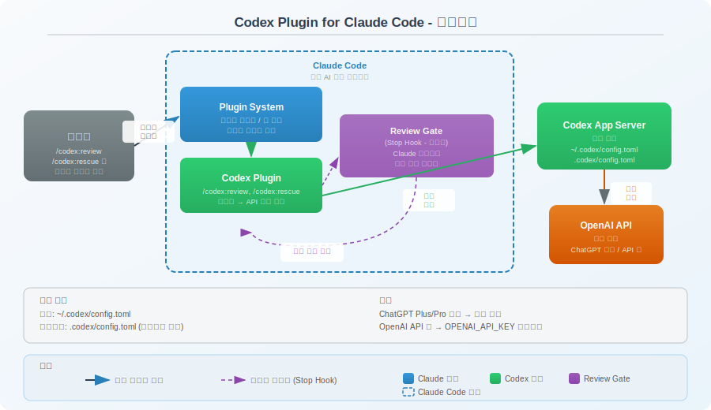
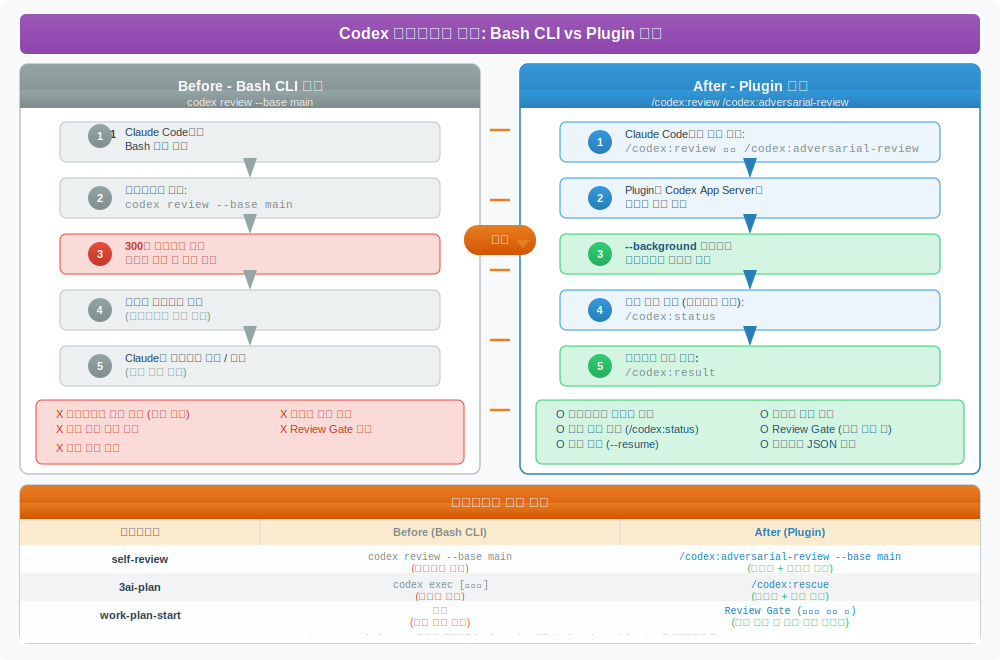

# Codex Plugin for Claude Code

> `[2] 활용` · 선수 지식: 없음

> 한 줄 정의: OpenAI의 Codex를 Claude Code 내에서 네이티브 슬래시 커맨드로 사용할 수 있게 해주는 플러그인이다.

`#CodexPlugin` `#ClaudeCode` `#OpenAI` `#Codex` `#코드리뷰` `#적대적리뷰` `#AdversarialReview` `#ReviewGate` `#크로스리뷰` `#AI협업` `#플러그인` `#슬래시커맨드` `#백그라운드실행` `#작업위임` `#CodeReview` `#MultiAI` `#CLI` `#개발도구` `#자동리뷰` `#품질게이트`

---

## 왜 알아야 하는가?

### 실무 관점
- Claude Code에서 Codex를 Bash로 호출하는 기존 방식은 **타임아웃 제한(300초)**, **백그라운드 실행 불가**, **작업 상태 추적 불가** 등의 한계가 있다
- 플러그인은 이 한계를 해결하며, **적대적 리뷰**(adversarial review)라는 새로운 리뷰 패러다임을 제공한다
- 이미 self-review, review-pr, 3ai-plan 등 여러 워크플로우에서 Codex를 활용 중이라면, 플러그인으로 전환 시 **워크플로우 품질과 효율이 동시에 향상**된다

### 기반 지식 관점
- Multi-AI 협업 패턴(Claude + Codex + Gemini)의 실무 적용을 이해하는 핵심 사례
- AI 도구 간 플러그인/통합 아키텍처를 이해하면 다른 도구 조합에도 응용 가능

### 커스터마이징 관점
- Review Gate(자동 리뷰 훅)를 활용하면 **CI/CD 없이도 코드 작성 시점에 실시간 품질 게이트**를 적용할 수 있다
- `.codex/config.toml`로 모델, 추론 강도를 프로젝트별로 세밀하게 조정 가능

---

## 핵심 개념

### 플러그인 개요

OpenAI 직원이 Apache-2.0 라이선스로 공개한 이 플러그인은 Claude Code의 **플러그인 시스템**을 활용하여 Codex를 네이티브 슬래시 커맨드로 통합한다.

- 별도 런타임 불필요 — 로컬 Codex CLI와 App Server를 그대로 활용
- 기존 인증, 설정, 레포지토리 환경을 유지
- ChatGPT 구독(무료 포함) 또는 OpenAI API 키로 사용 가능
- Node.js 18.18 이상 필요

### 기존 방식 vs 플러그인 방식 비교

| 항목 | 기존 (Bash CLI) | 플러그인 |
|------|-----------------|---------|
| **코드 리뷰** | `codex review --base main` | `/codex:review --base main` |
| **적대적 리뷰** | 불가능 | `/codex:adversarial-review` |
| **작업 위임** | `echo "..." \| codex exec -` | `/codex:rescue 자연어 설명` |
| **백그라운드 실행** | 불가능 (Bash 타임아웃 제한) | `--background` 옵션 |
| **작업 상태 확인** | 불가능 | `/codex:status` |
| **작업 결과 조회** | 불가능 | `/codex:result` |
| **작업 취소** | 불가능 | `/codex:cancel` |
| **작업 재개** | 불가능 | `--resume` 옵션 |
| **자동 리뷰 훅** | 없음 | Review Gate (Stop Hook) |
| **타임아웃** | 300초 (Bash 제한) | 없음 (비동기) |
| **결과 형식** | 텍스트 (수동 파싱) | 구조화된 출력 |

---

## 쉽게 이해하기

> 기존 방식은 **전화로 전문가에게 물어보는 것**과 같다.
> 전화를 걸고(Bash 호출), 5분 안에 답을 들어야 하며(타임아웃), 통화가 끊기면 처음부터 다시 설명해야 한다.
>
> 플러그인 방식은 **같은 사무실에 전문가를 앉혀놓는 것**이다.
> 슬랙 메시지를 보내고(슬래시 커맨드), 다른 일을 하다가(백그라운드), 끝나면 알림을 받고(status/result), 이어서 대화할 수도 있다(resume).
>
> Review Gate는 **옆에 앉은 전문가가 내가 코드를 작성할 때마다 자동으로 어깨너머로 봐주는 것**이다.

### 아키텍처



---

## 상세 설명

### 설치 및 설정

#### 1단계: Codex CLI 설치 (미설치 시)

```bash
npm install -g @openai/codex
```

#### 2단계: Codex 로그인

Claude Code 내에서 `!` 접두사로 실행:

```bash
!codex login
```

ChatGPT 구독(무료 포함) 또는 OpenAI API 키로 인증한다.

#### 3단계: Claude Code에서 플러그인 설치

```
/plugin marketplace add openai/codex-plugin-cc
/plugin install codex@openai-codex
/reload-plugins
```

#### 4단계: 설정 확인

```
/codex:setup
```

정상적으로 설치되면 Codex 버전, 인증 상태, Review Gate 상태가 출력된다.

#### 설정 파일 (.codex/config.toml)

모델과 추론 강도를 커스터마이징할 수 있다.

**전역 설정** (`~/.codex/config.toml`):

```toml
model = "gpt-5.4-mini"
model_reasoning_effort = "xhigh"
```

**프로젝트별 설정** (프로젝트 루트의 `.codex/config.toml`):

```toml
model = "gpt-5.3-codex-spark"
model_reasoning_effort = "medium"
```

프로젝트 설정이 전역 설정보다 우선한다 (신뢰된 프로젝트만 적용).

| 설정 항목 | 값 | 설명 |
|-----------|-----|------|
| `model` | `gpt-5.4-mini`, `gpt-5.3-codex-spark` 등 | 사용할 모델 |
| `model_reasoning_effort` | `low`, `medium`, `high`, `xhigh` | 추론 노력 수준 |
| `openai_base_url` | URL | 커스텀 API 엔드포인트 (선택) |

---

### 슬래시 커맨드 상세

#### `/codex:review` — 표준 코드 리뷰

현재 변경사항에 대한 일반적인 **읽기 전용** 리뷰를 수행한다.

```
/codex:review                    # 미커밋 변경사항 리뷰
/codex:review --base main        # main 브랜치 기준 리뷰
/codex:review --background       # 백그라운드 실행
/codex:review --wait             # 완료까지 대기
```

| 옵션 | 설명 |
|------|------|
| `--base <ref>` | 비교 기준 브랜치/커밋 지정 |
| `--background` | 백그라운드에서 비동기 실행 |
| `--wait` | 결과가 나올 때까지 대기 |

**사용 시기**: 커밋 전 변경사항 검토, 메인 브랜치와 비교하여 브랜치 리뷰

---

#### `/codex:adversarial-review` — 적대적 리뷰

설계 결정에 대해 **의도적으로 도전하는** 조정 가능한 리뷰를 수행한다. 일반 리뷰와 달리 가정, 트레이드오프, 실패 모드를 적극적으로 검증한다.

```
/codex:adversarial-review
/codex:adversarial-review --base main
/codex:adversarial-review --base main challenge whether this was the right caching and retry design
/codex:adversarial-review --background look for race conditions and question the chosen approach
```

**일반 리뷰와의 차이점:**

| 관점 | `/codex:review` | `/codex:adversarial-review` |
|------|-----------------|---------------------------|
| 목적 | 코드 품질 확인 | 설계 결정 압박 테스트 |
| 톤 | 중립적 | 비판적, 도전적 |
| 범위 | 코드 수준 이슈 | 아키텍처, 보안, 롤백, 경쟁 상태 |
| 포커스 | 자동 | 사용자가 자연어로 지정 가능 |

**사용 시기**: 배포 전 방향성 검증, 인증/데이터 손실/롤백/경쟁 상태 같은 위험 영역 검증, 숨겨진 가정 발견

---

#### `/codex:rescue` — 작업 위임

Codex 서브에이전트(`codex:codex-rescue`)를 통해 **작업을 Codex에 위임**한다. 자연어로 작업을 설명할 수 있다.

```
/codex:rescue investigate why the tests started failing
/codex:rescue fix the failing test with the smallest safe patch
/codex:rescue --resume apply the top fix from the last run
/codex:rescue --model spark fix the issue quickly
/codex:rescue --background investigate the regression
/codex:rescue --model gpt-5.4-mini --effort medium investigate the flaky integration test
```

| 옵션 | 설명 |
|------|------|
| `--background` | 백그라운드 실행 |
| `--wait` | 완료 대기 |
| `--resume` | 최신 rescue 스레드 이어서 계속 |
| `--fresh` | 새 작업으로 시작 |
| `--model <모델>` | 특정 모델 지정 (`spark` 입력 시 자동으로 `gpt-5.3-codex-spark` 매핑) |
| `--effort <수준>` | 추론 노력 수준 설정 |

**자연어 위임도 가능:**
```
Ask Codex to redesign the database connection to be more resilient.
```

**사용 시기**: 버그 조사, 수정 시도, 소규모 모델로 빠르고 저비용 처리, 이전 작업 이어서 진행

---

#### `/codex:status` — 작업 상태 확인

현재 저장소의 실행 중/최근 완료된 Codex 작업을 표시한다.

```
/codex:status                    # 전체 작업 상태
/codex:status task-abc123        # 특정 작업 상태
```

---

#### `/codex:result` — 작업 결과 조회

완료된 작업의 최종 출력을 표시한다. Codex 세션 ID도 제공되어 `codex resume <session-id>`로 Codex에서 직접 재개할 수 있다.

```
/codex:result                    # 최신 작업 결과
/codex:result task-abc123        # 특정 작업 결과
```

---

#### `/codex:cancel` — 작업 취소

실행 중인 백그라운드 Codex 작업을 취소한다.

```
/codex:cancel                    # 최신 작업 취소
/codex:cancel task-abc123        # 특정 작업 취소
```

---

#### `/codex:setup` — 설정 및 Review Gate

Codex 설치, 인증 상태를 확인하고, **Review Gate**를 관리한다.

```
/codex:setup                            # 상태 확인
/codex:setup --enable-review-gate       # Review Gate 활성화
/codex:setup --disable-review-gate      # Review Gate 비활성화
```

**Review Gate란?**

Claude Code의 **Stop Hook**을 활용하여, Claude가 응답을 생성할 때마다 Codex가 **자동으로 타겟 리뷰**를 실행하는 기능이다.

| 항목 | 설명 |
|------|------|
| 작동 방식 | Claude 응답 → Stop Hook 트리거 → Codex 리뷰 → 문제 발견 시 중지 |
| 장점 | 코드 작성 시점에 실시간 품질 게이트 |
| 위험 | Claude/Codex 반복 루프로 토큰 소비 급증 |
| 권장 | **능동적 모니터링 가능할 때만** 활성화 |

---

### 기존 Bash CLI 방식과의 상세 비교

#### 코드 리뷰 — Before/After

**Before (Bash CLI):**
```bash
# self-review 커맨드에서 Codex 크로스 리뷰 실행
# Bash timeout: 300000ms 필수 설정
codex review --base {COMPARE_BRANCH}
# → 타임아웃 위험, 실패 시 재시도 불가
```

**After (Plugin):**
```
# 일반 리뷰
/codex:review --base {COMPARE_BRANCH} --wait

# 또는 적대적 리뷰 (더 깊은 분석)
/codex:adversarial-review --base {COMPARE_BRANCH} --wait

# 백그라운드 실행 (에이전트 팀과 진짜 병렬)
/codex:adversarial-review --base {COMPARE_BRANCH} --background
# → 나중에 /codex:status 로 확인, /codex:result 로 수집
```

#### 작업 위임 — Before/After

**Before (Bash CLI):**
```bash
# 3ai-plan에서 Codex에 기술 검증 위임
cat << 'EOF' > /tmp/codex_prompt.txt
{컨텍스트 + 현황 + 기존 플랜}
기술적/구조적 관점에서 플랜을 검토하고 개선안을 제시해주세요.
EOF
cat /tmp/codex_prompt.txt | codex exec - --full-auto
# → 임시 파일 생성 필요, 컨텍스트 유실 위험
```

**After (Plugin):**
```
# 자연어로 바로 위임
/codex:rescue 이 플랜의 기술적 정확성과 데이터 무결성 검증 전략을 검토해줘

# 이어서 추가 분석
/codex:rescue --resume 자동화 가능 구간도 식별해줘
```

#### 장단점 비교

| 관점 | Bash CLI | Plugin |
|------|----------|--------|
| **안정성** | 타임아웃, 파이프 에러 위험 | 비동기로 안정적 |
| **유연성** | 셸 스크립트로 자유로운 조합 | 정해진 커맨드 체계 |
| **통합도** | Claude Code 외부 도구 | Claude Code 네이티브 |
| **상태 관리** | 없음 (fire-and-forget) | 추적/재개/취소 가능 |
| **비용 제어** | 수동 관리 | Review Gate 시 자동 소비 주의 |
| **학습 비용** | `codex` CLI 문법만 알면 됨 | 슬래시 커맨드 + 옵션 학습 필요 |

---

### 기존 워크플로우 적용 방안



#### 1. `/self-review`, `/review-pr`, `/team-review`

**현재 방식** (self-review.md 3-3. Codex 크로스 리뷰):
```bash
codex review --base {COMPARE_BRANCH}
# Bash timeout: 300000ms 필수
```

**플러그인 적용 시:**
```
# 옵션 A: 일반 리뷰 (기존과 동일 수준)
/codex:review --base {COMPARE_BRANCH} --wait

# 옵션 B: 적대적 리뷰 (설계 결정까지 검증) ← 권장
/codex:adversarial-review --base {COMPARE_BRANCH} --wait

# 옵션 C: 백그라운드 (4명 에이전트와 진짜 병렬)
/codex:adversarial-review --base {COMPARE_BRANCH} --background
# → 에이전트 팀 리뷰 완료 후 /codex:result 로 결과 수집
```

**개선 효과:**
- 타임아웃 걱정 없이 대규모 diff도 리뷰 가능
- `--background`로 에이전트 4명과 완전 병렬 실행 (기존엔 Bash 타임아웃 안에서만 가능)
- 적대적 리뷰로 리뷰 깊이 향상

---

#### 2. `/3ai-plan` (3-AI 협업 플랜)

**현재 방식:**
```bash
# Codex에 기술 검증 위임
cat /tmp/codex_prompt.txt | codex exec - --full-auto
```

**플러그인 적용 시:**
```
# 자연어로 기술 검증 위임
/codex:rescue 다음 플랜을 기술적/구조적 관점에서 검토해줘: {플랜 요약}

# 결과 확인
/codex:result

# 추가 분석이 필요하면 이어서
/codex:rescue --resume 자동화 가능 구간과 검증 전략도 식별해줘
```

**개선 효과:**
- 임시 파일 생성/삭제 불필요
- `--resume`으로 대화 맥락 유지하며 심층 분석
- `--background`로 Gemini CLI와 완전 병렬 실행

---

#### 3. `/work-plan-start` (팀 에이전트 워크플로우)

**새로운 가능성 — Review Gate 활용:**

```
Phase 1: 탐색 + 설계
├─ [Explore]  코드베이스 구조 파악
├─ [Plan]     구현 전략 설계
└─ /codex:adversarial-review  ← 플랜에 대한 적대적 검증 (NEW)

Phase 2: 구현
├─ [Main]            코드 수정
├─ [test-generator]  테스트 생성
└─ Review Gate ON (선택적)  ← Claude 코드 작성마다 자동 리뷰 (NEW)

Phase 3: 검증
├─ [code-refactor]   품질 리뷰
├─ [Main]            문서화
└─ /codex:review --background  ← 최종 종합 리뷰 (NEW)
```

**주의**: Phase 2에서 Review Gate는 토큰 소비가 크므로 **핵심 로직 구현 시에만 선택적으로** 활성화한다.

---

### 토큰 비용 분석 및 권장 사용 전략

#### Review Gate 비용 구조

```
Claude 응답 1회 → Codex 리뷰 1회 (자동)
├─ Claude 토큰 소비 (Anthropic)
└─ Codex 토큰 소비 (OpenAI)
    ├─ 입력: Claude 응답 전체를 컨텍스트로 전달
    └─ 출력: 리뷰 결과

문제 발견 시:
Claude 수정 → Codex 재리뷰 → Claude 재수정 → ... (루프 위험)
```

#### 비용 시나리오 비교

| 시나리오 | Codex 호출 횟수 | 비용 등급 |
|----------|----------------|----------|
| `/codex:review` 1회 실행 | 1회 | 낮음 |
| `/codex:adversarial-review` 1회 | 1회 | 낮음 |
| `/codex:rescue` 작업 위임 | 1~3회 | 중간 |
| Review Gate (10분 구현 세션) | 5~15회 | **높음** |
| Review Gate + 문제 발견 루프 | 10~30회+ | **매우 높음** |

#### 단계별 권장 설정

| 워크플로우 단계 | 권장 커맨드 | Review Gate | 이유 |
|----------------|------------|-------------|------|
| **탐색/설계** (Phase 1) | `/codex:rescue` | OFF | 코드 변경 없으므로 리뷰 불필요 |
| **일반 구현** (Phase 2) | 사용 안 함 | OFF | 토큰 대비 효과 낮음 |
| **핵심 로직 구현** (Phase 2) | 사용 안 함 | **ON (선택)** | 보안/인증 등 중요 코드에만 |
| **리뷰/검증** (Phase 3) | `/codex:adversarial-review` | OFF | 1회성 심층 리뷰로 충분 |
| **PR 전 최종 점검** | `/codex:adversarial-review --base main` | OFF | 최종 1회 리뷰 |

#### 비용 절약 팁

1. **`--model spark`** 옵션으로 빠르고 저렴한 모델 사용
   ```
   /codex:rescue --model spark 빠르게 이 버그 원인 조사해줘
   ```

2. **`--effort medium`**으로 추론 강도 낮추기
   ```
   /codex:rescue --effort medium 단순 리팩토링 검토해줘
   ```

3. **Review Gate는 특정 구간에서만** 활성화/비활성화
   ```
   /codex:setup --enable-review-gate    # 핵심 로직 작성 전
   # ... 구현 ...
   /codex:setup --disable-review-gate   # 작성 완료 후
   ```

4. **백그라운드 실행으로 대기 시간 제거**
   ```
   /codex:adversarial-review --background
   # 다른 작업 진행
   /codex:status                         # 나중에 확인
   ```

---

## 트러블슈팅

| 문제 | 원인 | 해결 |
|------|------|------|
| `/codex:review` 실행 안 됨 | 플러그인 미설치 | `/plugin install codex@openai-codex` → `/reload-plugins` |
| `codex not found` | Codex CLI 미설치 | `npm install -g @openai/codex` |
| 인증 에러 | 로그인 안 됨 | `!codex login` 실행 |
| Review Gate 무한 루프 | Codex가 계속 이슈 발견 | `/codex:setup --disable-review-gate` 후 수동 해결 |
| 백그라운드 작업 결과 없음 | 아직 진행 중 | `/codex:status`로 상태 확인 |
| `--resume` 실패 | 이전 세션 만료 | `--fresh` 옵션으로 새 작업 시작 |
| 모델 지정 에러 | 잘못된 모델명 | `gpt-5.4-mini`, `gpt-5.3-codex-spark` 등 정확한 모델명 사용 |
| Node.js 버전 에러 | 18.18 미만 | Node.js 18.18 이상으로 업그레이드 |

---

## 면접 예상 질문

### Q1. "Codex Plugin을 쓰면 기존 Bash CLI 방식과 비교해 어떤 이점이 있나요?"

가장 큰 차이는 **비동기 실행과 상태 관리**다. 기존 Bash 방식은 `codex review`를 호출하면 300초 타임아웃 내에 결과를 받아야 하고, 실패하면 처음부터 다시 시작해야 한다. 플러그인은 `--background`로 비동기 실행하고, `/codex:status`로 상태를 추적하며, `/codex:result`로 결과를 수집할 수 있다. 또한 `--resume`으로 이전 작업을 이어서 진행할 수 있어 컨텍스트 유실이 없다.

두 번째 차이는 **적대적 리뷰**다. 일반 리뷰는 코드 수준의 이슈(네이밍, 중복 등)를 찾지만, 적대적 리뷰는 설계 결정 자체를 도전한다 — 가정이 맞는지, 트레이드오프를 충분히 고려했는지, 실패 모드는 어떤 것이 있는지를 검증한다.

### Q2. "Review Gate는 언제 사용하고 언제 사용하지 않아야 하나요?"

Review Gate는 Claude의 모든 응답에 Codex 리뷰를 트리거하므로 **토큰 소비가 빠르다**. 특히 Codex가 이슈를 발견하면 Claude가 수정하고, 수정된 코드를 Codex가 다시 리뷰하는 루프가 발생할 수 있다.

**사용해야 할 때**: 인증/인가, 결제, 데이터 삭제 같은 **보안 민감 로직**을 작성할 때. 실시간 품질 게이트의 가치가 토큰 비용을 상회한다.

**사용하지 말아야 할 때**: 일반적인 CRUD 구현, 문서 작성, 설정 변경 같은 **저위험 작업**. 이 경우 작업 완료 후 `/codex:review` 1회 실행이 훨씬 효율적이다.

### Q3. "Multi-AI 협업에서 각 AI의 역할은 어떻게 나누나요?"

3AI 패턴에서 각 AI의 강점을 살린 역할 분담이 핵심이다:

| AI | 역할 | 강점 |
|----|------|------|
| Claude | 종합 설계, 맥락 이해, 최종 판단 | 긴 컨텍스트, 프로젝트 규칙 준수 |
| Codex | 기술 정확성, 코드 수준 검증 | 코드베이스 탐색, 적대적 리뷰 |
| Gemini | 표현/톤, 리스크 분석, 창의적 대안 | 사용자 관점, 자연어 품질 |

Codex Plugin은 이 중 Codex의 역할을 **네이티브 통합**으로 강화한다. 기존엔 Bash로 호출하느라 제한적이었던 Codex 활용이, 백그라운드 실행, 적대적 리뷰, 작업 재개 등으로 훨씬 유연해진다.

---

## 연관 문서

| 문서 | 연관성 | 난이도 |
|------|--------|--------|
| [Claude Code StatusLine](./claude-code-statusline.md) | Claude Code 터미널 설정 | [2] 활용 |
| [Claude HUD 설정 가이드](./claude-hud-setup.md) | Claude Code 플러그인 생태계 | [2] 활용 |

---

## 참고 자료

- [Codex Plugin GitHub](https://github.com/openai/codex-plugin-cc) — 소스코드 및 README (Apache-2.0)
- [GeekNews 소개 기사](https://news.hada.io/topic?id=28023) — 한국어 소개
- [Codex CLI 공식 문서](https://github.com/openai/codex) — Codex CLI 설치 및 설정
