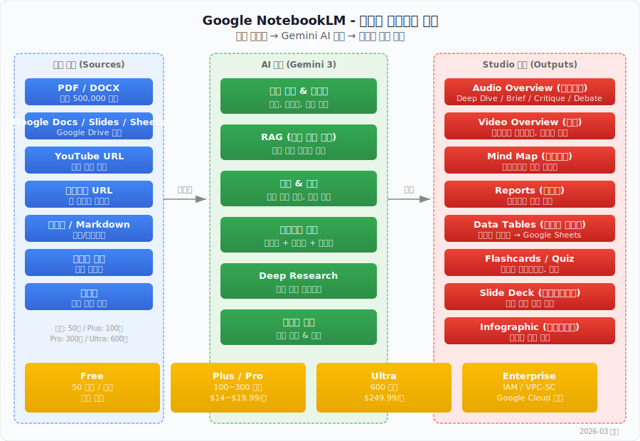

# Google NotebookLM 완전 가이드

> `[2] 입문` · 선수 지식: 없음

> 한 줄 정의: Google이 만든 AI 기반 연구/학습 도구로, 사용자가 업로드한 소스(PDF, 문서, 영상 등)를 Gemini AI가 분석하여 요약, 팟캐스트, 마인드맵, 보고서 등 다양한 형태로 변환해주는 개인 연구 어시스턴트

`#NotebookLM` `#GoogleAI` `#Gemini` `#RAG` `#AudioOverview` `#연구도구` `#학습도구` `#생산성` `#AI도구`

## 왜 알아야 하는가?

- **실무**: 대량의 문서(회의록, 기술 문서, 보고서)를 빠르게 분석하고 핵심을 추출하여 의사결정 속도를 높일 수 있음
- **학습**: 복잡한 기술 문서나 논문을 팟캐스트 형태로 변환하여 이동 중에도 학습할 수 있으며, 퀴즈/플래시카드로 자기 점검 가능
- **기반 지식**: RAG(Retrieval-Augmented Generation), 벡터 검색, 멀티모달 AI 등 현대 AI 시스템의 핵심 패턴을 실제 제품에서 체험할 수 있음

## 핵심 개념

- NotebookLM은 **소스 기반(Source-grounded) AI**로, 업로드한 문서만을 근거로 답변하여 환각(Hallucination)을 최소화
- Gemini 3 모델을 기반으로 텍스트, 이미지, 오디오를 동시에 이해하는 **멀티모달 분석** 지원
- Studio 패널에서 Audio Overview(팟캐스트), Video Overview(영상), Mind Map, Reports, Data Tables 등 **다양한 출력 형식** 생성
- 모든 응답에 **인라인 인용(Inline Citation)**이 포함되어 원본 소스의 해당 부분으로 직접 이동 가능
- 노트북 단위로 소스를 관리하며, 팀 공유 및 IAM 기반 권한 제어 지원

## 쉽게 이해하기

NotebookLM은 **개인 연구 비서**와 같다.

도서관에서 10권의 책을 빌려왔다고 하자. 일반 AI 챗봇은 자기가 알고 있는 지식으로 답하지만, NotebookLM은 **내가 빌려온 그 10권의 책만 읽고 답변**한다. "이 내용은 3번째 책 47페이지에 있습니다"라고 출처까지 알려준다.

더 나아가 이 비서는 10권의 내용을 정리해서 **팟캐스트 대화**(두 명의 AI 진행자가 토론), **마인드맵**, **퀴즈**, **발표 자료**까지 만들어준다. 듣다가 궁금한 게 있으면 중간에 끼어들어 질문할 수도 있다.

```
┌─────────────────────────────────────────────────────────────────────────┐
│                        NotebookLM 핵심 흐름                             │
│                                                                         │
│  ┌──────────┐     ┌──────────────┐     ┌───────────────────────────┐   │
│  │  소스 업로드 │ ──→ │  Gemini AI   │ ──→ │  다양한 출력 형식           │   │
│  │           │     │  분석 엔진     │     │                           │   │
│  │ · PDF     │     │              │     │ · Audio Overview (팟캐스트) │   │
│  │ · Docs    │     │ · 파싱       │     │ · Video Overview (영상)    │   │
│  │ · YouTube │     │ · 임베딩      │     │ · Mind Map (마인드맵)      │   │
│  │ · 웹사이트  │     │ · RAG 검색   │     │ · Reports (보고서)         │   │
│  │ · 텍스트   │     │ · 인용 추적   │     │ · Data Tables (테이블)     │   │
│  │ · 이미지   │     │ · 멀티모달    │     │ · Flashcards / Quiz       │   │
│  └──────────┘     └──────────────┘     └───────────────────────────┘   │
│                                                                         │
│  "내 자료만 근거로 답변" → 환각(Hallucination) 최소화                      │
└─────────────────────────────────────────────────────────────────────────┘
```



## 상세 설명

### 1. NotebookLM이란 무엇인가

NotebookLM은 Google이 개발한 AI 기반 연구 및 학습 도구다. 2023년 처음 공개되었으며, 2025-2026년에 걸쳐 Gemini 3 모델 통합, Enterprise 지원, 다양한 Studio 출력 등 대규모 업데이트를 거쳤다.

**왜 기존 AI 챗봇과 다른가?**

| 항목 | 일반 AI 챗봇 (ChatGPT 등) | NotebookLM |
|------|--------------------------|------------|
| 지식 근거 | 사전 학습 데이터 전체 | **사용자가 업로드한 소스만** |
| 환각 위험 | 높음 (없는 내용을 생성 가능) | 낮음 (소스 기반 응답) |
| 출처 표시 | 제한적 | **인라인 인용** (클릭 시 원본 이동) |
| 출력 형식 | 텍스트 위주 | 팟캐스트, 영상, 마인드맵, 퀴즈 등 |
| 데이터 보안 | 모델 학습에 사용될 수 있음 | **모델 학습에 사용 안 함** |

핵심 URL: [notebooklm.google](https://notebooklm.google/)

### 2. 주요 기능

#### 2-1. Audio Overview (팟캐스트 생성)

NotebookLM의 가장 인기 있는 기능으로, 업로드한 소스를 **두 명의 AI 진행자가 대화하는 팟캐스트 형식**으로 변환한다.

**형식 선택:**

| 형식 | 설명 | 적합한 상황 |
|------|------|------------|
| **Deep Dive** | 두 진행자가 깊이 있게 토론 | 복잡한 주제 심층 학습 |
| **Brief** | 핵심만 간결하게 요약 | 빠른 개요 파악 |
| **Critique** | 소스에 대한 비평/피드백 | 논문이나 보고서 리뷰 |
| **Debate** | 서로 다른 관점에서 토론 | 다양한 시각 이해 |

**커스터마이징 옵션 (2025년 9월 업데이트):**
- **음성 톤** 선택
- **길이** 조절
- **토픽 강조** - 특정 섹션에 집중하도록 지시
- **복잡도 레벨** - 청중 수준에 맞춤 조정
- **80개 이상 언어** 지원

**Interactive Mode:**
팟캐스트 청취 중 "Join" 버튼을 눌러 **마이크로 질문**할 수 있다. AI 진행자들이 대화를 멈추고 질문에 답한 뒤 다시 진행한다.

#### 2-2. Video Overview (영상 생성)

소스를 나레이션이 포함된 **슬라이드 영상**으로 변환한다.

**커스터마이징:**
- **형식**: Explainer(설명형) / Brief(요약형)
- **비주얼 스타일**: Whiteboard, Kawaii, Watercolor, Classic
- **언어 선택**: 다국어 지원
- **초점 지정**: AI가 집중할 주제 설정

#### 2-3. Mind Map (마인드맵)

소스의 주제와 관계를 **인터랙티브 분기 다이어그램**으로 시각화한다. 클릭으로 하위 주제를 탐색하고 새로운 연결 관계를 발견할 수 있다.

#### 2-4. Data Tables (데이터 테이블)

텍스트 기반 소스에서 **구조화된 비교 테이블**을 자동 생성한다. 생성된 테이블은 Google Sheets로 내보낼 수 있다. 예를 들어, 여러 제품 설명서를 업로드하면 기능별 비교표를 자동으로 만들어준다.

#### 2-5. Deep Research (딥 리서치)

**자율 연구 에이전트**로 동작한다. 연구 계획을 수립하고, 수백 개의 품질 높은 소스를 검색하여 인용이 포함된 종합 보고서를 작성한다.

#### 2-6. 대화형 질의응답 (Chat)

소스를 기반으로 자유롭게 질문할 수 있다. 모든 답변에 **인라인 인용**이 포함되어 원본 소스의 해당 위치로 직접 이동 가능하다.

#### 2-7. 기타 Studio 출력

| 출력 형식 | 설명 |
|----------|------|
| **Reports** | 구조화된 보고서 자동 생성 |
| **Flashcards** | 학습용 플래시카드 |
| **Quiz** | 이해도 점검 퀴즈 |
| **Slide Deck** | 프레젠테이션 슬라이드 |
| **Infographic** | 시각적 정보 요약 |
| **Study Guide** | 학습 가이드 |
| **Briefing Doc** | 브리핑 문서 |
| **FAQ** | 자주 묻는 질문 목록 |
| **Timeline** | 시간순 정리 |

### 3. 지원하는 소스 유형

| 소스 유형 | 형식 | 비고 |
|----------|------|------|
| **PDF** | .pdf | 최대 200MB, 500,000 단어 |
| **Word 문서** | .docx | Microsoft Word 호환 |
| **Google Docs** | Google Drive | 사본을 만들어 분석 |
| **Google Slides** | Google Drive | 슬라이드 콘텐츠 추출 |
| **Google Sheets** | Google Drive | 데이터 분석 |
| **텍스트 파일** | .txt, .md | 마크다운 포함 |
| **YouTube URL** | 공개 영상 URL | 자막(CC) 기반 분석, 공개 영상만 |
| **웹사이트 URL** | HTTP/HTTPS | 웹 콘텐츠 크롤링 |
| **이미지** | 각종 이미지 포맷 | 멀티모달 분석 |
| **오디오 파일** | 각종 오디오 포맷 | 음성 콘텐츠 분석 |
| **복사/붙여넣기** | 텍스트 직접 입력 | 간편 입력 |

**소스 제한 (플랜별):**

| 항목 | Free | Plus | Pro | Ultra |
|------|------|------|-----|-------|
| 노트북당 소스 수 | 50개 | 100개 | 300개 | 600개 |
| 소스당 최대 크기 | 500,000 단어 / 200MB | 동일 | 동일 | 확장 |

### 4. NotebookLM 요금제

NotebookLM은 2025년 말 기준 4개 티어(Free, Plus, Pro, Ultra)로 재편되었다.

| 항목 | Free | Plus | Pro | Ultra |
|------|------|------|-----|-------|
| **가격** | 무료 | Workspace $14+/월 | $19.99/월 (Google AI Pro) | $249.99/월 |
| **노트북 수** | 기본 | 5배 | 5배+ | 최대 |
| **소스/노트북** | 50개 | 100개 | 300개 | 600개 |
| **Audio 생성/일** | 제한적 | 5배 | 더 많음 | 최대 |
| **Chat-only 노트북** | X | O | O | O |
| **노트북 분석** | X | O | O | O |
| **고급 채팅 설정** | X | O | O | O |
| **새 기능 조기 접근** | X | O | O | O |

**Plus 가입 방법:**
- Google Workspace Standard($14+/user/month) 이상 플랜에 포함
- 또는 Google One AI Premium 구독

**Pro 가입 방법:**
- Google AI Pro (구 Google One AI Premium) $19.99/month 구독

**Ultra 가입 방법:**
- Google AI Ultra $249.99/month 구독

### 5. 사용 방법

#### Step 1: 시작하기

1. [notebooklm.google](https://notebooklm.google/)에 접속
2. Google 계정으로 로그인
3. "새 노트북 만들기(Create)" 클릭

#### Step 2: 소스 업로드

```
┌──────────────────────────────────────────┐
│  소스 추가 방법                            │
│                                          │
│  1. [파일 업로드]  → PDF, DOCX, TXT       │
│  2. [Google Drive] → Docs, Slides, Sheets │
│  3. [링크 붙여넣기] → YouTube, 웹사이트 URL │
│  4. [텍스트 직접 입력] → 복사/붙여넣기       │
│                                          │
│  ※ 업로드 즉시 자동 요약 + 핵심 주제 추출     │
└──────────────────────────────────────────┘
```

- 소스 업로드 시 NotebookLM이 자동으로 **요약**과 **핵심 주제**를 추출
- 노트북 가이드(Notebook Guide)에서 FAQ, 브리핑 문서, 타임라인 등 즉시 생성 가능

#### Step 3: 질의응답 (Chat)

- 채팅 인터페이스에서 소스에 대해 자유롭게 질문
- 답변의 인라인 인용 번호를 클릭하면 원본 소스의 해당 부분으로 이동
- "노트에 저장(Save to Note)" 버튼으로 유용한 답변을 노트로 저장

#### Step 4: Studio 출력 생성

1. 오른쪽 **Studio 패널** 확인
2. 원하는 출력 형식 선택 (Audio, Video, Mind Map, Report 등)
3. 커스터마이징 옵션 설정 (형식, 언어, 초점 등)
4. 생성 버튼 클릭
5. 같은 노트북에 **여러 개의 출력**을 생성하고 저장 가능

#### Step 5: 노트 관리

- AI 응답, 직접 작성 메모, Studio 출력을 **노트**로 저장
- 노트를 선택하여 새로운 질문의 컨텍스트로 활용
- 소스와 노트를 조합하여 더 정밀한 분석 수행

### 6. 비즈니스/팀 활용 사례

#### 6-1. 팀 지식 허브

모든 팀 문서(회의록, 기술 문서, 온보딩 자료)를 하나의 노트북에 업로드하고 공유하면, 신규 팀원이 스스로 질문하며 학습할 수 있는 **셀프서비스 지식 허브**가 된다.

> 사례: Sonata Design은 제품/공급자 관련 문의 응답 시간을 대폭 단축

#### 6-2. 프로젝트 관리

회의 트랜스크립트, 상태 보고서, 이메일을 업로드한 뒤 "이번 주 액션 아이템은?" 또는 "지연 중인 항목은?"이라고 질문하면 프로젝트 현황을 즉시 파악할 수 있다.

#### 6-3. 영업/경쟁 분석

제품 문서, 고객 성공 사례, 경쟁사 분석 자료를 업로드하고 **배틀 카드(Battle Card)**나 영업 전략을 자동 생성하여 일관된 영업 활동을 지원한다.

#### 6-4. 연구/전략 기획

시장 조사 보고서, 논문, 업계 동향을 업로드한 뒤 Audio Overview로 변환하면, 팀 전체가 동일한 이해 수준을 유지하면서 회의 준비 시간을 절약할 수 있다.

#### 6-5. 교육/학습

> 사례: Google Classroom에서 직접 NotebookLM 노트북을 생성할 수 있게 되었다 (2025년 8월).

- 강의 자료를 업로드하고 퀴즈/플래시카드 자동 생성
- 학생들이 자기 주도적으로 질문하며 학습
- 교사가 자료의 Audio Overview를 생성하여 복습용 팟캐스트 제공

#### 6-6. 실제 사용 기업

| 기업 | 활용 방식 |
|------|----------|
| **Rivian** (EV 제조사) | 기술 문서 → 크리에이티브 기획으로 전환 시간 단축 |
| **Sonata Design** | 제품/공급자 문의 대응 데이터베이스 구축 |

### 7. Enterprise 및 보안 기능

#### NotebookLM Enterprise

Google Cloud 기반의 엔터프라이즈 솔루션으로, 대규모 조직에 적합하다.

| 기능 | 설명 |
|------|------|
| **IAM 기반 권한 관리** | Owner / Editor / Viewer / Chat-only 역할 분리 |
| **VPC-SC (VPC Service Controls)** | 데이터 유출 방지 경계 설정 |
| **데이터 레지던시** | US, EU, Global 멀티 리전 지원 |
| **감사 로그** | 전체 활동 감사 추적 |
| **데이터 보호** | 사용자 데이터는 모델 학습에 사용되지 않음 |
| **3rd-party IdP** | Active Directory, Okta 등 외부 인증 연동 |
| **사용량 확장** | 5배 이상 높은 사용 한도 |

**왜 Enterprise를 선택하는가?**

법률, 금융, 의료 등 민감한 데이터를 다루는 조직에서는 데이터가 모델 학습에 사용되지 않고, VPC-SC로 데이터 유출을 방지하며, IAM으로 접근 권한을 세밀하게 제어해야 한다.

#### Workspace 통합

2025년 2월부터 NotebookLM과 NotebookLM Plus가 **Google Workspace 핵심 서비스**로 포함되었다. Business 및 Enterprise 고객은 별도 설정 없이 바로 사용할 수 있으며, 엔터프라이즈 수준의 데이터 보호가 적용된다.

### 8. NotebookLM API

#### 현재 API 상태

NotebookLM은 직접적인 공개 REST API를 제공하지는 않지만, 관련 API 접근 방식이 여러 가지 존재한다.

**1) Gemini File Search API (핵심)**

NotebookLM의 핵심 엔진인 RAG 기능을 **Gemini API의 File Search Tool**로 사용할 수 있다. 이는 사실상 "NotebookLM의 두뇌"를 API로 노출한 것이다.

| 항목 | 내용 |
|------|------|
| API 형태 | `generateContent` API 내 File Search Tool |
| 기능 | 파일 저장, 최적 청킹, 임베딩, 검색 증강 응답 |
| 인용 | 자동 인용(Citation) 포함 |
| 비용 | 저장 및 쿼리 시 임베딩 무료, 인덱싱 $0.15/1M 토큰 |
| 문서 | [Gemini API File Search](https://ai.google.dev/gemini-api/docs) |

**2) NotebookLM Enterprise API**

Google Cloud의 NotebookLM Enterprise는 **프로그래밍 방식의 노트북 관리 API**를 제공한다.

- 노트북 생성/관리
- 소스 추가 (Google Docs, Slides, 텍스트, 웹, YouTube)
- 배치 소스 추가
- IAM 기반 접근 제어

```
# Enterprise API 엔드포인트 예시
POST /v1/notebooks              # 노트북 생성
POST /v1/notebooks/{id}/sources # 소스 추가
GET  /v1/notebooks/{id}         # 노트북 조회
```

**3) Gemini Deep Research API (Interactions API)**

자율 연구 에이전트 기능을 앱에 임베드할 수 있는 API다.

**4) MCP 통합**

NotebookLM Enterprise를 Gemini CLI, Google Antigravity 등 MCP 호환 에이전트와 연동할 수 있다.

### 9. 2025-2026년 주요 업데이트 타임라인

| 시기 | 업데이트 | 핵심 내용 |
|------|---------|----------|
| **2025년 2월** | Workspace 핵심 서비스 편입 | NotebookLM/Plus가 Workspace Business/Enterprise 핵심 서비스로 포함 |
| **2025년 3월** | 새 기능 추가 | 출력 언어 선택기, 인터랙티브 마인드맵, Deep Research |
| **2025년 8월** | 교육 사용자 확대 | 모든 교육 기관 사용자에게 NotebookLM 제공, Google Classroom 연동 |
| **2025년 9월** | Audio 대규모 업데이트 | 80개+ 언어 지원, 4가지 형식(Deep Dive/Brief/Critique/Debate), 음성 톤 커스터마이징 |
| **2025년 12월** | Gemini 3 + Data Tables | Gemini 3 모델 전환, Data Tables 출력 추가, AI Ultra for Business 연동 |
| **2026년 초** | Video Overview + Studio 강화 | Video Overview 출시, Studio 4타일 UI, 동일 타입 다중 출력, 인터랙티브 오디오 Join 기능 |
| **2026년 2월** | Enterprise 리전 확대 | Global, EU, US 멀티리전 지원 |

## 트레이드오프

| 장점 | 단점 |
|------|------|
| 소스 기반 답변으로 환각 최소화 | 소스에 없는 내용은 답변 불가 |
| 팟캐스트, 영상 등 다양한 출력 형식 | 오프라인 사용 불가 (인터넷 필수) |
| 무료 플랜으로도 기본 기능 사용 가능 | Gemini 모델만 사용 가능 (모델 선택 불가) |
| 데이터가 모델 학습에 사용되지 않음 | Google 생태계 외부 도구(Notion, Obsidian 등)와 직접 연동 불가 |
| Enterprise 급 보안(VPC-SC, IAM) | 소스 수 제한 (무료 50개) |
| 인라인 인용으로 출처 추적 용이 | Ultra 플랜 가격이 높음 ($249.99/월) |
| Google Workspace와 자연스러운 통합 | API가 완전 공개되지 않음 (Enterprise 한정) |

## 제한 사항 및 주의점

### 소스 관련 제한

- **소스 수**: 플랜별 50~600개 제한
- **소스 크기**: 파일당 최대 500,000 단어 또는 200MB
- **YouTube**: 공개 영상 + 자막(CC)이 있는 영상만 지원, 텍스트 트랜스크립트만 가져옴
- **Google Drive**: 원본이 아닌 사본을 만들어 분석 (원본 변경 없음)

### 플랫폼 제한

- **오프라인 모드 없음**: 인터넷 연결 필수
- **모델 고정**: Gemini 모델만 사용, 외부 LLM이나 자체 API 키 사용 불가
- **Google 생태계**: Apple Notes, Obsidian, Notion 등 외부 도구의 데이터는 직접 가져오기 불가 (수동 내보내기/업로드 필요)

### 보안 관련 주의

- 민감한 개인정보나 기밀 문서 업로드 시, 사용 중인 플랜의 데이터 정책 확인 필요
- Enterprise 플랜이 아닌 경우 VPC-SC, IAM 등 고급 보안 기능 미지원
- 공유 노트북의 접근 권한 관리에 주의

## 면접 예상 질문

- Q: NotebookLM이 일반 AI 챗봇과 다른 핵심 차이점은?
  - A: NotebookLM은 **소스 기반(Source-grounded) AI**로, 사용자가 업로드한 문서만을 근거로 답변한다. 일반 챗봇은 사전 학습 데이터 전체에서 답변하므로 환각(Hallucination) 위험이 높지만, NotebookLM은 소스에 없는 내용은 답변하지 않으며 모든 응답에 인라인 인용을 포함한다. 이는 내부적으로 **RAG(Retrieval-Augmented Generation)** 아키텍처를 사용하기 때문이다.

- Q: RAG(Retrieval-Augmented Generation)란 무엇이고 NotebookLM에서 어떻게 적용되는가?
  - A: RAG는 LLM이 답변을 생성하기 전에 관련 문서를 검색하여 컨텍스트로 주입하는 방식이다. NotebookLM에서는 업로드된 소스를 청킹(Chunking)하고 벡터 임베딩으로 인덱싱한 뒤, 질문이 들어오면 유사한 청크를 검색하여 Gemini 모델의 프롬프트에 포함시킨다. 이를 통해 소스에 근거한 정확한 답변과 인용 생성이 가능하다.

- Q: NotebookLM의 Enterprise 보안 기능에는 어떤 것들이 있는가?
  - A: VPC Service Controls로 데이터 유출 방지 경계를 설정하고, IAM으로 Owner/Editor/Viewer/Chat-only 역할을 분리하며, Active Directory나 Okta 같은 3rd-party IdP 연동을 지원한다. 또한 데이터 레지던시(US/EU/Global)를 선택할 수 있고, 사용자 데이터가 모델 학습에 사용되지 않는다는 보장이 있다.

## 연관 문서

| 문서 | 연관성 | 난이도 |
|------|--------|--------|
| [Google Gemini API](https://ai.google.dev/gemini-api/docs) | NotebookLM의 기반 엔진 | Intermediate |
| [NotebookLM Enterprise 문서](https://docs.google.com/gemini/enterprise/notebooklm-enterprise) | Enterprise API 및 관리 | Advanced |

## 참고 자료

- [Google NotebookLM 공식 사이트](https://notebooklm.google/)
- [NotebookLM 공식 도움말](https://support.google.com/notebooklm/)
- [Google Workspace Updates - NotebookLM](https://workspaceupdates.googleblog.com/2025/02/notebooklm-and-notebooklm-plus-now-workspace-core-service.html)
- [Google Workspace Updates - 새 기능 (2025년 3월)](https://workspaceupdates.googleblog.com/2025/03/new-features-available-in-notebooklm.html)
- [Google Workspace Updates - Data Tables (2025년 12월)](https://workspaceupdates.googleblog.com/2025/12/transform-sources-structured-data-tables-notebooklm.html)
- [Google Workspace Updates - AI Ultra for Business (2025년 12월)](https://workspaceupdates.googleblog.com/2025/12/google-ai-ultra-business-enhanced-notebooklm.html)
- [NotebookLM Audio Overview 커스터마이징 - TechCrunch](https://techcrunch.com/2025/09/03/googles-notebooklm-now-lets-you-customize-the-tone-of-its-ai-podcasts/)
- [NotebookLM Video Overview 출시 - Google Blog](https://blog.google/innovation-and-ai/models-and-research/google-labs/notebooklm-video-overviews-studio-upgrades/)
- [NotebookLM Gemini 3 전환 - 9to5Google](https://9to5google.com/2025/12/19/notebooklm-gemini-3-data-tables/)
- [NotebookLM Deep Research 추가 - Google Blog](https://blog.google/innovation-and-ai/models-and-research/google-labs/notebooklm-deep-research-file-types/)
- [Gemini File Search API - Google Blog](https://blog.google/innovation-and-ai/technology/developers-tools/file-search-gemini-api/)
- [NotebookLM Enterprise API 문서](https://docs.google.com/gemini/enterprise/notebooklm-enterprise/docs/api-notebooks)
- [NotebookLM MCP 통합 - Medium](https://medium.com/google-cloud/integrate-notebooklm-with-gemini-cli-google-antigravity-or-other-agents-with-mcp-cd83b575dc39)
- [NotebookLM Wikipedia](https://en.wikipedia.org/wiki/NotebookLM)
- [NotebookLM 비즈니스 활용 - Google Blog](https://blog.google/innovation-and-ai/models-and-research/google-labs/notebooklm-business-tips/)
- [NotebookLM for Education](https://workspaceupdates.googleblog.com/2025/08/notebooklm-is-now-available-to-all.html)
- [NotebookLM 요금제 비교](https://notebooklm.google/plans)
