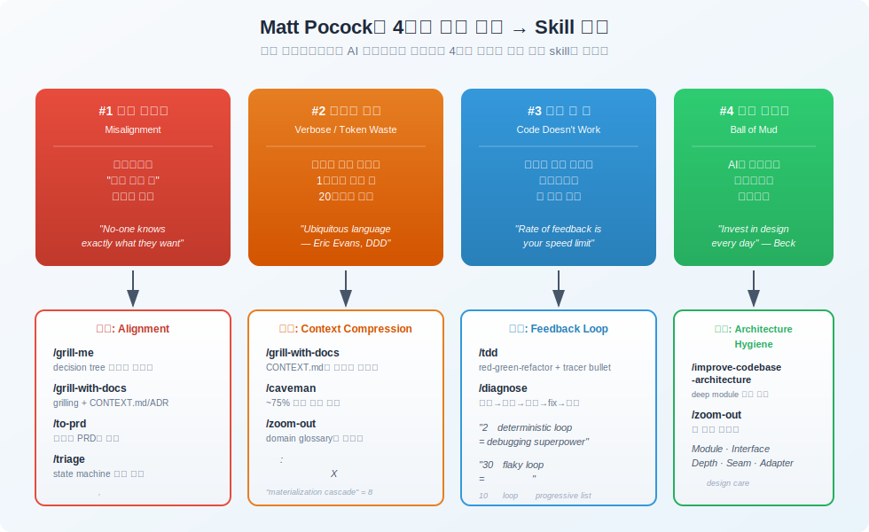
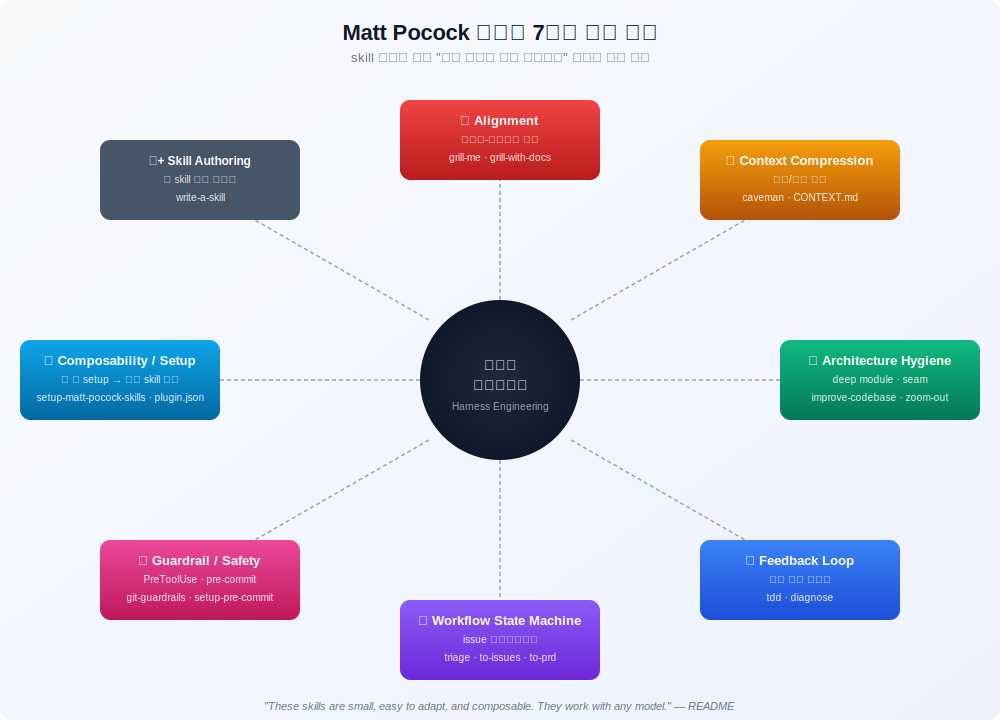

# Matt Pocock의 Skills For Real Engineers — 하네스 엔지니어링 분석 가이드

> `[2] 활용` · 선수 지식: [Codex Plugin for Claude Code](./codex-plugin-claude-code.md) (Claude Code 플러그인 시스템 이해)

> 한 줄 정의: TypeScript 교육자 Matt Pocock이 본인의 `.claude` 디렉토리에서 추출한 12개 엔지니어링 skill 모음을, **모델 자체가 아닌 모델을 둘러싼 실행 환경(harness)을 어떻게 설계하느냐**의 관점에서 패턴별로 해부한 가이드.

`#하네스엔지니어링` `#HarnessEngineering` `#ClaudeCode` `#ClaudeSkills` `#스킬` `#Skills` `#MattPocock` `#얼라인먼트` `#Alignment` `#그릴링` `#Grilling` `#피드백루프` `#FeedbackLoop` `#TDD` `#진단루프` `#Diagnose` `#UbiquitousLanguage` `#도메인언어` `#ContextCompression` `#ArchitectureHygiene` `#DeepModule` `#Seam` `#Adapter` `#StateMachine` `#Triage` `#Guardrail` `#PreToolUseHook` `#Composability` `#SetupSkill` `#PluginManifest` `#ADR` `#VerticalSlice` `#TracerBullet` `#AgentBrief`

> 원본 저장소: [github.com/mattpocock/skills](https://github.com/mattpocock/skills)

---

## 왜 알아야 하는가?

### 실무 관점
- AI 코딩 도구의 출력 품질은 **모델 성능보다 하네스 설계에 더 크게 좌우**된다. 같은 Claude Sonnet 4.5라도 grilling/CONTEXT.md/TDD/ADR이 깔린 환경에서는 결과물이 완전히 달라진다.
- Matt Pocock은 "vibe coding이 아닌 real engineering"을 표방하며, GSD/BMAD/Spec-Kit처럼 **프로세스를 통째로 가져가는 방식의 한계**를 지적하고, 작고 조립 가능한(composable) skill 단위로 통제권을 사용자에게 돌려주는 철학을 코드로 보여준다.
- 우리 `.claude/skills/`도 같은 방향으로 진화할 수 있다. 이 저장소는 **무엇을 차용하고 무엇을 버릴지**의 레퍼런스로 매우 유용하다.

### 기반 지식 관점
- 도메인 주도 설계(DDD)의 **Ubiquitous Language**, Ousterhout의 **A Philosophy of Software Design**의 **Deep Module**, Beck의 **TDD**, 그리고 **ADR(Architecture Decision Record)** 같은 클래식한 엔지니어링 프랙티스가 AI 시대에 어떻게 재해석되는지 보여주는 살아있는 사례.
- "프롬프트 엔지니어링"이 아닌 **"하네스 엔지니어링"** 이라는 시각으로 LLM 활용을 설계하는 사고 전환 — 모델 호출 한 번이 아니라, 그 호출을 둘러싼 컨텍스트·도구·피드백 루프 전체를 시스템으로 보는 관점.

### 커스터마이징 관점
- 우리 저장소의 `work-plan`, `work-plan-start`, `qa-scenario`, `self-review`, `team-review` 등은 이미 비슷한 방향으로 진화 중이다. Matt의 패턴을 흡수하면 **중복 정의되는 도메인 용어 정리(CONTEXT.md), 진단 루프 표준화, AGENT-BRIEF 양식 도입**이 자연스럽게 따라온다.
- 특히 ADR 0001의 **Hard vs Soft Dependency 분리**는 우리 skill들이 서로 어떤 사전 조건을 요구하는지 정리하는 데 그대로 쓸 수 있다.

---

## 핵심 개념

### "하네스 엔지니어링"이란?

LLM 자체는 stateless한 함수에 가깝다. 같은 모델이라도 **무엇을 입력으로 주느냐, 어떤 도구를 쥐어주느냐, 결과를 어떻게 검증하느냐**에 따라 출력 품질이 10배씩 차이 난다. 이 "모델을 둘러싼 실행 환경 전체"를 흔히 **harness** 라고 부른다.

| 구분 | 프롬프트 엔지니어링 | 하네스 엔지니어링 |
|------|-------------------|------------------|
| **단위** | 한 번의 메시지 | 세션·반복·시스템 |
| **관심사** | 단어 선택, 예시, 포맷 | 컨텍스트 누적, 도구 권한, 피드백 루프, 워크플로우 상태 |
| **산출물** | 좋은 프롬프트 문자열 | skills · hooks · ADR · CONTEXT.md · plugin.json |
| **실패 모드 대응** | 다시 물어보기 | 시스템적으로 같은 실패를 반복하지 않게 인프라화 |

Matt Pocock의 저장소는 **두 번째 영역(하네스)을 어떻게 코드와 마크다운으로 박제하는가**의 레퍼런스다.

### 4가지 실패 모드와 매핑

저장소의 README는 본인이 Claude Code/Codex를 쓰면서 반복적으로 마주친 4가지 실패 모드를 정의하고, 각각을 막는 skill을 1:1 또는 1:N으로 매핑한다.



| # | 실패 모드 | 근본 원인 | 대응 skill | 핵심 원리 |
|---|----------|---------|----------|---------|
| 1 | 의도 불일치 | 사용자도 자기가 뭘 원하는지 정확히 모름 | `/grill-me`, `/grill-with-docs` | 결정 트리 끝까지 인터뷰. 권장 답안 제시하며 사용자 override |
| 2 | 장황한 응답 | 도메인 용어 부재로 1단어로 끝낼 걸 20단어로 설명 | `/grill-with-docs`, `/caveman` | CONTEXT.md에 ubiquitous language 누적, caveman 모드로 filler 제거 |
| 3 | 동작 안 함 | 검증 신호 없이 코딩 → 눈 감고 운전 | `/tdd`, `/diagnose` | red-green-refactor + 재현→가설→계측→fix→회귀 |
| 4 | 진흙 덩어리 | AI가 가속하는 소프트웨어 엔트로피 | `/improve-codebase-architecture`, `/zoom-out`, `/to-prd` | deep module · seam · adapter 어휘로 매일 design care |

### 저장소 메타 구조

```
mattpocock/skills/
├── .claude-plugin/plugin.json    # Claude Code 플러그인 manifest (skill 12개 등록)
├── CLAUDE.md                     # 저장소 헌법: bucket 구조, README/plugin.json 동기화 규칙
├── CONTEXT.md                    # ubiquitous language (Issue tracker, Triage role 등)
├── README.md                     # 4가지 실패 모드 + skill reference
├── docs/adr/
│   └── 0001-explicit-setup-pointer-only-for-hard-dependencies.md
└── skills/
    ├── engineering/    # 일상 코딩 (9개)
    ├── productivity/   # 비-코드 워크플로우 (3개)
    ├── misc/           # 가끔 쓰는 도구 (3개)
    ├── personal/       # 본인 setup 의존, 비공개 (excluded)
    └── deprecated/     # 더 이상 사용 안 함 (excluded)
```

**bucket별 README 동기화 규칙** (CLAUDE.md):
- `engineering/`, `productivity/`, `misc/` 의 모든 skill은 **반드시** 최상단 `README.md`와 `plugin.json` 모두에 등록
- `personal/`, `deprecated/`는 절대 노출 X
- bucket README가 자체 목차 보유

---

## 쉽게 이해하기

> 일반 프롬프트 사용은 **택배 기사한테 전화 한 통으로 "그 거 갖다줘"라고 하는 것**이다.
> 운이 좋으면 맞는 게 오고, 운이 나쁘면 엉뚱한 박스가 도착한다.
>
> Matt Pocock의 skill 모음은 **택배 회사 자체를 세팅하는 것**에 가깝다.
> - 출발 전에 받는 사람과 화상 미팅(`grill-me`)
> - 두 사람만 아는 줄임말 사전 비치(`CONTEXT.md`)
> - 트럭마다 GPS 추적(`tdd` 피드백 루프)
> - 위험 도로엔 차단봉 설치(`git-guardrails`)
> - 매일 노선 점검(`improve-codebase-architecture`)
> - 지점장이 한 번만 바꿔주면 모든 트럭이 따라가는 표준(`setup-matt-pocock-skills`)
>
> 한 번 인프라가 깔리면, 매번 똑같은 실수를 다시 설명하지 않아도 된다.

### 7가지 횡단 패턴

12개 skill을 1:1로 외우는 대신, **"어떤 종류의 문제를 푸는 도구인가"** 로 묶으면 7가지 패턴으로 압축된다. 각 skill은 보통 2~3개 패턴을 동시에 만족한다.



---

## 상세 설명

### 패턴 ① Alignment — 사용자-에이전트 정합

**문제**: 에이전트는 사용자가 원하는 걸 정확히 모르고, 사용자도 자기가 원하는 걸 정확히 모른다.

**해결**: 결정 트리를 따라 끝까지 인터뷰한다. 한 번에 한 질문, 권장 답안을 함께 제시한다.

#### `/grill-me`
- 가장 짧은 skill 중 하나. 본문은 거의 한 문단.
- 핵심 프롬프트:
  > "Interview me relentlessly about every aspect of this plan until we reach a shared understanding. Walk down each branch of the design tree, resolving dependencies between decisions one-by-one. **For each question, provide your recommended answer.**"
- 비-코드 영역에도 사용 가능 (글쓰기, 사업 결정 등).

#### `/grill-with-docs`
- `/grill-me` + **도메인 문서 자동 갱신**.
- 인터뷰 도중 새로운 용어가 나오면 → 사용자에게 "이건 ubiquitous language에 등록할까요?" 묻고 → `CONTEXT.md`에 추가.
- 비가역적이고 놀라운 결정이 나오면 → ADR 작성 제안 → `docs/adr/0042-...md`에 1~3문단으로 기록.
- **Single-context** 프로젝트: `/CONTEXT.md` + `/docs/adr/`
- **Multi-context** 프로젝트: `/CONTEXT-MAP.md` + per-context `CONTEXT.md` + `src/{context}/docs/adr/`

#### `/triage`, `/to-prd`도 같은 패턴
`/triage`는 issue를 state machine 한 칸씩 옮기면서 필요시 grilling. `/to-prd`는 인터뷰 없이 **이미 나눈 대화를 PRD로 합성** (다른 패턴에 비해 미니멀).

---

### 패턴 ② Context Compression — 토큰/단어 절약

**문제**: 매 세션마다 같은 도메인 개념을 20단어로 다시 설명한다.

**해결**: 한 번 정의해서 박제한다(`CONTEXT.md`). 또는 응답 자체를 짧게 만든다(`caveman`).

#### `CONTEXT.md`로서의 Ubiquitous Language

`grill-with-docs/CONTEXT-FORMAT.md`가 정의하는 양식:

```markdown
# Project Name

## Language

**Order**: A purchase request submitted by a customer. Once submitted,
it produces one or more **Invoices**.
_Avoid_: purchase, transaction

**Invoice**: A billing document linked to an Order.
_Avoid_: bill, receipt

## Relationships
- An **Order** produces one or more **Invoices**

## Flagged ambiguities
- "account" was used for both Customer and User. Resolved: account = Customer.
```

규칙:
- **이 프로젝트 고유 용어만**. timeout, retry 같은 일반 프로그래밍 용어는 제외.
- `_Avoid_:` 로 deprecated synonyms를 명시 → 에이전트가 잘못된 이름을 쓰지 않게.
- 모호함이 있었던 용어는 `Flagged ambiguities`에 결정 이력을 남김.

> "There's a problem when a lesson inside a section of a course is made 'real' (i.e. given a spot in the file system)" → 31단어
>
> "There's a problem with the materialization cascade" → 8단어
>
> 매 세션·매 응답마다 누적되는 절약. — README #2

#### `/caveman`
- 약 75% 토큰 절약 모드.
- Drop: articles(a/an/the), filler(just/really/basically), pleasantries(sure/of course), hedging.
- Keep: 기술 용어, 코드 블록, 에러 메시지(원본 그대로).
- Pattern: `[thing] [action] [reason]. [next step].`
- 한 번 ON 하면 사용자가 "stop caveman" 할 때까지 **persistent**.
- **Auto-clarity exception**: 보안 경고/비가역 액션/멀티스텝 시퀀스에서는 일시적으로 해제.

---

### 패턴 ③ Architecture Hygiene — 매일 design care

**문제**: AI는 코딩을 가속하므로, 함께 **소프트웨어 엔트로피도 가속**한다.

**해결**: 정확한 어휘로 코드 구조를 매일 다듬는다.

#### `/improve-codebase-architecture` 의 공유 어휘

`improve-codebase-architecture/LANGUAGE.md`는 6개 용어를 엄격히 정의한다. drift 금지:

| 용어 | 정의 |
|------|------|
| **Module** | Interface + Implementation을 가진 것. 함수/클래스/패키지/slice 모두 포함 (scale-agnostic) |
| **Interface** | Caller가 알아야 할 모든 것 (signature + invariants + error modes + ordering + perf) |
| **Depth** | Interface 당 behavior leverage. Small interface + deep impl = **deep module** |
| **Seam** | Behavior를 in-place로 alter하지 않고 바꿀 수 있는 곳. Module의 interface가 사는 위치 |
| **Adapter** | Seam에서 interface를 satisfy하는 concrete thing. Role을 기술 (substance 아님) |
| **Leverage / Locality** | Caller 관점 capability / Maintainer 관점 변경 집중도 |

#### 진단 도구: 3가지 원칙

1. **Deletion test**: "이 모듈을 지우면 복잡도가 사라지나?"
   - YES → shallow / pass-through (제거 후보)
   - NO → 여러 caller에 복잡도가 다시 퍼짐 → deep module (가치 있음)

2. **Interface is test surface**: caller와 test가 같은 seam을 건넌다. 그 안쪽을 test하고 싶어진다면 모듈 모양이 잘못된 것.

3. **One adapter = hypothetical seam, two adapters = real seam**: 적어도 2개의 adapter가 있어야만 seam을 도입한다. 미래의 가상 어댑터 때문에 인터페이스를 자르지 않는다.

> "Don't introduce a seam unless something actually varies across it." — `LANGUAGE.md`

#### Dependency Categories (`DEEPENING.md`)

deep module로 바꿀 때 의존성이 in-process냐 외부냐에 따라 전략이 다르다:

| 카테고리 | 예시 | 전략 |
|---------|------|------|
| In-process | 순수 계산 | 직접 merge & test |
| Local-substitutable | PGLite, in-memory FS | test stand-in 보유 → deepenable |
| Remote but owned | 자사 서비스 | Ports & Adapters (HTTP prod, in-memory test) |
| True external | Stripe, Twilio | mock adapter 필수 |

#### `/zoom-out`
가장 짧은 skill (사실상 한 문장 프롬프트):
> "I don't know this area of code well. Go up a layer of abstraction. Give me a map of all the relevant modules and callers, **using the project's domain glossary vocabulary**."

`disable-model-invocation: true` — 즉, 단순 명령어로만 동작하고 별도 추론을 하지 않는 패턴.

---

### 패턴 ④ Feedback Loop — 검증 신호 인프라

**문제**: 에이전트가 자기 코드가 동작하는지 모른 채 keep going.

**해결**: 빠르고 결정적인 pass/fail 신호를 먼저 만든다. 이게 모든 디버깅·TDD의 전제다.

#### `/diagnose` Phase 1의 명제

> "**This is the skill. Everything else is mechanical.** If you have a fast, deterministic, agent-runnable pass/fail signal for the bug, you will find the cause." — `diagnose/SKILL.md`

루프 품질 우선순위 (10단계, progressive):

1. Failing test (가장 이상적)
2. Curl/HTTP 스크립트
3. CLI + snapshot diff
4. Headless browser
5. Replay captured trace
6. Throwaway harness
7. Property/fuzz loop
8. Bisection harness
9. Differential loop
10. **HITL bash script** (사람이 한 단계씩 confirm)

> "A 30-second flaky loop is barely better than no loop. A 2-second deterministic loop is a debugging superpower."

5단계 진단 phase:

```
Phase 1. 재현 (deterministic loop 만들기)
Phase 2. 최소화 (failing input 줄이기)
Phase 3. 가설 3~5개 ranked + 사용자 승인
Phase 4. 계측 (한 번에 한 변수만)
Phase 5. fix + 회귀 테스트 (단, correct seam이 있을 때만)
```

#### `/tdd` 의 Tracer Bullet 패턴

**Anti-Pattern: Horizontal Slicing**
```
WRONG: RED(test1~5) → GREEN(impl1~5)   ← imagined behavior
RIGHT: RED→GREEN(t1→i1) → RED→GREEN(t2→i2) → ...   ← tracer bullets
```

가로로 자르면 "모양"만 맞고 실제 행동에 둔감해진다. **vertical slice (한 test + 한 impl)** 가 한 단위다.

좋은 테스트 vs 나쁜 테스트:

| 특성 | Good | Bad |
|------|------|-----|
| 스타일 | integration-style (real interfaces) | implementation 디테일에 coupled |
| 모킹 | system boundaries만 | internal collaborator까지 |
| 이름 | what (행동) | how (구현) |
| 리팩터 생존 | behavior 유지되면 통과 | interface 바뀌면 다 깨짐 |

> "Tests should verify behavior through public interfaces, not implementation details. Code can change entirely; tests shouldn't." — `tdd/SKILL.md`

---

### 패턴 ⑤ Workflow State Machine — Issue 라이프사이클

**문제**: issue가 어디까지 진행됐는지 라벨만 봐서는 모른다.

**해결**: canonical state machine을 정의하고, 모든 issue는 정확히 1 category + 1 state.

#### `/triage` 의 5가지 state role + 2가지 category role

| 종류 | role | 의미 |
|------|------|------|
| Category | `bug` | 동작 안 함 |
| Category | `enhancement` | 새 기능 / 개선 |
| State | `needs-triage` | 분류 대기 |
| State | `needs-info` | 정보 부족 → 사용자 답변 대기 |
| State | `ready-for-agent` | AGENT-BRIEF 작성됨, AFK 가능 |
| State | `ready-for-human` | 사람의 design 결정 필요 |
| State | `wontfix` | 거절. 이유는 `.out-of-scope/{concept}.md` |

`setup-matt-pocock-skills`가 이 canonical role을 **프로젝트 실제 라벨 문자열로 매핑**한다 (`docs/agents/triage-labels.md`).

#### AGENT-BRIEF Format — durability over precision

issue가 `ready-for-agent`로 넘어갈 때, 본문 또는 코멘트에 다음 양식을 추가:

```markdown
## Agent Brief
**Category**: bug / enhancement
**Summary**: one-liner

**Current behavior**: (지금 깨진 상태 / status quo)
**Desired behavior**: (구체적으로, edge case 포함)

**Key interfaces**: (바뀌어야 할 type, function signature)
**Acceptance criteria**: (테스트 가능한 체크리스트)
**Out of scope**: (건드리지 말아야 할 것)
```

> "**Don't** reference file paths — they go stale. **Do** describe interfaces, types, and behavioral contracts." — `triage/AGENT-BRIEF.md`

파일 경로/줄 번호 대신 **인터페이스 수준 spec**으로 적는다. 코드가 리팩터링돼도 brief는 살아남는다.

#### `.out-of-scope/{concept}.md` — Rejection의 Institutional Memory

`wontfix`로 거절한 이슈는 단순히 닫히는 게 아니라 **"왜 이 컨셉은 받지 않는가"** 를 별도 파일에 박제한다. 같은 거절을 여러 번 받아도 파일은 하나. 새 issue가 들어오면 triage가 `.out-of-scope/`를 먼저 참조한다.

---

### 패턴 ⑥ Guardrail / Safety — Harm Prevention

**문제**: 에이전트가 `git push --force` 같은 비가역 명령을 실수로 실행한다.

**해결**: 실행 시점에 hook으로 차단한다 (PreToolUse).

#### `/git-guardrails-claude-code`

`.claude/hooks/block-dangerous-git.sh` 의 핵심:

```bash
INPUT=$(cat)                           # JSON stdin
COMMAND=$(echo "$INPUT" | jq -r '.tool_input.command')

DANGEROUS_PATTERNS=(
  'git\s+push'
  'git\s+reset\s+--hard'
  'git\s+clean\s+-f'
  'git\s+branch\s+-D'
  'git\s+checkout\s+\.'
  'git\s+restore\s+\.'
)

for pattern in "${DANGEROUS_PATTERNS[@]}"; do
  if echo "$COMMAND" | grep -qE "$pattern"; then
    echo "BLOCKED: $pattern" >&2
    exit 2     # ← exit 2 = "denied by authority" 시그널
  fi
done
exit 0
```

`settings.json`의 `hooks.PreToolUse[].matcher: "Bash"` 에 등록하면 **에이전트가 명령을 실행하기 전에** 가로채진다. 프롬프트로 "조심해" 라고 부탁하는 것과 차원이 다른 강도.

우리 저장소의 `block-dangerous-sql.sh` (mysqlsh DELETE/DROP/UPDATE 차단)가 정확히 같은 패턴이다.

#### `/setup-pre-commit`
Husky + lint-staged + Prettier + typecheck + test 를 한 번에 깔아준다. 패키지 매니저(npm/pnpm/yarn/bun) 자동 감지, Husky v9+ 의 shebang 미사용 같은 디테일까지 처리.

---

### 패턴 ⑦ Composability / Setup — 한 번 깔면 여러 skill이 소비

**문제**: 비슷한 사전 조건(issue tracker 종류, 라벨 매핑, 도메인 문서 위치)을 매 skill마다 다시 묻는다.

**해결**: 한 번에 묻는 setup skill을 두고, 결과를 다른 skill들이 읽는다.

#### `/setup-matt-pocock-skills`

순차적으로 3가지를 결정:

1. **Issue tracker** (GitHub / Local markdown / Other)
   - git remote가 GitHub면 GitHub 자동 제안
   - Local: `.scratch/<feature>/` 폴더를 issue 한 칸으로 사용
2. **Triage label vocabulary** (canonical 5개 → 실제 라벨 문자열)
3. **Domain docs layout** (single-context / multi-context)

산출물:
```
docs/agents/
├── issue-tracker.md      ← /to-issues, /to-prd, /triage가 읽음
├── triage-labels.md      ← /triage가 읽음
└── domain.md             ← /grill-with-docs, /improve-codebase-architecture가 읽음

CLAUDE.md 또는 AGENTS.md
└── ## Agent skills 섹션 추가
```

이게 **하네스 인프라의 핵심 설계**다. setup skill 하나가 9개 다른 skill의 사전 조건을 한 번에 충족시킨다.

#### `.claude-plugin/plugin.json` — 플러그인 manifest

```json
{
  "name": "matt-pocock-skills",
  "skills": [
    "skills/engineering/diagnose",
    "skills/engineering/grill-with-docs",
    "skills/engineering/tdd",
    ...
  ]
}
```

bucket README + 최상단 README + plugin.json 3곳에 동기화 의무. CLAUDE.md가 이 동기화 규칙을 명문화한다.

#### `/write-a-skill` — 새 skill 만드는 메타 skill

특히 강조하는 것: **skill description은 system prompt에 보이는 유일한 부분**이다. agent가 어떤 skill을 invoke할지 결정하는 한 줄. 따라서:
- 1024자 max
- 3인칭으로
- 첫 문장 = 무엇을
- 둘째 문장 = "Use when [구체적 트리거]"

> "**Description drives skill selection.** Spend disproportionate effort here."

split files 기준:
- SKILL.md > 100 lines
- 분명히 다른 도메인이 섞여 있음
- advanced feature가 거의 안 쓰임 → 별도 reference로 빼서 token 절약

---

### ADR 0001 — Hard vs Soft Dependency

`docs/adr/0001-explicit-setup-pointer-only-for-hard-dependencies.md`의 결정:

| 분류 | 정의 | 해당 skill | 표시 |
|------|------|-----------|------|
| **Hard dependency** | setup 없이 동작 불가 | `to-issues`, `to-prd`, `triage` | "...should have been provided to you — run `/setup-matt-pocock-skills` if not." 명시 |
| **Soft dependency** | 없어도 graceful degrade | `diagnose`, `tdd`, `improve-codebase-architecture`, `zoom-out` | CONTEXT.md/ADR을 모호하게 참조만 |

> "The split keeps soft-dependency skills token-light and avoids cargo-culting the setup pointer into places where it isn't load-bearing." — ADR 0001

쉬운 말로: **꼭 필요한 데만 setup 안내를 박는다**. 안 그러면 모든 skill이 비슷한 한 줄을 복붙하게 되고, 토큰이 새고, 사용자도 불필요한 setup을 강요받는다.

---

## 핵심 인용 모음

가이드/문서/팀 공유 시 그대로 인용 가능한 핵심 문장. 출처 path 함께 표기.

### Alignment
> "No-one knows exactly what they want." — Hunt & Thomas, *The Pragmatic Programmer* (인용: `README.md`)

### Domain Language
> "With a ubiquitous language, conversations among developers and expressions of the code are all derived from the same domain model." — Eric Evans, *DDD* (인용: `README.md`)

### Feedback Loop
> "If you have a fast, deterministic, agent-runnable pass/fail signal for the bug, you will find the cause." — `skills/engineering/diagnose/SKILL.md`

> "A 30-second flaky loop is barely better than no loop. A 2-second deterministic loop is a debugging superpower." — `diagnose/SKILL.md`

### TDD
> "Tests should verify behavior through public interfaces, not implementation details. Code can change entirely; tests shouldn't." — `skills/engineering/tdd/SKILL.md`

### Architecture
> "The best modules are deep. They allow a lot of functionality to be accessed through a simple interface." — Ousterhout, *A Philosophy of Software Design* (인용: `README.md`)

> "The deletion test. Imagine deleting the module. If complexity vanishes, the module wasn't hiding anything." — `improve-codebase-architecture/LANGUAGE.md`

> "One adapter means a hypothetical seam. Two adapters means a real one." — `LANGUAGE.md`

### ADR & Spec
> "An ADR can be a single paragraph. The value is in recording *that* a decision was made and *why* — not in filling out sections." — `grill-with-docs/ADR-FORMAT.md`

> "Don't reference file paths — they go stale. Do describe interfaces, types, and behavioral contracts." — `triage/AGENT-BRIEF.md`

### Caveman
> "Pattern: `[thing] [action] [reason]. [next step].` Not: 'Sure! I'd be happy to help you...' Yes: 'Bug in auth middleware. Token expiry check use `<` not `<=`. Fix:'" — `caveman/SKILL.md`

### Setup philosophy
> "The split keeps soft-dependency skills token-light and avoids cargo-culting the setup pointer into places where it isn't load-bearing." — `docs/adr/0001-...`

---

## 우리 저장소에 차용할 만한 아이디어 Top 10

우리 TIL 저장소(`.claude/skills/` 기준)에 즉시 적용 가능한 우선순위별 차용안.

### 1. CONTEXT.md 도입 (프로젝트 루트)
**현황**: 도메인 용어가 코드/주석/PR에 흩어져 있음. 매 세션마다 "Track이 뭐냐", "WORK-SPEC이 뭐냐" 재설명.

**제안**: `/CONTEXT.md`에 프로젝트 ubiquitous language 정의.
```markdown
**Track**: 하나의 Jira 이슈에 묶인 작업 추적 단위. 같은 이슈에 sub-track 가능.
_Avoid_: 작업, 태스크

**WORK-SPEC**: /work-plan이 생성하는 작업 명세서. PRD 역할.
_Avoid_: 스펙, 명세
```

### 2. Hard vs Soft Dependency 분리 ADR
**현황**: skill들의 사전 조건이 implicit. `/work-plan-start`는 WORK-SPEC.md 필수인데 어디서도 명문화 안 됨.

**제안**: `.claude/docs/adr/0001-skill-dependency-classification.md`에 분류표 작성.
- Hard: `work-plan-start`(WORK-SPEC.md), `feature-check`(FEATURE-CHECKLIST.md), Confluence skill 들(ATLASSIAN_API_TOKEN)
- Soft: 나머지

### 3. AGENT-BRIEF 양식을 우리 WORK-SPEC에 흡수
**현황**: WORK-SPEC.md가 file path/line number를 포함해 stale해지기 쉬움.

**제안**: WORK-SPEC.md의 "변경 대상" 섹션을 interface-level로 재작성. file path는 보조용.

### 4. 진단 루프 표준화 (`/diagnose` 패턴)
**현황**: 우리 `debugger` 에이전트는 스택 트레이스 분석 위주. 재현→가설→계측 phase 구조 없음.

**제안**: `debugger.md` 에이전트에 5-phase + 10-loop 옵션 progressive list 추가.

### 5. Tracer Bullet TDD 명시
**현황**: `test-coverage-check` 스킬은 사후 검증. 사전 TDD 강제는 약함.

**제안**: `tdd-til` skill 신설 또는 기존 work-plan-start에 "tracer bullet 모드" 추가. horizontal slicing 금지를 SKILL.md에 명문화.

### 6. `.out-of-scope/` 컨셉 박제소
**현황**: 거절된 기능은 PR comment/Slack에 흩어짐.

**제안**: `.claude/out-of-scope/{concept}.md` 도입. 같은 요청이 또 들어오면 이 파일을 먼저 인용.

### 7. PreToolUse Hook 패턴 확장
**현황**: 이미 `block-dangerous-sql.sh` 있음 (Matt의 git-guardrails와 같은 패턴).

**제안**: 같은 패턴으로 `block-dangerous-git.sh`도 추가. 우리 CLAUDE.md의 "git add까지만" 규칙을 hook으로 강제 (`git commit` 차단).

### 8. Skill description의 "Use when" 트리거 강화
**현황**: 일부 skill description이 무엇을 하는지만 적고, 언제 발동되는지가 모호함.

**제안**: 모든 SKILL.md frontmatter description을 "X를 한다. Use when [구체적 트리거 키워드]." 패턴으로 통일. 1024자 max 준수.

### 9. `caveman` 모드 차용
**현황**: 응답이 길어질 때 implicit하게 줄이려고 함.

**제안**: `/caveman` 같은 explicit 토글 skill 추가. 한국어 버전 ("동굴인 모드"). filler 제거 규칙 + auto-clarity 예외 그대로 차용.

### 10. Setup skill 신설 (`/setup-til-skills`)
**현황**: 새 PC에서 클론하면 sync-global, ATLASSIAN_API_TOKEN, Slack MCP, .claude/hooks 활성화 등을 일일이 수동 설정.

**제안**: `/setup-til-skills` 한 번 실행하면 위 모두 묻고 세팅. ADR 0001 패턴(hard/soft 분리)도 반영.

---

## 우리 저장소와의 패턴별 차이 요약

| 패턴 | Matt Pocock | 우리 TIL `.claude/skills/` | 갭 |
|------|------------|--------------------------|-----|
| Alignment | grill-me, grill-with-docs로 explicit 인터뷰 | work-plan이 분석은 하지만 인터뷰 약함 | 인터뷰 단계 강화 |
| Context Compression | CONTEXT.md + caveman | 없음 | 신규 도입 |
| Architecture Hygiene | 6개 어휘 + LANGUAGE.md/DEEPENING.md | review 에이전트들은 있으나 어휘 부재 | 어휘 정의 + improve-til-architecture skill |
| Feedback Loop | 5-phase diagnose + tracer bullet TDD | debugger + test-coverage-check (사후) | 사전 진단 루프 추가 |
| State Machine | 5 state + 2 category role + AGENT-BRIEF | jira-updater (haiku, 단순 상태 전환) | AGENT-BRIEF 양식 도입 |
| Guardrail | git-guardrails + setup-pre-commit | block-dangerous-sql.sh (있음) | git hook도 추가 |
| Composability | setup skill + plugin.json + ADR 0001 | sync-global (수동) | 자동 setup skill |

---

## 정리

Matt Pocock의 저장소가 보여주는 핵심 메시지는 단순하다:

> **"AI 에이전트의 출력은 모델보다 그 모델을 둘러싼 실행 환경(harness)에 의해 결정된다.
> 그리고 그 환경은 작고, 적응 가능하고, 조립 가능한(small, easy to adapt, composable) 파일들로 구축할 수 있다."**

이 환경을 구축하는 도구가 **skill**이다. 그리고 skill은 7가지 패턴 중 하나(또는 둘셋)에 속한다:

1. **Alignment** — 사용자-에이전트 정합 (grilling)
2. **Context Compression** — 토큰/단어 절약 (CONTEXT.md, caveman)
3. **Architecture Hygiene** — 매일 design care (deep module, seam)
4. **Feedback Loop** — 검증 신호 인프라 (TDD, diagnose)
5. **Workflow State Machine** — issue 라이프사이클 (triage)
6. **Guardrail / Safety** — harm prevention (PreToolUse hook)
7. **Composability / Setup** — 한 번 깔면 여러 skill이 소비 (setup skill, plugin.json)

각 패턴은 클래식 엔지니어링 책 한 권에 뿌리가 있다 (DDD, A Philosophy of Software Design, TDD by Example, The Pragmatic Programmer, Extreme Programming). AI 시대의 새로움은 **이 책들의 가르침을 각 세션·각 호출마다 코드처럼 강제할 수 있는 인프라가 처음 생겼다**는 점이다.

우리 TIL의 다음 진화 방향도 거의 동일하다: **CONTEXT.md, ADR 0001, AGENT-BRIEF, /setup-til-skills**부터 도입하면 12개 skill을 새로 짤 필요 없이 기존 것이 같이 진화한다.

---

## 연관 문서

- [Codex Plugin for Claude Code](./codex-plugin-claude-code.md) — Claude Code 플러그인 시스템 이해의 선수 지식
- [Advisor Strategy](./advisor-strategy.md) — Executor + Advisor 이중 모델 전략 (Matt의 caveman 모드와 결이 같음 — 토큰 절약)
- [Claude Code StatusLine](./claude-code-statusline.md) — Claude Code 환경 설정의 또 다른 차원
- [Claude HUD 설정 가이드](./claude-hud-setup.md) — 플러그인 기반 HUD (mattpocock의 plugin.json과 같은 manifest 패턴)
